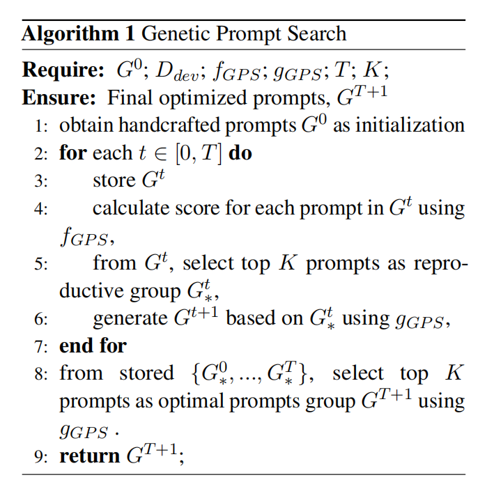

# GPS Genetic Prompt Search for Efficient Few-shot Learning

## Introduction

[Hanwei Xu et al., 2022](https://arxiv.org/pdf/2210.17041.pdf) propose a novel Genetic Prompt Search (GPS) algorithm that gradually mutates the prompts with a generative model and selects candidates according to their performance on a small development set. This evolutionary procedure relies on a tiny set of labeled data, only used for validation but not training.

GPS does not require updating any parameter, but only searches for the optimal hard prompts for every downstream task. Similar to prompt tuning, GPS allows the pretrained model to serve a large number of applications simultaneously. Meanwhile, GPS is even easier to deploy than prompt tuning, because it does not need to store the tuned continuous soft prompts. Empirically, GPS achieves substantial improvement over the baseline of manual prompts, and it also outperforms other parameter-efficient few-shot tuning methods.

The author followed the T0 baseline and compared five methods using ten T0 testing tasks, namely Model Tuning, Prompt Tuning, Black Box Tuning, In Context Learning, and GRIPS. Result showed that GPS outperforms not only the manual prompt baseline, but also other parameterefficient few-shot learning methods. Extensive experiments verified the effectiveness of the proposed GPS.

## How it Works?

It is challenging to automatically find highperforming prompts for a new unseen task.Inspired by Genetic Algorithms (Mitchell, 1980), we propose Genetic Prompt Search (GPS) for this purpose.The specific algorithm is shown in the following figure:

In GPS, we will first sample a tiny number of data as a development set Ddev for each downstream task.Then, we will design two genetic functions, where fGPS is the metric function to decide which prompts will be reserved or eliminated at each iteration, and gGPS represents the genetic function to generate new prompts.According to the algorithm, GPS is firstly initialized with a set of handcrafted prompts, G0. And the key process of GPS is to reproduce the current generation of prompts and use re-scoring to select prompts iteratively. For each iteration, we calculate the scores of prompts in Gt using fGPS, and select the top-K prompts as Gt∗ . Then we generate Gt+1 using gGPS based on Gt∗ . After several steps of genetic search, we will collect all the top-K prompts in each generation, and rescore all these prompts to make the final decision on which prompts are optimal.There are three different ways to use gGPS.

**Back Translation**:Back Translation (BT), a common technique for data augmentation in NLP, is applied for prompt reproduction. Here we first translate the manual prompts from English to 11 other languages including Chinese, Japanese, Korean, French, Spanish, Italian, Russian, German, Arabic, Greek, Cantonese, and then translate them back to English.

**Cloze**:we use the large pretrained text-to-text transformer (T5) to generate templates. For each input example and its verbalizer, we compose the template with placeholders as prefix and suffix, and let T5 to fill in the placeholders. We apply beam search to generate multiple prompt candidates.However, this approach does not work well since our setting conducts no parameter update, which is different from the few-shot training setting in the original paper. Therefore, we instead use manual prompts as initial templates, replace some random tokens with placeholders, and then let T5 fill in the blanks to generate new prompts.

**Sentence Continuation**:Use the template "Write two sentences that mean the same thing. Sentence 1: Manual Prompt, Sentence 2:" to the pretrained model, and let it generate continuations as a new prompt. We conducted experiments with GPT2-XL (1.5B) and T5LM-XXL (11B) as our prompt generation models.

Finally, according to the different ways in which prompts are generated, our corresponding scoring standards are also different. The specific scoring rules are as follows:

**For Cloze**:we follow previous work to score the prompts with average logits on the validation set Ddev. 

**For Back Translation and Sentence Continuation**:since averaging logits is not applicable, we score each prompt using accuracy on Ddev.

## Prompt Example

There are currently no prompt examples available

## Datasets

### [ANLI](https://github.com/facebookresearch/anli)
The Adversarial Natural Language Inference (ANLI, Nie et al.) is a new large-scale NLI benchmark dataset, collected via an iterative, adversarial human-and-model-in-the-loop procedure. Particular, the data is selected to be difficult to the state-of-the-art models, including BERT and RoBERTa.

### [RTE](https://aclweb.org/aclwiki/Recognizing_Textual_Entailment)
The Recognizing Textual Entailment (RTE) datasets come from a series of textual entailment challenges. Data from RTE1, RTE2, RTE3 and RTE5 is combined. Examples are constructed based on news and Wikipedia text.

### [CB](https://huggingface.co/datasets/super_glue/viewer/cb/test)
CB is a corpus of short texts, where at least one sentence contains an embedded clause. Each embedded clause indicates the expected level of authenticity of the clause. The obtained task framework consists of three types of textual implications, with samples from the Wall Street Journal, British National Corpus novels, and Switchboard. Each sample contains a premise containing an embedded clause, and the corresponding hypothesis is the extraction of the clause. SuperCLUE uses a subset of this dataset, and the consistency between annotations in this subset exceeds 0.85. These data are not very balanced (with relatively few neutral samples), so the evaluation indicators are accuracy and F1 score, with multiple F1 scores being the unweighted average of each F1 score.

### [WSC](https://cs.nyu.edu/~davise/papers/WinogradSchemas/WS.html)
The Winograd Schema Challenge was introduced both as an alternative to the Turing Test and as a test of a system’s ability to do commonsense reasoning. A Winograd schema is a pair of sentences differing in one or two words with a highly ambiguous pronoun, resolved differently in the two sentences, that appears to require commonsense knowledge to be resolved correctly. The examples were designed to be easily solvable by humans but difficult for machines, in principle requiring a deep understanding of the content of the text and the situation it describes.The original Winograd Schema Challenge dataset consisted of 100 Winograd schemas constructed manually by AI experts. As of 2020 there are 285 examples available; however, the last 12 examples were only added recently. To ensure consistency with earlier models, several authors often prefer to report the performance on the first 273 examples only. These datasets are usually referred to as WSC285 and WSC273, respectively.

### [Winogrande](https://huggingface.co/datasets/winogrande)
WinoGrande is a new collection of 44k problems, inspired by Winograd Schema Challenge (Levesque, Davis, and Morgenstern 2011), but adjusted to improve the scale and robustness against the dataset-specific bias. Formulated as a fill-in-a-blank task with binary options, the goal is to choose the right option for a given sentence which requires commonsense reasoning.

### [COPA](https://people.ict.usc.edu/~gordon/copa.html)
The Choice Of Plausible Alternatives (COPA) evaluation provides researchers with a tool for assessing progress in open-domain commonsense causal reasoning. COPA consists of 1000 questions, split equally into development and test sets of 500 questions each. Each question is composed of a premise and two alternatives, where the task is to select the alternative that more plausibly has a causal relation with the premise. The correct alternative is randomized so that the expected performance of randomly guessing is 50%.

### [HellaSwag](https://rowanzellers.com/hellaswag/)
HellaSwag is a challenge dataset for evaluating commonsense NLI that is specially hard for state-of-the-art models, though its questions are trivial for humans (>95% accuracy).

### [WiC](https://pilehvar.github.io/wic/)
WiC is a benchmark for the evaluation of context-sensitive word embeddings. WiC is framed as a binary classification task. Each instance in WiC has a target word w, either a verb or a noun, for which two contexts are provided. Each of these contexts triggers a specific meaning of w. The task is to identify if the occurrences of w in the two contexts correspond to the same meaning or not. In fact, the dataset can also be viewed as an application of Word Sense Disambiguation in practise.

## References

Annaaphq.(2022).遗传算法（基础知识）.[在线].CSDN博客.取自:https://blog.csdn.net/Annaaphq/article/details/126341559

tigerqin1980.(2022).遗传算法入门详解.[在线].知乎.取自:https://zhuanlan.zhihu.com/p/100337680?utm_id=0

