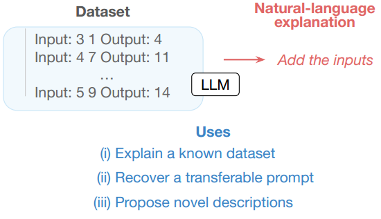

# iPrompt: Explaining Data Patterns in Natural Language via Interpretable Autoprompting

[Chandan Singh et al., 2023](https://doi.org/10.48550/arXiv.2210.01848) introduce interpretable autoprompting (iPrompt), an algorithm that generates a natural language string explaining the data.

In other words,iPrompt is an extended AutoPrompt that uses natural language writing to generate a semantically meaningful natural language prompt for better understanding and generalization than AutoPrompt.

iPrompt uses a pre-trained LLM to iteratively propose and evaluate different candidate explanations and reorder them based on their performance as prompts.Thus, a fixed natural language model of the data set is generated.

Experiments on a wide range of datasets, from synthetic mathematics to natural language understanding, show that iPrompt can yield meaningful insights by accurately finding dataset explanations that are human-interpretable.

## How it Works?

iPrompt is an iterative local search algorithm that alternates between three steps: (1) proposing candidate prompts,(2) reranking candidate prompts, (3) exploration.

**First Step:proposing candidate prompts**

(i) Proposal:Candidate prompts are generated by extending the zero-shot LLM generation. Given a data instance as a prefix, we sample a number of candidate prompts. The maximum length of each candidate is pre-specified and fixed.

**Second Step:reranking candidate prompts**

(ii) Reranking:Given candidates, the objective Eq. (1) is evaluated for each candidate prompt s. The top few candidates which
maximize the objective are kept, e.g. narrowing down the candidates to fCombine the numbers, Sum in or-der.

**Third Step:exploration**

(iii) Iterate with exploration: Each of the top candidates from reranking is truncated at a random position. These
truncated candidates are used as a prefix when generating new candidate prompts via suffix decoding. For example, we
may randomly select the start of the previous candidates and fill in the endings:```{Combine the__, Sum__}——>{Combine the numbers, Combine both arguments, Sum the numbers, Sum all inputs}```.

**Fourth Step:Again and again**

The algorithm is repeated until identifying a suitably strong ^s.

*Prompt:*


