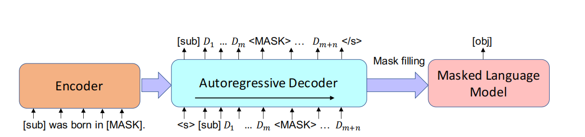
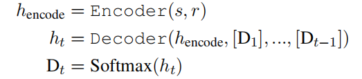
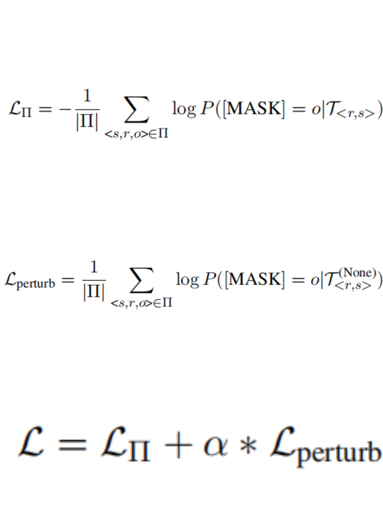

# PromptGen Automatically Generate Prompts using Generative Models

## Introduction

[Yue Zhang, Hongliang Fei et al., 2022](https://pdfs.semanticscholar.org/5e27/3f5f35f6b6619212e3e41c582679ae5f7180.pdf) propose a dynamic prompt generation model, named as PromptGen, to automatically generate prompts based on inputs by leveraging the pre-trained generative model BART.Generally, PromptGen consists of an encoder and an autoregressive decoder based on Transformer.

A knowledge fact is defined as a triplet: ```<sub,rel,obj>```. The encoder produces a latent representation from input ```<sub,rel>```, and the decoder autoregressively generates prompt in the form of ```[sub][D1]...[MASK]..., [Dm+n]```. Generated prompts are then passed to a fixed pretrained LM (e.g., BERT) to fill ```<MASK>``` as ```[obj]```.

With pretraining, generative models can store related knowledge regarding input subjects, but we want to generate context-aware (i.e., ```<sub,rel>```) prompts without leaking label information (i.e., object).To mitigate label leaking,we replace ```[sub]``` of a generated prompt with “None” and pass the perturbed prompt to LM and using Loss for fine-tuning.

Result demonstrate that PromptGen leverages a pre-trained generative model, e.g., BART. PromptGen is end-to-end trainable, where  fine-tune the parameters of the generative model, while keeping the downstream pre-trained MLM frozen.Evaluate PromptGen on the benchmark LAMA dataset and observe the significant improvement of the performance on the down.

## How it Works?

Given a subject s, relation r, a generated prompt $T<r,s>$, and an MLM, we can identify the word oˆ ∈ V to which the MLM assigns the highest probability of $P([MASK] = oˆ|T<r s>)$, where $T<r,s>$ represents the generated prompt conditional on relation r and subject s; V represents the predefined vocabulary.If the MLM can fill in the mask with the correct object, we conclude that the MLM encodes information about the fact.

Input Format:The input of our generative model is the manual prompt provided by the LAMA dataset. For instances: for relation “place of birth”, our input is “```[sub]``` was born in ```[MASK]```”; The encoding form of the original prompt on the encoder as follow: Assuming the BART word embedding matrix for tokens in vocabulary Vcommon is $\epsilon_V ∈ R^{|V|×d}$. we know that each $[Di]$ is a multinomial distribution on Vcommon,so the embedding vector $\epsilon_{Di}$ for each $[Di]$ is a linear combination on $\epsilon_V$ :


Output Format:The prompt is generated from the decoder. Our prompt is in the following form:```[sub] [D]1 [D]2...[D]m [MASK] [D]m+1...[D]m+n```.(each ```[D]i``` represents a multinomial distribution over vocabulary Vcommon).where m is pre-defined maximal number of triggers between ```[sub]``` and ```[MASK]```; n is the maximal number of triggers after ```[MASK]```;

The method structure is shown in the following figure:



Explanation of the above figure:we elaborate our method on the application of the LAMA task, in which the downstream MLM is BERT. Our generative model(encoder-decoder) adopts pre-trained BART.At each decoding step, we use the model output from a prior time as the current input.At each decoding step t, our decoder computes the current hidden state $h_t$ and current token distribution $D_t$ , based on the current sequence ```[D1], ..., [Dt−1]```, and the encoding output $h_{encode}$:



To avoid label leaking, we develop a novel constraint. We replace the ```[sub]``` of ```T<r,s>``` with “None”. For example, assuming we pass “None was born in ```[MASK]```” into an MLM.The possibility of filling the mask with “Hawaii” will be low without knowing the subject of “Obama”.Therefore, we use such a loss function to fune-tuning the Generative model,to avoid label leakage:



## Prompt Example

There are currently no prompt examples available.

## Datasets

### [LAMA](https://github.com/facebookresearch/LAMA)
The LAMA dataset contains sentences that describe the relationship between two entities, and one of the entities is masked, requiring a language model to predict. If the prediction is correct, it indicates that the model has learned this relationship. However, many times this relationship cannot be seen from these queries, or even if the model does not answer correctly, it cannot indicate that the model does not understand this relationship (such as the existence of one-to-many situations or entities that the model has not seen before).

## References

斜角巷奇遇.(2019).自然语言处理基础学习（一）word embedding，word2vec，skip-grams，CBOW.[在线].CSDN博客.取自:https://blog.csdn.net/WTQTakee/article/details/103442222

weixin_51182518.(2021).NLP 3.5 Transformer的结构，BERT&masked language model.[在线].CSDN博客.取自:https://blog.csdn.net/weixin_51182518/article/details/113929301

Terry_dong.(2019).图解Transformer.[在线].CSDN博客.取自:https://blog.csdn.net/sjyttkl/article/details/98784410/
