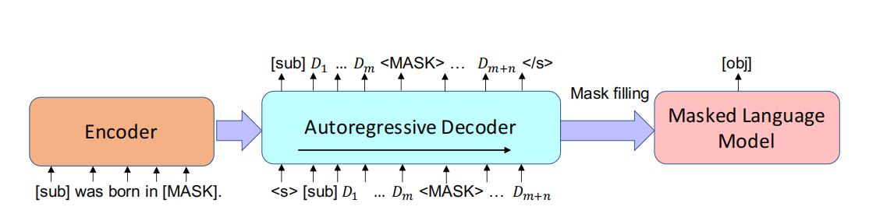
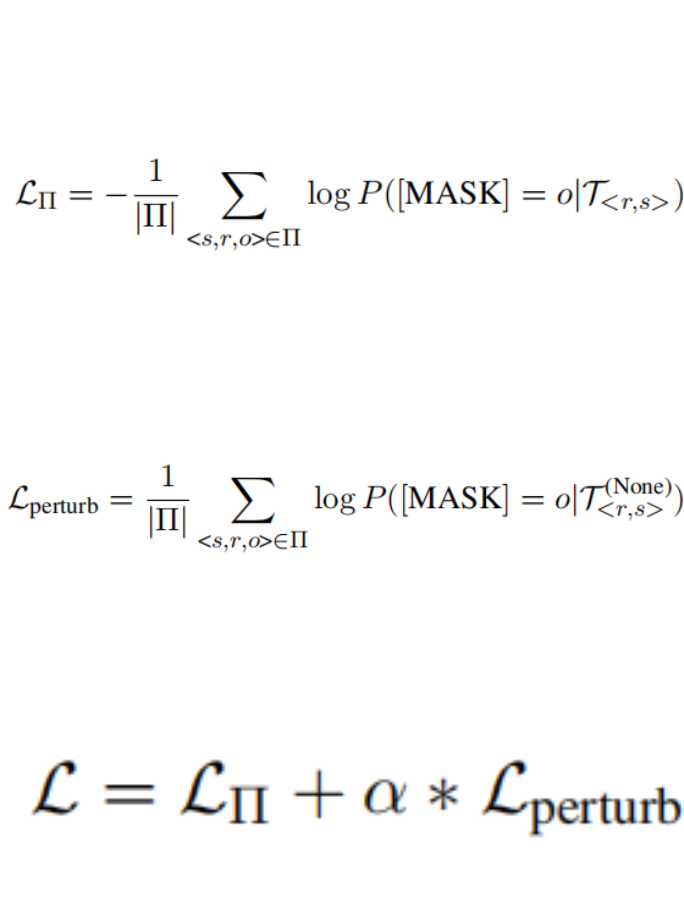

# **PromptGen Automatically Generate Prompts using Generative Models**

## 简介

[Yue Zhang, Hongliang Fei et al., 2022](https://pdfs.semanticscholar.org/5e27/3f5f35f6b6619212e3e41c582679ae5f7180.pdf)提出了一个动态提示生成模型，称为promptGen，通过利用预先训练的生成模型BART，根据输入自动生成提示。通常 promptGen由编码器和基于Transformer的自回归解码器组成。

知识事实被定义为三元组：<sub,rel,obj>.编码器从输入<sub，rel>中产生潜在表示，并且解码器自回归地生成[sub][D1]...[MASK]..., [Dm+n].形式的提示，然后将生成的提示传递给固定的预训练LM（例如BERT），以将<MASK>填充为[obj]。

通过预训练，生成模型可以存储有关输入主题的相关知识，但我们希望在不泄漏标签信息（即对象）的情况下生成上下文感知（即<sub，rel>）提示。为了减少标签泄漏，我们将生成提示的[sub]替换为“None”，并将扰动提示传递给LM，并使用Loss进行微调。

结果表明，PromptGen利用了预先训练的生成模型，例如BART。PromptGen是端到端可训练的，可以微调生成模型的参数，同时保持下游预先训练的MLM冻结。在基准LAMA数据集上评估PromptGen，并观察到性能的显著改善。

## 原理

给定一个主题s，关系r，一个生成的提示T<r，s>和一个MLM，我们可以识别单词oˆ∈V，这个单词是MLM按照P([MASK] = oˆ|T<r,s>)得到的最高概率的单词，其中T<r，s>表示以关系r和主题s为条件的生成的提示；V表示预定义的词汇表。如果MLM可以用正确的对象填充掩码，我们得出结论，MLM对有关事实的信息进行了编码。

输入格式：我们的生成模型的输入是LAMA数据集提供的手动提示。例如：对于关系“place of birth”,我们的输入是“[sub] was born in [MASK]”；编码器上原始提示的编码形式如下:假设词汇表中标记的BART单词嵌入矩阵Vcommon为$\epsilon$V ∈ R|V|×d.我们知道每个[Di]是Vcommon上的多项式分布，因此每一个[Di]的嵌入向量$\epsilon$Di是一个在$\epsilon$V上面的线性组合：

输出格式：提示由解码器生成。我们的提示形式如下：[sub] [D]1 [D]2...[D]m [MASK] [D]m+1...[D]m+n。（每个[D]i表示词汇表Vcommon上的多项式分布）。其中m是[sub]和[MASK]之间预定义的最大触发词个数；n是[MASK]之后的最大触发词个数；

方法结构如下图所示：

上图说明：我们详细阐述了LAMA任务的应用方法，其中下游MLM是BERT。我们的生成模型（编码器-解码器）采用预训练的BART。在每个解码步骤，我们使用先前时间的模型输出作为当前输入。在每个解码步骤t，我们的解码器在先前序列[D1], ..., [Dt−1],和编码器的输出hencode的基础上计算当前隐藏状态ht和当前令牌分布Dt：

为了避免标签泄漏，我们开发了一种新的约束。我们将T<r，s>的[sub]替换为“None”。例如，假设我们将“None was born in[MASK]”代入MLM。在不知道“Obama”主题的情况下，用“Hawaii”填充mask的可能性很低。因此，我们使用这样的损失函数来调整生成模型，以避免标签泄露:

## Prompt 示例

目前没有可用的提示示例。

## 数据集

### LAMA
LAMA 数据集中包含的句子用于描述两个实体之间的关系，而其中一个实体被遮盖，需要语言模型来预测，如果预测正确则说明模型学会了这一关系。然而，很多时候其实从这些 query 中是看不出这种关系的，或者说，即便模型没有回答正确，也不能说明模型不懂这个关系（比如存在一对多的情形，或者模型未见过的实体等）。