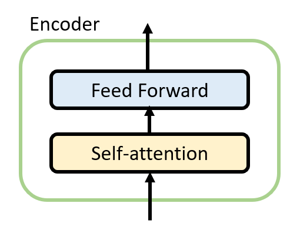
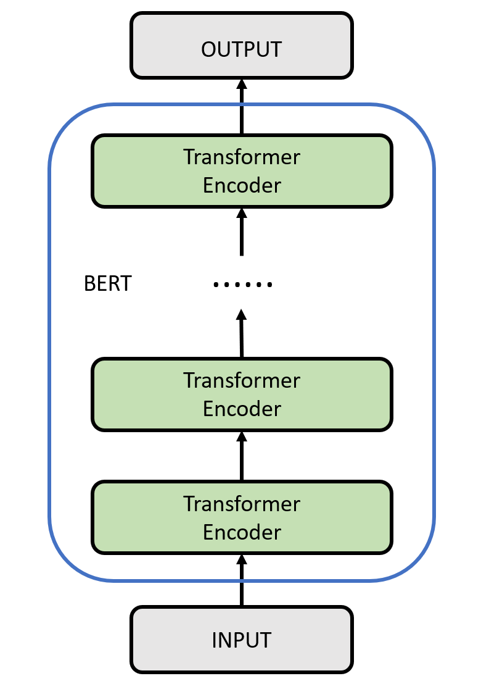
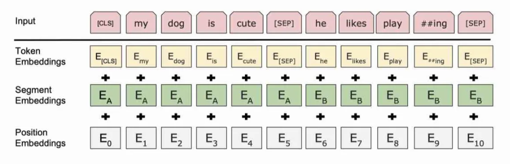
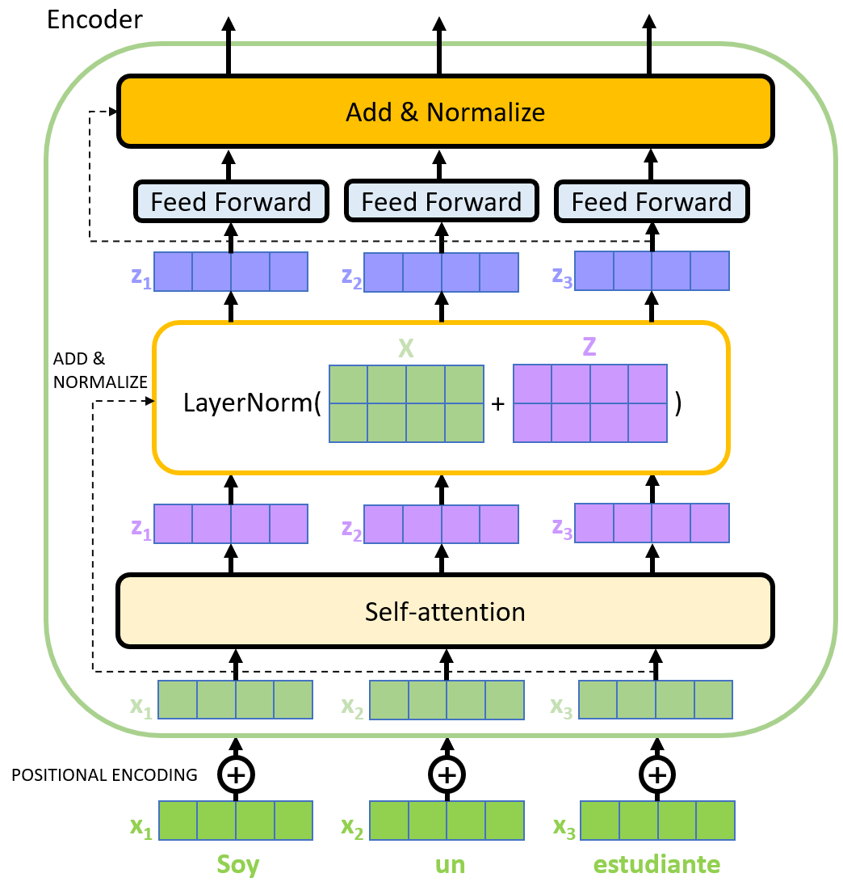
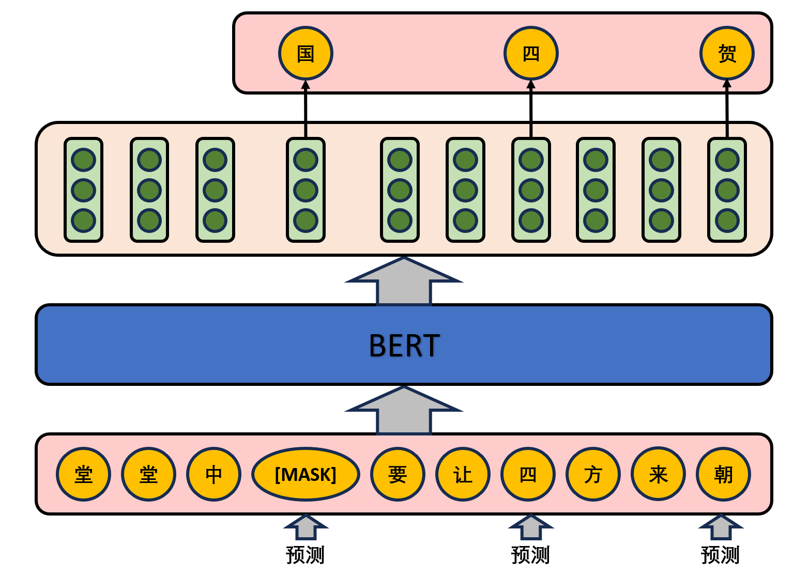
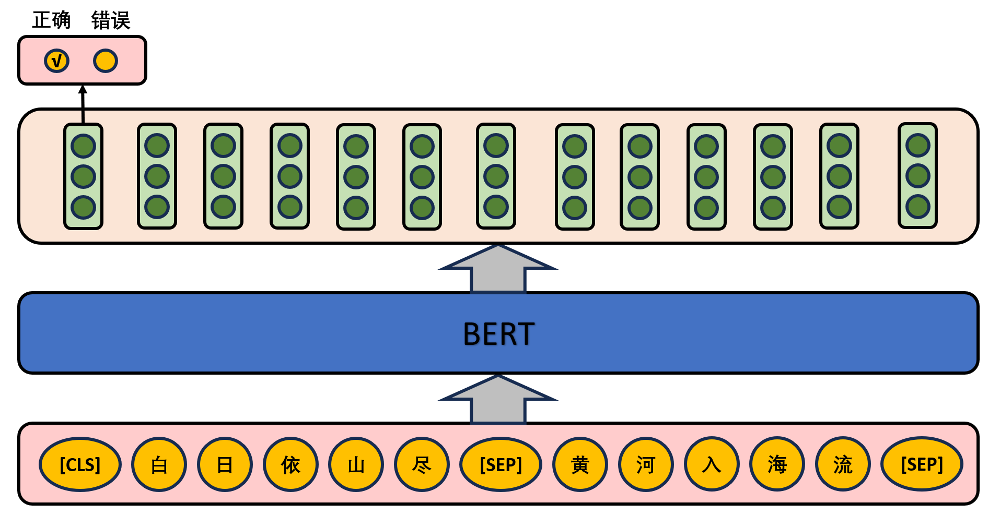
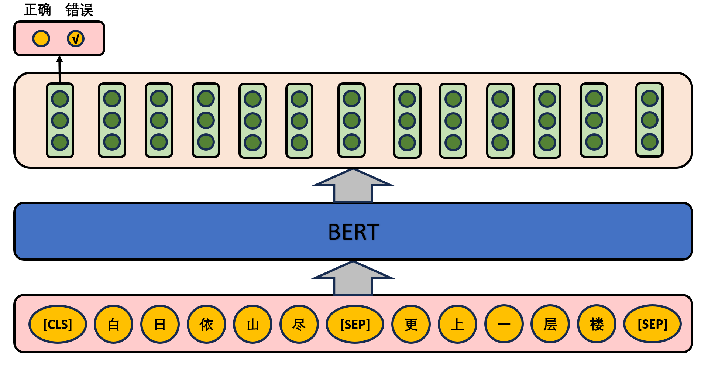
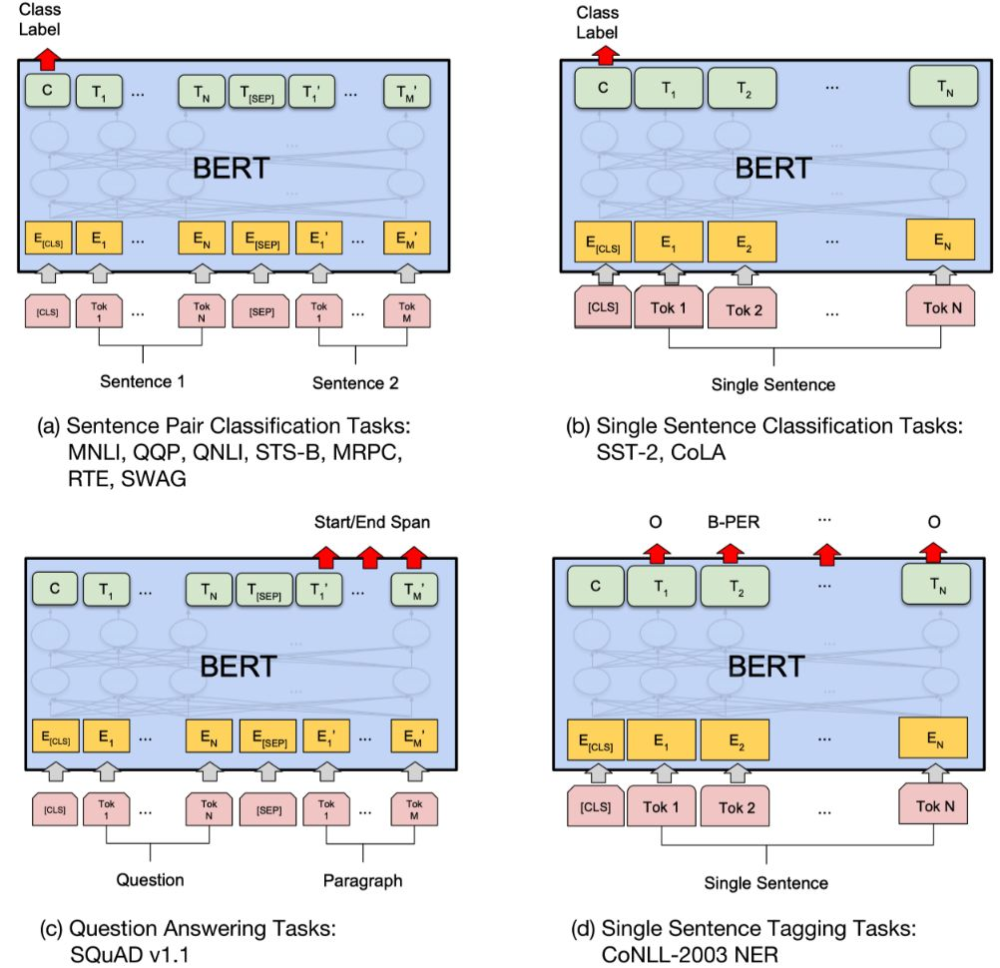

# BERT
- [BERT](#bert)
  - [Introduction](#introduction)
  - [Overview of the Transformer](#overview-of-the-transformer)
  - [Model structure](#model-structure)
    - [Input](#input)
    - [Encoder](#encoder)
  - [Pre-training tasks](#pre-training-tasks)
    - [MLM](#mlm)
    - [NSP](#nsp)
  - [Fine-tuning tasks](#fine-tuning-tasks)
  - [Application](#application)
  - [References](#references)

## Introduction
BERT (Bidirectional Encoder Representations from Transformers) is a revolutionary pre-trained language model. In 2018, the Google research team first proposed in the paper [《BERT: Pre-training of Deep Bidirectional Transformers for Language Understanding》](https://arxiv.org/pdf/1810.04805.pdf).

BERT model benefits from the successful application of Transformer model. Transformer is a neural network architecture based on self-attention mechanism, which performs well in tasks such as machine translation. The BERT model takes advantage of Transformer's encoder structure and learns a common linguistic representation on a large-scale text corpus through pre-training. This enables the BERT model to understand the text at a deep level, capture contextual information, and thus provide a more accurate and rich language representation.

The importance of BERT model is that it has achieved breakthrough results in several natural language processing tasks. Through pre-training on massive text data, BERT model learns rich linguistic knowledge and context representation ability. This allows it to gain deep semantic understanding in an unsupervised manner, leading to superior performance in a variety of tasks. For example, in the task of text classification, BERT model can accurately capture the key information and improve the accuracy of classification. In the named entity recognition task, the BERT model can accurately identify and classify entities. In question answering system and machine translation tasks, BERT model can generate more accurate and fluent answers or translation results.

BERT model has been widely used in various natural language processing fields due to its excellent performance in language understanding tasks. Researchers and engineers have made remarkable progress in building powerful text processing systems using the BERT model. At the same time, BERT model also provides new ideas and methods for the improvement of other models and algorithms. Its importance in the field of natural language processing is self-evident, and it has a far-reaching impact on promoting the research and application of language understanding and language generation.

## Overview of the Transformer
The bottom layer of BERT uses Transformer's encoder module. The basic structure of Transformer model consists of an encoder and a decoder. The encoder is responsible for transforming the input sequence into a high-dimensional semantic representation, while the decoder uses the output of the encoder and its own input to generate the output sequence. One of the core components is the self-attention mechanism, which allows the model to better understand the dependencies between different locations when working with sequence data. The self-attention mechanism achieves the interaction and integration of global information by calculating the correlation between each location and other locations and weighting the locations according to these correlations. This allows the Transformer model to capture the long-range dependencies, avoiding the problem of vanishing or exploding gradients in RNNs. Another advantage of the Transformer model is its parallel computing capability. Because of the characteristics of self-attention mechanism and multi-head attention mechanism, Transformer model can efficiently carry out parallel computing, thus accelerating the speed of training and reasoning. This parallelism makes the Transformer model excellent for large-scale sequential data, especially for tasks such as machine translation, text generation, and language modeling.

Transformer model provides an important basis and idea for the design and optimization of BERT model. Its self-attention mechanism, multi-head attention mechanism and parallel computing ability have a profound impact on the performance and application of the BERT model. The innovation and development of Transformer has brought a new paradigm to the field of natural language processing and played a key role in the success of models such as BERT.

## Model structure
The model structure of BERT is shown in the following figure. The encoder is the core component of BERT, which consists of multiple identical layers, each of which is a Transformer model with self-attention mechanism and feedforward neural network. The stacking of these layers makes BERT powerful in language modeling and context understanding. The encoder of the BERT model can process all locations in the sentence simultaneously, capture the relationship between words through the self-attention mechanism, and generate context-sensitive representations.

### Input

First, to better accommodate downstream tasks, BERT needs to add two special markers [CLS] and [SEP] to the input.
* The representation vector of the [CLS] tag can be used for classification or judgment of downstream tasks. The representation vector of [CLS] contains the semantic information of the whole sequence, so it can be regarded as the semantic representation of the whole sequence. At the same time, the [CLS] marker has a special use in the pretraining task. In the next sentence prediction (Next Sentence Prediction, NSP) task in the pre-training task, the representation vector of [CLS] is also used together with the representation vector of another special marker [SEP] to determine whether two sentences are consecutive.
* The [SEP] symbol is used in the BERT model to mark the separation between sentences, helping the model to understand and process the relationship between multiple sentences.

At the same time, the BERT model also has three types of embedding:
* Token Embedding: The BERT model maps each word in the input text sequence to a real vector representation of a fixed dimension, which is called Token Embedding. This embedding captures the semantic and contextual information of the words, allowing the model to better understand the meanings and relationships of the words.
* Segment Embedding: Segment embedding refers to assigning a specific identifier, such as [SEP] symbol, to each input segment to distinguish the beginning and end of different segments.
* Position Embedding: To capture the order of words in a sentence, BERT introduces Position Embedding. Unlike Transformer, BERT does not use a trigonometric encoding method, but directly uses a method similar to Word embedding to directly obtain position embedding.
  
BERT combines the above three embedding vectors and processes them through a stacked Transformer encoder layer to obtain a context-sensitive representation of the input text. The BERT model is able to learn rich semantic information from input sequences to support the processing and solving of multiple natural language processing tasks.

### Encoder
The intermediate layer of BERT is the same as the encoder of Transformer, which can be learned by referring to the corresponding content of Transformer and will not be described here.

## Pre-training tasks
The pre-training tasks of BERT mainly include MLM (Masked Language Modeling) and NSP (Next Sentence Prediction).

### MLM

In this task, the model randomly masks some words in the input text and tries to predict the masked words. The purpose of this task is to let BERT learn to infer the covered words from the context information. Specifically, 15% of the words in a sentence are randomly selected for prediction. For the words that were erased in the original sentence, 80% of the words were replaced by a special symbol [MASK], 10% of the words were replaced by an arbitrary word, and the remaining 10% remained unchanged. The main reason for this is that the [MASK] marker will not appear in the sentence in the subsequent fine-tuning task, and another advantage of this is that when predicting a word, the model does not know whether the word in the corresponding position of the input is the correct word (10% probability), which forces the model to rely more on context information to predict words. And endows the model with certain error correction capability.

### NSP
Given two sentences in an article, determine whether the second sentence immediately follows the first sentence in the text, as shown in the following figure.

In the actual pre-training process, the author randomly selects 50% of the correct sentence pairs and 50% of the wrong sentence pairs from the text corpus for training, combined with the Masked LM task, so that the model can more accurately depict the semantic information at the sentence and text level.

## Fine-tuning tasks
The fine-tuning task of the BERT model is to apply the BERT model to a specific downstream task and fine-tune it on the data set of the task after pre-training.
* Sentence pair based classification task:
  * MNLI: Given a Premise, infer the relationship between the Hypothesis and the Premise from the Premise. There are three kinds of relationships in this task: Entailment, Contradiction, and Neutral. So this problem is essentially a classification problem, and what we need to do is to explore the mutual information between the two sentence pairs of premise and hypothesis.
  * QQP: Based on Quora, determine whether two question sentences on Quora have the same meaning.
  * QNLI: Used to determine whether the text contains the answer to the question, similar to how we do reading comprehension to locate the passage where the question is.
  * STS-B: Predicting the similarity of two sentences, including 5 levels.
  * MRPC: It also determines whether two sentences are equivalent.
  * RTE: It is similar to MNLI, but it is only a binary classification judgment of implication relations, and the data set is smaller.
  * SWAG: Choose from four sentences as the one that may be the following of the preceding sentence.
* Classification task based on a single sentence:
  * SST-2: Sentiment Analysis of Film Evaluation.
  * CoLA: Sentence semantic judgment, whether it is Acceptable.

For classification tasks on the GLUE dataset (MNLI, QQP, QNLI, SST-B, MRPC, RTE, SST-2, CoLA), BERT's fine-tuning method is to generate a set of feature vectors $C$ according to the [CLS] flag and fine-tune them through a layer of full connections. The loss function is designed according to the task type, such as softmax for multi-classification or sigmoid for binary classification. The fine-tuning method for SWAG is similar to the GLUE dataset, except that the output is a softmax of four possible options.
* Question and answer task:
  * SQuAD v1.1: Given a sentence (usually a question) and a descriptive text, output the answer to this question, similar to doing short answer questions for reading comprehension. The input of SQuAD is the sentence pair of the question and the description text, and the output is the feature vector. The conditional probability of the output text is obtained by connecting a layer of full connection with the activation function softmax on the description text. The number of output nodes of full connection is the number of Token in the corpus.
* Named Entity Recognition NER:
  * CoNLL-2003 NER: Determines whether a word in a sentence is Person, Organization, Location, Miscellaneous, or other (no named entity). When fine-tuning CoNLL-2003 NER, the whole sentence is taken as input, a probability is output at each time slice, and the entity category of this Token is obtained through softmax.
The following figure shows the model of BERT in 11 different tasks, which only need to add an output layer on the basis of BERT to complete the fine-tuning of specific tasks. These tasks are similar to the liberal arts papers we have done, including multiple choice questions, short answer questions and so on. Where Tok represents a different Token, $E $represents the embedding vector, and $T _ I $represents the feature vector of the $I $th Token after BERT processing.

## Application
BERT model is widely used in natural language processing tasks, its context-sensitive word vector representation ability and powerful feature extraction ability make it surpass the traditional model, achieve significant performance improvement in language understanding tasks, and provide better feature representation for other tasks. This makes BERT model an important tool and research focus in the field of natural language processing. Its important application scenarios include:
* Sentiment analysis: By learning context-dependent word vector representations, BERT models can better capture the sentiment and emotional information in sentences, thus improving the accuracy of sentiment analysis.
* Machine translation: By taking the sentences of source language and target language as input, BERT model can learn the semantic representation at the sentence level, thus improving the accuracy and fluency of translation.
* Text generation: The BERT model can be used to generate various types of text, such as automatic summarization, dialog systems, and text generation tasks. By learning a context-sensitive word vector representation, the BERT model is able to generate more semantically and syntactically correct texts.
* Text categorization: BERT model is widely used in text categorization tasks, such as news categorization, spam filtering, and user comment categorization. By inputting the text into the Bert model, more accurate text classification results can be obtained.
* Named entity recognition: By learning the context-dependent word vector representation, BERT model can accurately recognize named entities such as person names, place names and organization names in the text.
* Relation extraction: By learning the context-dependent word vector representation, BERT model can identify the entities and their relationships in the text, thus improving the accuracy of relation extraction.

## References
* [《BERT: Pre-training of Deep Bidirectional Transformers for Language Understanding》](https://arxiv.org/pdf/1810.04805.pdf)
* [图解BERT模型：从零开始构建BERT](https://cloud.tencent.com/developer/article/1389555)
* [BERT详解](https://zhuanlan.zhihu.com/p/130913995)