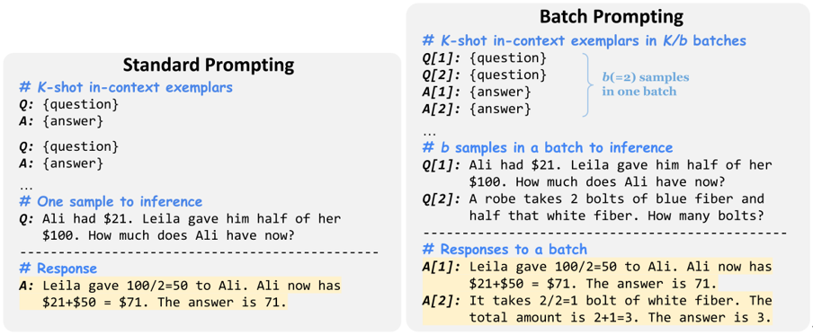

# **Batch Prompting**

## Introduction

\[[Cheng et al.\]](https://arxiv.org/abs/2301.08721) proposed batch prompting, a simple alternative prompting approach which enables the LLM to run inference in batches, instead of one sample at a time in the way of standard prompting.

It theoretically demonstrated that under a few-shot in-context learning setting, the inference costs will decrease almost inverse linearly with the number of samples in each batch. The results of valuations delivered that when each batch contains 3 to 4 samples, the performance of the model is generally the best.

Authors extensively validated the effectiveness of batch prompting on ten datasets across commonsense QA, arithmetic reasoning and NLI/NLU. Results showed that batch prompting significantly reduces the LLM (Codex) inference token and time costs while achieving better or comparable performance. Further, batch prompting can be applied across different LLMs and reasoning methods.

## How it Works?

Batch prompting enables the LLM to generate responses for multiple samples in one batch in a single inference run, so that it reduces the LLM inference time from N to N/b, where b is the number of samples in one batch. 

Specifically, the prompt groups the K in-context exemplars into K/b batches with b exemplars each as demonstrations. In every batch, demonstration contexts are arranged in a specific order at the beginning, with their corresponding outputs placed in the same order afterwards. Then, b test sample contexts are grouped together at the end of the input prompt. In this way, the LLM learns from the in-context demonstrations and generates corresponding responses for the entire batch of test samples. 

Authors add a position identifier “\[index\]” in each batch to ensure that the LLM can easily identify the order correspondence of input contexts and generated responses in batches. At the same time, it also eases the process of parsing the generated responses.




## Prompt Example

### *Prompt*

```
Q[1]: A garden produced 237 potatoes, 60 fewer cucumbers and twice as many peppers than the cucumbers. How
many vegetables did the garden produce?
Q[2]: John’s cow weighs 400 pounds. It increased its weight to 1.5 times its starting weight. He is able to sell the cow
for $3 per pound. How much more is it worth after gaining the weight?
Q[3]: John writes 20 pages a day. How long will it take him to write 3 books that are 400 pages each?
Q[4]: James has a rainwater collection barrel. For each inch of rain he collects 15 gallons. On Monday it rained 4 inches
and on Tuesday it rained 3 inches. He can sell water for $1.2 per gallon. How much money did he make from selling
all the water?
```

### *Output* 

```
A[1]: The garden produced 237 - 60 = 177 cucumbers. The garden produced 177 * 2 = 354 peppers. The garden produced 237 + 177 + 354 = 768 vegetables. The answer is 768.
A[2]: The cow initially weighs 400 * 1.5 = 600 pounds. So it gained 600 - 400 = 200 pounds. It is worth 200 * 3 = 600 dollars more. The answer is 600.
A[3]: He wants to write 3 * 400 = 1200 pages. So it will take him 1200 / 20= 60 days. The answer is 60.
A[4]: It rained 3 + 4 = 7 inches So he collected 7 * 15 = 105 gallons So he makes 105 * 1.2 = 126 from selling the water. The answer is 126.
```

## Datasets

We evaluate batch prompting on ten datasets across commonsense question answering,
arithmetic reasoning, and natural language understanding/inference: CommonsenseQA, 
StrategyQA, GSM8K, SVAMP, AQuA, AddSub, MultiArith, RTE, MNLI, and SST-5.

For CommonsenseQA, AQuA, AddSub, MultiArith, and RTE, we evaluate the whole dev/test
sets. For the other five datasets, we evaluate the first 300 test samples considering the costs of LLM APIs.

### CSQA

[CSQA](https://www.huggingface.co/datasets/skrishna/CSQA_preprocessed) is a dataset of questions and answers about multiple options in the real world. Inference is made through T5, questions are formalized as text padding, and selection is predicted with the highest sequence-to-sequence language modeling probability. It contains around 200K dialogs with a total of 1.6M turns.

### strategyQA

[strategyQA](https://www.huggingface.co/datasets/wics/strategy-qa):An implicit multi-step question-and-answer dataset requiring extensive reasoning skills. It aims to measure the ability of models to answer questions that require multi-step implicit reasoning.

### GSM8K

[GSM8K](https://www.huggingface.co/datasets/gsm8k) is a data set consisting of 8.5K high quality language diverse primary math word problems. These problems are divided into 7.5K training problems and 1K test problems. These problems take between two and eight steps to solve, and are solved by performing a series of basic calculations using basic arithmetic operations (+ - / *) to arrive at the final answer.

### SVAMP

[SVAMP](https://www.huggingface.co/datasets/ChilleD/SVAMP): A challenge set for elementary-level Math Word Problems (MWP).  An MWP consists of a short Natural Language narrative that describes a state of the world and poses a question about some unknown quantities.

The examples in [SVAMP](https://www.huggingface.co/datasets/ChilleD/SVAMP) test a model across different aspects of solving MWPs: 1) Is the model question sensitive?  2) Does the model have robust reasoning ability?  3) Is it invariant to structural alterations?

### AQuA

[AQuA]((https://www.huggingface.co/datasets/aqua_rat)): A dataset that contains algebraic word problems with rationales.  The dataset consists of about 100,000 algebraic word problems with natural language rationales.  Each problem is a json object consisting of four parts:
* question - A natural language definition of the problem to solve.
* options - 5 possible options (A, B, C, D and E), among which one is correct.
* rationale - A natural language description of the solution to the problem.
* correct - The correct option.

### MultiArith

The [MultiArith](https://www.huggingface.co/datasets/ChilleD/MultiArith) dataset is a multi-step algorithm dataset containing 600 scenario-based math problems at the elementary level.

### RTE

[The Recognizing Textual Entailment (RTE)]((https://www.huggingface.co/datasets/SetFit/rte)) datasets come from a series of textual entailment challenges.  Data from RTE1, RTE2, RTE3 and RTE5 is combined.  Examples are constructed based on news and Wikipedia text.

### MNLI

[MNLI](https://www.huggingface.co/datasets/SetFit/mnli), Multi-type natural language Inference Data set, a natural language inference task, is a collection of sentence text implication annotation through crowdsourcing. Given a premise statement and a hypothesis statement, the task is to predict whether the premise statement contains, contradicts, or is neutral.

### SST-5

[SST]((https://www.huggingface.co/datasets/SetFit/sst5)) is an emotion analysis data set released by Stanford University, which mainly classifies emotions for film reviews. Therefore, SST belongs to the text classification task of a single sentence, among which SST-5 is five categories, and its emotional polarity is more detailed.

## References

\[1\] Ashish V aswani, Noam Shazeer, Niki Parmar, Jakob Uszkoreit, Llion Jones, Aidan N Gomez, Łukasz Kaiser, and Illia Polosukhin. 2017. [Attention is all you need](https://arxiv.org/abs/1706.03762) In Proc. of NeurIPS.

\[2\] Jiachang Liu, Dinghan Shen, Yizhe Zhang, Bill Dolan,
Lawrence Carin, and Weizhu Chen. 2022. [What makes good in-context examples for gpt-3?](https://arxiv.org/abs/2101.06804)

\[3\] Hongjin Su, Jungo Kasai, Chen Henry Wu, Weijia Shi,
Tianlu Wang, Jiayi Xin, Rui Zhang, Mari Ostendorf,
Luke Zettlemoyer, Noah A Smith, and Tao Y u. 2022.
[Selective annotation makes language models better few-shot learners.](https://arxiv.org/abs/2209.01975)
