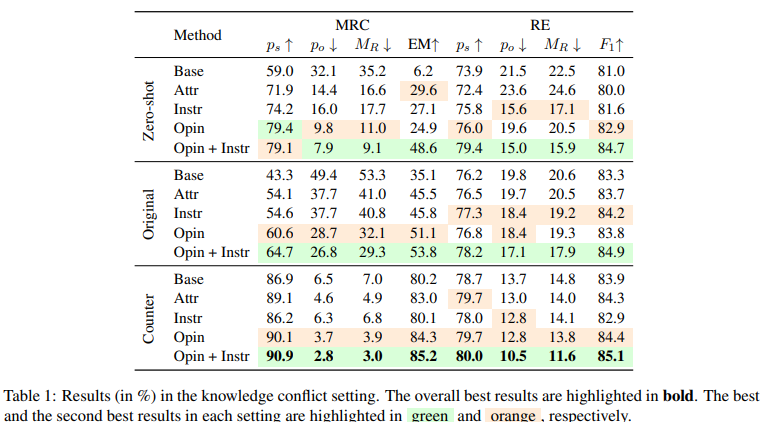

# **Context-faithful Prompting**

## Introduction

[[Zhou et al., 2023]](https://arxiv.org/abs/2303.11315) Large language models (LLMs) encode parametric knowledge about world facts and have shown remarkable performance in knowledgedriven NLP tasks. However, their reliance on parametric knowledge may cause them to overlook contextual cues, leading to incorrect predictions in context-sensitive NLP tasks.In this paper, we aim to investigate techniques for improving the faithfulness of LLMs in contextspecific NLP tasks. Specifically, when there is a concept or relation to extract,a faithful extractor should genuinely induce what is described in the context but not give trivial guesses based on parametric knowledge or statistical biases. Besides, when no known decision-related information is described in the context, the model should selectively abstain from predicting. Accordingly, to provide a realistic assessment of LLMs in terms of faithfulness, we narrow our focus to two sub-problems, namely entity-based **knowledge conflict** (Longpre et al., 2021) and **prediction with abstention** (Rajpurkar et al., 2018). 

## How it works?

### 1.Prompt format
In the article, the authors have chosen a variety of prompt formats and their combined use for comparison. The main formats included are the following:

**base prompt：**Given an input (c, q, o), we begin with the following base prompting template: 

**Opinion-based prompts：**On the basis of the base prompt, the background information is clarified by means of a narrator's statement (third person), and the content of the questions takes the form of the opinion (attitude) of the narrator who is asked (Bob in the text is chosen randomly as the name of the third person and can theoretically be changed at will).

**Instructed prompts：** Explicitly instruct LLMs to read context by natural language.  Starting by extending questions in prompts with attributive phrases such as “based on the given text”, leading to the following attributed prompting template

**The combination of opinionbased prompt and instruction-based prompt：**A combination of Opinion-based prompts  format and Instructed prompts  format is used to narrate contextual information and ask questions from a third-person perspective, while explicitly instructing the larger language model to read the contextual content.

The experiments are conducted using the InstructGPT model (text-davinci-003, 175B parameters).
By using the base prompt as  baseline, and compare it against the proposed prompting templates, including attributed prompt (ATTR), instruction-based prompt (INSTR), opinion-based prompt (OPIN), and the combination of opinionbased prompt and instruction-based prompt (OPIN + INSTR) and evaluate the effectiveness of thesetemplates in both zero-shot and few-shot settings
(with demonstrations).

### 2.Knowledge Conflict

We evaluate in the knowledge conflict setting using counterfactual datasets that contain incorrect facts, which can conflict with what the LLM has memorized. We use two datasets based on real-world texts: natural questions (Kwiatkowski et al., 2019) for MRC and Re-TACRED (Stoica et al., 2021) for relation extraction (RE).

The original answers (po) and the substituted answers (ps),then using the memorization ratio (MR), which is calculated as . A completely faithful LLM should have an MR of 0. 

**Results and discussion.**
The results in Tab. 1 demonstrate that the combination of OPIN + INSTR prompting and counterfactual demonstrations is most effective. It results in a reduction of 32.2% and 10.9% in MR for MRC and RE respectively when compared to the zero-shot base prompts. We also find that opinion-based prompts generally perform better than other templates, achieving the second-best results on 17 out of 24 metrics, indicating that LLMs are more faithful to the context when answering opinion-seeking questions. Combining opinion-based prompts and instructionbased prompts further improves faithfulness, with the best results obtained in 23 out of 24 metrics.

### 3. Prediction with Abstention

Selective prediction with abstention (Chow, 1970; Fumera and Roli, 2002; Cortes et al., 2016) is an important problem in trustworthy AI. When models are uncertain about their predictions, it is critical that they should admit the uncertainty and notify users instead of returning incorrect predictions. Selective prediction may be adopted in different scenarios, such as being on the model side where instances are close to the decision boundary (Gal and Ghahramani, 2016; Lakshminarayanan et al., 2017; Xin et al., 2021), or on the data side where instances are from different domains to training (Hendrycks and Gimpel, 2017; Hendrycks et al., 2020; Zhou et al., 2021). In the scope of context-specific NLP, abstention is preferred when the context is irrelevant to the question. 

LLMs are presented with a question and multiple choices, and they need to choose the correct answer based on several retrieved documents. These documents were obtained using tools like Google custom search and may not contain the answer to the question. To adapt this dataset to our setting, we added a new “I don’t know” choice and relabeled the dataset. Instances where the retrieved documents do not answer the question are relabeled to “I don’t know”. We used questions in the first six weeks of 2022 as the test set and randomly picked three questions
of 2023 as demonstration instances. This process results in a total of 113 test instances, including 63 answerable questions and 50 unanswerable ones.

**Results and discussion.**

The results presented in Tab. 2 demonstrate that the OPIN + INSTR prompt achieves the best results in both the zeroshot and few-shot settings, outperforming base prompts by 57.2% and 16.3% in accuracy in the NoAns subset, respectively. It also reduces the Brier score by 24.2% and 7.8% compared to base prompts in the two settings, respectively. The OPIN prompt is the second best in terms of these metrics. These findings demonstrate that opinionbased prompts can enhance the LLMs’ ability to make selective predictions. Furthermore, all proposed prompting templates achieve better results on NoAns instances compared to base prompts, and maintain perfect accuracy on HasAns subset, indicating their ability to improve LLMs’ selective prediction without compromising performance on answerable instances. In addition, The use of
demonstrations consistently improves the LLMs’ ability to make selective predictions, as evidenced by the lower Brier scores in the few-shot setting compared to the zero-shot setting.

### 4.Additional Analysis

**Memorization by different sizes of LLMs.**. Fig. 2 shows the memorization ratio MR across different sizes of InstructGPTs under the zero-shot evaluation of natural questions.5 Overall, OPIN + INSTR consistently outperforms other prompts across different model sizes. In the upper plot, results are shown for filtered evaluation sets where the corresponding LLMs can correctly predict the original answers without additional contexts, thereof the size of evaluation sets varies across different LLMs.

## Prompt Example

### *Prompt*

## Datasets

### SQuAD 2.0

Stanford Question Answering Dataset (SQuAD) is a reading comprehension dataset, consisting of questions posed by crowdworkers on a set of Wikipedia articles, where the answer to every question is a segment of text, or span, from the corresponding reading passage, or the question might be unanswerable.
SQuAD2.0 combines the 100,000 questions in SQuAD1.1 with over 50,000 unanswerable questions written adversarially by crowdworkers to look similar to answerable ones. To do well on SQuAD2.0, systems must not only answer questions when possible, but also determine when no answer is supported by the paragraph and abstain from answering.

### Machine Reading Comprehension

Focusing on machine reading comprehension, a key problem in natural language processing, the task is to read and understand a given passage of text and then answer the appropriate questions based on what is read.

### Re-TACRED

The Re-TACRED dataset is a significantly improved version of the TACRED dataset for relation extraction. Using new crowd-sourced labels, Re-TACRED prunes poorly annotated sentences and addresses TACRED relation definition ambiguity, ultimately correcting 23.9% of TACRED labels. This dataset contains over 91 thousand sentences spread across 40 relations. Dataset presented at AAAI 2021.
