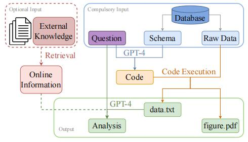
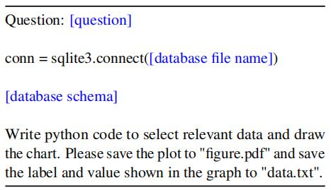
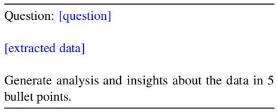

# 🏞️ Evaluation and Reliability

## 🏔️ Contents
- [AGIEval: A Human-Centric Benchmark for Evaluating Foundation Models](#agieval-a-human-centric-benchmark-for-evaluating-foundation-models)
- [Have LLMs Advanced Enough?A Challenging Problem Solving Benchmark For Large Language Models](#have-llms-advanced-enougha-challenging-problem-solving-benchmark-for-large-language-models)
- [EVEVAL:A Comprehensive Evaluation of Event Semantics for Large Language Model](#evevala-comprehensive-evaluation-of-event-semantics-for-large-language-model)
- [Is GPT-4 a Good Data Analyst?](#is-gpt-4-a-good-data-analyst)
---

## AGIEval: A Human-Centric Benchmark for Evaluating Foundation Models

&ensp;&ensp;&ensp;&ensp;This paper presents the AGIEval, a benchmark model specifically designed to assess foundation models in the context of human-centered standardized testing. The authors use this benchmark to assess several state-of-the-art foundation models, including the GPT-4, ChatGPT, and Text-Davinci-003.
The assessment model uses a dataset drawn from a variety of high-standard exams in human society, including:
university entrance exams and professional licensing exams, among others. Ensures robust and standardized assessment of LLM
The benchmark is also bilingual, including Chinese and English versions, in order to provide a more comprehensive assessment of LLMs' ability to process in different languages and cultures.  
&ensp;&ensp;&ensp;&ensp;The authors used the benchmark to conduct experiments on the three LLMs mentioned above to draw experimental conclusions.
The authors found that GPT-4 significantly outperformed ChatGPT and Text-Davinci-003, achieving an accuracy rate of 93.8% and 95% on the Advanced Placement English and SAT, respectively.
This indicates its superior general-purpose ability to handle human-centered tasks. chatGPT significantly outperformed Text-Davinci-003 on tasks requiring a high degree of external knowledge, such as
For example, courses involving geography, biology, chemistry, physics, and mathematics. This suggests that ChatGPT has a more robust knowledge base and is better able to handle tasks that require a deeper understanding of a specific domain.
While the three larger models above performed well they showed limitations in handling tasks that require more advanced reasoning and problem solving skills. This also provides an opportunity for future research and development targeting the general reasoning capabilities of the enhanced models.
The authors compared the few-sample cueing with the zero-sample cueing experiments, in which only a limited improvement was found for the few-sample cueing compared to the zero-sample cueing.
This suggests that the current zero-sample learning ability of large language models is approaching its less-sample learning ability. It is also mentioned in the paper that the original GPT-3 performs much better than zero-sample learning.
The improvement in GPT-3 is due to the improvements in manual alignment and instruction tuning in the current large models, which allow the models to better understand the meaning and context of the task in advance, thus making them perform better.  
&ensp;&ensp;&ensp;&ensp;In this article, the authors manually look at the comprehension dimension, the knowledge dimension, the reasoning dimension, and the computational dimension. Four dimensions are used to assess the capability of the LLM model.  

1. Comprehension dimension: The comprehension of the large model is good and the meaning can be understood correctly for most tasks, reflecting the ability of the large model to understand the context.
2. Knowledge dimension: In the knowledge dimension, large models struggled to recall domain-specific knowledge for subject exams such as law, biology and physics, an observation that highlights the importance of integrating more domain-specific knowledge into the model, either through the use of dedicated domain-specific knowledge bases or knowledge-enhancing pre-training techniques.
3. Reasoning dimension: the reasoning capabilities of the models are relatively underdeveloped and it is difficult for task models that require complex multi-step reasoning to accurately perform multi-step reasoning processes. This emphasises the importance of future research focused on enhancing reasoning with large models.
4. Computational dimension: the computational power of the model is weaker than its comprehension and shows variability between disciplines.
They perform better in mathematics exams but less well in chemistry and biology exams, which often require frequent substitution of variables involving chemical elements, requiring improved abstraction and computational skills in calculations and combinations.
Finally, the experimental data was analysed to obtain aspects of the current LLMs where progress can still be made. The main areas include  
1. allowing models to allow models to include external knowledge and formulae introducing knowledge bases and expertise into models to allow them to be adapted more effectively to different domains.
2. more rigorous complex logical reasoning Creating new datasets that emphasise complex reasoning, as well as combining api and external symbolic compilers that can perform rigorous logical or mathematical derivations, and using the results of the execution to further facilitate logical analysis and reasoning verification.
3. generalisation of multilingual reasoning capabilities The capabilities of the models are different in different languages, but where reasoning capabilities are relative more attention could be given to enhancing the multilingual generalisation reasoning capabilities of the underlying models.
4. multimodal assessment Extending the assessment framework to include multimodal tasks
5. better automated human-centred assessment metrics for tasks Development of more robust and meaningful automated assessment metrics
6. Robustness of inference capabilities Improving the robustness of model inference capabilities is essential to ensure their consistency and reliability across contexts

## Have LLMs Advanced Enough?A Challenging Problem Solving Benchmark For Large Language Models

The authors propose the JEEBench dataset for assessing the ability of LLMS to solve complex problems, which is a collection of 450 challenging problems from the IIT JEE-Advanced Exam (an entrance exam in India with an acceptance rate of only 5%).
450 challenging problems were selected from the IIT JEE-Advanced Exam, including mathematics, physics and chemistry problems, where LLMs need to reason mathematically and logically from deep domain knowledge above. The authors evaluated the GPT family of models and the best performer was GPT-4, but even with the use of
techniques such as self-consistency and cot hints the highest improvement was less than 40%. The authors analyse that errors in algebraic manipulation and failures to retrieve relevant domain-specific concepts are the main reasons for the low efficiency of GPT-4.  

### JEEBench dataset design

The dataset consists of 450 questions from the Indian pre-engineering exams in mathematics, physics and chemistry. It is important to note that this dataset was selected to exclude graphical questions.
The largest proportion of physics questions were on machine science content, the largest proportion of chemistry questions were on inorganic chemistry, and the largest proportion of mathematics questions were on algebra and calculus.
The answers given by LLMs to the three types of questions mentioned above contained single correct multiple choice questions, multiple correct multiple choice questions, integer type and number type. In integer-type questions the answer is an unbounded non-negative integer, while in numeric-type questions the answer is a floating-point number that must be accurate to 2 digits.  

### Experimental design and results

The authors conducted their experiments with three questions in mind:

1. how does the GPT family of models perform in a complex benchmark test like JEEBench?
2. how effective are methods such as 'thought chain hints' and 'self-consistency' in improving the reasoning of LLMs?
3. what are the main factors and sources of error that limit the performance of these models?  

#### Metrics

For single-option and integer-type questions, the authors use accuracy as a measure, i.e., if the model gives an answer that matches the correct answer, a score of 1 is awarded, otherwise a score of 0 is awarded. For numeric-type questions, a mark of 1 was awarded if the model answer did not differ from the correct answer by more than 0.01 , otherwise 0 was awarded. For multiple choice questions, we awarded 1 mark if the model answer matched all the correct choices. If the model selects correctly but incompletely, then for each correct option in the output, the model will receive 0.25 marks.

#### Experimental approach

The authors conducted a series of tests on the GPT family of models and designed comparison experiments for GPT-4, including the thought chain cueing technique, and the self-consistency technique.
GPT-3 showed near-random performance, but GPT-3.5 and GPT-4 performed significantly better. GPT-4 was far superior to GPT-3.5 by a wide margin, with a difference of 12.5 points between their total scores. The highest performance improvement was seen in Chemistry, followed by Physics and finally Mathematics. This may be due to the fact that mathematics questions had the highest complexity of reasoning and chemistry questions the lowest in the test dataset.
Thinking chain prompts were administered to the GPT-4 and this approach was found to significantly improve performance, with an overall score increase of 4.2 points. Thought chain prompting on the GPT-4 with self-consistency using an optimal sampling temperature of 0.5 and aggregating the results through multiple polling revealed no significant performance improvement compared to the regular gpt-4.

#### Human analysis

The authors manually annotated the errors made in the experimental dataset by GPT-4 using the thought chain prompting technique for GPT-4 against:

1. the ability of GPT-4 to correctly retrieve the concepts needed to solve the problem, the inability to do so can lead to conceptual errors
2. if the relevant correct concepts are retrieved, can they correctly solve the equations, failure to do so can lead to fundamental errors.
3. whether the algebra and arithmetic are correct, failure to do so can lead to computational errors.
With these three questions in mind the authors conducted a manual analysis of the experimental results of GPT-4 errors
The experimental analysis showed that most of the errors were due to the inability to retrieve important concepts that are crucial to solving the problem. The second cause of errors was caused by algebraic errors, which accounted for more than eighty percent of the total errors. It is important to note that the authors suggest that there could be multiple cases of causes of errors, and the authors only counted the first error in the solution.

#### Summary

The authors found that more often than not, GPT-4 was able to give at least a sketch of a correct, human-like solution, which is excellent considering the difficulty of reasoning involved in the test dataset problem. However, the authors' analysis also reveals major areas where progress is needed. While GPT-4 appears to be able to perform human-like logical and mathematical reasoning in some cases, it sometimes makes serious errors when performing trivial steps. Algebraic manipulation and computation remain difficult for the GPT family. The ability of large language models to utilise black-box scientific calculators as APIs would potentially improve the rate of correct computation.
Another interesting direction that could be explored is self-improvement. If a verifier were trained that could verify the correctness of mathematical reasoning in natural language and possibly provide some feedback on the nature of the errors, such an approach has the potential to greatly improve the reasoning power of the LLM. Physics problems often require spatial reasoning in order to understand real-world physical dynamics. We found that although GPT- 4's physical reasoning was far from perfect, it was able to reason about basic physical concepts in a limited sense.
This is a summary of the authors' experiments, and they also suggest future developments such as calculator-enhanced GPT, multimodal assessment of GPT-4, and the planning capabilities of GPT in an exam setting. The authors hope that this benchmark will guide future research using the LLM.  

## EVEVAL:A Comprehensive Evaluation of Event Semantics for Large Language Model

Recent studies have begun leveraging large language models (LLMs) to address event semantic processing. However, the extent that LLMs can effectively tackle these challenges remains uncertain. The lack of a comprehensive evaluation framework for event semantic processing poses a significant challenge in evaluating these capabilities.To comprehensively evaluate the event semantic processing abilities of models, we introduce a novel benchmark called EVEVAL. We include 8 datasets covering understanding, reasoning, and prediction about the event semantics. Extensive experiments are conducted on EVEVAL, leading to several noteworthy findings based on the obtained results.

## Tasks

### Understanding

1. Intra [DTFit].  Given two events, the model should pick out the more plausible event. This task evaluates the model's ability to comprehend the roles and participants involved in events, as well as its capacity to generate plausible event representations.
2.Inter [HardSim]. Given an event and two candidate events, the model should find which one of the candidate events is more semantically similar to event. This task evaluates the ability to distinguish the event semantics.

### Reasoning

1. Causal [ECARE]. Given an event and a target relation which can be either cause or effect, the model should pick out the correct event from the candidate events according to target relation.
2.Temporal [TRACIE]. Given an event E and a target relation R which can be either before or after,the model should pick out the correct event from the candidate events according to R.
3.Counterfactual [TIMETRAVEL]. Given a premise event Ep, a beginning event Eb, and an origin story  endding Do. The model should be able to edit the Do to Dc according to a counterfactual beginning event Ec.
4.Intent [SocialIQA]. Given an event E, the model should pick out the correct event from the can didate events most reflect the agent's intent.

### Prediction

1. Script [MCNC]. Given a chronological sequence of structured script events all with subject, trigger, and some object. The task is to select the correct future event from the given candidate events.
2. Story [SCT]. Given a chronological sequence of story events in natural language. The task is to select the correct future event from the given candidate events.

## Dataset

1. DTFit dataset (Pedinotti et al., 2021). The dataset consists of pairs of events that have a single differing argument, representing either a typical or atypical filler for a specific role in the described event.
2. HardSim dataset (Ding et al., 2019). Each data has an event and two choices. One with similar semantics but has very little lexical overlap while another one with dissimilar semantics but has high lexical overlap.
3. ECARE dataset (Du et al., 2022). This dataset is designed for explainable causal reasoning and comprises causal questions, accompanied by a vast collection of unique conceptual explanations that facilitate a profound comprehension of causal facts.
4. TRACIE dataset (Zhou et al., 2020). The primary emphasis of this dataset revolves around temporal relationships concerning implicit events present in short stories. TRACIE dataset incorporates meticulously annotated start and end time queries.
5. TIMETRAVEL dataset (Qin et al., 2019) . It introduces the concept of Counterfactual Story Rewriting, which involves the task of making minimal revisions to an original story in order to align it with a provided counterfactual event.
6. SocialIQA dataset (Sap et al., 2019) .It comprises a collection of multiple-choice questions designed to assess emotional and social intelligence across diverse everyday scenarios.
7. MCNC dataset (Granroth-Wilding and Clark,2016) . It is closely related to the narrative cloze task but better suited to comparing systems'usefulness as a component in a narrative prediction.
8. SCT dataset (Mostafazadeh et al., 2016).It encompasses a diverse range of causal and temporal commonsense relations between everyday events, and it serves as a high-quality compilation of stories from everyday life.

## Results

1. LLMs understand individual events, but not the semantic similarity between events.
2. LLMs demonstrate proficient reasoning abilities in causal and intentional relations, but their performance in other types of relations is comparatively weaker.
3. The more context, the better LLMs can forecast future events.
4. CoT for event semantic processing may need better utilization of event knowledge, context, and patterns.
5. Structural event representation performs comparatively to natural language.

## Is GPT-4 a Good Data Analyst?

As large language models (LLMs) have demonstrated their powerful capabilities in plenty of domains and tasks, including context understanding, code generation, language generation,data storytelling, etc., many data analysts may raise concerns if their jobs will be replaced by artificial intelligence (AI). This controversial topic has drawn great attention in public. We raise the research question of "is GPT-4 a good data analyst?" in this work and aim to answer it by conducting head-to-head comparative studies.We propose a framework to tackle the problems by carefully designing the prompts for GPT-4 to conduct experiments. We also design several task-specific evaluation metrics to systematically compare the performance between several professional human data analysts and GPT-4. Experimental results show that GPT-4 can achieve comparable performance to humans.

## Framework

First, based on the given question, it is determined whether the database contains relevant tables and scenarios for the necessary data for the chart, then the data is extracted from the database, and finally, the data needs to be analyzed to help answer the initial question. Since the actual data analyst role usually requires relevant business background knowledge, we designed an external knowledge retrieval model to query real-time online information from external knowledge sources (e.g. Google).

## prompt

### Step 1: Code Generation

The input of the first step contains a question and database schema. The goal here is to generate the code for extracting data and drawing the chart in later steps. We utilize GPT-4 to understand the questions and the relations among multiple database tables from the schema. By following the instructions, we can get a piece of python code containing SQL queries.

### Step 2: Code Execution

 The inputs in this step are the code generated from step 1 and the raw data from the database.The massive raw data is involved in this step. By executing the python code, we are able to get the chart in "figure.pdf" and the extracted data saved in "data.txt".

### Step 3: Analysis Generation

To make sure the data analysis is aligned with the original query, we use both the question and the extracted data as the input. Instead of generating a paragraph of description about the extracted data, we instruct GPT-4 to generate the analysis and insights in 5 bullet points to emphasize the key takeaways.

## Dataset

NvBench dataset. We randomly choose 100 questions from different domains with different chart types and different difficulty levels to conduct our main experiments. The chart types cover the bar chart, the stacked bar chart, the line chart, the scatter chart, the grouping scatter chart and the piechart. The difficulty levels include: easy, medium, hard and extra hard. The domains include: sports, artists, transportation, apartment rentals, colleges, etc. On top of the existing NvBench dataset, we additionally use our framework to write insights drawn from data in 5 bullet points for each instance and evaluate the quality using our self-designed evaluation metrics.

## Evaluation

### Figure Evaluation

1. information correctness: is the data and information shown in the figure correct?
2. chart type correctness: does the chart type match the requirement in the question?
3. aesthetics: is the figure aesthetic and clear without any format errors?
The information correctness and chart type correctness are calculated from 0 to 1, while the aesthetics is on a scale of 0 to 3.

### Analysis Evaluation

correctness: does the analysis contain wrong data or information?

1. alignment: does the analysis align with the question?
2. complexity: how complex and in-depth is the analysis?
3. fluency: is the generated analysis fluent, grammatically sound and without unnecessary repetitions?
We grade the correctness and alignment on a scale of 0 to 1, and grade complexity and fluency in a range between 0 to 3.

### Results

1.GPT-4 still has hallucination problems. Data analysis jobs not only require those technical skills and analytics skills, but also requires high accuracy to be guaranteed.
2.Instead of directly giving any suggestion or making any guess from the data, GPT-4 should be careful about all the assumptions and make the claims rigorous.
3.GPT-4 can surpass entry-level data analysts in terms of performance, and its performance is comparable to that of advanced-level data analysts. In terms of cost and time, GPT-4 is much cheaper and faster than hiring a data analyst. GPT-4 can achieve performance comparable to that of humans, but further research is needed before concluding that GPT-4 can replace data analysts.
