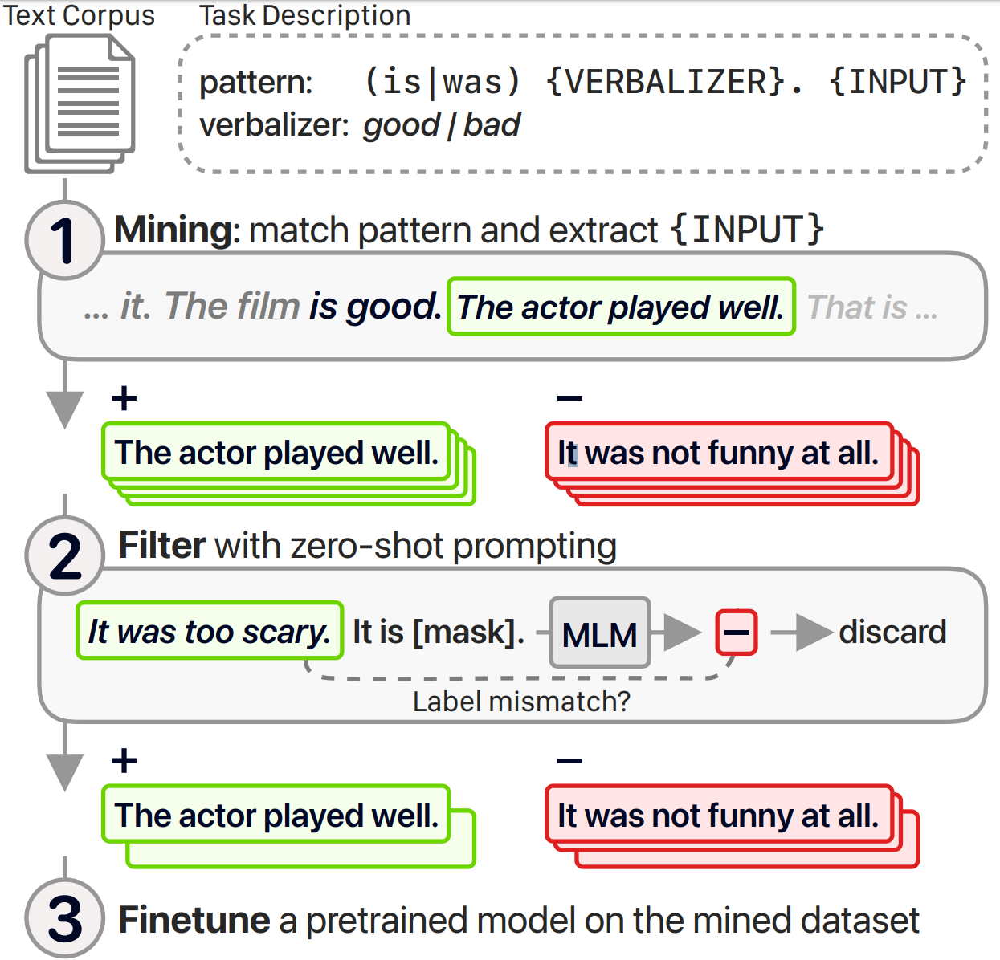
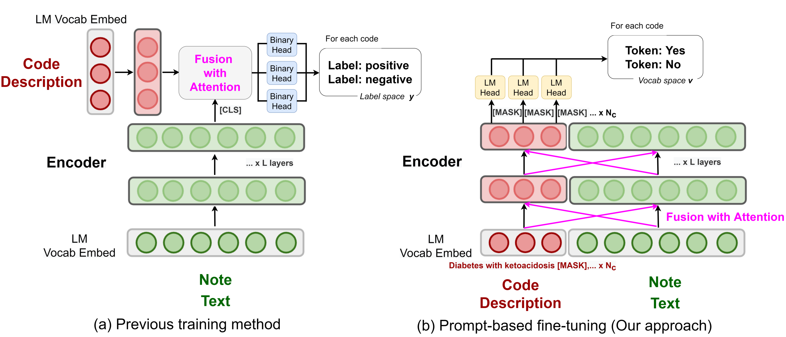

# 💾 Knowledge Augmented Prompt

# 📂 Table of Contents

- [**LasUIE: Unifying Information Extraction with Latent Adaptive Structure-aware Generative Language Model**](https://arxiv.org/abs/2304.06248)
- [**Commonsense-Aware Prompting for Controllable Empathetic Dialogue Generation**](https://doi.org/10.48550/arXiv.2302.01441)
- [**REPLUG: Retrieval-Augmented Black-Box Language Models**](https://doi.org/10.48550/arXiv.2301.12652)
- [**Self-Instruct: Aligning Language Model with Self Generated Instructions**](https://doi.org/10.48550/arXiv.2212.10560)
- [**The Impact of Symbolic Representations on In-context Learning for Few-shot Reasoning**](https://doi.org/10.48550/arXiv.2212.08686)
- [**Don’t Prompt, Search! Mining-based Zero-Shot Learning with Language Models**](https://doi.org/10.48550/arXiv.2210.14803)
- [**Knowledge Prompting in Pre-trained Language Model for Natural Language Understanding**](https://doi.org/10.48550/arXiv.2210.08536)
- [**Knowledge Injected Prompt Based Fine-tuning for Multi-label Few-shot ICD Coding**](https://doi.org/10.48550/arXiv.2210.03304)
- [**Unified Knowledge Prompt Pre-training for Customer Service Dialogues**](https://doi.org/10.1145/3511808.3557718)
- [**DocPrompting: Generating Code by Retrieving the Docs**](https://arxiv.org/abs/2207.05987)
- [**Towards Unified Conversational Recommender Systems via Knowledge-Enhanced Prompt Learning**](https://doi.org/10.1145/3534678.3539382)
- [**Decoupling Knowledge from Memorization: Retrieval-augmented Prompt Learning**](https://doi.org/10.48550/arXiv.2205.14704)
- [**Relation Extraction as Open-book Examination: Retrieval-enhanced Prompt Tuning**](https://doi.org/10.1145/3477495.3531746)
- [**Contrastive Demonstration Tuning for Pre-trained Language Models**](https://doi.org/10.48550/arXiv.2204.04392)
- [**Recommendation as Language Processing (RLP): A Unified Pretrain, Personalized Prompt & Predict Paradigm (P5)**](https://doi.org/10.1145/3523227.3546767)
- [**Multi-Stage Prompting for Knowledgeable Dialogue Generation**](https://doi.org/10.48550/arXiv.2203.08745)
- [**Training Data is More Valuable than You Think: A Simple and Effective Method by Retrieving from Training Data**](https://doi.org/10.48550/arXiv.2203.08773)
- [**AdaPrompt: Adaptive Model Training for Prompt-based NLP**](https://arxiv.org/abs/2202.04824)
- [**Generated Knowledge Prompting for Commonsense Reasoning**](https://doi.org/10.18653/v1/2022.acl-long.225)
- [**Label Verbalization and Entailment for Effective Zero and Few-Shot Relation Extraction**](https://doi.org/10.18653/v1/2021.emnlp-main.92)
- [**Knowledgeable Prompt-tuning: Incorporating Knowledge into Prompt Verbalizer for Text Classification**](https://doi.org/10.18653/v1/2022.acl-long.158)
- [**PTR: Prompt Tuning with Rules for Text Classification**](https://doi.org/10.1016/j.aiopen.2022.11.003)
- [**Retrieval-Augmented Generation for Knowledge-Intensive NLP Tasks**](https://arxiv.org/abs/2005.11401)
- [**REALM: Retrieval-Augmented Language Model Pre-Training**](https://arxiv.org/abs/2002.08909)
- [**Prompt as a Knowledge Probe for Chinese Spelling Check**](https://doi.org/10.1007/978-3-031-10989-8_41)

## [**LasUIE: Unifying Information Extraction with Latent Adaptive Structure-aware Generative Language Model**](https://arxiv.org/abs/2304.06248)

### Introduction

Syntactic structure information, a type of effective feature should be beneficial to universally modeling all typical information extraction tasks (**UIE**).  In this work, they propose a novel structure-aware generative language model (**GLM**), fully unleashing the power of syntactic knowledge for UIE.

### How it works

A heterogeneous structure inductor is explored to unsupervisedly induce rich **heterogeneous structural representations** by post-training an existing GLM. In particular, a structural broadcaster is devised to compact various latent trees into explicit high-order forests, helping to guide a better generation during decoding. They finally introduce a **task-oriented structure fine-tuning mechanism**, further adjusting the learned structures to most coincide with the end-task’s need.

### Mechanism Structure

Reduce all the IE tasks into three prototypes (a) with representative examples (b). Unify all IEs with an encoder-decoder GLM (c). Both syntactic dependency (d) and constituency structure (e) plays a key but distinct role in IE, where the former helps solve long-range dependence problem and the latter benefits boundary detection issue.

- Post-training & Heterogeneous syntax measurement

  

  LasUIE framework under (a) unsupervised structure-aware post-training (y 0 7→ refers to prediction y 0 with shift right in seq-to-seq procedure). Heterogeneous structure inductor module generates both constituency and dependency structures via (b) two heterogeneous syntax measurements.

- Task-oriented Structure Fine-tuning

  

## [**Commonsense-Aware Prompting for Controllable Empathetic Dialogue Generation**](https://doi.org/10.48550/arXiv.2302.01441)

### Introduction

This study  proposes a framework that improves empathetic dialogue generation using pre-trained language models by 1) incorporating commonsense knowledge through prompt verbalization, and 2) controlling dialogue generation using a strategy-driven future discriminator.

### Overall Framework

The Overall Framework of the Proposed Model.

## [**REPLUG: Retrieval-Augmented Black-Box Language Models**](https://doi.org/10.48550/arXiv.2301.12652)

### Introduction

This work introduces REPLUG, a retrieval-augmented language modeling framework that treats the language model (LM) as a black box and augments it with a tuneable retrieval model. Unlike prior retrieval-augmented LMs that train language models with special cross attention mechanisms to encode the retrieved text, REPLUG simply prepends retrieved documents to the input for the frozen black-box LM. This simple design can be easily applied to any existing retrieval and language models. Furthermore, the LM can be used to supervise the retrieval model, which can then find documents that help the LM make better predictions.

### Main Idea

REPLUG treats the language model as a black box and augments it with a frozen or tunable retriever. This black-box assumption makes REPLUG applicable to large LMs (i.e., >100B parameters), which are often served via APIs.

### example for inference

### 

REPLUG at inference (§3). Given an input context, REPLUG first retrieves a small set of relevant documents from an external corpus using a retriever (§3.1 Document Retrieval). Then it prepends each document separately to the input context and ensembles output probabilities from different passes (§3.2 Input Reformulation).

## [**Self-Instruct: Aligning Language Model with Self Generated Instructions**](https://doi.org/10.48550/arXiv.2212.10560)

### Introduction

This work introduces SELF-INSTRUCT, a framework for improving the instruction-following capabilities of pretrained language models by bootstrapping off its own generations.

### How it works

The pipeline generates instruction, input, and output samples from a language model, then prunes them before using them to finetune the original model.

### Overview of SELF-INSTRUCT

A high-level overview of SELF-INSTRUCT. The process starts with a small seed set of tasks as the task pool. Random tasks are sampled from the task pool, and used to prompt an off-the-shelf LM to generate both new instructions and corresponding instances, followed by filtering low-quality or similar generations, and then added back to the initial repository of tasks. The resulting data can be used for the instruction tuning of the language model itself later to follow instructions better. Tasks shown in the figure are generated by GPT3.

## [**The Impact of Symbolic Representations on In-context Learning for Few-shot Reasoning**](https://doi.org/10.48550/arXiv.2212.08686)

### Introduction

To make progress towards understanding in-context learning, this work curates synthetic datasets containing equivalent (natural, symbolic) data pairs, where symbolic examples contain first-order logic rules and predicates from knowledge bases (KBs). Then revisit neuro-symbolic approaches and use Language Models as Logic Programmer (LMLP) that learns from demonstrations containing logic rules and corresponding examples to iteratively reason over KBs, recovering Prolog’s backward chaining algorithm.

### Comparison between LMLP and CoT

## [**Don’t Prompt, Search! Mining-based Zero-Shot Learning with Language Models**](https://doi.org/10.48550/arXiv.2210.14803)

### Introduction

This paper proposes an alternative mining-based approach for zero-shot learning. Instead of prompting language models, they use regular expressions to mine labeled examples(examples that match regex-based patterns of different labels) from unlabeled corpora, which can optionally be filtered through prompting, and used to finetune a pretrained model.

### Main procedure of the method

Proposed method. 1) Mine labeled examples from a text corpus with regex-based patterns. 2) Optionally, filter examples for which zero-shot prompting predicts a different label. 3) Finetune a pretrained language model with a classification head.

## [**Knowledge Prompting in Pre-trained Language Model for Natural Language Understanding**](https://doi.org/10.48550/arXiv.2210.08536)

### Introduction

Most existing methods modify the internal structures of fixed types of PLMs by stacking complicated modules, and introduce redundant and irrelevant factual knowledge from knowledge bases (KBs). In this paper, to address these problems, they introduce a knowledge prompting paradigm and further propose a knowledge-prompting-based PLM framework **KP-PLM**. This framework can be flexibly combined with existing mainstream PLMs.

### How it works

They first construct a knowledge subgraph from KBs for each context. Then design multiple continuous prompts rules and transform the knowledge sub-graph into natural language prompts. To further leverage the factual knowledge from these prompts,  two novel knowledge-aware selfsupervised tasks  including prompt relevance inspection and masked prompt modeling are proposed.

## [**Knowledge Injected Prompt Based Fine-tuning for Multi-label Few-shot ICD Coding**](https://doi.org/10.48550/arXiv.2210.03304)

### Introduction

Automatic International Classification of Diseases (ICD) coding aims to assign multiple ICD codes to a medical note with average length of 3,000+ tokens. This study addresses the long-tail challenge by adapting a prompt based fine-tuning technique with label semantics, which has been shown to be effective under few-shot setting. To further enhance the performance in medical domain, they propose a knowledge-enhanced longformer by injecting three domain-specific knowledge: hierarchy, synonym, and abbreviation with additional pretraining using contrastive learning.

### Comparison between previous pre-train method and the proposed method

## [**Unified Knowledge Prompt Pre-training for Customer Service Dialogues**](https://doi.org/10.1145/3511808.3557718)

### Introduction

In this paper, they propose a unified knowledge prompt pre-training framework, **UFA** (Unified Model For All Tasks), for customer service dialogues. They formulate all the tasks of customer service dialogues as a unified text-to-text generation task and introduce a knowledge-driven prompt strategy to jointly learn from a mixture of distinct dialogue tasks. They pre-train UFA on a large-scale Chinese customer service corpus collected from practical scenarios and get significant improvements on both natural language understanding (NLU) and natural language generation (NLG) benchmarks.

### Overall architecture of UFA

The overall architecture of proposed unified knowledge prompt pre-training framework (UFA) for customer service dialogues. UFA formulate all the dialogue tasks as a text-to-text format and use the same prompts to guide multi-task pre-training on a large-scale weakly-supervised customer service dialogue corpus.

## [**DocPrompting: Generating Code by Retrieving the Docs**](https://arxiv.org/abs/2207.05987)

### Introduction

- Existing models inherently cannot generalize to using unseen functions and libraries, because these would never appear in their training data. This work introduces DocPrompting: a natural-language-to-code generation approach that explicitly leverages code documentation by (1) retrieving the relevant documentation pieces given a natural language (NL) intent, and (2) generating code based on the NL intent and the retrieved documentation. DocPrompting is general: it can be applied to any programming language, and is agnostic to the underlying neural model.

### Main procedure of DocPrompting

DocPrompting: given an NL intent n , the retriever retrieves a set of relevant documentation {d1 ,d2 , d3 } from a documentation pool D . Then, the generator generates the code c based on the NL and retrieved docs. DocPrompting allows the model to generalize to previously unseen usages by reading those docs. Italic blue highlights the shared tokens between NL and docs; Bold shows shared tokens between docs and the code snippet.

## [**Towards Unified Conversational Recommender Systems via Knowledge-Enhanced Prompt Learning**](https://doi.org/10.1145/3534678.3539382)

### Introduction

To address the problem of integrating recommendation module and conversation module in a conversational recommender systems (CRS), this work proposes a unified CRS model named UniCRS based on knowledge-enhanced prompt learning. Their approach unifies the recommendation and conversation subtasks into the prompt learning paradigm, and utilizes knowledge-enhanced prompts based on a fixed pre-trained language model (PLM) to fulfill both subtasks in a unified approach.

### How it works

 In the prompt design, they include fused knowledge representations, task-specific soft tokens, and the dialogue context, which can provide sufficient contextual information to adapt the PLM for the CRS task. Besides, for the recommendation subtask, they also incorporate the generated response template as an important part of the prompt, to enhance the information interaction between the two subtasks.

### Overview of framework UniCRS

The overview of the proposed framework UniCRS. Blocks in grey indicate that their parameters are frozen, while other parameters are tunable. Firstly perform pre-training to fuse semantics from both words and entities, then prompt the PLM to generate the response template and use the template as part of the prompt for recommendation. Finally, the recommended items are filled into the template as a complete response.

## [**Decoupling Knowledge from Memorization: Retrieval-augmented Prompt Learning**](https://doi.org/10.48550/arXiv.2205.14704)

### Introduction

This work develops **RETROPROMPT** with the motivation of decoupling knowledge from memorization to help the model strike a balance between generalization and memorization. **RETROPROMPT** constructs an open-book knowledge-store from training instances and implements a retrieval mechanism during the process of input, training and inference, thus equipping the model with the ability to retrieve related contexts from the training corpus as cues for enhancement.

### Overview of RETROPROMPT

Overview of RETROPROMPT. Note that e(·) denotes word embedding function in the PLM M, while “M”,“t” and “g” in e(·) specifically refers to “[MASK]”, “terrible” and “great”.

### Main idea of decoupling knowledge from memorization

## [**Relation Extraction as Open-book Examination: Retrieval-enhanced Prompt Tuning**](https://doi.org/10.1145/3477495.3531746)

### Introduction

This work regards relation extraction as an open-book examination and propose a new semiparametric paradigm of retrieval-enhanced prompt tuning for relation extraction.

### How it works

They construct an open-book datastore for retrieval regarding prompt-based instance representations and corresponding relation labels as memorized key-value pairs. During inference, the model can infer relations by linearly interpolating the base output of PLM with the non-parametric nearest neighbor distribution over the datastore. In this way, the model not only infers relation through knowledge stored in the weights during training but also assists decision-making by unwinding and querying examples in the open-book datastore.

### procedure of inference

## [**Contrastive Demonstration Tuning for Pre-trained Language Models**](https://doi.org/10.48550/arXiv.2204.04392)

### Introduction

This paper proposes a pluggable, extensible, and efficient approach named contrastive demonstration tuning, which is free of demonstration sampling. Furthermore, the proposed approach can be: (i) Plugged into any previous prompt-tuning approaches; (ii) Extended to widespread classification tasks with a large number of categories.

### Illustration of demonstration tuning

An illustration of (a) prompt-tuning with demonstrations, and (b) proposed contrastive demonstration tuning (demo-tuning). Note that regard the input with virtual demonstration and a random sampled real demonstrations as positive pairs for contrastive learning.

## [**Recommendation as Language Processing (RLP): A Unified Pretrain, Personalized Prompt & Predict Paradigm (P5)**](https://doi.org/10.1145/3523227.3546767)

### Introduction

This work presents a flexible and unified text-to-text paradigm called “Pretrain, Personalized Prompt, and Predict Paradigm” (P5) for recommendation, which unifies various recommendation tasks in a shared framework.

### How it works

In P5, all data such as user-item interactions, user descriptions, item metadata, and user reviews are converted to a common format — natural language sequences. The rich information from natural language assists P5 to capture deeper semantics for personalization and recommendation. Specifically, P5 learns different tasks with the same language modeling objective during pretraining. Thus, it serves as the foundation model for various downstream recommendation tasks, allows easy integration with other modalities, and enables instruction-based recommendation. P5 advances recommender systems from shallow model to deep model to big model, and will revolutionize the technical form of recommender systems towards universal recommendation engine. With adaptive personalized prompt for different users, P5 is able to make predictions in a zero-shot or few-shot manner and largely reduces the necessity for extensive fine-tuning.

### Pretrain tasks and downstream tasks of P5

P5 pretrains on an encoder–decoder Transformer model that takes in textual inputs and produces target responses. P5 was trained on a multitask collection of personalized prompts. After multitask prompt-based pretraining on recommendation datasets, P5 achieves the capability of zero-shot generalization to unseen personalized prompts and new items.

## [**Multi-Stage Prompting for Knowledgeable Dialogue Generation**](https://doi.org/10.48550/arXiv.2203.08745)

### Introduction

In this work they propose a multi-stage prompting approach to generate knowledgeable responses from a single pretrained LM. Firstly prompt the LM to generate knowledge based on the dialogue context. Then, further prompt it to generate responses based on the dialogue context and the previously generated knowledge.

### Overview of multi-stage prompting approach

## [**Training Data is More Valuable than You Think: A Simple and Effective Method by Retrieving from Training Data**](https://doi.org/10.48550/arXiv.2203.08773)

### Introduction

**RE**trieving from the tra**IN**ing dat**A** (**REINA**)  can lead to significant gains on multiple NLG and NLU tasks. In this work they retrieve the labeled training instances most similar to the input text and then concatenate them with the input to feed into the model to generate the output.

### pipline procedure of REINA

REINA pipeline of model training/inference with retrieval from training data. Filter only happens at training, as the same training sample will be retrieved from the index. For each instance, concatenate the input with the retrieved content, i.e., data and/or labels, for model training and inference.

## [**AdaPrompt: Adaptive Model Training for Prompt-based NLP**](https://arxiv.org/abs/2202.04824)

### Introduction

This work proposes AdaPrompt, adaptively retrieving external data for continual pretraining of PLMs by making use of both task and prompt characteristics. In addition, they make use of knowledge in Natural Language Inference models for deriving adaptive verbalizers.

### Overall framework of AdaPrompt

## [**Generated Knowledge Prompting for Commonsense Reasoning**](https://doi.org/10.18653/v1/2022.acl-long.225)

### Introduction

This work develops generated knowledge prompting, which consists of generating knowledge from a language model, then providing the knowledge as additional input when answering a question. The method does not require task-specific supervision for knowledge integration, or access to a structured knowledge base,

### Overall procedure of generated knowledge prompting

Generated knowledge prompting involves (i) using few-shot demonstrations to generate questionrelated knowledge statements from a language model; (ii) using a second language model to make predictions with each knowledge statement, then selecting the highest-confidence prediction.

## [**Label Verbalization and Entailment for Effective Zero and Few-Shot Relation Extraction**](https://doi.org/10.18653/v1/2021.emnlp-main.92)

### Introduction

In this work they reformulate relation extraction as an entailment task, with simple, hand-made, verbalizations of relations produced in less than 15 minutes per relation. The system relies on a pretrained textual entailment engine which is run as-is (no training examples, zero-shot) or further fine-tuned on labeled examples (few-shot or fully trained).

### Overall workflow of entailment-based RE approach

## [**Knowledgeable Prompt-tuning: Incorporating Knowledge into Prompt Verbalizer for Text Classification**](https://doi.org/10.18653/v1/2022.acl-long.158)

### Introduction

In this work, they focus on incorporating external knowledge into the verbalizer, forming a **knowledgeable prompt-tuning (KPT)**, to improve and stabilize prompt-tuning. Specifically, they expand the label word space of the verbalizer using external knowledge bases (KBs) and refine the expanded label word space with the PLM itself before predicting with the expanded label word space.

### Overall illustration of KPT

The illustration of KPT , the knowledgeable verbalizer maps the predictions over label words into labels. And the above part is the construction, refinement and utilization processes of KPT .

## [**PTR: Prompt Tuning with Rules for Text Classification**](https://doi.org/10.1016/j.aiopen.2022.11.003)

### Introduction

In this paper, they propose to encode the prior knowledge of a classification task into rules, then design subprompts according to the rules, and finally combine the sub-prompts to handle the task. They name this Prompt Tuning method with Rules ‘‘PTR’’.

### Illustration of PTR in relation extraction task

Illustration of PTR. Take the task relation classification for example. By composing the sub-prompts of the conditional functions, we could easily get an effective prompt to distinguish “person:parent” and “organization:parent”.

## [**Retrieval-Augmented Generation for Knowledge-Intensive NLP Tasks**](https://arxiv.org/abs/2005.11401)

- 用额外的维基数据作为知识库，在任务中根据句子或词元进行匹配选取进行知识增强以提升模型效果

### Introduction

In this work, they explore a general-purpose fine-tuning recipe for retrieval-augmented generation (RAG) — models which combine pre-trained parametric and non-parametric memory for language generation. They introduce RAG models where the parametric memory is a pre-trained seq2seq model and the non-parametric memory is a dense vector index of Wikipedia, accessed with a pre-trained neural retriever. They compare two RAG formulations, one which conditions on the same retrieved passages across the whole generated sequence, and another which can use different passages per token.

### Overview of RAG

Overview of this approach. Combine a pre-trained retriever (Query Encoder + Document Index) with a pre-trained seq2seq model (Generator) and fine-tune end-to-end. For query x, use Maximum Inner Product Search (MIPS) to find the top-K documents zi . For final prediction y, treat z as a latent variable and marginalize over seq2seq predictions given different documents.

## [**REALM: Retrieval-Augmented Language Model Pre-Training**](https://arxiv.org/abs/2002.08909)

- 在作为知识库的数据上训练一个知识选取器 knowledge retriever 来给出用于增强的知识

### Introduction

In this work, to capture knowledge in a more modular and interpretable way, they augment language model pretraining with a latent knowledge retriever, which allows the model to retrieve and attend over documents from a large corpus such as Wikipedia, used during pre-training, fine-tuning and inference.  This model called Retrieval-Augmented Language Model (REALM).

### Overall framework of REALM

Left: Unsupervised pre-training. The knowledge retriever and knowledge-augmented encoder are jointly pre-trained on the unsupervised language modeling task.

Right: Supervised fine-tuning. After the parameters of the retriever (θ) and encoder (φ) have been pre-trained, they are then fine-tuned on a task of primary interest, using supervised examples.

## [**Prompt as a Knowledge Probe for Chinese Spelling Check**](https://doi.org/10.1007/978-3-031-10989-8_41)

- 使用 prompt 方法用 BERT 判断句中存在错别字的位置，再用 BERT 的 mask LM 对有错别字的位置进行更正

### Introduction & How it works

They propose an end-to-end generative model called **PromptCSC**. Since misspelling of characters causes unnatural semantic incoherence in sentences, by using the prompt template as a knowledge probe, PromptCSC detects and outputs the error probability of each character in the sentence. The error locations are then corrected using BERT’s soft mask mechanism.

### Overall architecture of PromptCSC

## [**Knowledgeable Prompt-tuning: Incorporating Knowledge into Prompt Verbalizer for Text Classification Rolling Review submission**](https://arxiv.org/abs/2108.02035) (ACL Rolling Review)
