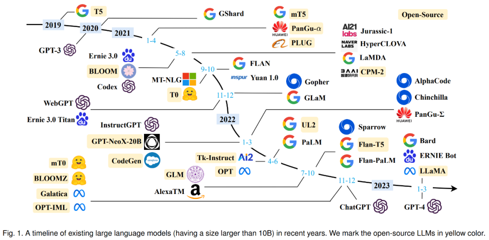
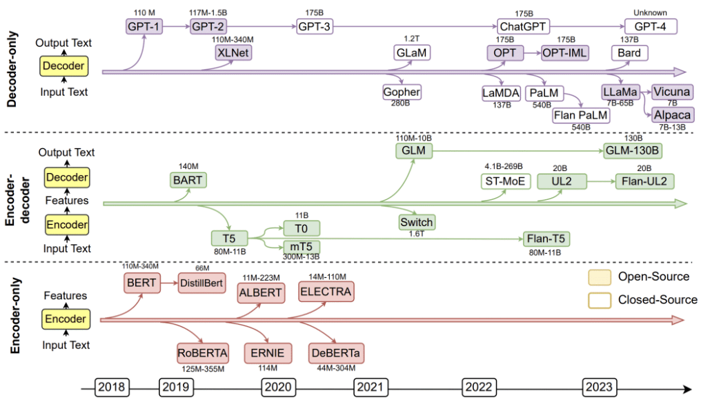

# Overview of the Large Language Model
- [Overview of the Large Language Model](#overview-of-the-large-language-model)
  - [Introduction](#introduction)
  - [History of development](#history-of-development)
  - [Emergence capability](#emergence-capability)
  - [Technical route](#technical-route)
  - [Training methods](#training-methods)
  - [Inference optimization](#inference-optimization)
  - [References](#references)

## Introduction
Large Language Model (LLM) is a natural language processing model based on deep learning, which can learn the syntax and semantics of natural language, so as to generate human-readable text.

The so-called "language model" is an AI model that only deals with language (or symbol system), finds the rules, and automatically generates the content that conforms to these rules according to the prompts.

LLM is usually based on neural network models and trained using large-scale corpora, such as massive text data on the Internet. These models usually have billions to trillions of parameters and can handle various natural language processing tasks, such as natural language generation, text classification, text summarization, machine translation, speech recognition and so on.

## History of development

The history of large language models can be traced back to the early research on language models and natural language processing. Here are some of the key historical milestones for the Big Language Model:
* The rule stage is roughly from 1956 to 1992. The rule-based machine translation system links various functional modules together internally. People first acquire knowledge from data, summarize rules, write them out and teach them to the machine, and then the machine executes the rules to complete specific tasks.
* The statistical machine learning stage is roughly from 1993 to 2012. The machine translation system can be split into a language model and a translation model. The language model here is exactly the same as the current GPT-3/3.5 technical means. Compared with the previous stage, the mutation of this stage is higher, from human knowledge to machine learning knowledge from data automatically. The mainstream technologies include SVM, HMM, MaxEnt, CRF, LM, etc. At that time, the amount of manual annotation data was about one million.
* The pre-training stage is from 2018 to 2022. Compared with the previous stage, the biggest change is to add self-supervised learning. Zhang Junlin believes that this is the most outstanding contribution in the field of NLP, which expands the available data from labeled data to non-labeled data. This stage can be divided into two stages: pre-training and fine-tuning. The amount of pre-training data is expanded by 3 to 5 times. Typical technology stacks include Encoder-Decoder, Transformer, Attention, etc.
* Starting from 2023, the large-scale language model phase aims to enable machines to understand human commands and follow human values. Its characteristic is that in the first stage, the past two stages are condensed into a pre-training stage, and in the second stage, it is transformed into alignment with people's values, rather than migration to the field. At this stage, the mutation is very high, and it has shifted from special tasks to general tasks, or presented in the form of natural language human-computer interface.

## Emergence capability
The emergence capability of LLM is formally defined as "the capability that does not exist in small models but appears in large models", which is one of the most prominent features that distinguish LLM from previous PLMs. When this new capability appears, it also introduces a striking feature: when the scale reaches a certain level, the performance is significantly higher than the random state. By analogy, this new mode is closely related to the phenomenon of phase transition in physics. In principle, this ability can also be related to some complex tasks, while people are more concerned about the general ability that can be applied to solve multiple tasks. Three representative emergent capabilities of LLM are briefly introduced here:

* Contextual learning. GPT-3 formally introduces contextual learning capabilities: assuming that a language model already provides natural language instructions and multiple task descriptions, it can generate the expected output of a test instance by completing a sequence of words of the input text without additional training or gradient updates.
* Follow the instructions. By fine-tuning a mixture of multi-task datasets formatted with natural language descriptions, LLM performs well on trivial tasks, which are also described in the form of instructions. With this capability, instruction tuning enables LLM to perform new tasks by understanding task instructions without using explicit samples, which can greatly improve generalization.
* Progressive reasoning. For small language models, it is often difficult to solve complex tasks involving multiple inference steps, such as mathematical subject word problems. At the same time, through the thought chain reasoning strategy, LLM can get the final answer by using the prompt mechanism involving intermediate reasoning steps to solve such tasks. It is speculated that this ability may be acquired through code training.

## Technical route
In the past five years, there are three technical routes for the development of large-scale language model research: Bert model, GPT model and hybrid model. Most of them adopt mixed mode in China, and most of the mainstream large-scale language models follow the GPT technology route, until the end of 2022, ChatGPT was produced on the basis of GPT-3.5.

After 2019, the Bert route has basically no iconic new models, while the GPT technology route tends to flourish. From Bert to GPT, the model is getting bigger and bigger, and the things it does are getting more and more universal. Large language model is divided from data to knowledge, data can be divided into general data and domain data, knowledge can be divided into language knowledge and world knowledge; from the type of task, it can be classified into single task and multi-task, understanding class and generation class.

* Encoder-only: Represented by Google's BERT.
* Encoder-Decoder: represented by T5 of Google, BART of Meta and GLM of Tsinghua University.
* Decoder-only: represented by OpenAI's GPT, Google's Bard, Meta's LLaMA, DeepMind's Chinchilla, Anthropic's Claude.

The conclusion of the current study is that if the scale of the model is not particularly large, it is suitable to use T5 mode for understanding tasks in a single field. GPT mode works best when doing generation-type tasks. GPT mode works best if zero-shot is considered alone, and T5 mode works best if multi-task fine-tuning is introduced after pre-training. Generally speaking, almost all large-scale language models with parameters of more than 100 billion adopt GPT mode.

## Training methods
To train a language model, we need to provide it with a large amount of text data, which the model uses to learn the structure, syntax and semantics of human language. This process is usually done through unsupervised learning, using a technique called self-supervised learning. In self-supervised learning, the model generates its own label for the input data by predicting the next word or token in the sequence, and gives the previous words.

The training process consists of two main steps: pre-training and fine-tuning:
* In the pre-training phase, the model learns from a huge, diverse dataset, often containing billions of words from different sources, such as websites, books, and articles. This phase allows the model to learn general language patterns and representations.
* In the fine-tuning phase, the model is further trained on a more specific, smaller dataset related to the target task or domain. This helps the model to fine-tune its understanding and adapt to the special requirements of the task.

## Inference optimization
At present, many studies have proved that LLM has a strong memory ability for knowledge, but generally we will not say that a person is very smart because of his strong memory ability. Whether he has a strong reasoning ability is often an important criterion for us to judge whether a person is smart or not. When the scale of the model is large enough, LLM itself has the ability of reasoning. In simple reasoning problems, LLM has reached a very good ability, but in complex reasoning problems, more in-depth research is needed. If we sort out the existing work related to LLM reasoning, I classify them into two categories, reflecting the different technical ideas of mining or promoting LLM reasoning ability:
* There are many researches in the first category, which can be collectively referred to as Prompt-based methods. The core idea is to better stimulate the reasoning ability of LLM itself through appropriate prompts or prompt samples. Google has done a lot of effective work in this direction.
* The second approach is to introduce program code in the pre-training process and participate in pre-training with text, so as to further enhance the reasoning ability of LLM, which should be the idea of OpenAI practice. For example, ChatGPT certainly has strong reasoning ability, but it does not require users to provide some reasoning examples, so ChatGPT's strong reasoning ability probably comes from using code to participate in the pre-training of GPT 3.5.

## References
* [A Survey of Large Language Models](https://arxiv.org/pdf/2303.18223.pdf)
* [通向AGI之路：大型语言模型（LLM）技术精要](https://zhuanlan.zhihu.com/p/597586623)
* [大型语言模型综述全新出炉：从T5到GPT-4最全盘点，国内20余位研究者联合撰写](https://zhuanlan.zhihu.com/p/619083290)
