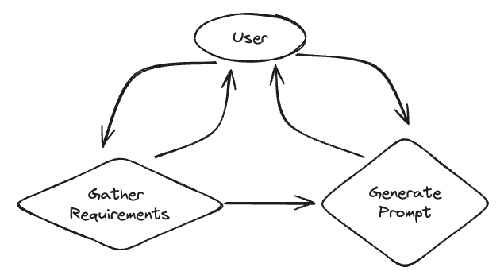
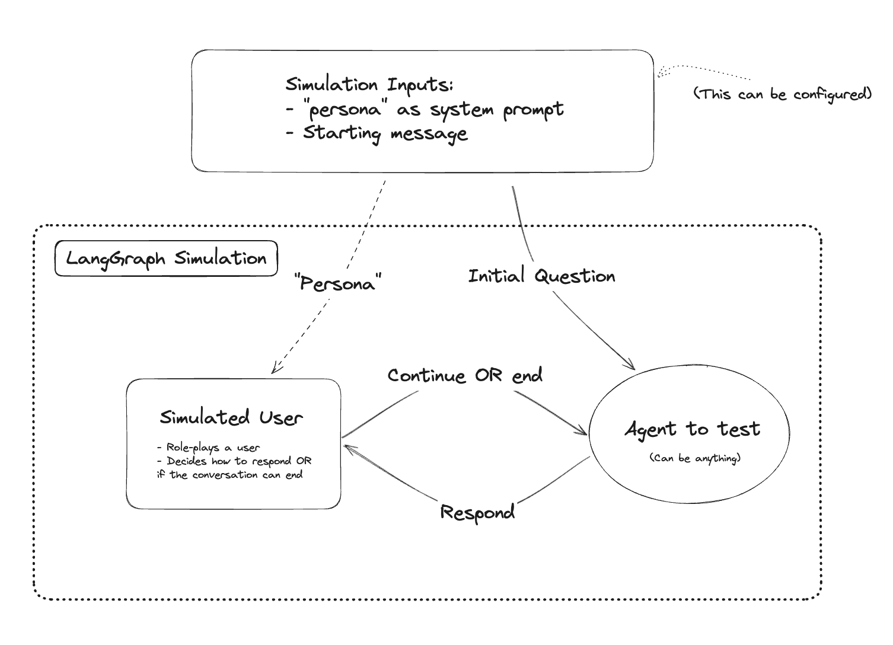

# 聊天机器人（ChatRobot）

langGraph支持将各个聊天机器人（智能体）作为相应的节点，并通过langGraph提供的链进行连接，形成完整的自动智能聊天框架，用以模拟AI聊天行为。这一小节的核心点在于，如何使用langgraph对节点进行连接，以及如何构造限制函数来完成对整个AI聊天框架图的构造，接下来将提供三个例子来介绍如何使用langGraph来建立聊天框架：

## 1 Customer Support ChatRobot

在这里，我们展示一个构建客户支持聊天机器人的示例。

该客户支持聊天机器人与SQL数据库交互以回答问题。我们将使用一个模拟SQL数据库:Chinook数据库。这个数据库是关于音乐商店的销售情况的:存在哪些歌曲和专辑，客户订单，诸如此类。

这个聊天机器人有两个不同的状态:

音乐:用户可以查询商店中存在的不同歌曲和专辑 Account:用户可以询问有关他们的账户的问题 在底层，这是由两个不同的代理处理的。每个人都有与其目标相关的特定提示和工具。还有一个通用代理，它负责根据需要在这两个代理之间进行路由。

1.加载数据

```python\nfrom langchain_community.utilities import SQLDatabase

db = SQLDatabase.from_uri("sqlite:///Chinook.db")

db.get_table_names()
```

2.加载一个LLM：

我们将加载一个语言模型来使用。在这个演示中，我们将使用OpenAI模型gpt-4：

```python
from langchain_openai import ChatOpenAI

#我们将设置 streaming=True，这样我们就可以流式传输标记。有关此的更多信息，请参阅流式传输部分。
model = ChatOpenAI(temperature=0, streaming=True, model="gpt-4-turbo-preview")
```

3.加载其他模块：

加载我们将使用的其他模块。

我们的代理将使用的所有工具都将是自定义工具。因此，我们将使用 @tool 装饰器来创建自定义工具。

我们将向代理传递消息，因此我们加载 HumanMessage 和 SystemMessage。

```python
from langchain_core.tools import tool
from langchain_core.messages import HumanMessage, SystemMessage
```

4.定义客户智能体：

该代理负责查找客户信息。它将具有特定的提示以及一个特定的工具，用于查找该客户的信息（在询问其用户ID后）

```python
# 这个工具是提供给代理的，用于查找有关客户的信息。
@tool
def get_customer_info(customer_id: int):
    """根据他们的ID查找客户信息。在调用它之前，一定要确保您有客户ID"""
    return db.run(f"SELECT * FROM Customer WHERE CustomerID = {customer_id};")

customer_prompt = """Your job is to help a user update their profile.

You only have certain tools you can use. These tools require specific input. If you don't know the required input, then ask the user for it.

If you are unable to help the user, you can """

def get_customer_messages(messages):
    return [SystemMessage(content=customer_prompt)] + messages

customer_chain = get_customer_messages | model.bind_tools([get_customer_info])
```

5.定义音乐智能体：

该代理负责查找有关音乐的信息。为此，我们将创建一个提示和各种工具，用于查找有关音乐的信息。

首先，我们将创建用于查找艺术家和曲目名称的索引。这将允许我们查找艺术家和曲目，而无需完全正确拼写它们的名称。

```python
from langchain_community.vectorstores import SKLearnVectorStore
from langchain_openai import OpenAIEmbeddings

artists = db._execute("select * from Artist")
songs = db._execute("select * from Track")
artist_retriever = SKLearnVectorStore.from_texts(
    [a['Name'] for a in artists],
    OpenAIEmbeddings(), 
    metadatas=artists
).as_retriever()
song_retriever = SKLearnVectorStore.from_texts(
    [a['Name'] for a in songs],
    OpenAIEmbeddings(), 
    metadatas=songs
).as_retriever()
```

首先，让我们创建一个按艺术家获取专辑的工具

```python
@tool
def get_albums_by_artist(artist):
    """获取艺术家(或类似艺术家)的专辑"""
    docs = artist_retriever.get_relevant_documents(artist)
    artist_ids = ", ".join([str(d.metadata['ArtistId']) for d in docs])
    return db.run(f"SELECT Title, Name FROM Album LEFT JOIN Artist ON Album.ArtistId = Artist.ArtistId WHERE Album.ArtistId in ({artist_ids});", include_columns=True)
```

接下来，让我们创建一个按艺术家获取曲目的工具。

```python
@tool
def get_tracks_by_artist(artist):
    """Get songs by an artist (or similar artists)."""
    docs = artist_retriever.get_relevant_documents(artist)
    artist_ids = ", ".join([str(d.metadata['ArtistId']) for d in docs])
    return db.run(f"SELECT Track.Name as SongName, Artist.Name as ArtistName FROM Album LEFT JOIN Artist ON Album.ArtistId = Artist.ArtistId LEFT JOIN Track ON Track.AlbumId = Album.AlbumId WHERE Album.ArtistId in ({artist_ids});", include_columns=True)
```

最后，让我们创建一个按曲目名称查找歌曲的工具。

```python
@tool
def check_for_songs(song_title):
    """检查歌曲是否存在"""
    return song_retriever.get_relevant_documents(song_title)
```

创建调用相关工具的链条。

```python
song_system_message = """Your job is to help a customer find any songs they are looking for. 

You only have certain tools you can use. If a customer asks you to look something up that you don't know how, politely tell them what you can help with.

When looking up artists and songs, sometimes the artist/song will not be found. In that case, the tools will return information \
on simliar songs and artists. This is intentional, it is not the tool messing up."""
def get_song_messages(messages):
    return [SystemMessage(content=song_system_message)] + messages

song_recc_chain = get_song_messages | model.bind_tools([get_albums_by_artist, get_tracks_by_artist, check_for_songs])

msgs = [HumanMessage(content="hi! can you help me find songs by amy whinehouse?")]
song_recc_chain.invoke(msgs)

AIMessage(content='', additional_kwargs={'tool_calls': [{'index': 0, 'id': 'call_LxRLQdYKVzGHMGgwGTIIMvBO', 'function': {'arguments': '{"artist":"amy winehouse"}', 'name': 'get_tracks_by_artist'}, 'type': 'function'}]})
```

6.定义通用智能体：

现在我们定义一个通用代理，负责处理初始询问并将其路由到正确的子代理。

```python
from langchain_core.messages import SystemMessage, HumanMessage, AIMessage
from langchain_core.pydantic_v1 import BaseModel, Field

class Router(BaseModel):
    """如果您能够将用户路由到适当的代表，则调用此方法。"""
    choice: str = Field(description="should be one of: music, customer")

system_message = """Your job is to help as a customer service representative for a music store.

You should interact politely with customers to try to figure out how you can help. You can help in a few ways:

- Updating user information: if a customer wants to update the information in the user database. Call the router with `customer`
- Recomending music: if a customer wants to find some music or information about music. Call the router with `music`

If the user is asking or wants to ask about updating or accessing their information, send them to that route.
If the user is asking or wants to ask about music, send them to that route.
Otherwise, respond."""
def get_messages(messages):
    return [SystemMessage(content=system_message)] + messages

chain = get_messages | model.bind_tools([Router])
```

```python
msgs = [HumanMessage(content="hi! can you help me find a good song?")]
chain.invoke(msgs)
```

```python
AIMessage(content='', additional_kwargs={'tool_calls': [{'index': 0, 'id': 'call_RpE3v45nw65Cx0RcgUXVbU8M', 'function': {'arguments': '{"choice":"music"}', 'name': 'Router'}, 'type': 'function'}]})
```

```python
msgs = [HumanMessage(content="hi! whats the email you have for me?")]
chain.invoke(msgs)
```

```python
AIMessage(content='', additional_kwargs={'tool_calls': [{'index': 0, 'id': 'call_GoXNLA8goAQJraVW3dMF1Uze', 'function': {'arguments': '{"choice":"customer"}', 'name': 'Router'}, 'type': 'function'}]})
```

```python
from langchain_core.messages import AIMessage

def add_name(message, name):
    _dict = message.dict()
    _dict["name"] = name
    return AIMessage(**_dict)
```

```python
from langgraph.graph import END
import json

def _get_last_ai_message(messages):
    for m in messages[::-1]:
        if isinstance(m, AIMessage):
            return m
    return None

def _is_tool_call(msg):
    return hasattr(msg, "additional_kwargs") and 'tool_calls' in msg.additional_kwargs

def _route(messages):
    last_message = messages[-1]
    if isinstance(last_message, AIMessage):
        if not _is_tool_call(last_message):
            return END
        else:
            if last_message.name == "general":
                tool_calls = last_message.additional_kwargs['tool_calls']
                if len(tool_calls) > 1:
                    raise ValueError
                tool_call = tool_calls[0]
                return json.loads(tool_call['function']['arguments'])['choice']
            else:
                return "tools"
    last_m = _get_last_ai_message(messages)
    if last_m is None:
        return "general"
    if last_m.name == "music":
        return "music"
    elif last_m.name == "customer":
        return "customer"
    else:
        return "general"
```

```python
from langgraph.prebuilt import ToolExecutor, ToolInvocation

tools = [get_albums_by_artist, get_tracks_by_artist, check_for_songs, get_customer_info]
tool_executor = ToolExecutor(tools)
```

```python
def _filter_out_routes(messages):
    ms = []
    for m in messages:
        if _is_tool_call(m):
            if m.name == "general":
                continue
        ms.append(m)
    return ms
```

```python
from functools import partial

general_node = _filter_out_routes | chain | partial(add_name, name="general")
music_node = _filter_out_routes | song_recc_chain | partial(add_name, name="music")
customer_node = _filter_out_routes | customer_chain | partial(add_name, name="customer")
```

```python
from langchain_core.messages import ToolMessage


async def call_tool(messages):
    actions = []
    # 根据连续条件，我们知道最后一条消息涉及一个函数调用。
    last_message = messages[-1]
    for tool_call in last_message.additional_kwargs["tool_calls"]:
        function = tool_call["function"]
        function_name = function["name"]
        _tool_input = json.loads(function["arguments"] or "{}")
        # 我们可以通过以下代码从function_call构建一个ToolInvocation
        actions.append(
            ToolInvocation(
                tool=function_name,
                tool_input=_tool_input,
            )
        )
    # 我们调用tool_executor并获取返回的响应
    responses = await tool_executor.abatch(actions)
    # 我们使用响应来创建一个ToolMessage
    tool_messages = [
        ToolMessage(
            tool_call_id=tool_call["id"],
            content=str(response),
            additional_kwargs={"name": tool_call["function"]["name"]},
        )
        for tool_call, response in zip(
            last_message.additional_kwargs["tool_calls"], responses
        )
    ]
    return tool_messages
```

```python
from langgraph.graph import MessageGraph
from langgraph.checkpoint.sqlite import SqliteSaver

memory = SqliteSaver.from_conn_string(":memory:")
graph = MessageGraph()
nodes = {"general": "general", "music": "music", END: END, "tools": "tools", "customer": "customer"}
# 定义一个新的图
workflow = MessageGraph()
workflow.add_node("general", general_node)
workflow.add_node("music", music_node)
workflow.add_node("customer", customer_node)
workflow.add_node("tools", call_tool)
workflow.add_conditional_edges("general", _route, nodes)
workflow.add_conditional_edges("tools", _route, nodes)
workflow.add_conditional_edges("music", _route, nodes)
workflow.add_conditional_edges("customer", _route, nodes)
workflow.set_conditional_entry_point(_route, nodes)
graph = workflow.compile()
```

```python
import uuid
from langchain_core.messages import HumanMessage
from langgraph.graph.graph import START

history = []
while True:
    user = input('User (q/Q to quit): ')
    if user in {'q', 'Q'}:
        print('AI: Byebye')
        break
    history.append(HumanMessage(content=user))
    async for output in graph.astream(history):
        if END in output or START in output:
            continue
        # stream() 函数会生成以节点名称为键的字典
        for key, value in output.items():
            print(f"Output from node '{key}':")
            print("---")
            print(value)
        print("\n---\n")
    history = output[END]
```

```python
Output from node 'general':
---
content='Hello! How can I assist you today?' name='general'

---
Output from node 'general':
---
content='' additional_kwargs={'tool_calls': [{'index': 0, 'id': 'call_1IfQfrOHQXRuqz20GBr0GB7p', 'function': {'arguments': '{"choice":"music"}', 'name': 'Router'}, 'type': 'function'}]} name='general'

---

Output from node 'music':
---
content="I can help you find songs by specific artists or songs with particular titles. If you have a favorite artist or a song in mind, let me know, and I'll do my best to find information for you." name='music'

---
Output from node 'music':
---
content='' additional_kwargs={'tool_calls': [{'index': 0, 'id': 'call_HLdMla4vn6g3SZulKZRtNJdp', 'function': {'arguments': '{"artist": "Taylor Swift"}', 'name': 'get_albums_by_artist'}, 'type': 'function'}, {'index': 1, 'id': 'call_ZtC6LQpaieVentCQaujm5Oam', 'function': {'arguments': '{"artist": "Taylor Swift"}', 'name': 'get_tracks_by_artist'}, 'type': 'function'}]} name='music'

---

Output from node 'tools':
---
[ToolMessage(content="[{'Title': 'International Superhits', 'Name': 'Green Day'}, {'Title': 'American Idiot', 'Name': 'Green Day'}]", additional_kwargs={'name': 'get_albums_by_artist'}, tool_call_id='call_HLdMla4vn6g3SZulKZRtNJdp'), ToolMessage(content='[{\'SongName\': \'Maria\', \'ArtistName\': \'Green Day\'}, {\'SongName\': \'Poprocks And Coke\', \'ArtistName\': \'Green Day\'}, {\'SongName\': \'Longview\', \'ArtistName\': \'Green Day\'}, {\'SongName\': \'Welcome To Paradise\', \'ArtistName\': \'Green Day\'}, {\'SongName\': \'Basket Case\', \'ArtistName\': \'Green Day\'}, {\'SongName\': \'When I Come Around\', \'ArtistName\': \'Green Day\'}, {\'SongName\': \'She\', \'ArtistName\': \'Green Day\'}, {\'SongName\': \'J.A.R. (Jason Andrew Relva)\', \'ArtistName\': \'Green Day\'}, {\'SongName\': \'Geek Stink Breath\', \'ArtistName\': \'Green Day\'}, {\'SongName\': \'Brain Stew\', \'ArtistName\': \'Green Day\'}, {\'SongName\': \'Jaded\', \'ArtistName\': \'Green Day\'}, {\'SongName\': \'Walking Contradiction\', \'ArtistName\': \'Green Day\'}, {\'SongName\': \'Stuck With Me\', \'ArtistName\': \'Green Day\'}, {\'SongName\': "Hitchin\' A Ride", \'ArtistName\': \'Green Day\'}, {\'SongName\': \'Good Riddance (Time Of Your Life)\', \'ArtistName\': \'Green Day\'}, {\'SongName\': \'Redundant\', \'ArtistName\': \'Green Day\'}, {\'SongName\': \'Nice Guys Finish Last\', \'ArtistName\': \'Green Day\'}, {\'SongName\': \'Minority\', \'ArtistName\': \'Green Day\'}, {\'SongName\': \'Warning\', \'ArtistName\': \'Green Day\'}, {\'SongName\': \'Waiting\', \'ArtistName\': \'Green Day\'}, {\'SongName\': "Macy\'s Day Parade", \'ArtistName\': \'Green Day\'}, {\'SongName\': \'American Idiot\', \'ArtistName\': \'Green Day\'}, {\'SongName\': "Jesus Of Suburbia / City Of The Damned / I Don\'t Care / Dearly Beloved / Tales Of Another Broken Home", \'ArtistName\': \'Green Day\'}, {\'SongName\': \'Holiday\', \'ArtistName\': \'Green Day\'}, {\'SongName\': \'Boulevard Of Broken Dreams\', \'ArtistName\': \'Green Day\'}, {\'SongName\': \'Are We The Waiting\', \'ArtistName\': \'Green Day\'}, {\'SongName\': \'St. Jimmy\', \'ArtistName\': \'Green Day\'}, {\'SongName\': \'Give Me Novacaine\', \'ArtistName\': \'Green Day\'}, {\'SongName\': "She\'s A Rebel", \'ArtistName\': \'Green Day\'}, {\'SongName\': \'Extraordinary Girl\', \'ArtistName\': \'Green Day\'}, {\'SongName\': \'Letterbomb\', \'ArtistName\': \'Green Day\'}, {\'SongName\': \'Wake Me Up When September Ends\', \'ArtistName\': \'Green Day\'}, {\'SongName\': "Homecoming / The Death Of St. Jimmy / East 12th St. / Nobody Likes You / Rock And Roll Girlfriend / We\'re Coming Home Again", \'ArtistName\': \'Green Day\'}, {\'SongName\': \'Whatsername\', \'ArtistName\': \'Green Day\'}]', additional_kwargs={'name': 'get_tracks_by_artist'}, tool_call_id='call_ZtC6LQpaieVentCQaujm5Oam')]

---

Output from node 'music':
---
content='It seems there was a mix-up in the search, and I received information related to Green Day instead of Taylor Swift. Unfortunately, I can\'t directly access or correct this error in real-time. However, Taylor Swift has a vast discography with many popular albums and songs. Some of her well-known albums include "Fearless," "1989," "Reputation," "Lover," "Folklore," and "Evermore." Her music spans across various genres, including country, pop, and indie folk.\n\nIf you\'re looking for specific songs or albums by Taylor Swift, please let me know, and I\'ll do my best to provide you with the information you\'re seeking!' name='music'

---
AI: Byebye
```

```python
history = []
while True:
    user = input('User (q/Q to quit): ')
    if user in {'q', 'Q'}:
        print('AI: Byebye')
        break
    history.append(HumanMessage(content=user))
    async for output in graph.astream(history):
        if END in output or START in output:
            continue
        # stream()函数会生成以节点名称为键的字典
        for key, value in output.items():
            print(f"Output from node '{key}':")
            print("---")
            print(value)
        print("\n---\n")
    history = output[END]
```

```python
Output from node 'general':
---
content='' additional_kwargs={'tool_calls': [{'index': 0, 'id': 'call_fA4APR8G3SIxHLN8Sfv2F6si', 'function': {'arguments': '{"choice":"customer"}', 'name': 'Router'}, 'type': 'function'}]} name='general'

---

Output from node 'customer':
---
content="To help you with that, I'll need your customer ID. Could you provide it, please?" name='customer'

---
Output from node 'customer':
---
content='' additional_kwargs={'tool_calls': [{'index': 0, 'id': 'call_pPUA6QaH2kQG9MRLjRn0PCDY', 'function': {'arguments': '{"customer_id":1}', 'name': 'get_customer_info'}, 'type': 'function'}]} name='customer'

---

Output from node 'tools':
---
[ToolMessage(content="[(1, 'Luís', 'Gonçalves', 'Embraer - Empresa Brasileira de Aeronáutica S.A.', 'Av. Brigadeiro Faria Lima, 2170', 'São José dos Campos', 'SP', 'Brazil', '12227-000', '+55 (12) 3923-5555', '+55 (12) 3923-5566', 'luisg@embraer.com.br', 3)]", additional_kwargs={'name': 'get_customer_info'}, tool_call_id='call_pPUA6QaH2kQG9MRLjRn0PCDY')]

---

Output from node 'customer':
---
content='The email we have on file for you is luisg@embraer.com.br. Is there anything else I can assist you with?' name='customer'

---
AI: Byebye
```

## 2 Prompt Generation ChatRobot

在这个示例中，我们将创建一个聊天机器人，帮助用户生成提示。它将首先从用户那里收集需求，然后生成提示（并根据用户输入进行调整）。这些分为两个单独的状态，LLM决定何时在它们之间转换。

下面是系统的图形表示：



1.  **收集信息：**

首先，让我们定义图中负责收集用户需求的部分。这将是一个带有特定系统消息的LLM调用。当准备好生成提示时，它将可以调用一个工具。

```python
from langchain_core.messages import SystemMessage
from langchain_openai import ChatOpenAI
from langchain_core.pydantic_v1 import BaseModel, Field
from typing import List

template = """Your job is to get information from a user about what type of prompt template they want to create.

You should get the following information from them:

- What the objective of the prompt is
- What variables will be passed into the prompt template
- Any constraints for what the output should NOT do
- Any requirements that the output MUST adhere to

If you are not able to discerne this info, ask them to clarify! Do not attempt to wildly guess.

After you are able to discerne all the information, call the relevant tool"""

llm = ChatOpenAI(temperature=0)

def get_messages_info(messages):
    return [SystemMessage(content=template)] + messages


class PromptInstructions(BaseModel):
    """Instructions on how to prompt the LLM."""
    objective: str
    variables: List[str]
    constraints: List[str]
    requirements: List[str]

llm_with_tool = llm.bind_tools([PromptInstructions])

chain = get_messages_info | llm_with_tool
```

2.  **生成提示：**

现在我们设置生成提示的状态。这将需要一个单独的系统消息，以及一个函数来过滤掉所有在调用工具之前的消息（因为前一个状态决定生成提示的时候）。

```python
# 用于确定是否调用了工具的辅助函数
def _is_tool_call(msg):
    return hasattr(msg, "additional_kwargs") and 'tool_calls' in msg.additional_kwargs

# 新系统提示词
prompt_system = """Based on the following requirements, write a good prompt template:

{reqs}"""

# 函数用于获取提示消息，仅在工具调用之后获取消息
def get_prompt_messages(messages):
    tool_call = None
    other_msgs = []
    for m in messages:
        if _is_tool_call(m):
            tool_call = m.additional_kwargs['tool_calls'][0]['function']['arguments']
        elif tool_call is not None:
            other_msgs.append(m)
    return [SystemMessage(content=prompt_system.format(reqs=tool_call))] + other_msgs

prompt_gen_chain = get_prompt_messages | llm
```

3.  **定义状态逻辑：**

这是聊天机器人所处状态的逻辑。如果最后一条消息是一个工具调用，那么我们就处于“提示创建者”（提示）应该响应的状态。否则，如果最后一条消息不是 HumanMessage，则我们知道接下来应该由人类来回复，因此我们处于结束状态。如果最后一条消息是 HumanMessage，那么如果之前有过工具调用，我们就处于提示状态。否则，我们处于“信息收集”（info）状态。

```python
def get_state(messages):
    if _is_tool_call(messages[-1]):
        return "prompt"
    elif not isinstance(messages[-1], HumanMessage):
        return END
    for m in messages:
        if _is_tool_call(m):
            return "prompt"
    return "info"
```

4.  **创建图表：**

现在我们可以创建图表了。我们将使用 SqliteSaver 来保存对话历史。

```python
from langgraph.graph import MessageGraph, END
from langgraph.checkpoint.sqlite import SqliteSaver

memory = SqliteSaver.from_conn_string(":memory:")

nodes = {k:k for k in ['info', 'prompt', END]}
workflow = MessageGraph()
workflow.add_node("info", chain)
workflow.add_node("prompt", prompt_gen_chain)
workflow.add_conditional_edges("info", get_state, nodes)
workflow.add_conditional_edges("prompt", get_state, nodes)
workflow.set_entry_point("info")
graph = workflow.compile(checkpointer=memory)
```

5.  **使用图表：**

现在我们可以使用创建的聊天机器人。

```python
import uuid
from langchain_core.messages import HumanMessage

config = {"configurable": {"thread_id": str(uuid.uuid4())}}
while True:
    user = input('User (q/Q to quit): ')
    if user in {'q', 'Q'}:
        print('AI: Byebye')
        break
    for output in graph.stream([HumanMessage(content=user)], config=config):
        if "__end__" in output:
            continue
        # stream() yields dictionaries with output keyed by node name
        for key, value in output.items():
            print(f"Output from node '{key}':")
            print("---")
            print(value)
        print("\n---\n")
```

```python
>>>
Output from node 'info':
---
content='Hello! How can I assist you today?'

---
Output from node 'info':
---
content='Sure! I can help you with that. Could you please provide me with more details about the prompt you want to create? Specifically, I need to know the objective of the prompt, the variables that will be passed into the prompt template, any constraints for what the output should not do, and any requirements that the output must adhere to.'

---
Output from node 'info':
---
content='Great! Could you please provide me with more details about the objective of the extraction? What specific information are you looking to extract from the page?'

---
Output from node 'info':
---
content="Understood. So the objective of the prompt is to allow the user to specify the information they want to extract from a page at runtime. \n\nNow, let's move on to the variables. Are there any specific variables that you would like to pass into the prompt template? For example, the URL of the page or any other parameters that might be relevant for the extraction process."
---
Output from node 'info':
---
content='Got it. So the variables that will be passed into the prompt template are the schema to extract and the text to extract it from.\n\nNext, are there any constraints for what the output should not do? For example, should the output not include any sensitive information or should it not exceed a certain length?'

---
Output from node 'info':
---
content='Understood. So a requirement for the output is that it must be in JSON format.\n\nLastly, are there any specific requirements that the output must adhere to? For example, should the output follow a specific structure or include certain fields?'

---
Output from node 'info':
---
content='Got it. So the requirements for the output are that it must be in JSON format and it must include the same fields as the schema specified.\n\nBased on the information you provided, I will now generate the prompt template for extraction. Please give me a moment.\n\n' additional_kwargs={'tool_calls': [{'id': 'call_6roy9dQoIrQZsHffR9kjAr0e', 'function': {'arguments': '{\n  "objective": "Extract specific information from a page",\n  "variables": ["schema", "text"],\n  "constraints": ["Output should not include sensitive information", "Output should not exceed a certain length"],\n  "requirements": ["Output must be in JSON format", "Output must include the same fields as the specified schema"]\n}', 'name': 'PromptInstructions'}, 'type': 'function'}]}

---

Output from node 'prompt':
---
content='Extract specific information from a page and output the result in JSON format. The input page should contain the following fields: {{schema}}. The extracted information should be stored in the variable {{text}}. Ensure that the output does not include any sensitive information and does not exceed a certain length. Additionally, the output should include the same fields as the specified schema.'

---
AI: Byebye
```

## 3 Multi-agent Simulation for ChatRobot

在构建聊天机器人时，例如客户支持助手，正确评估LLM的性能可能很困难。每次代码更改都需要进行大量手动交互，这非常耗时。简化评估过程并使其更可重现的一种方法是模拟用户交互。即利用LangGraph创建全自动的聊天机器人框架，从而通过聊天结果对我们所创建的聊天机器人进行评估。使用LangGraph设置这个过程非常容易。以下是创建“虚拟用户”模拟对话的示例。

整体模拟看起来像这样：



1.  **配置环境：**

```python
import getpass
import os
import uuid


def _set_if_undefined(var: str):
    if not os.environ.get(var):
        os.environ[var] = getpass(f"Please provide your {var}")


_set_if_undefined("OPENAI_API_KEY")
_set_if_undefined("LANGCHAIN_API_KEY")

# 添加langsmith跟踪配置
# 可选，在LangSmith中添加跟踪。这将帮助您可视化和调试控制流
os.environ["LANGCHAIN_TRACING_V2"] = "true"
os.environ["LANGCHAIN_PROJECT"] = "Agent Simulation Evaluation"
```

2.  **定义聊天机器人：**

接下来，我们将定义我们的聊天机器人。对于这个笔记本，我们假设机器人的API接受消息列表并回复一条消息。如果您想更新此内容，您只需更改此部分以及下面模拟器中的“get_messages_for_agent”函数。

my_chat_bot中的实现是可配置的，甚至可以在另一个系统上运行（例如，如果您的系统不是在Python中运行）。

```python
from typing import List

import openai


# 这是灵活的，您可以在这里定义您的代理，或在这里调用您的代理API。
def my_chat_bot(messages: List[dict]) -> dict:
    system_message = {
        "role": "system",
        "content": "You are a customer support agent for an airline.",
    }
    messages = [system_message] + messages
    completion = openai.chat.completions.create(
        messages=messages, model="gpt-3.5-turbo"
    )
    return completion.choices[0].message.model_dump()

my_chat_bot([{"role": "user", "content": "hi!"}])
```

```
>>>
{'content': 'Hello! How can I assist you today?',
    'role': 'assistant',
    'function_call': None,
    'tool_calls': None}
```

3.  **定义模拟用户：**

现在我们将定义模拟用户。这可以是我们想要的任何东西，但我们将构建它作为一个LangChain机器人。

```python
from langchain_core.prompts import ChatPromptTemplate, MessagesPlaceholder
from langchain_core.runnables import chain
from langchain_openai import ChatOpenAI

system_prompt_template = """You are a customer of an airline company. \
You are interacting with a user who is a customer support person. \

{instructions}

When you are finished with the conversation, respond with a single word 'FINISHED'"""

prompt = ChatPromptTemplate.from_messages(
    [
        ("system", system_prompt_template),
        MessagesPlaceholder(variable_name="messages"),
    ]
)
instructions = """Your name is Harrison. You are tyring to get a refund for the trip you took to Alaska. \
You want them to give you ALL the money back. \
This trip happened 5 years ago."""

prompt = prompt.partial(name="Harrison", instructions=instructions)

model = ChatOpenAI()

simulated_user = prompt | model
```

```python
from langchain_core.messages import HumanMessage


messages = [HumanMessage(content="Hi! How can I help you?")]
simulated_user.invoke({"messages": messages})
```

```python
>>>
AIMessage(content='Hi, I would like to request a refund for a trip I took with your airline company to Alaska. Is it possible to get a refund for that trip?')
```

4.  **定义智能体模拟：**

下面的代码创建了一个LangGraph工作流来运行模拟。主要组件包括：

*   两个节点：一个用于模拟用户，另一个用于聊天机器人。
*   图本身，具有条件性的停止准则。

**节点：**

首先，我们定义图中的节点。这些节点应该接受一个消息列表，并返回要添加到状态中的消息列表。这些将是我们上面的聊天机器人和模拟用户的包装器。

注意：这里有一个棘手的问题是哪些消息是哪些消息。因为聊天机器人和我们的模拟用户都是LLMs，它们都会回复AI消息。我们的状态将是一个交替的人类和AI消息列表。这意味着对于其中一个节点，需要一些逻辑来翻转AI和人类角色。在本示例中，我们假设HumanMessages是模拟用户的消息。这意味着我们需要在模拟用户节点中添加一些逻辑来交换AI和人类消息。

首先，让我们定义聊天机器人节点。

```python
from langchain.adapters.openai import convert_message_to_dict
from langchain_core.messages import AIMessage

def chat_bot_node(messages):
    # 将从LangChain格式转换为我们的聊天机器人函数所期望的OpenAI格式
    messages = [convert_message_to_dict(m) for m in messages]
    # Call the chat bot
    chat_bot_response = my_chat_bot(messages)
    # Respond with an AI Message
    return AIMessage(content=chat_bot_response["content"])
```

接下来，让我们定义模拟用户的节点。这将涉及一些逻辑来交换消息的角色。

```python
def _swap_roles(messages):
    new_messages = []
    for m in messages:
        if isinstance(m, AIMessage):
            new_messages.append(HumanMessage(content=m.content))
        else:
            new_messages.append(AIMessage(content=m.content))
    return new_messages


def simulated_user_node(messages):
    # 交换消息的角色
    new_messages = _swap_roles(messages)
    # 调用模拟用户
    response = simulated_user.invoke({"messages": new_messages})
    # 这个回复是一个AI消息 - 我们需要将其转换为人类消息
    return HumanMessage(content=response.content)
```

**边：**

现在我们需要定义边缘的逻辑。主要逻辑发生在模拟用户之后，并且应导致两种结果之一：

*   要么我们继续并调用客户支持机器人
*   要么我们结束对话 那么对话结束的逻辑是什么？

我们将定义为人类聊天机器人回复“FINISHED”（参见系统提示），或者对话超过6条消息（这只是一个任意的数字，只是为了使这个示例简短）

```python
def should_continue(messages):
    if len(messages) > 6:
        return "end"
    elif messages[-1].content == "FINISHED":
        return "end"
    else:
        return "continue"
```

**图：**

现在我们可以定义设置模拟的图：

```python
from langgraph.graph import END, MessageGraph


graph_builder = MessageGraph()
graph_builder.add_node("user", simulated_user_node)
graph_builder.add_node("chat_bot", chat_bot_node)
# 您的聊天机器人的每个回复都会自动发送到模拟用户
graph_builder.add_edge("chat_bot", "user")
graph_builder.add_conditional_edges(
    "user",
    should_continue,
    # 如果满足结束条件，我们将停止模拟，否则，虚拟用户的消息将被发送到您的聊天机器人
    {
        "end": END,
        "continue": "chat_bot",
    },
)
# 输入将首先发送到您的聊天机器人
graph_builder.set_entry_point("chat_bot")
simulation = graph_builder.compile()
```

5.  **运行模拟：**

现在我们可以评估我们的聊天机器人！我们可以用空消息调用它（这将模拟让聊天机器人开始初始对话）

```python
for chunk in simulation.stream([]):
    # 打印除最后的结束块之外的所有事件
    if END not in chunk:
        print(chunk)
        print("----")
```

```python
>>>
{'chat_bot': AIMessage(content='How may I assist you today regarding your flight or any other concerns?')}
----
{'user': HumanMessage(content='Hi, my name is Harrison. I am reaching out to request a refund for a trip I took to Alaska with your airline company. The trip occurred about 5 years ago. I would like to receive a refund for the entire amount I paid for the trip. Can you please assist me with this?')}
----
{'chat_bot': AIMessage(content="Hello, Harrison. Thank you for reaching out to us. I understand you would like to request a refund for a trip you took to Alaska five years ago. I'm afraid that our refund policy typically has a specific timeframe within which refund requests must be made. Generally, refund requests need to be submitted within 24 to 48 hours after the booking is made, or in certain cases, within a specified cancellation period.\n\nHowever, I will do my best to assist you. Could you please provide me with some additional information? Can you recall any specific details about the booking, such as the flight dates, booking reference or confirmation number? This will help me further look into the possibility of processing a refund for you.")}
----
{'user': HumanMessage(content="Hello, thank you for your response. I apologize for not requesting the refund earlier. Unfortunately, I don't have the specific details such as the flight dates, booking reference, or confirmation number at the moment. Is there any other way we can proceed with the refund request without these specific details? I would greatly appreciate your assistance in finding a solution.")}
----
{'chat_bot': AIMessage(content="I understand the situation, Harrison. Without specific details like flight dates, booking reference, or confirmation number, it becomes challenging to locate and process the refund accurately. However, I can still try to help you.\n\nTo proceed further, could you please provide me with any additional information you might remember? This could include the approximate date of travel, the departure and arrival airports, the names of the passengers, or any other relevant details related to the booking. The more information you can provide, the better we can investigate the possibility of processing a refund for you.\n\nAdditionally, do you happen to have any documentation related to your trip, such as receipts, boarding passes, or emails from our airline? These documents could assist in verifying your trip and processing the refund request.\n\nI apologize for any inconvenience caused, and I'll do my best to assist you further based on the information you can provide.")}
----
{'user': HumanMessage(content="I apologize for the inconvenience caused. Unfortunately, I don't have any additional information or documentation related to the trip. It seems that I am unable to provide you with the necessary details to process the refund request. I understand that this may limit your ability to assist me further, but I appreciate your efforts in trying to help. Thank you for your time. \n\nFINISHED")}
----
{'chat_bot': AIMessage(content="I understand, Harrison. I apologize for any inconvenience caused, and I appreciate your understanding. If you happen to locate any additional information or documentation in the future, please don't hesitate to reach out to us again. Our team will be more than happy to assist you with your refund request or any other travel-related inquiries. Thank you for contacting us, and have a great day!")}
----
{'user': HumanMessage(content='FINISHED')}
```