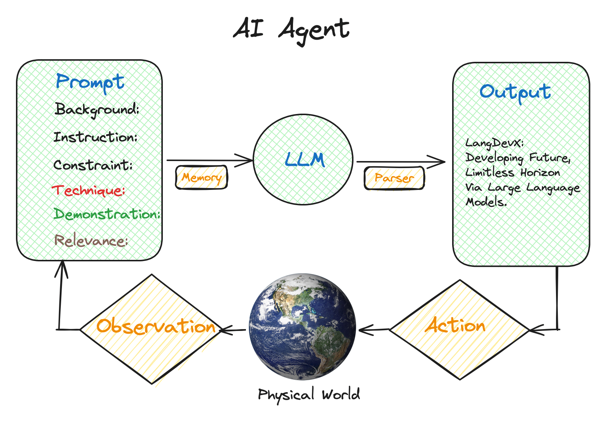

# AI Agent & LangGraph: Zero to Hero 大模型驱动的智能体

## 一. AI Agent 与 LangGraph 基础介绍

### 1.1 AI Agent 是什么？

AI Agent（智能体）是一种能够感知环境、做出决策并采取行动以实现特定目标的人工智能系统。在大语言模型（LLM）的背景下，AI Agent 通常指的是能够使用工具、访问外部信息源、并根据用户需求执行复杂任务的智能系统。



### 1.2 AI Agent 解决大模型的哪些缺点？

大语言模型虽然强大，但存在一些固有的局限性：

1. **知识截止时间**：模型的训练数据有时间限制，无法获取最新信息
2. **计算能力限制**：无法执行复杂的数学计算或代码运行
3. **外部系统交互**：无法直接与数据库、API或其他系统交互
4. **多步推理**：在需要多步骤、复杂推理的任务中表现不佳

AI Agent 通过以下组件解决这些问题：

| 组件 | 功能 | 解决的问题 |
|------|------|------------|
| **工具调用** | 调用外部API、数据库查询、代码执行等 | 扩展模型能力边界 |
| **记忆系统** | 存储和检索历史对话、知识库等 | 解决上下文长度限制 |
| **规划能力** | 将复杂任务分解为子任务 | 提升多步推理能力 |
| **反思机制** | 评估和改进输出质量 | 提高准确性和可靠性 |

### 1.3 LangGraph 是什么？

LangGraph 是 LangChain 生态系统中的一个库，专门用于构建有状态的、多参与者的应用程序。它使用图结构来定义应用程序的流程，其中节点代表计算步骤，边代表数据流。

#### 状态图的要素：

1. **节点（Nodes）**：执行特定功能的计算单元
2. **边（Edges）**：连接节点，定义执行流程
3. **状态（State）**：在节点间传递的数据
4. **条件边（Conditional Edges）**：根据条件决定下一步执行路径

#### LangGraph 的优点：

- **可视化流程**：图结构使复杂的AI工作流程更加直观
- **状态管理**：自动处理状态在节点间的传递和更新
- **灵活控制**：支持条件分支、循环等复杂控制流
- **易于调试**：可以单独测试每个节点的功能
- **可扩展性**：易于添加新的节点和功能

## 二. Agent Executor 智能体执行器

### 2.1 智能体的核心要素

一个完整的AI Agent通常包含以下三个核心要素：

#### 记忆（Memory）
- **短期记忆**：当前对话的上下文信息
- **长期记忆**：历史对话记录、学习到的用户偏好
- **工作记忆**：执行任务过程中的中间状态

#### 行动（Action）
- **工具调用**：调用外部API、数据库查询、文件操作等
- **推理决策**：基于当前状态和目标做出最优选择
- **输出生成**：生成符合用户需求的响应

#### 协作（Collaboration）
- **多智能体协作**：不同专业领域的智能体协同工作
- **人机协作**：在需要时请求人类干预和指导
- **工具协作**：协调使用多个工具完成复杂任务

### 2.2 智能体执行器的工作流程

智能体执行器遵循以下基本工作流程：

1. **接收输入**：获取用户的查询或任务描述
2. **分析任务**：理解任务需求，确定执行策略
3. **选择工具**：根据任务需求选择合适的工具
4. **执行操作**：调用选定的工具执行具体操作
5. **处理结果**：分析工具执行结果，决定下一步行动
6. **生成响应**：基于执行结果生成最终回复

### 2.3 使用 LangChain Agent Executor 实现售货智能体

让我们通过一个具体的例子来理解智能体执行器的工作原理。我们将构建一个售货智能体，它能够：

- 分析客户所处的销售对话阶段
- 根据阶段提供相应的销售话术
- 查询产品信息
- 推进销售流程

#### 阶段分析链

```python
from langchain.chains import LLMChain
from langchain.prompts import PromptTemplate
from langchain_openai import ChatOpenAI

# 阶段分析提示模板
stage_analyzer_inception_prompt_template = """
你是一名销售助手，帮助销售代理识别对话应该进入哪个阶段。
以下是销售对话的阶段：
1. 介绍：开始对话，介绍自己和公司。保持礼貌和尊重，同时保持对话的专业性。
2. 资格认定：确认他们是否是合适的潜在客户。
3. 价值主张：简要解释你的产品/服务如何使潜在客户受益。
4. 需求分析：询问开放性问题以发现潜在客户的需求和痛点。
5. 解决方案展示：基于潜在客户的需求，展示你的产品/服务如何解决他们的问题。
6. 异议处理：解决潜在客户可能有的任何异议。
7. 成交：询问销售问题以推进交易。

当前对话历史：
{conversation_history}

请选择应该进入的对话阶段，只需回答数字。
"""

stage_analyzer_inception_prompt = PromptTemplate(
    template=stage_analyzer_inception_prompt_template,
    input_variables=["conversation_history"],
)

llm = ChatOpenAI(temperature=0.0)
stage_analyzer_chain = LLMChain(
    llm=llm, 
    prompt=stage_analyzer_inception_prompt, 
    verbose=True
)
```

#### 销售对话链

```python
# 销售对话提示模板
sales_conversation_utterance_prompt_template = """
你是一名销售代表，为一家销售睡眠技术产品的公司工作。
你的名字是Ted Lasso。你遵循以下销售对话阶段的顺序：

1. 介绍：开始对话，介绍自己和公司。
2. 资格认定：确认他们是否是合适的潜在客户。
3. 价值主张：简要解释你的产品/服务如何使潜在客户受益。
4. 需求分析：询问开放性问题以发现潜在客户的需求和痛点。
5. 解决方案展示：基于潜在客户的需求，展示你的产品/服务。
6. 异议处理：解决潜在客户可能有的任何异议。
7. 成交：询问销售问题以推进交易。

当前对话阶段：{conversation_stage}
对话历史：{conversation_history}
销售代理：{salesperson_name}
公司名称：{company_name}
公司业务：{company_business}
公司价值观：{company_values}

请生成一个回复以推进销售对话。
回复应该基于之前的对话历史和当前对话阶段。
回复长度不应超过100字。
回复结尾不要说再见。

回复：
"""

sales_conversation_utterance_prompt = PromptTemplate(
    template=sales_conversation_utterance_prompt_template,
    input_variables=[
        "conversation_stage",
        "conversation_history",
        "salesperson_name",
        "company_name",
        "company_business",
        "company_values",
    ],
)

sales_conversation_utterance_chain = LLMChain(
    llm=llm, 
    prompt=sales_conversation_utterance_prompt, 
    verbose=True
)
```

#### 产品目录

```python
product_catalog = """
睡眠天堂产品目录：

1. **梦境床垫**
   - 价格：$1,200
   - 特点：记忆泡沫，温度调节，10年保修
   - 适用：所有睡眠姿势，特别适合侧睡者

2. **云朵枕头**
   - 价格：$85
   - 特点：可调节高度，透气材质，防过敏
   - 适用：颈椎问题，打鼾问题

3. **智能睡眠追踪器**
   - 价格：$200
   - 特点：睡眠质量监测，智能闹钟，健康建议
   - 适用：想要改善睡眠质量的用户
"""
```

#### 向量数据库设置

```python
from langchain.vectorstores import Chroma
from langchain.text_splitter import CharacterTextSplitter
from langchain.embeddings.openai import OpenAIEmbeddings
from langchain.document_loaders import TextLoader

# 创建产品知识库
text_splitter = CharacterTextSplitter(chunk_size=1000, chunk_overlap=0)
docs = text_splitter.split_text(product_catalog)

embeddings = OpenAIEmbeddings()
docsearch = Chroma.from_texts(
    docs, embeddings, collection_name="product-knowledge-base"
)
```

#### 工具封装

```python
from langchain.agents import Tool

def knowledge_base(query: str) -> str:
    """
    查询产品知识库以获取产品信息
    """
    docs = docsearch.similarity_search(query, k=2)
    docs_page_content = " ".join([d.page_content for d in docs])
    return docs_page_content

knowledge_base_tool = Tool(
    name="ProductKnowledgeBase",
    func=knowledge_base,
    description="用于回答产品相关问题的知识库。输入应该是一个搜索查询。"
)
```

#### SalesGPT 类定义

```python
from typing import Dict, List, Any
from langchain.chains.base import Chain
from pydantic import Field

class SalesGPT(Chain):
    """销售对话智能体的控制器"""
    
    conversation_history: List[str] = []
    current_conversation_stage: str = "1"
    stage_analyzer_chain: LLMChain = Field(...)
    sales_conversation_utterance_chain: LLMChain = Field(...)
    
    # 销售代理配置
    salesperson_name: str = "Ted Lasso"
    company_name: str = "Sleep Haven"
    company_business: str = "Sleep Haven是一家专门销售优质睡眠产品的公司。"
    company_values: str = "我们的使命是帮助人们获得更好的睡眠质量。"
    
    def retrieve_conversation_stage(self, key):
        conversation_stages = {
            "1": "介绍：开始对话，介绍自己和公司。保持礼貌和尊重，同时保持对话的专业性。你的问候应该是热情的。始终澄清你的联系原因。",
            "2": "资格认定：确认他们是否是合适的潜在客户。确保你符合他们的需求。",
            "3": "价值主张：简要解释你的产品/服务如何使潜在客户受益。使用数据来支持你的主张。",
            "4": "需求分析：询问开放性问题以发现潜在客户的需求和痛点。倾听他们的需求和痛点。",
            "5": "解决方案展示：基于潜在客户的需求，展示你的产品/服务如何解决他们的问题。",
            "6": "异议处理：解决潜在客户可能有的任何异议。准备好常见异议的回应。",
            "7": "成交：询问销售问题以推进交易。提出下一步行动。解释他们需要做什么来开始。",
        }
        return conversation_stages.get(key, "1")
    
    @property
    def input_keys(self) -> List[str]:
        return []
    
    @property
    def output_keys(self) -> List[str]:
        return []
    
    def seed_agent(self):
        # 初始化对话
        self.current_conversation_stage = self.retrieve_conversation_stage("1")
        self.conversation_history = []
    
    def determine_conversation_stage(self):
        conversation_stage_id = self.stage_analyzer_chain.run(
            conversation_history='"\n"'.join(self.conversation_history)
        )
        self.current_conversation_stage = self.retrieve_conversation_stage(conversation_stage_id)
        print(f"对话阶段: {conversation_stage_id}")
        return conversation_stage_id
    
    def human_step(self, human_input):
        # 处理人类输入
        human_input = "用户: " + human_input
        self.conversation_history.append(human_input)
    
    def step(self):
        self._call(inputs={})
    
    def _call(self, inputs: Dict[str, Any]) -> None:
        # 生成智能体的回复
        ai_message = self.sales_conversation_utterance_chain.run(
            conversation_stage=self.current_conversation_stage,
            conversation_history="\n".join(self.conversation_history),
            salesperson_name=self.salesperson_name,
            company_name=self.company_name,
            company_business=self.company_business,
            company_values=self.company_values,
        )
        
        # 添加到对话历史
        agent_name = self.salesperson_name
        ai_message = agent_name + ": " + ai_message
        self.conversation_history.append(ai_message)
        print(ai_message)
        return {}
    
    @classmethod
    def from_llm(cls, llm: ChatOpenAI, verbose: bool = False, **kwargs) -> "SalesGPT":
        """从LLM初始化SalesGPT"""
        stage_analyzer_chain = LLMChain(
            llm=llm, 
            prompt=stage_analyzer_inception_prompt, 
            verbose=verbose
        )
        sales_conversation_utterance_chain = LLMChain(
            llm=llm, 
            prompt=sales_conversation_utterance_prompt, 
            verbose=verbose
        )
        
        return cls(
            stage_analyzer_chain=stage_analyzer_chain,
            sales_conversation_utterance_chain=sales_conversation_utterance_chain,
            verbose=verbose,
            **kwargs,
        )
```

#### 使用 SalesGPT

```python
# 初始化销售智能体
sales_agent = SalesGPT.from_llm(llm, verbose=False)

# 开始对话
sales_agent.seed_agent()

# 手动推进对话
sales_agent.step()  # 智能体开场白

sales_agent.human_step("你好，我对你们的产品感兴趣")
sales_agent.determine_conversation_stage()
sales_agent.step()

sales_agent.human_step("我最近睡眠质量不好，经常失眠")
sales_agent.determine_conversation_stage()
sales_agent.step()
```

输出示例：
```
Ted Lasso: 你好！我是Ted Lasso，来自Sleep Haven。我们专门销售优质睡眠产品，帮助人们获得更好的睡眠质量。我联系你是因为我们有一些可能对改善你的睡眠有帮助的产品。

对话阶段: 2

Ted Lasso: 太好了！很高兴听到你对我们的产品感兴趣。为了更好地为你服务，我想了解一下你目前的睡眠情况。你是否经常遇到入睡困难或者睡眠质量不佳的问题？

对话阶段: 4

Ted Lasso: 我完全理解你的困扰。失眠确实会严重影响生活质量。让我问几个问题来更好地了解你的情况：你的失眠主要是难以入睡，还是容易醒来？你目前使用的床垫和枕头有多长时间了？
```

## 三. 使用LangGraph定义复杂智能体的优势

### 3.1 状态图机制

LangGraph 使用状态图来管理复杂的AI工作流程，这种方法相比传统的链式调用有以下优势：

1. **清晰的流程可视化**：每个节点和边都有明确的职责
2. **灵活的控制流**：支持条件分支、循环、并行执行
3. **状态持久化**：自动管理状态在节点间的传递
4. **易于调试和维护**：可以单独测试每个节点

### 3.2 创建基本 Agent 执行器

让我们使用 LangGraph 重新实现一个基本的智能体执行器：

#### 安装依赖

```bash
pip install langgraph langchain langchain-openai
```

#### 设置 API 密钥

```python
import os
os.environ["OPENAI_API_KEY"] = "your-api-key-here"
```

#### 创建 LangChain 智能体

```python
from langchain import hub
from langchain.agents import create_openai_functions_agent
from langchain_community.tools.tavily_search import TavilySearchResults
from langchain_openai import ChatOpenAI

# 定义工具
tools = [TavilySearchResults(max_results=1)]

# 获取提示模板
prompt = hub.pull("hwchase17/openai-functions-agent")

# 创建LLM
llm = ChatOpenAI(model="gpt-3.5-turbo", temperature=0)

# 创建智能体
agent = create_openai_functions_agent(llm, tools, prompt)
```

#### 定义节点功能函数

```python
from langgraph.prebuilt import ToolExecutor

# 创建工具执行器
tool_executor = ToolExecutor(tools)

def run_agent(data):
    """运行智能体节点"""
    agent_outcome = agent.invoke(data)
    return {"agent_outcome": agent_outcome}

def execute_tools(data):
    """执行工具节点"""
    agent_action = data['agent_outcome']
    output = tool_executor.invoke(agent_action)
    return {"intermediate_steps": [(agent_action, str(output))]}

def should_continue(data):
    """决定是否继续的条件函数"""
    if isinstance(data['agent_outcome'], AgentFinish):
        return "end"
    else:
        return "continue"
```

#### 构建图

```python
from langgraph.graph import StateGraph, END
from langchain.schema import AgentFinish

# 定义状态
from typing import TypedDict, Annotated, List, Union
from langchain.schema import AgentAction, AgentFinish, BaseMessage
import operator

class AgentState(TypedDict):
    input: str
    chat_history: list[BaseMessage]
    agent_outcome: Union[AgentAction, AgentFinish, None]
    intermediate_steps: Annotated[list[tuple[AgentAction, str]], operator.add]

# 创建图
workflow = StateGraph(AgentState)

# 添加节点
workflow.add_node("agent", run_agent)
workflow.add_node("action", execute_tools)

# 设置入口点
workflow.set_entry_point("agent")

# 添加条件边
workflow.add_conditional_edges(
    "agent",
    should_continue,
    {
        "continue": "action",
        "end": END
    }
)

# 添加普通边
workflow.add_edge('action', 'agent')

# 编译图
app = workflow.compile()
```

### 2.3 运行智能体执行器

```python
# 运行智能体
inputs = {"input": "今天天气怎么样？", "chat_history": []}
for output in app.stream(inputs):
    for key, value in output.items():
        print(f"输出来自节点 '{key}':")
        print("---")
        print(value)
    print("\n---\n")
```

输出示例：
```
输出来自节点 'agent':
---
{'agent_outcome': AgentAction(tool='tavily_search_results_json', tool_input={'query': '今天天气'}, log='我需要搜索今天的天气信息。')}

---

输出来自节点 'action':
---
{'intermediate_steps': [(AgentAction(tool='tavily_search_results_json', tool_input={'query': '今天天气'}, log='我需要搜索今天的天气信息。'), '[{"url": "https://weather.com", "content": "今天多云，温度15-22°C"}]')]}

---

输出来自节点 'agent':
---
{'agent_outcome': AgentFinish(return_values={'output': '根据搜索结果，今天是多云天气，温度在15-22°C之间。'}, log='我已经获得了天气信息。')}

---
```

## 3 Chat Agent Executor 聊天智能体执行器

### 3.1 构建聊天智能体执行器

聊天智能体执行器是一个更加用户友好的版本，它可以处理连续的对话并维护对话历史。

```python
from langgraph.prebuilt import create_agent_executor

# 创建聊天智能体执行器
agent_executor = create_agent_executor(agent, tools)
```


### 3.2 运行聊天智能体执行器

```python
# 运行聊天智能体
response = agent_executor.invoke({"input": "你好，我想了解一下人工智能的发展历史"})
print(response["output"])
```

### 3.3 进阶—强制调用工具

有时我们希望智能体必须调用特定的工具，而不是直接回答问题：

```python
from langchain.schema import AIMessage

def force_tool_call(data):
    """强制调用工具的节点"""
    # 检查是否直接返回了答案
    if isinstance(data['agent_outcome'], AgentFinish):
        # 强制调用搜索工具
        forced_action = AgentAction(
            tool="tavily_search_results_json",
            tool_input={"query": data['input']},
            log="强制调用搜索工具获取最新信息"
        )
        return {"agent_outcome": forced_action}
    return data

# 在图中添加强制工具调用节点
workflow.add_node("force_tool", force_tool_call)
```

### 3.4 进阶—在循环中修改humans操作

```python
def human_feedback(data):
    """获取人类反馈的节点"""
    print("当前智能体输出:", data['agent_outcome'].return_values['output'])
    feedback = input("请提供反馈（按回车继续，或输入修改建议）: ")
    
    if feedback.strip():
        # 如果有反馈，修改输入并重新处理
        modified_input = data['input'] + f" 请考虑以下反馈: {feedback}"
        return {"input": modified_input, "agent_outcome": None}
    
    return data

# 添加人类反馈节点
workflow.add_node("human_feedback", human_feedback)
```

## 4 RAG（检索增强生成）

### 4.1 RAG 基础流程

RAG（Retrieval-Augmented Generation）是一种结合检索和生成的技术，基本流程包括：

1. **文档索引**：将知识库文档转换为向量并存储
2. **查询检索**：根据用户查询检索相关文档
3. **上下文增强**：将检索到的文档作为上下文
4. **生成回答**：基于上下文生成最终答案

### 4.2 使用 LangGraph 构建 RAG 的优势

- **灵活的检索策略**：可以实现多轮检索、条件检索等
- **动态路由**：根据查询类型选择不同的处理路径
- **质量控制**：可以添加答案质量评估和重试机制
- **可观测性**：清晰地看到每个步骤的执行过程

### 4.3 Agentic RAG

Agentic RAG 是一种更智能的RAG实现，智能体可以：
- 决定是否需要检索
- 选择检索策略
- 评估检索结果质量
- 进行多轮检索优化

#### 准备工作

```python
from langchain.text_splitter import RecursiveCharacterTextSplitter
from langchain_community.document_loaders import WebBaseLoader
from langchain_community.vectorstores import Chroma
from langchain_openai import OpenAIEmbeddings

# 加载文档
urls = [
    "https://lilianweng.github.io/posts/2023-06-23-agent/",
    "https://lilianweng.github.io/posts/2023-03-15-prompt-engineering/",
    "https://lilianweng.github.io/posts/2023-10-25-adv-attack-llm/",
]

docs = [WebBaseLoader(url).load() for url in urls]
docs_list = [item for sublist in docs for item in sublist]

# 分割文档
text_splitter = RecursiveCharacterTextSplitter.from_tiktoken_encoder(
    chunk_size=250, chunk_overlap=0
)
doc_splits = text_splitter.split_documents(docs_list)

# 创建向量存储
vectorstore = Chroma.from_documents(
    documents=doc_splits,
    collection_name="rag-chroma",
    embedding=OpenAIEmbeddings(),
)
retriever = vectorstore.as_retriever()
```

#### 智能体状态定义

```python
from typing import List
from typing_extensions import TypedDict

class GraphState(TypedDict):
    """
    表示图状态的类型定义
    """
    question: str  # 用户问题
    generation: str  # LLM生成的答案
    documents: List[str]  # 检索到的文档
```

#### 添加节点和边

```python
from langchain.schema import Document

def retrieve(state):
    """
    检索文档
    """
    print("---检索---")
    question = state["question"]
    
    # 检索
    documents = retriever.get_relevant_documents(question)
    return {"documents": documents, "question": question}

def generate(state):
    """
    生成答案
    """
    print("---生成---")
    question = state["question"]
    documents = state["documents"]
    
    # RAG生成
    rag_chain = prompt | llm | StrOutputParser()
    generation = rag_chain.invoke({"context": documents, "question": question})
    return {"documents": documents, "question": question, "generation": generation}

def grade_documents(state):
    """
    评估文档相关性
    """
    print("---检查文档相关性---")
    question = state["question"]
    documents = state["documents"]
    
    # 评分每个文档
    filtered_docs = []
    for d in documents:
        score = retrieval_grader.invoke({"question": question, "document": d.page_content})
        grade = score['score']
        if grade == "yes":
            print("---评级：文档相关---")
            filtered_docs.append(d)
        else:
            print("---评级：文档不相关---")
            continue
    return {"documents": filtered_docs, "question": question}
```

#### Agentic RAG 运行结果

```python
# 构建图
workflow = StateGraph(GraphState)

# 定义节点
workflow.add_node("retrieve", retrieve)  # 检索
workflow.add_node("grade_documents", grade_documents)  # 评估文档
workflow.add_node("generate", generate)  # 生成

# 构建图
workflow.set_entry_point("retrieve")
workflow.add_edge("retrieve", "grade_documents")
workflow.add_conditional_edges(
    "grade_documents",
    decide_to_generate,
    {
        "generate": "generate",
        "rewrite": "rewrite_query",
    },
)
workflow.add_edge("generate", END)

# 编译
app = workflow.compile()

# 运行
inputs = {"question": "什么是智能体记忆？"}
for output in app.stream(inputs):
    for key, value in output.items():
        print(f"节点 '{key}':")
        pprint.pprint(value, indent=2, width=80, depth=None)
    print("\n---\n")
```

### 2.3 Corrective RAG

Corrective RAG (CRAG) 是一种改进的RAG方法，它会评估检索到的文档质量，并在必要时进行纠正。

#### 设计原理

CRAG 的核心思想是：
1. **质量评估**：评估检索到的文档是否与查询相关
2. **动态决策**：根据评估结果决定下一步行动
3. **纠正机制**：如果文档质量不佳，进行查询重写或网络搜索

#### LangGraph 实现

##### 准备工作

```python
from langchain_community.tools.tavily_search import TavilySearchResults
from langchain_core.prompts import ChatPromptTemplate
from langchain_core.pydantic_v1 import BaseModel, Field

# 网络搜索工具
web_search_tool = TavilySearchResults(k=3)

# 文档评分器
class GradeDocuments(BaseModel):
    """评估检索到的文档是否与用户问题相关"""
    
    score: str = Field(description="文档是否相关，'yes' 或 'no'")

# 创建评分链
system = """你是一个评估检索到的文档是否与用户问题相关的评分员。
如果文档包含与用户问题相关的关键词或语义，评分为 'yes'。
否则评分为 'no'。"""

grade_prompt = ChatPromptTemplate.from_messages([
    ("system", system),
    ("human", "检索到的文档: \n\n {document} \n\n 用户问题: {question}"),
])

retrieval_grader = grade_prompt | llm.with_structured_output(GradeDocuments)
```

##### 图结构定义

```python
def decide_to_generate(state):
    """
    决定是生成答案还是重新搜索
    """
    print("---评估评分文档---")
    
    filtered_documents = state["documents"]
    
    if not filtered_documents:
        # 所有文档都不相关，进行网络搜索
        print("---决策：所有文档都不相关，进行网络搜索---")
        return "websearch"
    else:
        # 生成答案
        print("---决策：生成答案---")
        return "generate"

def rewrite_query(state):
    """
    重写查询以改善检索效果
    """
    print("---重写查询---")
    question = state["question"]
    
    # 查询重写提示
    rewrite_prompt = ChatPromptTemplate.from_messages([
        ("system", "你是一个查询重写助手。重写用户查询以改善检索效果。"),
        ("human", "原始查询: {question} \n 重写查询:"),
    ])
    
    question_rewriter = rewrite_prompt | llm | StrOutputParser()
    better_question = question_rewriter.invoke({"question": question})
    
    return {"question": better_question}

def web_search(state):
    """
    网络搜索
    """
    print("---网络搜索---")
    question = state["question"]
    
    # 网络搜索
    docs = web_search_tool.invoke({"query": question})
    web_results = "\n".join([d["content"] for d in docs])
    web_results = Document(page_content=web_results)
    
    return {"documents": [web_results], "question": question}
```

##### 节点与逻辑边设计

```python
# 构建图
workflow = StateGraph(GraphState)

# 定义节点
workflow.add_node("retrieve", retrieve)  # 检索
workflow.add_node("grade_documents", grade_documents)  # 评估文档
workflow.add_node("generate", generate)  # 生成
workflow.add_node("rewrite_query", rewrite_query)  # 重写查询
workflow.add_node("websearch", web_search)  # 网络搜索

# 构建图
workflow.set_entry_point("retrieve")
workflow.add_edge("retrieve", "grade_documents")
workflow.add_conditional_edges(
    "grade_documents",
    decide_to_generate,
    {
        "websearch": "websearch",
        "generate": "generate",
    },
)
workflow.add_edge("websearch", "generate")
workflow.add_edge("generate", END)

# 编译
app = workflow.compile()
```

##### 图表构建


#### 运行结果

##### 情况1：文档相关，直接生成

```python
# 测试相关查询
inputs = {"question": "智能体规划是什么？"}
for output in app.stream(inputs):
    for key, value in output.items():
        print(f"节点 '{key}':")
        print(value)
    print("\n---\n")
```

输出：
```
---检索---
节点 'retrieve':
{'documents': [...], 'question': '智能体规划是什么？'}

---

---检查文档相关性---
---评级：文档相关---
---评级：文档相关---
节点 'grade_documents':
{'documents': [...], 'question': '智能体规划是什么？'}

---

---评估评分文档---
---决策：生成答案---
---生成---
节点 'generate':
{'documents': [...], 'question': '智能体规划是什么？', 'generation': '智能体规划是指...'}

---
```

##### 情况2：文档不相关，网络搜索

```python
# 测试不相关查询
inputs = {"question": "今天的股票市场表现如何？"}
for output in app.stream(inputs):
    for key, value in output.items():
        print(f"节点 '{key}':")
        print(value)
    print("\n---\n")
```

输出：
```
---检索---
节点 'retrieve':
{'documents': [...], 'question': '今天的股票市场表现如何？'}

---

---检查文档相关性---
---评级：文档不相关---
---评级：文档不相关---
节点 'grade_documents':
{'documents': [], 'question': '今天的股票市场表现如何？'}

---

---评估评分文档---
---决策：所有文档都不相关，进行网络搜索---
---网络搜索---
节点 'websearch':
{'documents': [...], 'question': '今天的股票市场表现如何？'}

---

---生成---
节点 'generate':
{'documents': [...], 'question': '今天的股票市场表现如何？', 'generation': '根据最新信息...'}

---
```

参考论文：[Corrective Retrieval Augmented Generation](https://arxiv.org/pdf/2401.15884.pdf)

## 3 多智能体（Multi-Agents）

### 3.1 LangGraph 与 LangChain 的关系

LangGraph 是 LangChain 生态系统的一部分，专门用于构建复杂的、有状态的多智能体应用：

- **LangChain**：提供基础的LLM抽象、工具集成、链式调用等
- **LangGraph**：在LangChain基础上，提供图结构的工作流编排能力

### 3.2 多智能体 vs 单智能体

| 特性 | 单智能体 | 多智能体 |
|------|----------|----------|
| **复杂度** | 简单，易于理解 | 复杂，需要协调机制 |
| **专业性** | 通用能力 | 每个智能体专注特定领域 |
| **可扩展性** | 有限 | 高，可以添加新的专业智能体 |
| **容错性** | 单点故障 | 分布式，更强的容错能力 |
| **并行处理** | 顺序执行 | 可以并行处理不同任务 |

### 3.3 多智能体设计的优点

1. **专业化分工**：每个智能体专注于特定领域，提高专业性
2. **模块化设计**：易于维护和扩展
3. **并行处理**：提高整体处理效率
4. **容错能力**：单个智能体故障不会影响整个系统
5. **可解释性**：清晰的职责分工使系统行为更容易理解

### 3.4 Hierarchical Agent Teams

分层智能体团队是一种组织多智能体的方式，通过层次结构来管理复杂的任务分解和协调。

#### 环境设置

```python
import functools
import operator
from typing import Annotated, Any, Dict, List, Optional, Sequence, TypedDict
import uuid

from langchain_core.messages import BaseMessage, HumanMessage
from langchain_openai import ChatOpenAI
from langgraph.graph import END, StateGraph
from langgraph.prebuilt import create_agent_executor
```

#### 工具定义

```python
from langchain_community.tools.tavily_search import TavilySearchResults
from langchain_core.tools import tool

tavily_tool = TavilySearchResults(max_results=5)

@tool
def scrape_webpages(urls: List[str]) -> str:
    """使用requests和beautifulsoup抓取网页内容"""
    # 实现网页抓取逻辑
    return "抓取的网页内容..."

@tool  
def create_outline(points: List[str]) -> str:
    """创建内容大纲"""
    outline = "\n".join([f"{i+1}. {point}" for i, point in enumerate(points)])
    return f"内容大纲:\n{outline}"

@tool
def read_document(document_path: str) -> str:
    """读取文档内容"""
    # 实现文档读取逻辑
    return "文档内容..."

@tool
def write_document(content: str, file_path: str) -> str:
    """写入文档"""
    # 实现文档写入逻辑
    return f"文档已保存到 {file_path}"
```

#### 智能体创建函数

```python
def create_agent(llm: ChatOpenAI, tools: list, system_prompt: str):
    """创建一个智能体"""
    from langchain.agents import create_openai_functions_agent
    from langchain_core.prompts import ChatPromptTemplate, MessagesPlaceholder
    
    prompt = ChatPromptTemplate.from_messages([
        ("system", system_prompt),
        MessagesPlaceholder(variable_name="messages"),
        MessagesPlaceholder(variable_name="agent_scratchpad"),
    ])
    
    agent = create_openai_functions_agent(llm, tools, prompt)
    executor = create_agent_executor(agent, tools)
    return executor

def agent_node(state, agent, name):
    """智能体节点包装器"""
    result = agent.invoke(state)
    return {"messages": [HumanMessage(content=result["output"], name=name)]}
```

#### 研究团队

```python
# 创建研究智能体
research_agent = create_agent(
    llm,
    [tavily_tool, scrape_webpages],
    "你是一个研究助手。负责搜索和收集信息。"
    "你应该提供准确、全面的研究结果。"
)

research_node = functools.partial(agent_node, agent=research_agent, name="Researcher")

# 创建图表生成智能体  
chart_agent = create_agent(
    llm,
    [create_outline, read_document],
    "你是一个图表生成专家。负责创建数据可视化图表。"
    "你应该根据数据创建清晰、有意义的图表。"
)

chart_node = functools.partial(agent_node, agent=chart_agent, name="ChartGenerator")

# 研究团队路由器
def research_router(state):
    messages = state["messages"]
    last_message = messages[-1]
    if "图表" in last_message.content or "可视化" in last_message.content:
        return "chart_generator"
    return "researcher"

# 构建研究团队图
research_graph = StateGraph(AgentState)
research_graph.add_node("researcher", research_node)
research_graph.add_node("chart_generator", chart_node)
research_graph.add_conditional_edges(
    "researcher",
    research_router,
    {"chart_generator": "chart_generator", "researcher": END}
)
research_graph.add_edge("chart_generator", END)
research_graph.set_entry_point("researcher")

research_chain = research_graph.compile()
```

#### 文档撰写团队

```python
# 创建文档撰写智能体
doc_writer_agent = create_agent(
    llm,
    [write_document, read_document],
    "你是一个文档撰写专家。负责撰写高质量的文档。"
    "你应该确保文档结构清晰、内容准确。"
)

doc_writer_node = functools.partial(agent_node, agent=doc_writer_agent, name="DocWriter")

# 创建编辑智能体
editor_agent = create_agent(
    llm,
    [read_document, write_document],
    "你是一个编辑。负责审查和改进文档质量。"
    "你应该检查语法、逻辑和整体质量。"
)

editor_node = functools.partial(agent_node, agent=editor_agent, name="Editor")

# 文档团队路由器
def doc_router(state):
    messages = state["messages"]
    last_message = messages[-1]
    if "编辑" in last_message.content or "审查" in last_message.content:
        return "editor"
    return "doc_writer"

# 构建文档团队图
authoring_graph = StateGraph(AgentState)
authoring_graph.add_node("doc_writer", doc_writer_node)
authoring_graph.add_node("editor", editor_node)
authoring_graph.add_conditional_edges(
    "doc_writer",
    doc_router,
    {"editor": "editor", "doc_writer": END}
)
authoring_graph.add_edge("editor", END)
authoring_graph.set_entry_point("doc_writer")

authoring_chain = authoring_graph.compile()
```

#### 代码执行

```python
# 定义顶层状态
class AgentState(TypedDict):
    messages: Annotated[Sequence[BaseMessage], operator.add]
    next: str

def supervisor_agent(state):
    """监督智能体决定下一步行动"""
    messages = state["messages"]
    
    # 简单的路由逻辑
    last_message = messages[-1].content.lower()
    
    if any(keyword in last_message for keyword in ["研究", "搜索", "调查"]):
        return {"next": "research_team"}
    elif any(keyword in last_message for keyword in ["写作", "文档", "报告"]):
        return {"next": "authoring_team"}
    else:
        return {"next": "FINISH"}

# 构建顶层图
top_graph = StateGraph(AgentState)
top_graph.add_node("supervisor", supervisor_agent)
top_graph.add_node("research_team", research_chain)
top_graph.add_node("authoring_team", authoring_chain)

top_graph.set_entry_point("supervisor")
top_graph.add_conditional_edges(
    "supervisor",
    lambda x: x["next"],
    {
        "research_team": "research_team",
        "authoring_team": "authoring_team",
        "FINISH": END
    }
)
top_graph.add_edge("research_team", "supervisor")
top_graph.add_edge("authoring_team", "supervisor")

hierarchical_chain = top_graph.compile()

# 运行示例
response = hierarchical_chain.invoke({
    "messages": [HumanMessage(content="请研究人工智能的最新发展趋势")]
})
print(response)
```

## 4 规划智能体（Planning Agents）

### 4.1 Plan-and-execute

Plan-and-execute 是一种将复杂任务分解为可执行步骤的架构模式。

#### 架构组成

1. **规划器（Planner）**：分析任务并创建执行计划
2. **执行器（Executor）**：执行计划中的具体步骤
3. **再规划器（Replanner）**：根据执行结果调整计划

```python
from typing import List, Tuple
from langchain_core.pydantic_v1 import BaseModel, Field

class Plan(BaseModel):
    """执行计划"""
    steps: List[str] = Field(description="执行步骤列表")

class Response(BaseModel):
    """执行响应"""
    response: str = Field(description="执行结果")

# 规划器节点
def planner_node(state):
    messages = state["messages"]
    
    planner_prompt = ChatPromptTemplate.from_template(
        "给定以下目标，创建一个详细的执行计划。将复杂任务分解为简单的步骤。\n"
        "目标: {goal}\n"
        "计划:"
    )
    
    planner = planner_prompt | llm.with_structured_output(Plan)
    plan = planner.invoke({"goal": messages[0].content})
    
    return {"plan": plan.steps}

# 执行器节点
def executor_node(state):
    plan = state["plan"]
    results = []
    
    for step in plan:
        # 执行每个步骤
        executor_prompt = ChatPromptTemplate.from_template(
            "执行以下步骤: {step}\n"
            "之前的结果: {previous_results}\n"
            "执行结果:"
        )
        
        executor = executor_prompt | llm.with_structured_output(Response)
        result = executor.invoke({
            "step": step,
            "previous_results": "\n".join(results)
        })
        
        results.append(result.response)
    
    return {"results": results}

# 再规划器节点
def replanner_node(state):
    original_plan = state["plan"]
    results = state["results"]
    
    replanner_prompt = ChatPromptTemplate.from_template(
        "原始计划: {original_plan}\n"
        "执行结果: {results}\n"
        "是否需要调整计划？如果需要，提供新的计划:"
    )
    
    replanner = replanner_prompt | llm.with_structured_output(Plan)
    new_plan = replanner.invoke({
        "original_plan": original_plan,
        "results": results
    })
    
    return {"plan": new_plan.steps}
```

### 4.3 ReWOO

ReWOO（Reasoning WithOut Observation）是一种将推理和观察分离的架构。

#### 架构组成

1. **规划器（Planner）**：创建推理计划，使用变量引用
2. **执行器（Worker）**：执行具体的工具调用
3. **求解器（Solver）**：基于执行结果生成最终答案

#### 变量引用语法

ReWOO 使用特殊的变量语法来引用中间结果：
- `#E1`：第一个执行步骤的结果
- `#E2`：第二个执行步骤的结果
- 以此类推...

```python
class Step(BaseModel):
    """执行步骤"""
    id: int = Field(description="步骤ID")
    tool: str = Field(description="使用的工具")
    tool_input: str = Field(description="工具输入，可以引用之前的结果如#E1")

class Plan(BaseModel):
    """ReWOO计划"""
    steps: List[Step] = Field(description="执行步骤")

# ReWOO规划器
def rewoo_planner(state):
    query = state["query"]
    
    planner_prompt = ChatPromptTemplate.from_template(
        "为以下查询创建一个执行计划。使用#E1, #E2等引用之前步骤的结果。\n"
        "可用工具: search, calculator, python\n"
        "查询: {query}\n"
        "计划:"
    )
    
    planner = planner_prompt | llm.with_structured_output(Plan)
    plan = planner.invoke({"query": query})
    
    return {"plan": plan}

# ReWOO执行器
def rewoo_worker(state):
    plan = state["plan"]
    results = {}
    
    for step in plan.steps:
        # 替换变量引用
        tool_input = step.tool_input
        for var, value in results.items():
            tool_input = tool_input.replace(f"#{var}", str(value))
        
        # 执行工具
        if step.tool == "search":
            result = tavily_tool.invoke({"query": tool_input})
        elif step.tool == "calculator":
            result = eval(tool_input)  # 简化示例
        else:
            result = f"执行 {step.tool} 工具的结果"
        
        results[f"E{step.id}"] = result
    
    return {"results": results}

# ReWOO求解器
def rewoo_solver(state):
    query = state["query"]
    results = state["results"]
    
    solver_prompt = ChatPromptTemplate.from_template(
        "基于以下执行结果回答查询:\n"
        "查询: {query}\n"
        "执行结果: {results}\n"
        "答案:"
    )
    
    solver = solver_prompt | llm | StrOutputParser()
    answer = solver.invoke({"query": query, "results": results})
    
    return {"answer": answer}
```

### 4.4 LLMCompiler

LLMCompiler 是一种并行执行任务的架构，它可以识别任务间的依赖关系并创建执行DAG（有向无环图）。

#### 架构概述

1. **任务DAG**：将任务表示为有向无环图
2. **并行执行**：同时执行无依赖关系的任务
3. **三个组成部分**：
   - Planner：创建任务DAG
   - Task Fetching Unit：管理任务执行顺序
   - Executor：并行执行任务

```python
import asyncio
from typing import Dict, Set

class Task(BaseModel):
    """任务定义"""
    id: str = Field(description="任务ID")
    tool: str = Field(description="使用的工具")
    args: Dict[str, Any] = Field(description="工具参数")
    dependencies: List[str] = Field(default=[], description="依赖的任务ID")

class TaskDAG(BaseModel):
    """任务DAG"""
    tasks: List[Task] = Field(description="任务列表")

# LLMCompiler规划器
def llm_compiler_planner(state):
    query = state["query"]
    
    planner_prompt = ChatPromptTemplate.from_template(
        "将以下查询分解为可并行执行的任务DAG。\n"
        "查询: {query}\n"
        "任务DAG:"
    )
    
    planner = planner_prompt | llm.with_structured_output(TaskDAG)
    dag = planner.invoke({"query": query})
    
    return {"dag": dag}

# 任务获取单元
def task_fetcher(state):
    dag = state["dag"]
    completed = set(state.get("completed", []))
    
    # 找到可以执行的任务（所有依赖都已完成）
    ready_tasks = []
    for task in dag.tasks:
        if task.id not in completed:
            if all(dep in completed for dep in task.dependencies):
                ready_tasks.append(task)
    
    return {"ready_tasks": ready_tasks}

# 并行执行器
async def parallel_executor(state):
    ready_tasks = state["ready_tasks"]
    results = state.get("results", {})
    
    # 并行执行所有就绪任务
    async def execute_task(task):
        # 替换参数中的依赖引用
        args = task.args.copy()
        for key, value in args.items():
            if isinstance(value, str) and value.startswith("$"):
                dep_id = value[1:]  # 移除$前缀
                args[key] = results.get(dep_id, value)
        
        # 执行工具
        if task.tool == "search":
            result = tavily_tool.invoke(args)
        else:
            result = f"执行任务 {task.id} 的结果"
        
        return task.id, result
    
    # 并行执行
    task_results = await asyncio.gather(*[execute_task(task) for task in ready_tasks])
    
    # 更新结果
    for task_id, result in task_results:
        results[task_id] = result
    
    completed = set(state.get("completed", []))
    completed.update([task.id for task in ready_tasks])
    
    return {"results": results, "completed": list(completed)}
```

## 5 反思智能体（Reflection Agents）

### 5.1 Self-RAG

Self-RAG（Self-Reflective Retrieval-Augmented Generation）是一种能够自我反思和改进的RAG系统。

#### 核心机制

1. **检索决策**：决定是否需要检索外部信息
2. **相关性评估**：评估检索到的信息是否相关
3. **支持度评估**：评估生成的答案是否有足够支持
4. **实用性评估**：评估答案是否有用

```python
from langchain_core.pydantic_v1 import BaseModel, Field

class RetrievalDecision(BaseModel):
    """检索决策"""
    should_retrieve: bool = Field(description="是否需要检索")
    reasoning: str = Field(description="决策理由")

class RelevanceScore(BaseModel):
    """相关性评分"""
    score: float = Field(description="相关性分数 0-1")
    reasoning: str = Field(description="评分理由")

class SupportScore(BaseModel):
    """支持度评分"""
    score: float = Field(description="支持度分数 0-1")
    reasoning: str = Field(description="评分理由")

# Self-RAG节点定义
def retrieval_decision_node(state):
    """决定是否需要检索"""
    query = state["query"]
    
    decision_prompt = ChatPromptTemplate.from_template(
        "判断以下查询是否需要检索外部信息:\n"
        "查询: {query}\n"
        "决策:"
    )
    
    decision_maker = decision_prompt | llm.with_structured_output(RetrievalDecision)
    decision = decision_maker.invoke({"query": query})
    
    return {"retrieval_decision": decision}

def relevance_evaluation_node(state):
    """评估检索内容的相关性"""
    query = state["query"]
    documents = state["documents"]
    
    relevance_scores = []
    for doc in documents:
        relevance_prompt = ChatPromptTemplate.from_template(
            "评估以下文档与查询的相关性:\n"
            "查询: {query}\n"
            "文档: {document}\n"
            "相关性评分:"
        )
        
        evaluator = relevance_prompt | llm.with_structured_output(RelevanceScore)
        score = evaluator.invoke({"query": query, "document": doc.page_content})
        relevance_scores.append(score)
    
    return {"relevance_scores": relevance_scores}

def generate_with_reflection(state):
    """生成答案并进行自我反思"""
    query = state["query"]
    documents = state.get("documents", [])
    
    # 生成初始答案
    generation_prompt = ChatPromptTemplate.from_template(
        "基于以下信息回答查询:\n"
        "查询: {query}\n"
        "参考信息: {documents}\n"
        "答案:"
    )
    
    generator = generation_prompt | llm | StrOutputParser()
    answer = generator.invoke({"query": query, "documents": documents})
    
    # 自我反思
    reflection_prompt = ChatPromptTemplate.from_template(
        "评估以下答案的质量:\n"
        "查询: {query}\n"
        "答案: {answer}\n"
        "参考信息: {documents}\n"
        "评估:"
    )
    
    reflector = reflection_prompt | llm.with_structured_output(SupportScore)
    reflection = reflector.invoke({
        "query": query, 
        "answer": answer, 
        "documents": documents
    })
    
    return {"answer": answer, "reflection": reflection}
```

### 5.2 Reflexion

Reflexion 是一种通过自我反思来改进智能体性能的框架。

#### 框架介绍

Reflexion 的核心思想是让智能体能够：
1. **执行任务**：尝试解决问题
2. **自我评估**：评估执行结果的质量
3. **生成反思**：分析失败原因和改进方向
4. **重新执行**：基于反思改进后重新尝试

#### 工作原理

1. **Actor**：执行具体任务的智能体
2. **Evaluator**：评估执行结果的质量
3. **Self-Reflection**：生成改进建议
4. **Memory**：存储反思历史

#### 组成部分

- **短期记忆**：当前任务的执行轨迹
- **长期记忆**：历史反思和经验总结
- **反思生成器**：分析失败并生成改进建议
- **执行器**：基于反思改进执行策略

### 5.2.1 实现

```python
from typing import List, Dict, Any

class ReflexionState(TypedDict):
    """Reflexion状态"""
    task: str
    attempt: int
    max_attempts: int
    trajectory: List[str]
    reflection_history: List[str]
    success: bool
    final_answer: str

def execute_task(state):
    """执行任务"""
    task = state["task"]
    attempt = state["attempt"]
    reflection_history = state.get("reflection_history", [])
    
    # 构建提示，包含历史反思
    reflection_context = "\n".join([
        f"反思 {i+1}: {reflection}" 
        for i, reflection in enumerate(reflection_history)
    ])
    
    execution_prompt = ChatPromptTemplate.from_template(
        "执行以下任务 (尝试 {attempt}):\n"
        "任务: {task}\n"
        "历史反思:\n{reflection_context}\n"
        "基于历史反思，请改进你的方法。\n"
        "执行过程:"
    )
    
    executor = execution_prompt | llm | StrOutputParser()
    trajectory = executor.invoke({
        "task": task,
        "attempt": attempt,
        "reflection_context": reflection_context
    })
    
    return {"trajectory": [trajectory]}

def evaluate_execution(state):
    """评估执行结果"""
    task = state["task"]
    trajectory = state["trajectory"]
    
    evaluation_prompt = ChatPromptTemplate.from_template(
        "评估以下任务执行是否成功:\n"
        "任务: {task}\n"
        "执行轨迹: {trajectory}\n"
        "成功标准: 任务是否完成，答案是否正确\n"
        "评估结果 (成功/失败):"
    )
    
    evaluator = evaluation_prompt | llm | StrOutputParser()
    evaluation = evaluator.invoke({
        "task": task,
        "trajectory": "\n".join(trajectory)
    })
    
    success = "成功" in evaluation.lower()
    return {"success": success, "evaluation": evaluation}

def generate_reflection(state):
    """生成反思"""
    if state["success"]:
        return state  # 成功则不需要反思
    
    task = state["task"]
    trajectory = state["trajectory"]
    evaluation = state["evaluation"]
    
    reflection_prompt = ChatPromptTemplate.from_template(
        "分析以下失败的任务执行，生成改进建议:\n"
        "任务: {task}\n"
        "执行轨迹: {trajectory}\n"
        "评估结果: {evaluation}\n"
        "请分析失败原因并提供具体的改进建议:\n"
        "反思:"
    )
    
    reflector = reflection_prompt | llm | StrOutputParser()
    reflection = reflector.invoke({
        "task": task,
        "trajectory": "\n".join(trajectory),
        "evaluation": evaluation
    })
    
    reflection_history = state.get("reflection_history", [])
    reflection_history.append(reflection)
    
    return {"reflection_history": reflection_history}

def should_continue(state):
    """决定是否继续尝试"""
    if state["success"]:
        return "end"
    elif state["attempt"] >= state["max_attempts"]:
        return "end"
    else:
        return "continue"

# 构建Reflexion图
reflexion_graph = StateGraph(ReflexionState)

reflexion_graph.add_node("execute", execute_task)
reflexion_graph.add_node("evaluate", evaluate_execution)
reflexion_graph.add_node("reflect", generate_reflection)

reflexion_graph.set_entry_point("execute")
reflexion_graph.add_edge("execute", "evaluate")
reflexion_graph.add_conditional_edges(
    "evaluate",
    should_continue,
    {
        "continue": "reflect",
        "end": END
    }
)
reflexion_graph.add_edge("reflect", "execute")

reflexion_app = reflexion_graph.compile()

# 运行示例
result = reflexion_app.invoke({
    "task": "解决数学问题：如果一个圆的半径是5，求其面积",
    "attempt": 1,
    "max_attempts": 3,
    "trajectory": [],
    "reflection_history": [],
    "success": False,
    "final_answer": ""
})

print("最终结果:", result)```

输出示例：
```
执行轨迹 1: 圆的面积公式是 A = πr²，其中 r = 5，所以 A = π × 5² = 25π

评估: 失败 - 计算正确但没有给出数值结果

反思: 虽然公式应用正确，但应该提供具体的数值答案。π ≈ 3.14159，所以应该计算 25π ≈ 78.54

执行轨迹 2: 使用圆面积公式 A = πr²，r = 5，A = π × 25 = 25π ≈ 25 × 3.14159 ≈ 78.54 平方单位

评估: 成功 - 提供了正确的公式、计算过程和数值结果
```

### 5.3 Language Agents Tree Search

Language Agents Tree Search (LATS) 是一种结合了蒙特卡洛树搜索和语言模型的方法。

#### 算法介绍

LATS 将问题解决过程建模为树搜索：
1. **选择**：选择最有希望的节点进行扩展
2. **扩展**：生成新的候选解决方案
3. **评估**：评估候选解决方案的质量
4. **回传**：更新节点的价值估计

#### 步骤说明

1. **初始化**：创建根节点，表示初始状态
2. **树搜索循环**：
   - 选择叶节点进行扩展
   - 生成子节点（候选动作）
   - 评估子节点质量
   - 回传价值到父节点
3. **最优路径提取**：选择价值最高的路径作为最终解决方案

```python
import math
import random
from typing import Optional

class TreeNode:
    """树搜索节点"""
    def __init__(self, state: str, parent: Optional['TreeNode'] = None, action: str = ""):
        self.state = state
        self.parent = parent
        self.action = action
        self.children: List['TreeNode'] = []
        self.visits = 0
        self.value = 0.0
        self.is_terminal = False
    
    def is_fully_expanded(self) -> bool:
        """检查节点是否完全扩展"""
        return len(self.children) >= 3  # 假设每个节点最多3个子节点
    
    def best_child(self, c_param: float = 1.4) -> 'TreeNode':
        """选择最佳子节点（UCB1算法）"""
        choices_weights = [
            (child.value / child.visits) + c_param * math.sqrt(
                (2 * math.log(self.visits) / child.visits)
            )
            for child in self.children
        ]
        return self.children[choices_weights.index(max(choices_weights))]
    
    def add_child(self, child_state: str, action: str) -> 'TreeNode':
        """添加子节点"""
        child = TreeNode(child_state, parent=self, action=action)
        self.children.append(child)
        return child

def select_node(root: TreeNode) -> TreeNode:
    """选择要扩展的节点"""
    node = root
    while not node.is_terminal:
        if not node.is_fully_expanded():
            return node
        else:
            node = node.best_child()
    return node

def expand_node(node: TreeNode, llm) -> TreeNode:
    """扩展节点"""
    expansion_prompt = ChatPromptTemplate.from_template(
        "当前状态: {state}\n"
        "生成下一个可能的行动或推理步骤:\n"
        "行动:"
    )
    
    expander = expansion_prompt | llm | StrOutputParser()
    action = expander.invoke({"state": node.state})
    
    # 生成新状态
    new_state = f"{node.state}\n行动: {action}"
    child = node.add_child(new_state, action)
    
    return child

def evaluate_node(node: TreeNode, llm) -> float:
    """评估节点价值"""
    evaluation_prompt = ChatPromptTemplate.from_template(
        "评估以下推理路径的质量 (0-1分):\n"
        "路径: {state}\n"
        "评分:"
    )
    
    evaluator = evaluation_prompt | llm | StrOutputParser()
    evaluation = evaluator.invoke({"state": node.state})
    
    try:
        score = float(evaluation.strip())
        return max(0.0, min(1.0, score))  # 确保在0-1范围内
    except:
        return 0.5  # 默认分数

def backpropagate(node: TreeNode, value: float):
    """回传价值"""
    while node is not None:
        node.visits += 1
        node.value += value
        node = node.parent

def lats_search(initial_state: str, llm, max_iterations: int = 100) -> TreeNode:
    """LATS主搜索算法"""
    root = TreeNode(initial_state)
    
    for _ in range(max_iterations):
        # 选择节点
        selected_node = select_node(root)
        
        # 扩展节点
        if not selected_node.is_terminal:
            child_node = expand_node(selected_node, llm)
            
            # 评估节点
            value = evaluate_node(child_node, llm)
            
            # 回传价值
            backpropagate(child_node, value)
    
    return root

# 使用示例
def solve_with_lats(problem: str, llm):
    """使用LATS解决问题"""
    root = lats_search(f"问题: {problem}", llm)
    
    # 找到最佳路径
    best_path = []
    node = root
    while node.children:
        node = node.best_child(c_param=0)  # 选择最佳子节点
        best_path.append(node.action)
    
    return best_path, node.state

# 运行示例
problem = "一个农夫需要将狐狸、鸡和玉米运过河，但船只能载农夫和其中一样东西。狐狸会吃鸡，鸡会吃玉米。如何安全运输？"

best_path, final_state = solve_with_lats(problem, llm)
print("最佳解决路径:")
for i, action in enumerate(best_path, 1):
    print(f"{i}. {action}")
print(f"\n最终状态:\n{final_state}")
```

## 6 多智能体协作示例

### 6.1 客服系统多智能体

让我们构建一个完整的客服系统，包含多个专业智能体：

```python
from langchain_community.utilities import SQLDatabase
from langchain_core.tools import tool

# 数据库连接（示例）
db = SQLDatabase.from_uri("sqlite:///customer_service.db")

@tool
def get_customer_info(customer_id: int):
    """根据客户ID查找客户信息"""
    return db.run(f"SELECT * FROM Customer WHERE CustomerID = {customer_id};")

@tool
def get_albums_by_artist(artist):
    """获取艺术家的专辑"""
    docs = artist_retriever.get_relevant_documents(artist)
    artist_ids = ", ".join([str(d.metadata['ArtistId']) for d in docs])
    return db.run(f"SELECT Title, Name FROM Album LEFT JOIN Artist ON Album.ArtistId = Artist.ArtistId WHERE Album.ArtistId in ({artist_ids});", include_columns=True)

@tool
def get_tracks_by_artist(artist):
    """获取艺术家的歌曲"""
    docs = artist_retriever.get_relevant_documents(artist)
    artist_ids = ", ".join([str(d.metadata['ArtistId']) for d in docs])
    return db.run(f"SELECT Track.Name as SongName, Artist.Name as ArtistName FROM Album LEFT JOIN Artist ON Album.ArtistId = Artist.ArtistId LEFT JOIN Track ON Track.AlbumId = Album.AlbumId WHERE Album.ArtistId in ({artist_ids});", include_columns=True)

@tool
def check_for_songs(song_title):
    """检查歌曲是否存在"""
    return song_retriever.get_relevant_documents(song_title)

# 定义客户智能体
customer_prompt = """你的工作是帮助用户更新他们的个人资料。

你只有特定的工具可以使用。这些工具需要特定的输入。如果你不知道所需的输入，请询问用户。

如果你无法帮助用户，你可以将他们转接给其他专家。"""

def get_customer_messages(messages):
    return [SystemMessage(content=customer_prompt)] + messages

customer_chain = get_customer_messages | model.bind_tools([get_customer_info])

# 定义音乐智能体
song_system_message = """你的工作是帮助客户找到他们正在寻找的任何歌曲。

你只有特定的工具可以使用。如果客户要求你查找你不知道如何查找的内容，请礼貌地告诉他们你可以帮助什么。

在查找艺术家和歌曲时，有时找不到艺术家/歌曲。在这种情况下，工具将返回类似歌曲和艺术家的信息。这是有意的，不是工具出错。"""

def get_song_messages(messages):
    return [SystemMessage(content=song_system_message)] + messages

song_recc_chain = get_song_messages | model.bind_tools([get_albums_by_artist, get_tracks_by_artist, check_for_songs])

# 定义通用智能体路由器
class Router(BaseModel):
    """如果您能够将用户路由到适当的代表，则调用此方法"""
    choice: str = Field(description="应该是以下之一: music, customer")

system_message = """你的工作是作为音乐商店的客服代表提供帮助。

你应该礼貌地与客户互动，试图弄清楚你可以如何帮助他们。你可以通过几种方式提供帮助：

- 更新用户信息：如果客户想要更新用户数据库中的信息。使用 `customer` 调用路由器
- 推荐音乐：如果客户想要找到一些音乐或关于音乐的信息。使用 `music` 调用路由器

如果用户询问或想要询问更新或访问他们的信息，将他们发送到该路由。
如果用户询问或想要询问音乐，将他们发送到该路由。
否则，请回应。"""

def get_messages(messages):
    return [SystemMessage(content=system_message)] + messages

chain = get_messages | model.bind_tools([Router])

# 工具调用处理
from langgraph.prebuilt import ToolExecutor

tools = [get_albums_by_artist, get_tracks_by_artist, check_for_songs, get_customer_info]
tool_executor = ToolExecutor(tools)

async def call_tool(messages):
    actions = []
    last_message = messages[-1]
    for tool_call in last_message.additional_kwargs["tool_calls"]:
        function = tool_call["function"]
        function_name = function["name"]
        _tool_input = json.loads(function["arguments"] or "{}")
        actions.append(
            ToolInvocation(
                tool=function_name,
                tool_input=_tool_input,
            )
        )
    
    responses = await tool_executor.abatch(actions)
    tool_messages = [
        ToolMessage(
            tool_call_id=tool_call["id"],
            content=str(response),
            additional_kwargs={"name": tool_call["function"]["name"]},
        )
        for tool_call, response in zip(
            last_message.additional_kwargs["tool_calls"], responses
        )
    ]
    return tool_messages

# 路由器函数
def _route(messages):
    last_message = messages[-1]
    if isinstance(last_message, AIMessage):
        if not _is_tool_call(last_message):
            return END
        else:
            if last_message.name == "general":
                tool_calls = last_message.additional_kwargs['tool_calls']
                if len(tool_calls) > 1:
                    raise ValueError
                tool_call = tool_calls[0]
                return json.loads(tool_call['function']['arguments'])['choice']
            else:
                return "tools"
    
    last_m = _get_last_ai_message(messages)
    if last_m is None:
        return "general"
    if last_m.name == "music":
        return "music"
    elif last_m.name == "customer":
        return "customer"
    else:
        return "general"

# 构建工作流
from langgraph.graph import MessageGraph

workflow = MessageGraph()
workflow.add_node("general", general_node)
workflow.add_node("music", music_node)
workflow.add_node("customer", customer_node)
workflow.add_node("tools", call_tool)

nodes = {"general": "general", "music": "music", END: END, "tools": "tools", "customer": "customer"}

workflow.add_conditional_edges("general", _route, nodes)
workflow.add_conditional_edges("tools", _route, nodes)
workflow.add_conditional_edges("music", _route, nodes)
workflow.add_conditional_edges("customer", _route, nodes)
workflow.set_conditional_entry_point(_route, nodes)

graph = workflow.compile()

# 运行客服系统
history = []
while True:
    user = input('用户 (q/Q 退出): ')
    if user in {'q', 'Q'}:
        print('AI: 再见')
        break
    history.append(HumanMessage(content=user))
    async for output in graph.astream(history):
        if END in output or START in output:
            continue
        for key, value in output.items():
            print(f"来自节点 '{key}' 的输出:")
            print("---")
            print(value)
        print("\n---\n")
    history = output[END]
```

这个多智能体客服系统展示了如何使用 LangGraph 构建复杂的、专业化的智能体协作系统。每个智能体都有自己的专业领域，通过路由机制实现智能的任务分发和协作。

## 总结

LangGraph 为构建复杂的AI智能体系统提供了强大的工具和框架。通过图结构的工作流编排，我们可以：

1. **构建专业化智能体**：每个智能体专注于特定领域
2. **实现复杂协作**：多个智能体协同完成复杂任务
3. **支持动态路由**：根据任务类型智能选择处理路径
4. **提供可观测性**：清晰地追踪每个步骤的执行过程
5. **支持状态管理**：自动处理状态在节点间的传递

无论是简单的RAG系统，还是复杂的多智能体协作平台，LangGraph 都提供了灵活、强大的解决方案。
