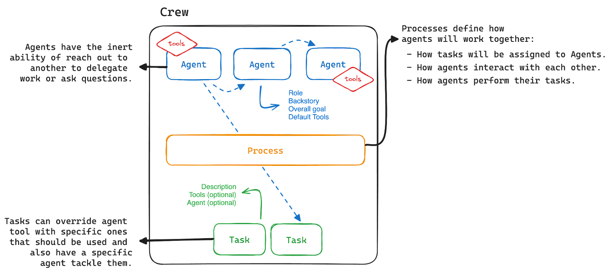
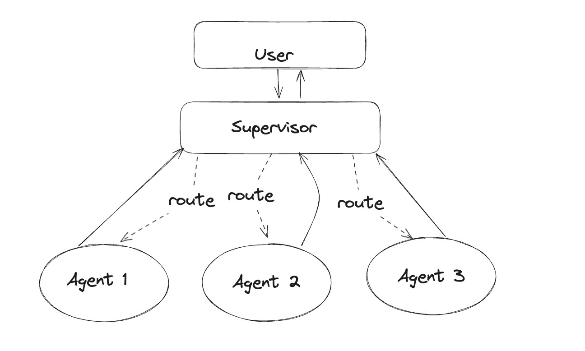
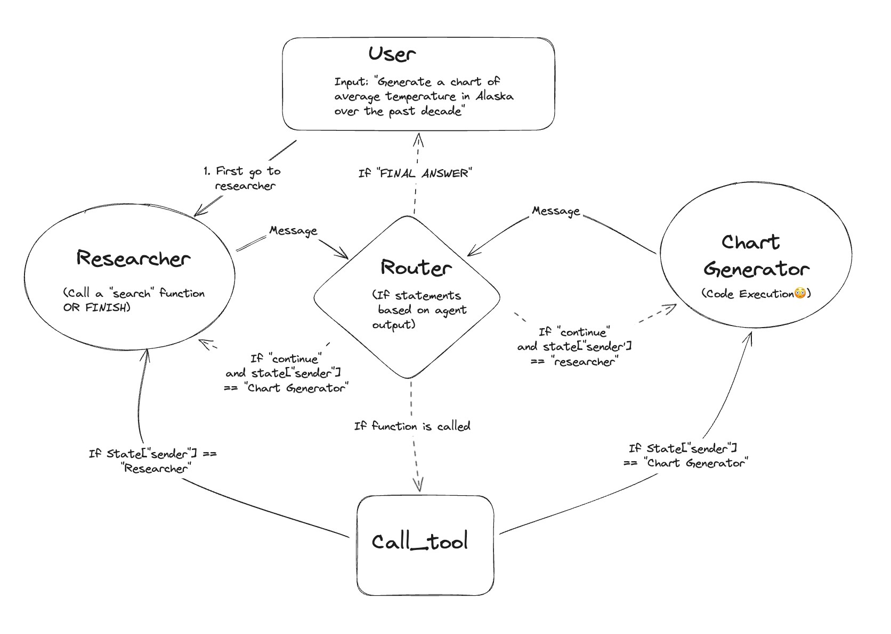
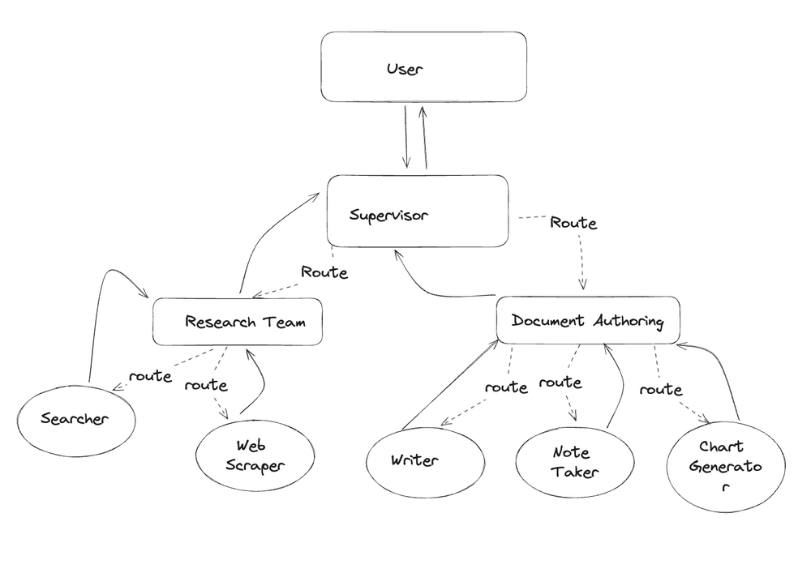

# 多智能体（Multi-Agents）

## 1 简介

**LangChain** 是一个指导Agent执行特定任务的框架，由语言模型提供支持。Agent循环运行以执行多个操作。例如，您可以设置一个Agent来浏览文档并提取文档中的所有药物名称及其副作用。

**LangGraph** 建立在LangChain之上，可以具有多个循环的并提高Agent运行时间。例如，如果我们想让不同的Agent从文档或网站中提取不同类型的信息或执行不同的指令集，可以通过多种方式链接或配置这些Agent以提供最佳结果。

LangGraph是一个使用LLM构建"multi-actor applications"的库。LangChain表达式语言可以容纳多个链(或角色)在多个步骤中周期性地循环工作。"LangChain"的最大价值之一就是可以轻松创建自定义链。

LangChain表达式语言不适合描述循环(循环)，但通过使用LangGraph，可以描述和引入Agent所需的循环。

LangGraph 是一个有用于构建有状态和多角色的 Agents 应用，它并不是一个独立于 Langchain 的新框架，而是基于 Langchain 之上构建的一个扩展库，可以与 Langchain 现有的链（Chains）、LangChain Expression Language（LCEL）等无缝协作。LangGraph 能够协调多个 Chain、Agent、Tool 等共同协作来完成输入任务，支持 LLM 调用“循环”和 Agent 过程的更精细化控制。

LangGraph 的实现方式是把之前基于 AgentExecutor 的黑盒调用过程，用一种新的形式来构建：状态图（StateGraph）。把基于 LLM 的任务（比如：RAG、代码生成等）细节用 Graph 进行精确的定义（定义图的节点与边），最后基于这个图来编译生成应用。在任务运行过程中，维持一个中央状态对象(state)，会根据节点的跳转不断更新，状态包含的属性可自行定义。

### 1.1 Multi Agents Vs Single Agent

"If one agent can't work well ,then why is multi-agent useful?"

“如果一个Agent无法很好地工作,那么为什么多Agent更有用?”

Multi-Agent框架中会为不同的Agent赋予**不同的角色定位，**通过Agent之间的协同合作来完成更复杂的任务。Multi-Agent系统相比于 single agent 更加复杂，因为每个 agent 在和环境交互的同时也在和其他 agent 进行直接或者间接的交互，从而实现更为复杂的解决问题流程。

**为什么多Agent框架可以解决更复杂的任务？**

多Agent设计允许您将复杂的问题分解为可以由专业Agent和LLM程序目标的可管理工作单元。

每个Agent都可以有自己的提示、LLM、工具和其他自定义代码，以便与其他Agent进行最佳协作，即多Agent框架中每个Agent的专业性更强，对待一类问题解决更为专业。

**多Agent设计的优点**

- 分组工具/职责可以产生更好的结果。Agent更有可能在专注的任务上成功，而不是必须从几十个工具中选择，对Tools的选择更为专业。
- 分开的提示可以产生更好的结果。每个提示都可以有自己的说明和少量示例，可以让Agent更为专注，对prompt的理解更为充分。每个Agent甚至可以由单独微调的LLM提供动力! 不同Agent可以搭配更适合自己任务的LLM，在单Agent中只能配置一种LLM。这种不同Agent搭配不同的LLM也是在提升Agent的专业性。
- 有助于开发的概念模型。您可以单独评估和改进每个Agent，而不会破坏更大的应用程序。更符合软件开发的规范，在实际生产中更为灵活。


**Multi-Agent系统用于解决实际问题的优势** ，归纳起来，主要有以下几点：

- 在Multi-Agent系统中，每个Agent具有独立性和自主性，能够解决给定的子问题，自主地推理和规划并选择适当的策略，并以特定的方式影响环境。
- Multi-Agent系统支持分布式应用，所以具有良好的模块性、易于扩展性和设计灵活简单，克服了建设一个庞大的系统所造成的管理和扩展的困难，能有效降低系统的总成本；
- 在Multi-Agent系统的实现过程中，不追求单个庞大复杂的体系，而是按面向对象的方法构造多层次，多元化的Agent，其结果降低了系统的复杂性，也降低了各个Agent问题求解的复杂性；
- Multi-Agent系统是一个讲究协调的系统，各Agent通过互相协调去解决大规模的复杂问题；Multi-Agent系统也是一个集成系统，它采用信息集成技术，将各子系统的信息集成在一起，完成复杂系统的集成；
- 在Multi-Agent系统中，各Agent之间互相通信，彼此协调求解问题，因此能有效地提高问题求解的能力；


### 1.2 Multi-Agent in LangGraph

在考虑不同的Multi-Agent工作流程时有两个主要考虑因素：

- 怎么定义每个独立Agent？
- 这些独立的Agent是如何连接交互的？


不同的Multi-Agent框架由不同的Agent及交互方式构成。在LangGraph中每个Agent都是图中的一个节点，它们的连接表示为一条边。控制流由边管理，它们通过添加到图的状态来进行通信。

这种多Agent交互的想法非常适合图形表示，langgraph很好的契合了这种交互方式。

**LangGraph** 建立在LangChain之上，可以具有多个Agent循环运行。例如，如果我们想让不同的Agent从文档或网站中提取不同类型的信息或执行不同的指令集，可以通过多种方式链接或配置组织多Agent以提供最佳结果。LangGraph提供了更为灵活的定义方式。当然，langgraph与langchain的完美融合，更加释放了Agent的强大能力。

### 1.3 VS other Multi-Agent System

#### 一. VS CrewAI

在 CrewAI 中，Agent是一个被编程为执行任务、做出决策并与其他Agent进行通信的自治单元。将Agent视为团队的成员，具有特定的技能和特定的工作要做。Agent可以担任不同的角色，例如“研究员”、“作家”或“客户支持”，每个角色都有助于团队的总体目标。任务可以使用特定的Agent工具覆盖，这些工具应该被使用，同时还可以指定特定的Agent来处理它们。流程定义了Agent如何协同工作：任务如何分配给Agent、Agent之间如何互动、Agent如何执行它们的任务。

流程是 CrewAI 工作流程管理的核心，类似于人类团队组织工作的方式。在 CrewAI 中，流程定义了Agent执行任务的顺序和方式，反映了在运作良好的团队中所期望的协调。CrewAI 中的流程可以被视为 AI Agent如何处理其工作负载的游戏计划。正如项目经理根据团队成员的技能和项目时间表将任务分配给他们一样，CrewAI 也将任务分配给Agent以确保高效的工作流程。

当多个Agent智能体聚集在一起组成一个团队时，CrewAI 才真正表现出色。它是在团队合作中 - 代理协作、共享目标并遵循实现共同目标的流程。代理可以请求帮助或将部分任务分配给其他人，就像我们在工作场所所做的那样。以下为CrewAI的官方示例图，Agent交互是基于任务和流程的。



现在Agent交互方式（任务完成顺序）主要有三种:分层、顺序、共识。

CrewAI在构建时只能使用以上三种流程，然后设置Task Agent。即 固定好流程性、顺序性。这样虽然保证了执行顺序，但是固化了流程。Langchain也在逐步将CrewAI整合到Langchain。

#### 二. VS AutoGen

AutoGen把Agent之间的交互交给大模型。AutoGen可以看成一个多智能体对话框架，但是AutoGen中Agent种类只能继承于AutoGen已发布的基类Agent，与其他框架融合一般。而LangGraph建立在LangChain之上，与LangChain生态系统完全互操作，可以完美融合langsmith，而AutoGen目前与LangChain的结合不是很好，可以说独立于LangChain，实际操作中与LangChain结合起来不方便。AutoGen核心是groupchatmanager，AutoGen无有向图的能力，Agent之间的交互基本由LLM驱动，人类可定制化性不强。

AutoGen 的工作方式就像小组讨论：所有座席坐在一个房间里，群聊管理员决定下一个发言的人。所有Agent通常都有包含在 LLM 呼叫中的共享消息历史记录。LangGraph 将Agent表示为节点。它们通过有向边连接，有向边要么始终被触发，要么仅在定义的条件下被触发，这种触发条件可以由使用者自定义，增强了人类对多Agent交互的可控性。AutoGen 使在履行不同角色的Agent之间创建公开小组讨论变得非常容易，人们只需要创建需要的Agent，然后交给groupchatmanager决定交互顺序。然而，如果您希望能够更细粒度地控制信息流，LangGraph 的效果会更好。

#### 三. LangGraph Multi-Agent

LangGraph Multi-Agent与其他Multi-Agent框架有何不同？

- 其他Multi-Agent中Agent交互要么由LLM决定（比如AutoGen那样）要么是固定顺序（比如CrewAI），而LangGraph中的Multi-Agent系统，Agent之间是由“边”进行连接，这种更细粒度的信息控制流，可以让多Agent更加”正确地“进行交互，可以避免LLM的不稳定性和固定流程的死板性。
- LangGraph 可以图链接图：即一个构建好的LangGraph ，也可以看成一个节点，完成多层嵌套。所以一个已构建好完成某个特定功能的LangGraph ，完全可以把他当成一个节点，供其他Graph使用。这样可以实现多层次的复杂的多智能体应用。（本文3.4章节完美的诠释了LangGraph这一强大的功能。）
- Agent之间交互的循环性！LangGraph 利用有向有环图，完美的实现了Agent之间的多轮交互，解决了单轮Agent生成不准确的弊端。


LangGraph 作为一个尖端框架而出现，使用户能够有效地协调Agent之间的复杂交互。通过利用其先进的特性和功能（例如Agent监督和 StateGraph），用户可以简化工作流程、优化任务分配并增强多Agent系统内的协作。LangGraph 为设计智能、高效的Agent交互开辟了一个充满可能性的世界，为人工智能及其他领域的创新解决方案铺平了道路。我们可以拥抱 LangGraph 的强大功能，并踏上释放多智能体系统全部潜力的旅程。

## 2 Multi-agent with supervisor

前边章节介绍了LangGraph的Multi-Agent基本组成，接下来通过实际案例来展示LangGraph的构建及执行过程。

本案例中将创建一个Agent组，由两个Agent（Researcher和Coder）及一个Agent监督员来帮助委派任务。

**什么是Agent监督员** 

在此案例配置中，查询由Agent监督员在独立Agent之间路由。例如，supervisor将呼叫agent1。Agent1 将完成其工作并将最终答案仅返回给监督员。换句话说，监督员是一个拥有一些工具的Agent，每个工具本身就是一个Agent。

此案例中我们通过创建SuperVisor、research_agent、code_agent实现多Agent交互。

通过下边案例我们可以学习langgraph中是如何定义Agent及如何让Agent之间连接起来的，可以通过结果输出查看Agent之间的交互过程。

下图为Agent监督员SuperVisor与其他Agent之间的关系：



```python
# 代码解读
# 导入依赖包
from typing import Annotated, List, Tuple, Union
from langchain_community.tools.tavily_search import TavilySearchResults
from langchain_core.tools import tool
from langchain_experimental.tools import PythonREPLTool
from langchain.agents import AgentExecutor, create_openai_tools_agent
from langchain_core.messages import BaseMessage, HumanMessage
from langchain_openai import ChatOpenAI
from langchain.output_parsers.openai_functions import JsonOutputFunctionsParser
from langchain_core.prompts import ChatPromptTemplate, MessagesPlaceholder

# 1.创建工具
tavily_tool = TavilySearchResults(max_results=5)
# This executes code locally, which can be unsafe
python_repl_tool = PythonREPLTool()

# 2.create_agent method --创建下边的Agent专用AgentExecutor
def create_agent(llm: ChatOpenAI, tools: list, system_prompt: str):
    # Each worker node will be given a name and some tools.
    prompt = ChatPromptTemplate.from_messages(
        [
            (
                "system",
                system_prompt,
            ),
            MessagesPlaceholder(variable_name="messages"),
            MessagesPlaceholder(variable_name="agent_scratchpad"),
        ]
    )
    agent = create_openai_tools_agent(llm, tools, prompt)
    executor = AgentExecutor(agent=agent, tools=tools)
    return executor

def agent_node(state, agent, name):
    result = agent.invoke(state)
    return {"messages": [HumanMessage(content=result["output"], name=name)]}


#3.创建智能体监督员：它将使用函数调用来选择下一个工作节点或完成处理。
# 负责Agent之间的交互
members = ["Researcher", "Coder"]
system_prompt = (
    "You are a supervisor tasked with managing a conversation between the"
    " following workers:  {members}. Given the following user request,"
    " respond with the worker to act next. Each worker will perform a"
    " task and respond with their results and status. When finished,"
    " respond with FINISH."
)
# Our team supervisor is an LLM node. It just picks the next agent to process
# and decides when the work is completed
options = ["FINISH"] + members
# Using openai function calling can make output parsing easier for us
function_def = {
    "name": "route",
    "description": "Select the next role.",
    "parameters": {
        "title": "routeSchema",
        "type": "object",
        "properties": {
            "next": {
                "title": "Next",
                "anyOf": [
                    {"enum": options},
                ],
            }
        },
        "required": ["next"],
    },
}
prompt = ChatPromptTemplate.from_messages(
    [
        ("system", system_prompt),
        MessagesPlaceholder(variable_name="messages"),
        (
            "system",
            "Given the conversation above, who should act next?"
            " Or should we FINISH? Select one of: {options}",
        ),
    ]
).partial(options=str(options), members=", ".join(members))

# 使用模型
# 这里可以根据实际情况选择自己的模型
llm = ChatOpenAI(model="gpt-4-1106-preview")
supervisor_chain = (
    prompt
    | llm.bind_functions(functions=[function_def], function_call="route")
    | JsonOutputFunctionsParser()
)

# 4.构成图
import operator
from typing import Annotated, Any, Dict, List, Optional, Sequence, TypedDict
import functools

from langchain_core.prompts import ChatPromptTemplate, MessagesPlaceholder
from langgraph.graph import StateGraph, END


# 代理状态是图中每个节点的输入。
class AgentState(TypedDict):
    # 新消息将始终添加到当前状态中。
    messages: Annotated[Sequence[BaseMessage], operator.add]
    # 'next'字段指示下一步的路由位置
    next: str


# 创建Agent及节点
research_agent = create_agent(llm, [tavily_tool], "You are a web researcher.")
research_node = functools.partial(agent_node, agent=research_agent, name="Researcher")

# 注意：code_agent可以执行任意代码。请谨慎操作。
code_agent = create_agent(
    llm,
    [python_repl_tool],
    "You may generate safe python code to analyze data and generate charts using matplotlib.",
)
code_node = functools.partial(agent_node, agent=code_agent, name="Coder")

# 将Agent作为Node添加到LangGraph中
workflow = StateGraph(AgentState)
workflow.add_node("Researcher", research_node)
workflow.add_node("Coder", code_node)
workflow.add_node("supervisor", supervisor_chain)


#5.连接边 即各个Agent节点之间相互连接，构成图
for member in members:
    # 我们希望Agent在完成任务后始终"report back"向主管汇报
    workflow.add_edge(member, "supervisor")
conditional_map = {k: k for k in members}
conditional_map["FINISH"] = END
workflow.add_conditional_edges("supervisor", lambda x: x["next"], conditional_map)
workflow.set_entry_point("supervisor")

graph = workflow.compile()

#6.调用图
for s in graph.stream(
    {
        "messages": [
            HumanMessage(content="Code hello world and print it to the terminal")
        ]
    }
):
    if "__end__" not in s:
        print(s)
        print("----")

```

上述代码通过是实际例子展示了一个LangGraph-MultiAgent的创建过程，总结流程如下：

- 集成agentstate创建StateGraph
- 加入agent节点 和模型进行交互信息
- 设置整体流程被启用的第一个节点为agent节点作为入口
- 然后就开始按图写流程
- 加入边，对agent输出进行判断，如果是continue则action，end则结束
- action之后，把结果返回agent


集成agentstate创建StateGraph

加入agent节点 和模型进行交互信息

设置整体流程被启用的第一个节点为agent节点作为入口

然后就开始按图写流程

加入边，对agent输出进行判断，如果是continue则action，end则结束

action之后，把结果返回agent

## 3 Multi Agent Collaboration

在多智能体协作中，智能体共享状态。每个智能体都有一个提示+LLM。例如本示例中，假设有 2 个不同的智能体 - 一个智能体执行研究人员的工作并提取数据，另一个智能体充当图表生成器并根据提取的信息生成图表。

下述案例我们将看到通过langgraph创建research_agent、code_agent，及Agent与其他类型节点之间的交互，langgraph丰富了多Agent的背景意义，节点可以不仅仅是Agent。



```python
# 环境设置
import os

os.environ["OPENAI_API_KEY"] = getpass.getpass("OpenAI API Key:")
os.environ["TAVILY_API_KEY"] = getpass.getpass("Tavily API Key:")

# 创建Agent
import json

from langchain_core.messages import (
    AIMessage,
    BaseMessage,
    ChatMessage,
    FunctionMessage,
    HumanMessage,
)
from langchain.tools.render import format_tool_to_openai_function
from langchain_core.prompts import ChatPromptTemplate, MessagesPlaceholder
from langgraph.graph import END, StateGraph
from langgraph.prebuilt.tool_executor import ToolExecutor, ToolInvocation


def create_agent(llm, tools, system_message: str):
    """Create an agent."""
    functions = [format_tool_to_openai_function(t) for t in tools]

    prompt = ChatPromptTemplate.from_messages(
        [
            (
                "system",
                "You are a helpful AI assistant, collaborating with other assistants."
                " Use the provided tools to progress towards answering the question."
                " If you are unable to fully answer, that's OK, another assistant with different tools "
                " will help where you left off. Execute what you can to make progress."
                " If you or any of the other assistants have the final answer or deliverable,"
                " prefix your response with FINAL ANSWER so the team knows to stop."
                " You have access to the following tools: {tool_names}.\n{system_message}",
            ),
            MessagesPlaceholder(variable_name="messages"),
        ]
    )
    prompt = prompt.partial(system_message=system_message)
    prompt = prompt.partial(tool_names=", ".join([tool.name for tool in tools]))
    return prompt | llm.bind_functions(functions)

# 定义tools
from langchain_core.tools import tool
from typing import Annotated
from langchain_experimental.utilities import PythonREPL
from langchain_community.tools.tavily_search import TavilySearchResults

tavily_tool = TavilySearchResults(max_results=5)


repl = PythonREPL()


@tool
def python_repl(
    code: Annotated[str, "The python code to execute to generate your chart."]
):
    """Use this to execute python code. If you want to see the output of a value,
    you should print it out with `print(...)`. This is visible to the user."""
    try:
        result = repl.run(code)
    except BaseException as e:
        return f"Failed to execute. Error: {repr(e)}"
    return f"Succesfully executed:\n```python\n{code}\n```\nStdout: {result}"

import operator
from typing import Annotated, List, Sequence, Tuple, TypedDict, Union

from langchain.agents import create_openai_functions_agent
from langchain.tools.render import format_tool_to_openai_function
from langchain_core.prompts import ChatPromptTemplate, MessagesPlaceholder

from langchain_community.chat_models import ChatOpenAI
from typing_extensions import TypedDict


# 这定义了在图中每个节点之间传递的对象。我们将为每个代理和工具创建不同的节点。
class AgentState(TypedDict):
    messages: Annotated[Sequence[BaseMessage], operator.add]
    sender: str

import functools


# 创建给定代理节点的辅助函数
def agent_node(state, agent, name):
    result = agent.invoke(state)
    # 我们将代理输出转换为适合附加到全局状态的格式。
    if isinstance(result, FunctionMessage):
        pass
    else:
        result = HumanMessage(**result.dict(exclude={"type", "name"}), name=name)
    return {
        "messages": [result],
        # Since we have a strict workflow, we can
        # track the sender so we know who to pass to next.
        "sender": name,
    }


llm = ChatOpenAI(model="gpt-3.5-turbo")

# 创建research节点Agent
research节点Agent_agent = create_agent(
    llm,
    [tavily_tool],
    system_message="You should provide accurate data for the chart generator to use.",
)
research_node = functools.partial(agent_node, agent=research_agent, name="Researcher")

# Chart Generator
chart_agent = create_agent(
    llm,
    [python_repl],
    system_message="Any charts you display will be visible by the user.",
)
chart_node = functools.partial(agent_node, agent=chart_agent, name="Chart Generator")

tools = [tavily_tool, python_repl]
tool_executor = ToolExecutor(tools)


def tool_node(state):
    """在图中运行工具

    它接收代理操作并调用该工具，然后返回结果。"""
    messages = state["messages"]
    # 根据继续条件，我们知道最后一个消息涉及到一个函数调用
    last_message = messages[-1]
    # 我们从函数调用构造一个ToolInvocation
    tool_input = json.loads(
        last_message.additional_kwargs["function_call"]["arguments"]
    )
    # 如果工具输入只有一个参数且包含"__arg1"，我们可以按值传递单个参数输入
    if len(tool_input) == 1 and "__arg1" in tool_input:
        tool_input = next(iter(tool_input.values()))
    tool_name = last_message.additional_kwargs["function_call"]["name"]
    action = ToolInvocation(
        tool=tool_name,
        tool_input=tool_input,
    )
    # 我们调用工具执行器并获取响应
    response = tool_executor.invoke(action)
    # 我们使用响应创建一个FunctionMessage
    function_message = FunctionMessage(
        content=f"{tool_name} 响应: {str(response)}", name=action.tool
    )
    # 我们返回一个列表，因为这将添加到现有列表中
    return {"messages": [function_message]}


# 任一代理都可以决定结束
def router(state):
    # 路由器
    messages = state["messages"]
    last_message = messages[-1]
    if "function_call" in last_message.additional_kwargs:
        # 上一个代理正在调用工具
        return "call_tool"
    if "FINAL ANSWER" in last_message.content:
        # 任一代理决定工作已完成
        return "end"
    return "continue"


workflow = StateGraph(AgentState)

workflow.add_node("Researcher", research_node)
workflow.add_node("Chart Generator", chart_node)
workflow.add_node("call_tool", tool_node)

workflow.add_conditional_edges(
    "Researcher",
    router,
    {"continue": "Chart Generator", "call_tool": "call_tool", "end": END},
)
workflow.add_conditional_edges(
    "Chart Generator",
    router,
    {"continue": "Researcher", "call_tool": "call_tool", "end": END},
)

workflow.add_conditional_edges(
    "call_tool",
    # 每个代理节点更新 'sender' 字段
    # 调用工具的节点不会更新，这意味着此边将路由回最初调用工具的代理
    lambda x: x["sender"],
    {
        "Researcher": "Researcher",
        "Chart Generator": "Chart Generator",
    },
)
workflow.set_entry_point("Researcher")
graph = workflow.compile()

for s in graph.stream(
    {
        "messages": [
            HumanMessage(
                content="Fetch the UK's GDP over the past 5 years,"
                " then draw a line graph of it."
                " Once you code it up, finish."
            )
        ],
    },
    # Maximum number of steps to take in the graph
    {"recursion_limit": 150},
):
    print(s)
    print("----")

```

## 4 Hierarchical Agent Teams

现在节点中的智能体实际上是其他`langgraph` 对象本身。这比使用 LangChain AgentExecutor 作为智能体运行时提供了更大的灵活性。我们称其为 **分层团队** ，因为子智能体在某种程度上可以被视为团队。



代码展示如下：

### 4.1 Research Team

首先构造一个Reasearch的LangGraph

1.设置环境

```python
import getpass
import os
import uuid


def _set_if_undefined(var: str):
    if not os.environ.get(var):
        os.environ[var] = getpass(f"Please provide your {var}")


_set_if_undefined("OPENAI_API_KEY")
_set_if_undefined("LANGCHAIN_API_KEY")
_set_if_undefined("TAVILY_API_KEY")

# 可选的，在LangSmith中添加跟踪
# 这将帮助您可视化和调试控制流程
os.environ["LANGCHAIN_TRACING_V2"] = "true"
os.environ["LANGCHAIN_PROJECT"] = "Multi-agent Collaboration"

```

2.定义工具

每个团队将由一名或多名智能体组成，每个智能体拥有一种或多种工具。 下面定义了不同团队要使用的所有工具。研究团队可以使用搜索引擎和 URL 抓取工具在网络上查找信息。

```python
from typing import Annotated, List, Tuple, Union

import matplotlib.pyplot as plt
from langchain_community.document_loaders import WebBaseLoader
from langchain_community.tools.tavily_search import TavilySearchResults
from langchain_core.tools import tool
from langsmith import trace

tavily_tool = TavilySearchResults(max_results=5)


@tool
def scrape_webpages(urls: List[str]) -> str:
    """Use requests and bs4 to scrape the provided web pages for detailed information."""
    loader = WebBaseLoader(urls)
    docs = loader.load()
    return "\n\n".join(
        [
            f'<Document name="{doc.metadata.get("title", "")}">\n{doc.page_content}\n</Document>'
            for doc in docs
        ]
    )
    
from pathlib import Path
from tempfile import TemporaryDirectory
from typing import Dict, Optional

from langchain_experimental.utilities import PythonREPL
from typing_extensions import TypedDict

_TEMP_DIRECTORY = TemporaryDirectory()
WORKING_DIRECTORY = Path(_TEMP_DIRECTORY.name)


@tool
def create_outline(
    points: Annotated[List[str], "List of main points or sections."],
    file_name: Annotated[str, "File path to save the outline."],
) -> Annotated[str, "Path of the saved outline file."]:
    """Create and save an outline."""
    with (WORKING_DIRECTORY / file_name).open("w") as file:
        for i, point in enumerate(points):
            file.write(f"{i + 1}. {point}\n")
    return f"Outline saved to {file_name}"


@tool
def read_document(
    file_name: Annotated[str, "File path to save the document."],
    start: Annotated[Optional[int], "The start line. Default is 0"] = None,
    end: Annotated[Optional[int], "The end line. Default is None"] = None,
) -> str:
    """Read the specified document."""
    with (WORKING_DIRECTORY / file_name).open("r") as file:
        lines = file.readlines()
    if start is not None:
        start = 0
    return "\n".join(lines[start:end])


@tool
def write_document(
    content: Annotated[str, "Text content to be written into the document."],
    file_name: Annotated[str, "File path to save the document."],
) -> Annotated[str, "Path of the saved document file."]:
    """Create and save a text document."""
    with (WORKING_DIRECTORY / file_name).open("w") as file:
        file.write(content)
    return f"Document saved to {file_name}"


@tool
def edit_document(
    file_name: Annotated[str, "Path of the document to be edited."],
    inserts: Annotated[
        Dict[int, str],
        "Dictionary where key is the line number (1-indexed) and value is the text to be inserted at that line.",
    ],
) -> Annotated[str, "Path of the edited document file."]:
    """Edit a document by inserting text at specific line numbers."""

    with (WORKING_DIRECTORY / file_name).open("r") as file:
        lines = file.readlines()

    sorted_inserts = sorted(inserts.items())

    for line_number, text in sorted_inserts:
        if 1 <= line_number <= len(lines) + 1:
            lines.insert(line_number - 1, text + "\n")
        else:
            return f"Error: Line number {line_number} is out of range."

    with (WORKING_DIRECTORY / file_name).open("w") as file:
        file.writelines(lines)

    return f"Document edited and saved to {file_name}"


repl = PythonREPL()


@tool
def python_repl(
    code: Annotated[str, "The python code to execute to generate your chart."]
):
    """Use this to execute python code. If you want to see the output of a value,
    you should print it out with `print(...)`. This is visible to the user."""
    try:
        result = repl.run(code)
    except BaseException as e:
        return f"Failed to execute. Error: {repr(e)}"
    return f"Succesfully executed:\n```python\n{code}\n```\nStdout: {result}"

```

4.当我们想要执行以下操作时，我们将创建一些实用函数以使其更加简洁：创建一个工作智能体。为子图创建一个监督者。

```python
from typing import Any, Callable, List, Optional, TypedDict, Union

from langchain.agents import AgentExecutor, create_openai_functions_agent
from langchain.output_parsers.openai_functions import JsonOutputFunctionsParser
from langchain_core.prompts import ChatPromptTemplate, MessagesPlaceholder
from langchain_core.runnables import Runnable
from langchain_core.tools import BaseTool
from langchain_openai import ChatOpenAI

from langgraph.graph import END, StateGraph


def create_agent(
    llm: ChatOpenAI,
    tools: list,
    system_prompt: str,
) -> str:
    """Create a function-calling agent and add it to the graph."""
    system_prompt += "\nWork autonomously according to your specialty, using the tools available to you."
    " Do not ask for clarification."
    " Your other team members (and other teams) will collaborate with you with their own specialties."
    " You are chosen for a reason! You are one of the following team members: {team_members}."
    prompt = ChatPromptTemplate.from_messages(
        [
            (
                "system",
                system_prompt,
            ),
            MessagesPlaceholder(variable_name="messages"),
            MessagesPlaceholder(variable_name="agent_scratchpad"),
        ]
    )
    agent = create_openai_functions_agent(llm, tools, prompt)
    executor = AgentExecutor(agent=agent, tools=tools)
    return executor


def agent_node(state, agent, name):
    result = agent.invoke(state)
    return {"messages": [HumanMessage(content=result["output"], name=name)]}


def create_team_supervisor(llm: ChatOpenAI, system_prompt, members) -> str:
    """An LLM-based router."""
    options = ["FINISH"] + members
    function_def = {
        "name": "route",
        "description": "Select the next role.",
        "parameters": {
            "title": "routeSchema",
            "type": "object",
            "properties": {
                "next": {
                    "title": "Next",
                    "anyOf": [
                        {"enum": options},
                    ],
                },
            },
            "required": ["next"],
        },
    }
    prompt = ChatPromptTemplate.from_messages(
        [
            ("system", system_prompt),
            MessagesPlaceholder(variable_name="messages"),
            (
                "system",
                "Given the conversation above, who should act next?"
                " Or should we FINISH? Select one of: {options}",
            ),
        ]
    ).partial(options=str(options), team_members=", ".join(members))
    return (
        prompt
        | llm.bind_functions(functions=[function_def], function_call="route")
        | JsonOutputFunctionsParser()
    )

```

5.研究团队将有一个搜索Agent和一个网络抓取“research_agent”作为两个工作节点。 让我们创建这些以及团队主管。

```python
import functools
import operator

from langchain_core.messages import AIMessage, BaseMessage, HumanMessage
from langchain_openai.chat_models import ChatOpenAI
import functools


# 图状态
class ResearchTeamState(TypedDict):
    # 每个团队成员完成后都会添加一条消息
    messages: Annotated[List[BaseMessage], operator.add]
    # 跟踪团队成员，以便他们了解其他人的技能
    team_members: List[str]
    # 用于路由工作。主管调用一个函数，
    # 每次做出决定时都会更新这个字段
    next: str


llm = ChatOpenAI(model="gpt-4-1106-preview")

search_agent = create_agent(
    llm,
    [tavily_tool],
    "You are a research assistant who can search for up-to-date info using the tavily search engine.",
)
search_node = functools.partial(agent_node, agent=search_agent, name="Search")

research_agent = create_agent(
    llm,
    [scrape_webpages],
    "You are a research assistant who can scrape specified urls for more detailed information using the scrape_webpages function.",
)
research_node = functools.partial(agent_node, agent=research_agent, name="Web Scraper")

supervisor_agent = create_team_supervisor(
    llm,
    "You are a supervisor tasked with managing a conversation between the"
    " following workers:  Search, Web Scraper. Given the following user request,"
    " respond with the worker to act next. Each worker will perform a"
    " task and respond with their results and status. When finished,"
    " respond with FINISH.",
    ["Search", "Web Scraper"],
)

```

6.将节点添加到团队图中，并定义边，这确定了转换标准。

```python
research_graph = StateGraph(ResearchTeamState)
research_graph.add_node("Search", search_node)
research_graph.add_node("Web Scraper", research_node)
research_graph.add_node("supervisor", supervisor_agent)

# Define the control flow
research_graph.add_edge("Search", "supervisor")
research_graph.add_edge("Web Scraper", "supervisor")
research_graph.add_conditional_edges(
    "supervisor",
    lambda x: x["next"],
    {"Search": "Search", "Web Scraper": "Web Scraper", "FINISH": END},
)


research_graph.set_entry_point("supervisor")
chain = research_graph.compile()


# 以下函数在顶层图状态和研究子图状态之间进行交互
# 这样每个图的状态就不会混在一起
def enter_chain(message: str):
    results = {
        "messages": [HumanMessage(content=message)],
    }
    return results


research_chain = enter_chain | chain

for s in research_chain.stream(
    "when is Taylor Swift's next tour?", {"recursion_limit": 100}
):
    if "__end__" not in s:
        print(s)
        print("---")

```

代码执行输出如下：

```python
{'supervisor': {'next': 'Search'}}
---
{'Search': {'messages': [HumanMessage(content='Taylor Swift\'s next tour, named "The Eras Tour," has dates scheduled for both 2023 and 2024. Some of the upcoming dates mentioned in the search results include:\n\n- November 25-26, 2023, in São Paulo, Brazil at the Allianz Parque\n- February 7-9, 2024, in Tokyo, Japan at the Tokyo Dome\n\nFor a complete and detailed list of all the dates and locations for Taylor Swift\'s "The Eras Tour," you would need to visit official sources or ticketing websites such as Ticketmaster, as the search results suggest additional dates have been added due to overwhelming demand. The tour is set to wrap up in Indianapolis on November 3, 2024. Keep in mind that the schedule may be subject to change, and it\'s a good idea to verify the dates on an official ticketing or event site for the latest information.', name='Search')]}}
---
{'supervisor': {'next': 'FINISH'}}
---

```

### 4.2 Document Writing Team

构建文档撰写团队 使用类似的方法创建下面的文档编写团队。 这次，我们将为每个Agent提供不同的文件写入工具的访问权限。请注意，我们在这里向我们的Agent授予文件系统访问权限，这在所有情况下并不安全。

```python
import operator
from pathlib import Path


# 文件撰写团队图状态
class DocWritingState(TypedDict):
    # 跟踪团队的内部对话
    messages: Annotated[List[BaseMessage], operator.add]
    # 为每个工作者提供其他人技能集的上下文
    team_members: str
    # 主管告诉langgraph下一步该让谁工作的方式
    next: str
    # 跟踪共享目录状态
    current_files: str

# 这将在每个工作者代理开始工作之前运行
# 它使他们更加了解当前工作目录的状态。
def prelude(state):
    written_files = []
    if not WORKING_DIRECTORY.exists():
        WORKING_DIRECTORY.mkdir()
    try:
        written_files = [
            f.relative_to(WORKING_DIRECTORY) for f in WORKING_DIRECTORY.rglob("*")
        ]
    except:
        pass
    if not written_files:
        return {**state, "current_files": "No files written."}
    return {
        **state,
        "current_files": "\nBelow are files your team has written to the directory:\n"
        + "\n".join([f" - {f}" for f in written_files]),
    }


llm = ChatOpenAI(model="gpt-4-1106-preview")

doc_writer_agent = create_agent(
    llm,
    [write_document, edit_document, read_document],
    "You are an expert writing a research document.\n"
    # The {current_files} value is populated automatically by the graph state
    "Below are files currently in your directory:\n{current_files}",
)
# Injects current directory working state before each call
context_aware_doc_writer_agent = prelude | doc_writer_agent
doc_writing_node = functools.partial(
    agent_node, agent=context_aware_doc_writer_agent, name="Doc Writer"
)

note_taking_agent = create_agent(
    llm,
    [create_outline, read_document],
    "You are an expert senior researcher tasked with writing a paper outline and"
    " taking notes to craft a perfect paper.{current_files}",
)
context_aware_note_taking_agent = prelude | note_taking_agent
note_taking_node = functools.partial(
    agent_node, agent=context_aware_note_taking_agent, name="Note Taker"
)

chart_generating_agent = create_agent(
    llm,
    [read_document, python_repl],
    "You are a data viz expert tasked with generating charts for a research project."
    "{current_files}",
)
context_aware_chart_generating_agent = prelude | chart_generating_agent
chart_generating_node = functools.partial(
    agent_node, agent=context_aware_note_taking_agent, name="Chart Generator"
)

doc_writing_supervisor = create_team_supervisor(
    llm,
    "You are a supervisor tasked with managing a conversation between the"
    " following workers:  {team_members}. Given the following user request,"
    " respond with the worker to act next. Each worker will perform a"
    " task and respond with their results and status. When finished,"
    " respond with FINISH.",
    ["Doc Writer", "Note Taker", "Chart Generator"],
)

```

创建图

```python
# 在这里创建图：
authoring_graph = StateGraph(DocWritingState)
authoring_graph.add_node("Doc Writer", doc_writing_node)
authoring_graph.add_node("Note Taker", note_taking_node)
authoring_graph.add_node("Chart Generator", chart_generating_node)
authoring_graph.add_node("supervisor", doc_writing_supervisor)

# 添加总是发生的边
authoring_graph.add_edge("Doc Writer", "supervisor")
authoring_graph.add_edge("Note Taker", "supervisor")
authoring_graph.add_edge("Chart Generator", "supervisor")

# 添加需要路由的边
authoring_graph.add_conditional_edges(
    "supervisor",
    lambda x: x["next"],
    {
        "Doc Writer": "Doc Writer",
        "Note Taker": "Note Taker",
        "Chart Generator": "Chart Generator",
        "FINISH": END,
    },
)


authoring_graph.set_entry_point("supervisor")
chain = research_graph.compile()


# 以下函数在顶层图状态和研究子图状态之间进行交互
# 这样做可以确保每个图的状态不会混合在一起
def enter_chain(message: str, members: List[str]):
    results = {
        "messages": [HumanMessage(content=message)],
        "team_members": ", ".join(members),
    }
    return results


authoring_chain = (
    functools.partial(enter_chain, members=authoring_graph.nodes)
    | authoring_graph.compile()
)

```

执行图

```python
for s in authoring_chain.stream(
    "Write an outline for poem and then write the poem to disk.",
    {"recursion_limit": 100},
):
    if "__end__" not in s:
        print(s)
        print("---")

```

查看执行结果

```python
{'supervisor': {'next': 'Note Taker'}}
---
{'Note Taker': {'messages': [HumanMessage(content='The outline and poem have been successfully written and saved. The poem, titled "Whispers of the Wind," captures the essence of the wind\'s journey from a gentle beginning to a powerful crescendo and then a calming end, concluding with the cyclical nature of this elemental force.\n\nHere is the completed poem:\n\n---\n\n**Whispers of the Wind**\n\nEmbracing the essence of nature\'s breath,\nA zephyr stirs, the dawn\'s own cheer,\nWhispering secrets, meant for no ear,\nThe gentle beginnings, a soft caress.\n\nA gale ascends, midday\'s fierce guest,\nTwirling leaves in a wild, untamed dance,\nNature\'s raw power in its vast expanse,\nThe crescendo of gusts, a forceful dance.\n\nAs dusk falls, the tempest does wane,\nA soft sighing through the willow\'s mane,\nIn the quietude, peace finds its chance,\nThe calming aftermath, a serene trance.\n\nThrough whispers, roars, and silent chants,\nThe wind carries on, no pause nor glance,\nIn its journey, a boundless, spirited lance,\nThe enduring cycle, a timeless romance.\n\n---\n\nThe poem is a testament to the wind\'s ever-present and ever-changing presence in the world around us.', name='Note Taker')]}}
---
{'supervisor': {'next': 'FINISH'}}
---

```

### 4.3 Add Layers

添加图层 在这个设计中，我们正在执行自上而下的规划政策。 我们已经创建了两个LangGraph，但我们必须决定如何在两个图表之间分配工作。我们将创建第三个图来编排前两个图，并添加一些连接器来定义如何在不同图之间共享此顶级状态。

```python
from langchain_core.messages import AIMessage, BaseMessage, HumanMessage
from langchain_openai.chat_models import ChatOpenAI


llm = ChatOpenAI(model="gpt-4-1106-preview")

supervisor_node = create_team_supervisor(
    llm,
    "You are a supervisor tasked with managing a conversation between the"
    " following teams: {team_members}. Given the following user request,"
    " respond with the worker to act next. Each worker will perform a"
    " task and respond with their results and status. When finished,"
    " respond with FINISH.",
    ["Research team", "Paper writing team"],
)

# Top-level graph state
class State(TypedDict):
    messages: Annotated[List[BaseMessage], operator.add]
    next: str


def get_last_message(state: State) -> str:
    return state["messages"][-1].content


def join_graph(response: dict):
    return {"messages": [response["messages"][-1]]}


# 定义图形。
super_graph = StateGraph(State)
# 首先添加节点，执行工作
super_graph.add_node("Research team", get_last_message | research_chain | join_graph)
super_graph.add_node(
    "Paper writing team", get_last_message | authoring_chain | join_graph
)
super_graph.add_node("supervisor", supervisor_node)

# 定义图形连接，控制逻辑如何传播
super_graph.add_edge("Research team", "supervisor")
super_graph.add_edge("Paper writing team", "supervisor")
super_graph.add_conditional_edges(
    "supervisor",
    lambda x: x["next"],
    {
        "Paper writing team": "Paper writing team",
        "Research team": "Research team",
        "FINISH": END,
    },
)
super_graph.set_entry_point("supervisor")
super_graph = super_graph.compile()

for s in super_graph.stream(
    {
        "messages": [
            HumanMessage(
                content="Write a brief research report on the North American sturgeon. Include a chart."
            )
        ],
    },
    {"recursion_limit": 150},
):
    if "__end__" not in s:
        print(s)
        print("---")

```

查看运行结果：

```python
{'supervisor': {'next': 'Research team'}}
---
{'Research team': {'messages': [HumanMessage(content='Based on the information gathered from the provided URLs, here is a detailed research report on the North American sturgeon along with a chart that summarizes some of the key data:\n\n**North American Sturgeon Research Report**\n\n**Overview:**\nNorth American sturgeons are ancient fish that belong to the Acipenseridae family. These bony, bottom-dwelling fish are characterized by their elongated bodies, scutes (bony plates), and barbels near the mouth. They are anadromous, meaning they migrate from saltwater to freshwater to spawn.\n\n**Species and Distribution:**\n- Atlantic Sturgeon (*Acipenser oxyrinchus*): Found along the East Coast from Canada to Florida.\n- Green Sturgeon (*Acipenser medirostris*): Found on the West Coast from Alaska to California.\n- Shortnose Sturgeon (*Acipenser brevirostrum*): Distributed along the East Coast in estuarine and riverine habitats.\n\n**Conservation Status:**\n- Atlantic Sturgeon: Multiple distinct population segments (DPSs) listed as endangered or threatened under the Endangered Species Act (ESA).\n- Green Sturgeon: Southern DPS listed as threatened under the ESA.\n- Shortnose Sturgeon: Listed as endangered throughout its range under the ESA.\n\n**Threats:**\n- Bycatch in commercial fisheries.\n- Habitat degradation and loss due to dams, pollution, and development.\n- Climate change affecting water temperatures and spawning conditions.\n- Vessel strikes, particularly for Atlantic sturgeon in high-traffic rivers.\n\n**Conservation Efforts:**\nEfforts include habitat restoration, removal of barriers to improve fish passage, protection from bycatch, and public education. Critical habitat has been designated for certain species, and regulations prohibit the retention of green sturgeon in recreational and commercial fisheries.\n\n**Chart Information:**\nThe chart would include species names, conservation status, geographic distribution, and key threats.\n\n| Species             | Conservation Status | Distribution                        | Key Threats                                    |\n|---------------------|---------------------|-------------------------------------|------------------------------------------------|\n| Atlantic Sturgeon   | Endangered/Threatened | East Coast (Canada to Florida)     | Bycatch, habitat loss, vessel strikes          |\n| Green Sturgeon      | Southern DPS Threatened | West Coast (Alaska to California) | Bycatch, habitat degradation, climate change   |\n| Shortnose Sturgeon  | Endangered            | East Coast estuarine and riverine habitats | Bycatch, habitat degradation, dams          |\n\n**Conclusion:**\nNorth American sturgeons face numerous threats that have led to a decline in their populations. However, ongoing conservation efforts, including habitat restoration and protective regulations, are crucial in supporting their recovery and ensuring the survival of these ancient and ecologically important species.', name='Web Scraper')]}}
---
{'supervisor': {'next': 'Research team'}}
---
{'Research team': {'messages': [HumanMessage(content='Based on the information gathered from the provided URLs, here is a detailed research report on the North American sturgeon along with a chart that summarizes some of the key data:\n\n**North American Sturgeon Research Report**\n\n**Overview:**\nNorth American sturgeons are ancient fish that belong to the Acipenseridae family. These bony, bottom-dwelling fish are characterized by their elongated bodies, scutes (bony plates), and barbels near the mouth. They are anadromous, meaning they migrate from saltwater to freshwater to spawn.\n\n**Species and Distribution:**\n- Atlantic Sturgeon (*Acipenser oxyrinchus*): Found along the East Coast from Canada to Florida.\n- Green Sturgeon (*Acipenser medirostris*): Found on the West Coast from Alaska to California.\n- Shortnose Sturgeon (*Acipenser brevirostrum*): Distributed along the East Coast in estuarine and riverine habitats.\n\n**Conservation Status:**\n- Atlantic Sturgeon: Multiple distinct population segments (DPSs) listed as endangered or threatened under the Endangered Species Act (ESA).\n- Green Sturgeon: Southern DPS listed as threatened under the ESA.\n- Shortnose Sturgeon: Listed as endangered throughout its range under the ESA.\n\n**Threats:**\n- Bycatch in commercial fisheries.\n- Habitat degradation and loss due to dams, pollution, and development.\n- Climate change affecting water temperatures and spawning conditions.\n- Vessel strikes, particularly for Atlantic sturgeon in high-traffic rivers.\n\n**Conservation Efforts:**\nEfforts include habitat restoration, removal of barriers to improve fish passage, protection from bycatch, and public education. Critical habitat has been designated for certain species, and regulations prohibit the retention of green sturgeon in recreational and commercial fisheries.\n\n**Chart Information:**\nThe chart would include species names, conservation status, geographic distribution, and key threats.\n\n| Species             | Conservation Status | Distribution                        | Key Threats                                    |\n|---------------------|---------------------|-------------------------------------|------------------------------------------------|\n| Atlantic Sturgeon   | Endangered/Threatened | East Coast (Canada to Florida)     | Bycatch, habitat loss, vessel strikes          |\n| Green Sturgeon      | Southern DPS Threatened | West Coast (Alaska to California) | Bycatch, habitat degradation, climate change   |\n| Shortnose Sturgeon  | Endangered            | East Coast estuarine and riverine habitats | Bycatch, habitat degradation, dams          |\n\n**Conclusion:**\nNorth American sturgeons face numerous threats that have led to a decline in their populations. However, ongoing conservation efforts, including habitat restoration and protective regulations, are crucial in supporting their recovery and ensuring the survival of these ancient and ecologically important species.')]}}
---
{'supervisor': {'next': 'Research team'}}
---
{'Research team': {'messages': [HumanMessage(content='Based on the information gathered from the provided URLs, here is a detailed research report on the North American sturgeon along with a chart that summarizes some of the key data:\n\n**North American Sturgeon Research Report**\n\n**Overview:**\nNorth American sturgeons are ancient fish that belong to the Acipenseridae family. These bony, bottom-dwelling fish are characterized by their elongated bodies, scutes (bony plates), and barbels near the mouth. They are anadromous, meaning they migrate from saltwater to freshwater to spawn.\n\n**Species and Distribution:**\n- Atlantic Sturgeon (*Acipenser oxyrinchus*): Found along the East Coast from Canada to Florida.\n- Green Sturgeon (*Acipenser medirostris*): Found on the West Coast from Alaska to California.\n- Shortnose Sturgeon (*Acipenser brevirostrum*): Distributed along the East Coast in estuarine and riverine habitats.\n\n**Conservation Status:**\n- Atlantic Sturgeon: Multiple distinct population segments (DPSs) listed as endangered or threatened under the Endangered Species Act (ESA).\n- Green Sturgeon: Southern DPS listed as threatened under the ESA.\n- Shortnose Sturgeon: Listed as endangered throughout its range under the ESA.\n\n**Threats:**\n- Bycatch in commercial fisheries.\n- Habitat degradation and loss due to dams, pollution, and development.\n- Climate change affecting water temperatures and spawning conditions.\n- Vessel strikes, particularly for Atlantic sturgeon in high-traffic rivers.\n\n**Conservation Efforts:**\nEfforts include habitat restoration, removal of barriers to improve fish passage, protection from bycatch, and public education. Critical habitat has been designated for certain species, and regulations prohibit the retention of green sturgeon in recreational and commercial fisheries.\n\n**Chart Information:**\nThe chart would include species names, conservation status, geographic distribution, and key threats.\n\n| Species             | Conservation Status | Distribution                        | Key Threats                                    |\n|---------------------|---------------------|-------------------------------------|------------------------------------------------|\n| Atlantic Sturgeon   | Endangered/Threatened | East Coast (Canada to Florida)     | Bycatch, habitat loss, vessel strikes          |\n| Green Sturgeon      | Southern DPS Threatened | West Coast (Alaska to California) | Bycatch, habitat degradation, climate change   |\n| Shortnose Sturgeon  | Endangered            | East Coast estuarine and riverine habitats | Bycatch, habitat degradation, dams          |\n\n**Conclusion:**\nNorth American sturgeons face numerous threats that have led to a decline in their populations. However, ongoing conservation efforts, including habitat restoration and protective regulations, are crucial in supporting their recovery and ensuring the survival of these ancient and ecologically important species.')]}}
---
{'supervisor': {'next': 'Research team'}}
---
{'Research team': {'messages': [HumanMessage(content='Based on the information gathered from the provided URLs, here is a detailed research report on the North American sturgeon along with a chart that summarizes some of the key data:\n\n**North American Sturgeon Research Report**\n\n**Overview:**\nNorth American sturgeons are ancient fish that belong to the Acipenseridae family. These bony, bottom-dwelling fish are characterized by their elongated bodies, scutes (bony plates), and barbels near the mouth. They are anadromous, meaning they migrate from saltwater to freshwater to spawn.\n\n**Species and Distribution:**\n- Atlantic Sturgeon (*Acipenser oxyrinchus*): Found along the East Coast from Canada to Florida.\n- Green Sturgeon (*Acipenser medirostris*): Found on the West Coast from Alaska to California.\n- Shortnose Sturgeon (*Acipenser brevirostrum*): Distributed along the East Coast in estuarine and riverine habitats.\n\n**Conservation Status:**\n- Atlantic Sturgeon: Multiple distinct population segments (DPSs) listed as endangered or threatened under the Endangered Species Act (ESA).\n- Green Sturgeon: Southern DPS listed as threatened under the ESA.\n- Shortnose Sturgeon: Listed as endangered throughout its range under the ESA.\n\n**Threats:**\n- Bycatch in commercial fisheries.\n- Habitat degradation and loss due to dams, pollution, and development.\n- Climate change affecting water temperatures and spawning conditions.\n- Vessel strikes, particularly for Atlantic sturgeon in high-traffic rivers.\n\n**Conservation Efforts:**\nEfforts include habitat restoration, removal of barriers to improve fish passage, protection from bycatch, and public education. Critical habitat has been designated for certain species, and regulations prohibit the retention of green sturgeon in recreational and commercial fisheries.\n\n**Chart Information:**\nThe chart would include species names, conservation status, geographic distribution, and key threats.\n\n| Species             | Conservation Status | Distribution                        | Key Threats                                    |\n|---------------------|---------------------|-------------------------------------|------------------------------------------------|\n| Atlantic Sturgeon   | Endangered/Threatened | East Coast (Canada to Florida)     | Bycatch, habitat loss, vessel strikes          |\n| Green Sturgeon      | Southern DPS Threatened | West Coast (Alaska to California) | Bycatch, habitat degradation, climate change   |\n| Shortnose Sturgeon  | Endangered            | East Coast estuarine and riverine habitats | Bycatch, habitat degradation, dams          |\n\n**Conclusion:**\nNorth American sturgeons face numerous threats that have led to a decline in their populations. However, ongoing conservation efforts, including habitat restoration and protective regulations, are crucial in supporting their recovery and ensuring the survival of these ancient and ecologically important species.')]}}
---
{'supervisor': {'next': 'Research team'}}
---
{'Research team': {'messages': [HumanMessage(content='Based on the information gathered from the provided URLs, here is a detailed research report on the North American sturgeon along with a chart that summarizes some of the key data:\n\n**North American Sturgeon Research Report**\n\n**Overview:**\nNorth American sturgeons are ancient fish that belong to the Acipenseridae family. These bony, bottom-dwelling fish are characterized by their elongated bodies, scutes (bony plates), and barbels near the mouth. They are anadromous, meaning they migrate from saltwater to freshwater to spawn.\n\n**Species and Distribution:**\n- Atlantic Sturgeon (*Acipenser oxyrinchus*): Found along the East Coast from Canada to Florida.\n- Green Sturgeon (*Acipenser medirostris*): Found on the West Coast from Alaska to California.\n- Shortnose Sturgeon (*Acipenser brevirostrum*): Distributed along the East Coast in estuarine and riverine habitats.\n\n**Conservation Status:**\n- Atlantic Sturgeon: Multiple distinct population segments (DPSs) listed as endangered or threatened under the Endangered Species Act (ESA).\n- Green Sturgeon: Southern DPS listed as threatened under the ESA.\n- Shortnose Sturgeon: Listed as endangered throughout its range under the ESA.\n\n**Threats:**\n- Bycatch in commercial fisheries.\n- Habitat degradation and loss due to dams, pollution, and development.\n- Climate change affecting water temperatures and spawning conditions.\n- Vessel strikes, particularly for Atlantic sturgeon in high-traffic rivers.\n\n**Conservation Efforts:**\nEfforts include habitat restoration, removal of barriers to improve fish passage, protection from bycatch, and public education. Critical habitat has been designated for certain species, and regulations prohibit the retention of green sturgeon in recreational and commercial fisheries.\n\n**Chart Information:**\nThe chart would include species names, conservation status, geographic distribution, and key threats.\n\n| Species             | Conservation Status | Distribution                        | Key Threats                                    |\n|---------------------|---------------------|-------------------------------------|------------------------------------------------|\n| Atlantic Sturgeon   | Endangered/Threatened | East Coast (Canada to Florida)     | Bycatch, habitat loss, vessel strikes          |\n| Green Sturgeon      | Southern DPS Threatened | West Coast (Alaska to California) | Bycatch, habitat degradation, climate change   |\n| Shortnose Sturgeon  | Endangered            | East Coast estuarine and riverine habitats | Bycatch, habitat degradation, dams          |\n\n**Conclusion:**\nNorth American sturgeons face numerous threats that have led to a decline in their populations. However, ongoing conservation efforts, including habitat restoration and protective regulations, are crucial in supporting their recovery and ensuring the survival of these ancient and ecologically important species.')]}}
---
{'supervisor': {'next': 'Research team'}}
---
{'Research team': {'messages': [HumanMessage(content='Based on the information gathered from the provided URLs, here is a detailed research report on the North American sturgeon along with a chart that summarizes some of the key data:\n\n**North American Sturgeon Research Report**\n\n**Overview:**\nNorth American sturgeons are ancient fish that belong to the Acipenseridae family. These bony, bottom-dwelling fish are characterized by their elongated bodies, scutes (bony plates), and barbels near the mouth. They are anadromous, meaning they migrate from saltwater to freshwater to spawn.\n\n**Species and Distribution:**\n- Atlantic Sturgeon (*Acipenser oxyrinchus*): Found along the East Coast from Canada to Florida.\n- Green Sturgeon (*Acipenser medirostris*): Found on the West Coast from Alaska to California.\n- Shortnose Sturgeon (*Acipenser brevirostrum*): Distributed along the East Coast in estuarine and riverine habitats.\n\n**Conservation Status:**\n- Atlantic Sturgeon: Multiple distinct population segments (DPSs) listed as endangered or threatened under the Endangered Species Act (ESA).\n- Green Sturgeon: Southern DPS listed as threatened under the ESA.\n- Shortnose Sturgeon: Listed as endangered throughout its range under the ESA.\n\n**Threats:**\n- Bycatch in commercial fisheries.\n- Habitat degradation and loss due to dams, pollution, and development.\n- Climate change affecting water temperatures and spawning conditions.\n- Vessel strikes, particularly for Atlantic sturgeon in high-traffic rivers.\n\n**Conservation Efforts:**\nEfforts include habitat restoration, removal of barriers to improve fish passage, protection from bycatch, and public education. Critical habitat has been designated for certain species, and regulations prohibit the retention of green sturgeon in recreational and commercial fisheries.\n\n**Chart Information:**\nThe chart would include species names, conservation status, geographic distribution, and key threats.\n\n| Species             | Conservation Status | Distribution                        | Key Threats                                    |\n|---------------------|---------------------|-------------------------------------|------------------------------------------------|\n| Atlantic Sturgeon   | Endangered/Threatened | East Coast (Canada to Florida)     | Bycatch, habitat loss, vessel strikes          |\n| Green Sturgeon      | Southern DPS Threatened | West Coast (Alaska to California) | Bycatch, habitat degradation, climate change   |\n| Shortnose Sturgeon  | Endangered            | East Coast estuarine and riverine habitats | Bycatch, habitat degradation, dams          |\n\n**Conclusion:**\nNorth American sturgeons face numerous threats that have led to a decline in their populations. However, ongoing conservation efforts, including habitat restoration and protective regulations, are crucial in supporting their recovery and ensuring the survival of these ancient and ecologically important species.')]}}
---
{'supervisor': {'next': 'Research team'}}
---
{'Research team': {'messages': [HumanMessage(content='Based on the information gathered from the provided URLs, here is a detailed research report on the North American sturgeon along with a chart that summarizes some of the key data:\n\n**North American Sturgeon Research Report**\n\n**Overview:**\nNorth American sturgeons are ancient fish that belong to the Acipenseridae family. These bony, bottom-dwelling fish are characterized by their elongated bodies, scutes (bony plates), and barbels near the mouth. They are anadromous, meaning they migrate from saltwater to freshwater to spawn.\n\n**Species and Distribution:**\n- Atlantic Sturgeon (*Acipenser oxyrinchus*): Found along the East Coast from Canada to Florida.\n- Green Sturgeon (*Acipenser medirostris*): Found on the West Coast from Alaska to California.\n- Shortnose Sturgeon (*Acipenser brevirostrum*): Distributed along the East Coast in estuarine and riverine habitats.\n\n**Conservation Status:**\n- Atlantic Sturgeon: Multiple distinct population segments (DPSs) listed as endangered or threatened under the Endangered Species Act (ESA).\n- Green Sturgeon: Southern DPS listed as threatened under the ESA.\n- Shortnose Sturgeon: Listed as endangered throughout its range under the ESA.\n\n**Threats:**\n- Bycatch in commercial fisheries.\n- Habitat degradation and loss due to dams, pollution, and development.\n- Climate change affecting water temperatures and spawning conditions.\n- Vessel strikes, particularly for Atlantic sturgeon in high-traffic rivers.\n\n**Conservation Efforts:**\nEfforts include habitat restoration, removal of barriers to improve fish passage, protection from bycatch, and public education. Critical habitat has been designated for certain species, and regulations prohibit the retention of green sturgeon in recreational and commercial fisheries.\n\n**Chart Information:**\nThe chart would include species names, conservation status, geographic distribution, and key threats.\n\n| Species             | Conservation Status | Distribution                        | Key Threats                                    |\n|---------------------|---------------------|-------------------------------------|------------------------------------------------|\n| Atlantic Sturgeon   | Endangered/Threatened | East Coast (Canada to Florida)     | Bycatch, habitat loss, vessel strikes          |\n| Green Sturgeon      | Southern DPS Threatened | West Coast (Alaska to California) | Bycatch, habitat degradation, climate change   |\n| Shortnose Sturgeon  | Endangered            | East Coast estuarine and riverine habitats | Bycatch, habitat degradation, dams          |\n\n**Conclusion:**\nNorth American sturgeons face numerous threats that have led to a decline in their populations. However, ongoing conservation efforts, including habitat restoration and protective regulations, are crucial in supporting their recovery and ensuring the survival of these ancient and ecologically important species.')]}}
---
{'supervisor': {'next': 'Research team'}}
---
{'Research team': {'messages': [HumanMessage(content='Based on the information gathered from the provided URLs, here is a detailed research report on the North American sturgeon along with a chart that summarizes some of the key data:\n\n**North American Sturgeon Research Report**\n\n**Overview:**\nNorth American sturgeons are ancient fish that belong to the Acipenseridae family. These bony, bottom-dwelling fish are characterized by their elongated bodies, scutes (bony plates), and barbels near the mouth. They are anadromous, meaning they migrate from saltwater to freshwater to spawn.\n\n**Species and Distribution:**\n- Atlantic Sturgeon (*Acipenser oxyrinchus*): Found along the East Coast from Canada to Florida.\n- Green Sturgeon (*Acipenser medirostris*): Found on the West Coast from Alaska to California.\n- Shortnose Sturgeon (*Acipenser brevirostrum*): Distributed along the East Coast in estuarine and riverine habitats.\n\n**Conservation Status:**\n- Atlantic Sturgeon: Multiple distinct population segments (DPSs) listed as endangered or threatened under the Endangered Species Act (ESA).\n- Green Sturgeon: Southern DPS listed as threatened under the ESA.\n- Shortnose Sturgeon: Listed as endangered throughout its range under the ESA.\n\n**Threats:**\n- Bycatch in commercial fisheries.\n- Habitat degradation and loss due to dams, pollution, and development.\n- Climate change affecting water temperatures and spawning conditions.\n- Vessel strikes, particularly for Atlantic sturgeon in high-traffic rivers.\n\n**Conservation Efforts:**\nEfforts include habitat restoration, removal of barriers to improve fish passage, protection from bycatch, and public education. Critical habitat has been designated for certain species, and regulations prohibit the retention of green sturgeon in recreational and commercial fisheries.\n\n**Chart Information:**\nThe chart would include species names, conservation status, geographic distribution, and key threats.\n\n| Species             | Conservation Status | Distribution                        | Key Threats                                    |\n|---------------------|---------------------|-------------------------------------|------------------------------------------------|\n| Atlantic Sturgeon   | Endangered/Threatened | East Coast (Canada to Florida)     | Bycatch, habitat loss, vessel strikes          |\n| Green Sturgeon      | Southern DPS Threatened | West Coast (Alaska to California) | Bycatch, habitat degradation, climate change   |\n| Shortnose Sturgeon  | Endangered            | East Coast estuarine and riverine habitats | Bycatch, habitat degradation, dams          |\n\n**Conclusion:**\nNorth American sturgeons face numerous threats that have led to a decline in their populations. However, ongoing conservation efforts, including habitat restoration and protective regulations, are crucial in supporting their recovery and ensuring the survival of these ancient and ecologically important species.')]}}
---
{'supervisor': {'next': 'Research team'}}
---
{'Research team': {'messages': [HumanMessage(content='Based on the information gathered from the provided URLs, here is a detailed research report on the North American sturgeon along with a chart that summarizes some of the key data:\n\n**North American Sturgeon Research Report**\n\n**Overview:**\nNorth American sturgeons are ancient fish that belong to the Acipenseridae family. These bony, bottom-dwelling fish are characterized by their elongated bodies, scutes (bony plates), and barbels near the mouth. They are anadromous, meaning they migrate from saltwater to freshwater to spawn.\n\n**Species and Distribution:**\n- Atlantic Sturgeon (*Acipenser oxyrinchus*): Found along the East Coast from Canada to Florida.\n- Green Sturgeon (*Acipenser medirostris*): Found on the West Coast from Alaska to California.\n- Shortnose Sturgeon (*Acipenser brevirostrum*): Distributed along the East Coast in estuarine and riverine habitats.\n\n**Conservation Status:**\n- Atlantic Sturgeon: Multiple distinct population segments (DPSs) listed as endangered or threatened under the Endangered Species Act (ESA).\n- Green Sturgeon: Southern DPS listed as threatened under the ESA.\n- Shortnose Sturgeon: Listed as endangered throughout its range under the ESA.\n\n**Threats:**\n- Bycatch in commercial fisheries.\n- Habitat degradation and loss due to dams, pollution, and development.\n- Climate change affecting water temperatures and spawning conditions.\n- Vessel strikes, particularly for Atlantic sturgeon in high-traffic rivers.\n\n**Conservation Efforts:**\nEfforts include habitat restoration, removal of barriers to improve fish passage, protection from bycatch, and public education. Critical habitat has been designated for certain species, and regulations prohibit the retention of green sturgeon in recreational and commercial fisheries.\n\n**Chart Information:**\nThe chart would include species names, conservation status, geographic distribution, and key threats.\n\n| Species             | Conservation Status | Distribution                        | Key Threats                                    |\n|---------------------|---------------------|-------------------------------------|------------------------------------------------|\n| Atlantic Sturgeon   | Endangered/Threatened | East Coast (Canada to Florida)     | Bycatch, habitat loss, vessel strikes          |\n| Green Sturgeon      | Southern DPS Threatened | West Coast (Alaska to California) | Bycatch, habitat degradation, climate change   |\n| Shortnose Sturgeon  | Endangered            | East Coast estuarine and riverine habitats | Bycatch, habitat degradation, dams          |\n\n**Conclusion:**\nNorth American sturgeons face numerous threats that have led to a decline in their populations. However, ongoing conservation efforts, including habitat restoration and protective regulations, are crucial in supporting their recovery and ensuring the survival of these ancient and ecologically important species.')]}}
---
{'supervisor': {'next': 'Paper writing team'}}
---
{'Paper writing team': {'messages': [HumanMessage(content='The contents of the "AnalysisOfWhispersOfTheWindPoem.txt" file have been successfully retrieved. It appears to contain the structured paper that was conceptualized earlier, including the introduction, a detailed analysis of the poem\'s structure and content, exploration of poetic devices and imagery, discussion on the philosophical and environmental implications, and the paper\'s conclusion.\n\nWith this analysis, the paper provides a comprehensive examination of the poem "Whispers of the Wind," capturing the essence of the poem\'s use of the wind as a symbol to articulate themes related to the natural world. It reflects on how the poet utilizes language and form to convey the power and beauty of nature, as well as the philosophical undertones that underscore human connection with the environment.\n\nThe conclusion of the paper emphasizes the significance of the poem in fostering a greater appreciation for nature and highlights the relevance of its message in the context of contemporary environmental discourse. This analysis serves as an important contribution to the understanding of the poem\'s artistic and thematic dimensions.', name='Doc Writer')]}}
---
{'supervisor': {'next': 'Research team'}}
---
{'Research team': {'messages': [HumanMessage(content='The contents of the "AnalysisOfWhispersOfTheWindPoem.txt" file have been successfully retrieved. It appears to contain the structured paper that was conceptualized earlier, including the introduction, a detailed analysis of the poem\'s structure and content, exploration of poetic devices and imagery, discussion on the philosophical and environmental implications, and the paper\'s conclusion.\n\nWith this analysis, the paper provides a comprehensive examination of the poem "Whispers of the Wind," capturing the essence of the poem\'s use of the wind as a symbol to articulate themes related to the natural world. It reflects on how the poet utilizes language and form to convey the power and beauty of nature, as well as the philosophical undertones that underscore human connection with the environment.\n\nThe conclusion of the paper emphasizes the significance of the poem in fostering a greater appreciation for nature and highlights the relevance of its message in the context of contemporary environmental discourse. This analysis serves as an important contribution to the understanding of the poem\'s artistic and thematic dimensions.')]}}
---
{'supervisor': {'next': 'FINISH'}}
---

```

所以langgraph可以图链接图：即一个构建好的langgraph，也可以看成一个节点，完成多层嵌套。所以我们自己构建一个langgraph完成某个特定功能，完全可以把他当成一个节点，供其他人使用。

