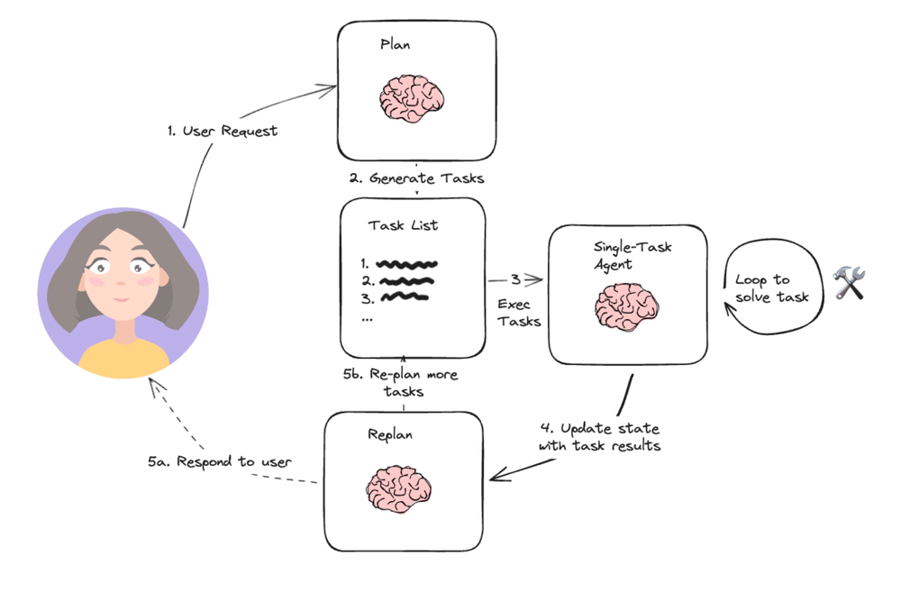
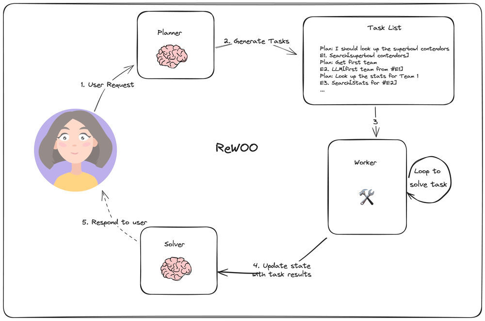
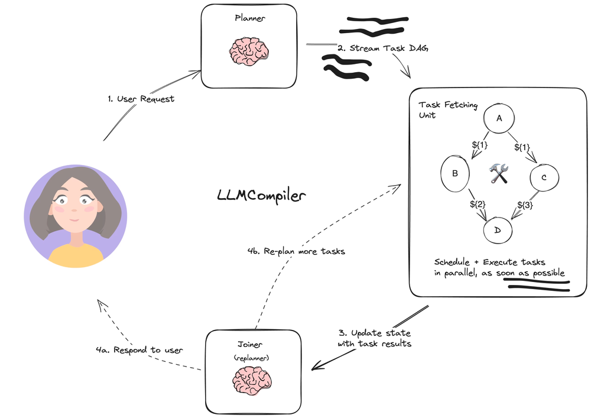

# 规划智能体（Planning Agents）

## 1 简介

在过去的一年里，由语言模型驱动的代理和状态机已经成为一种具有良好前景的设计模式，从本质上讲，智能体将LLM作为通用问题解决者，将它们与外部资源连接起来以回答问题或完成任务。 LLM 代理具有以下一般性步骤：

**1.规划动作：** LLM 生成文本以直接响应用户或传递给函数。 
**2.执行操作：** 您的代码调用其他软件来执行查询数据库或调用 API 等操作。 
**3.观察：** 通过调用另一个函数或响应用户来响应工具调用的响应。 以广泛应用的React代理原型为例，遵循'思考-行为-观察'的循环模式对LLM进行提示：

```python
Thought: I should call Search() to see the current score of the game.
Act: Search("What is the current score of game X?")
Observation: The current score is 24-21
... (repeat N times)
```

React框架和思维链技术的运用在简单任务中表现优异，但存在以下主要缺点：

1. 每一次的工具调用都需要进行一次 LLM 调用。
2. LLM 只计划当前子任务，这可能会导致局部最优解的出现，从而影响全局推理能力。


每一次的工具调用都需要进行一次 LLM 调用。

LLM 只计划当前子任务，这可能会导致局部最优解的出现，从而影响全局推理能力。

本节介绍三种（①Plan-and-execute②Rewoo③LLM-Compiler）基于LangGraph的代理架构，以示例“Plan-and-execute”风格的代理设计。三种策略从整体架构上可以总结为三个部分：

**规划者（Planner） ：** Plan-and-execute、Rewwo、LLM-compiler中的规划者（Planner）主要负责将用户的总体任务分解为子任务（列出子任务列表），根据策略不同会产生不同结构的子任务列表与执行者（executor）进行交互。例如，在Rewoo中需要的到带有任务标注（E1........En）和传入参数的结构化子任务列表等。这一部分三种策略均需要大语言模型的支持。

**执行者（executer）：** Plan-and-execute中的single-task Agent、Rewoo中的worker、LLM-Compiler中的Task fetching 单元，均属于执行者职责。主要负责接收规划者输出的子任务列表并进行逐一解决。具体的，Plan-and-execute中的执行者需要大语言模型参与解决子问题；Rewoo中的Worker不需要调用（或只需要轻量级语言模型）LLM进行问题解决；LLM-Compiler中的Task fetching单元利用stream流的格式依据所形成的DAG实现子任务并行。

**解决者（Solver）：** Plan-and-execute中的Replan、Rewoo中的Solver、LLM-Compiler中的Joiner 均可归类为解决者，主要负责接收执行者的任务列表执行结果或更新后状态，比对用户初始问题确定最终用户回答或者任务未解决的重新规划（返回执行者步骤）。该部分涉及验证职责，三种方法中均需要LLM调用比对最终结果。

文中三种架构，对比传统思维链和React方法，具有以下优点:

1. **更快的执行速度：** 每次操作或工具调用不需要额外的LLM调用（或仅在子任务层面调用轻量级LLM），从而更快执行多步骤工作流。
2. **成本节省：** 在子任务执行中仅调用特定于域的轻量级模型调用（或者不调用），以此减少LLM模型调用成本。
3. **整体推理：** 在计划步骤中强调Planner对整体任务步骤进行整体规划和思考，生成整体任务列表避免局部最优解出现。


## 2 Plan-and-execute



相对简单的规划代理架构（基于)，它由三个基本组件组成：

**1.规划器(planning)**，它提示 LLM 生成一个多步骤计划来完成一项大型任务。
        
**2.执行器(executer)** ，接受用户查询和计划中的步骤，并调用 1 个或多个工具来完成该任务。
        
**3.再规划(Re-plan)** ，一轮多步骤计划执行完成后，将再次调用代理，并发出重新规划提示，让它决定是以执行结果响应结束还是生成后续计划（如果第一轮计划没有达到预期效果）。

参考论文：[Plan-and-Solve Prompting](https://arxiv.org/abs/2305.04091?ref=blog.langchain.dev)

```
!pip install --quiet -U langchain langchain_openai tavily-python

```

```python
# 安装设置LLM和搜索工具的API（本实例设置的两个工具）
import os
import getpass

os.environ["OPENAI_API_KEY"] = getpass.getpass("OpenAI API Key:")
os.environ["TAVILY_API_KEY"] = getpass.getpass("Tavily API Key:")
os.environ["LANGCHAIN_TRACING_V2"] = "true"
os.environ["LANGCHAIN_API_KEY"] = getpass.getpass("LangSmith API Key:")
os.environ["LANGCHAIN_PROJECT"] = "Plan-and-execute"

```

```python
# 定义需要使用的工具，此示例中定义搜索工具为例。
from langchain_community.tools.tavily_search import TavilySearchResults

tools = [TavilySearchResults(max_results=3)]

```

```python
# 定义用于执行子任务的执行器
from langchain import hub
from langchain.agents import create_openai_functions_agent
from langchain_openai import ChatOpenAI

# 根据任务需求定义提示语
prompt = hub.pull("hwchase17/openai-functions-agent")
# 定义所使用的LLM
llm = ChatOpenAI(model="gpt-4-turbo-preview")
# 构建runnable代理
agent_runnable = create_openai_functions_agent(llm, tools, prompt)

```

```python
from langgraph.prebuilt import create_agent_executor
agent_executor = create_agent_executor(agent_runnable, tools)
# 调用执行器进行测试
agent_executor.invoke(
    {"input": "who is the winnner of the us open", "chat_history": []}
)

```

```python
# 定义状态,首先，我们需要跟踪当前的计划,将其表示为一个字符串列表。接下来，跟踪先前执行的步骤。将其表示为一个元组列表（这些元组将包含步骤，然后是结果）。最后用状态来表示最终的响应以及原始输入。
from langchain_core.pydantic_v1 import BaseModel, Field
from typing import List, Tuple, Annotated, TypedDict
import operator


class PlanExecute(TypedDict):
    input: str
    plan: List[str]
    past_steps: Annotated[List[Tuple], operator.add]
    response: str

```

```python
# 规划器部分：利用function calling功能创建计划
from langchain_core.pydantic_v1 import BaseModel


class Plan(BaseModel):
    """Plan to follow in future"""

    steps: List[str] = Field(
        description="different steps to follow, should be in sorted order"
    )

```

```python
from langchain.chains.openai_functions import create_structured_output_runnable
from langchain_core.prompts import ChatPromptTemplate

planner_prompt = ChatPromptTemplate.from_template(
    """For the given objective, come up with a simple step by step plan. \
This plan should involve individual tasks, that if executed correctly will yield the correct answer. Do not add any superfluous steps. \
The result of the final step should be the final answer. Make sure that each step has all the information needed - do not skip steps.

{objective}"""
)
planner = create_structured_output_runnable(
    Plan, ChatOpenAI(model="gpt-4-turbo-preview", temperature=0), planner_prompt
)

# 测试规划器调用
planner.invoke(
    {"objective": "what is the hometown of the current Australia open winner?"}
)

```

```python
# 再规划步骤：基于先前规划步骤执行结果进行再规划
from langchain.chains.openai_functions import create_openai_fn_runnable


class Response(BaseModel):
    """Response to user."""

    response: str


replanner_prompt = ChatPromptTemplate.from_template(
    """For the given objective, come up with a simple step by step plan. \
This plan should involve individual tasks, that if executed correctly will yield the correct answer. Do not add any superfluous steps. \
The result of the final step should be the final answer. Make sure that each step has all the information needed - do not skip steps.

Your objective was this:
{input}

Your original plan was this:
{plan}

You have currently done the follow steps:
{past_steps}

Update your plan accordingly. If no more steps are needed and you can return to the user, then respond with that. Otherwise, fill out the plan. Only add steps to the plan that still NEED to be done. Do not return previously done steps as part of the plan."""
)


replanner = create_openai_fn_runnable(
    [Plan, Response],
    ChatOpenAI(model="gpt-4-turbo-preview", temperature=0),
    replanner_prompt,
)

```

```python
# 图的创建
async def execute_step(state: PlanExecute):
    task = state["plan"][0]
    agent_response = await agent_executor.ainvoke({"input": task, "chat_history": []})
    return {
        "past_steps": (task, agent_response["agent_outcome"].return_values["output"])
    }


async def plan_step(state: PlanExecute):
    plan = await planner.ainvoke({"objective": state["input"]})
    return {"plan": plan.steps}


async def replan_step(state: PlanExecute):
    output = await replanner.ainvoke(state)
    if isinstance(output, Response):
        return {"response": output.response}
    else:
        return {"plan": output.steps}


def should_end(state: PlanExecute):
    if state["response"]:
        return True
    else:
        return False

```

```python
from langgraph.graph import StateGraph, END

workflow = StateGraph(PlanExecute)

# 添加规划节点
workflow.add_node("planner", plan_step)

# 添加执行节点
workflow.add_node("agent", execute_step)

# 添加再规划节点
workflow.add_node("replan", replan_step)

workflow.set_entry_point("planner")

# 连接规划和执行节点
workflow.add_edge("planner", "agent")

# 连接执行和再规划节点
workflow.add_edge("agent", "replan")

workflow.add_conditional_edges(
    "replan",
    should_end,
    {
        True: END,
        False: "agent",
    },
)

app = workflow.compile()

```

```python
from langchain_core.messages import HumanMessage

config = {"recursion_limit": 50}
inputs = {"input": "what is the hometown of the 2024 Australia open winner?"}
async for event in app.astream(inputs, config=config):
    for k, v in event.items():
        if k != "__end__":
            print(v)

```

## 3 ReWOO



总体架构与4.2Plan-and-execute类似，依然是**规划器（Planner）、执行器(worker)、再规划(solver)**三个部分组成（文章中称呼不同但职责相似）。通过允许在规划器的输出中进行变量分配来实现子任务执行不需要频繁调用LLM。在具体执行中，规划器对人物进行分解并依据格式化方式列出任务清单，格式如下（此为示例，可根据任务情况自定义格式）：

> Plan: I need to know the teams playing in the superbowl this year E1: Search[Who is competing in the superbowl?] Plan: I need to know the quarterbacks for each team E2: LLM[Quarterback for the first team of #E1] Plan: I need to know the quarterbacks for each team E3: LLM[Quarter back for the second team of #E1] Plan: I need to look up stats for the first quarterback E4: Search[Stats for #E2] Plan: I need to look up stats for the second quarterback E5: Search[Stats for #E3]

规划器步骤中使用#E2这样的语法引用之前的输出。以此实现顺序执行任务列表，而不必每次重新计划（重新调用LLM）。

执行器（worker）循环执行每个任务，并将任务输出分配给相应的变量。在调用后续调用时，将变量替换为其结果。

最后，solver将所有这些输出集成到最终答案中。

值得注意的是，图中在planner和solver部分标注了🧠的标识，worker部分没有标注，用于强调子任务执行中不需要额外的LLM调用。

这种代理设计可能比简单的计划和执行代理更有效，因为每个任务只能有所需的上下文（其输入和变量值）。
        
[参考论文：ReWOO](https://arxiv.org/abs/2305.18323?ref=blog.langchain.dev)

```
# %pip install -U langgraph langchain_community langchain_openai tavily-python

```

```python
import os
import getpass


def _set_if_undefined(var: str):
    if not os.environ.get(var):
        os.environ[var] = getpass.getpass(f"{var}=")


os.environ["LANGCHAIN_TRACING_V2"] = "true"
os.environ["LANGCHAIN_PROJECT"] = "ReWOO"
_set_if_undefined("TAVILY_API_KEY")
_set_if_undefined("LANGCHAIN_API_KEY")
_set_if_undefined("OPENAI_API_KEY")

```

```python
# 定义包含任务、计划、步骤和相关变量的图状态
from typing import TypedDict, List


class ReWOO(TypedDict):
    task: str
    plan_string: str
    steps: List
    results: dict
    result: str

```

规划器部分（Planner）如上文所说，在规划步骤需要对整体任务（Task）进行规划分解并形成规定格式化输出，输出结果正确与否对任务的执行结果有决定性作用，因此在Rewoo结构中，如何在规划步骤形成理想的结构化任务清单是关键，对规划步骤所使用的LLM的能力提出更高要求。

```python
# 示例中定义两个工具：搜索功能和大语言模型推理功能（定义在工具中的语言模型不会涉及太多推理步骤，可以选择轻量级的模型以节约成本）
from langchain_openai import ChatOpenAI

model = ChatOpenAI(temperature=0)

```

```python
prompt = """For the following task, make plans that can solve the problem step by step. For each plan, indicate \
which external tool together with tool input to retrieve evidence. You can store the evidence into a \
variable #E that can be called by later tools. (Plan, #E1, Plan, #E2, Plan, ...)

Tools can be one of the following:
(1) Google[input]: Worker that searches results from Google. Useful when you need to find short
and succinct answers about a specific topic. The input should be a search query.
(2) LLM[input]: A pretrained LLM like yourself. Useful when you need to act with general
world knowledge and common sense. Prioritize it when you are confident in solving the problem
yourself. Input can be any instruction.

For example,
Task: Thomas, Toby, and Rebecca worked a total of 157 hours in one week. Thomas worked x
hours. Toby worked 10 hours less than twice what Thomas worked, and Rebecca worked 8 hours
less than Toby. How many hours did Rebecca work?
Plan: Given Thomas worked x hours, translate the problem into algebraic expressions and solve
with Wolfram Alpha. #E1 = WolframAlpha[Solve x + (2x − 10) + ((2x − 10) − 8) = 157]
Plan: Find out the number of hours Thomas worked. #E2 = LLM[What is x, given #E1]
Plan: Calculate the number of hours Rebecca worked. #E3 = Calculator[(2 ∗ #E2 − 10) − 8]

Begin! 
Describe your plans with rich details. Each Plan should be followed by only one #E.

Task: {task}"""

```

```python
task = "what is the hometown of the 2024 australian open winner"
result = model.invoke(prompt.format(task=task))
print(result.content)

```

建立 get_plan 节点接受状态并更新后返回到 steps 和 plan_string

```python
import re
from langchain_core.prompts import ChatPromptTemplate

# 匹配格式化表达式 E#... = ...[...]
regex_pattern = r"Plan:\s*(.+)\s*(#E\d+)\s*=\s*(\w+)\s*\[([^\]]+)\]"
prompt_template = ChatPromptTemplate.from_messages([("user", prompt)])
planner = prompt_template | model


def get_plan(state: ReWOO):
    task = state["task"]
    result = planner.invoke({"task": task})
    # Find all matches in the sample text
    matches = re.findall(regex_pattern, result.content)
    return {"steps": matches, "plan_string": result.content}

```

**执行器（worker）：** 接收计划并顺序执行子任务

```python
from langchain_community.tools.tavily_search import TavilySearchResults

search = TavilySearchResults()
def _get_current_task(state: ReWOO):
    if state["results"] is None:
        return 1
    if len(state["results"]) == len(state["steps"]):
        return None
    else:
        return len(state["results"]) + 1


def tool_execution(state: ReWOO):
    """Worker node that executes the tools of a given plan."""
    _step = _get_current_task(state)
    _, step_name, tool, tool_input = state["steps"][_step - 1]
    _results = state["results"] or {}
    for k, v in _results.items():
        tool_input = tool_input.replace(k, v)
    if tool == "Google":
        result = search.invoke(tool_input)
    elif tool == "LLM":
        result = model.invoke(tool_input)
    else:
        raise ValueError
    _results[step_name] = str(result)
    return {"results": _results}

```

```python
# solver接收整体任务计划和worker中工具调用过程的流程结果
solve_prompt = """Solve the following task or problem. To solve the problem, we have made step-by-step Plan and \
retrieved corresponding Evidence to each Plan. Use them with caution since long evidence might \
contain irrelevant information.

{plan}

Now solve the question or task according to provided Evidence above. Respond with the answer
directly with no extra words.

Task: {task}
Response:"""

def solve(state: ReWOO):
    plan = ""
    for _plan, step_name, tool, tool_input in state["steps"]:
        _results = state["results"] or {}
        for k, v in _results.items():
            tool_input = tool_input.replace(k, v)
            step_name = step_name.replace(k, v)
        plan += f"Plan: {_plan}\n{step_name} = {tool}[{tool_input}]"
    prompt = solve_prompt.format(plan=plan, task=state["task"])
    result = model.invoke(prompt)
    return {"result": result.content}

```

```python
# 任务完成的确认
def _route(state):
    _step = _get_current_task(state)
    if _step is None:
        # 确定所有子任务执行
        return "solve"
    else:
        # 任务未执行完成返回工具
        return "tool"

```

```python
# 图的定义
from langgraph.graph import StateGraph, END

graph = StateGraph(ReWOO)
graph.add_node("plan", get_plan)
graph.add_node("tool", tool_execution)
graph.add_node("solve", solve)
graph.add_edge("plan", "tool")
graph.add_edge("solve", END)
graph.add_conditional_edges("tool", _route)
graph.set_entry_point("plan")

app = graph.compile()

for s in app.stream({"task": task}):
    print(s)
    print("---")
    
# 输出最终结果
print(s[END]["result"])

```

Rewoo通过一次性创建格式化任务列表，以实现在执行阶段不进行LLM调用（或仅调用轻量级模型）然而，它仍然依赖于顺序任务执行，并挖掘并行潜力。

## 4 LLMCompiler



LLM-Compiler是一种旨在进一步提高任务执行速度的代理架构。相对于上文中的Plan-and-execute和Rewoo架构，LLM-Compiler进一步挖掘并行潜力，在任务执行阶段通过DAG完成子任务并行。

主要包括以下三个部分：

**1.计划器：**流式传输任务DAG。每个任务都包含一个工具、参数和依赖项列表。 **2.任务提取单元:**接收任务流，一旦任务的依赖性得到满足，该单元就会执行任务。由于许多工具都涉及对搜索引擎或LLM的其他调用，因此额外的并行性可以显著提高速度（论文中的数据是3.6倍）。 **3.Joiner:**基于图的状态（包括任务执行结果）动态地重新规划或完成（LLM调用步骤），它决定是否确定为最终答案进行响应，或者是否将进度传递回（重新）规划代理以从新规划。
        
参考论文：[An LLM Compiler for Parallel Function Calling](https://arxiv.org/abs/2312.04511?ref=blog.langchain.dev)

安装依赖项

```
# %pip install -U --quiet langchain_openai langsmith langgraph langchain numexpr

```

```python
import os
import getpass


def _get_pass(var: str):
    if var not in os.environ:
        os.environ[var] = getpass.getpass(f"{var}: ")

os.environ["LANGCHAIN_TRACING_V2"] = "True"
os.environ["LANGCHAIN_PROJECT"] = "LLMCompiler"
_get_pass("LANGCHAIN_API_KEY")
_get_pass("OPENAI_API_KEY")

```

定义智能体使用的工具，示例中定义了搜索和计算两种工具。

```python
from langchain_openai import ChatOpenAI
from langchain_community.tools.tavily_search import TavilySearchResults

# 导入
from math_tools import get_math_tool

_get_pass("TAVILY_API_KEY")

calculate = get_math_tool(ChatOpenAI(model="gpt-4-turbo-preview"))
search = TavilySearchResults(
    max_results=1,
    description='tavily_search_results_json(query="the search query") - a search engine.',
)

tools = [search, calculate]

# 调用工具测试
calculate.invoke(
    {
        "problem": "What's the temp of sf + 5?",
        "context": ["Thet empreature of sf is 32 degrees"],
    }
)

```

规划器：接收问题并生成任务列表，如果接收到的是重新规划的问题会进行提示重新规划任务。

```python
from typing import Sequence

from langchain_core.language_models import BaseChatModel
from langchain_core.prompts import ChatPromptTemplate
from langchain_core.runnables import RunnableBranch
from langchain_core.tools import BaseTool
from langchain_core.messages import (
    BaseMessage,
    FunctionMessage,
    HumanMessage,
    SystemMessage,
)

from output_parser import LLMCompilerPlanParser, Task
from langchain import hub
from langchain_openai import ChatOpenAI


prompt = hub.pull("wfh/llm-compiler")
print(prompt.pretty_print())

```

```python
def create_planner(
    llm: BaseChatModel, tools: Sequence[BaseTool], base_prompt: ChatPromptTemplate
):
    tool_descriptions = "\n".join(
        f"{i}. {tool.description}\n" for i, tool in enumerate(tools)
    )
    planner_prompt = base_prompt.partial(
        replan="",
        num_tools=len(tools),
        tool_descriptions=tool_descriptions,
    )
    replanner_prompt = base_prompt.partial(
        replan=' - You are given "Previous Plan" which is the plan that the previous agent created along with the execution results '
        "(given as Observation) of each plan and a general thought (given as Thought) about the executed results."
        'You MUST use these information to create the next plan under "Current Plan".\n'
        ' - When starting the Current Plan, you should start with "Thought" that outlines the strategy for the next plan.\n'
        " - In the Current Plan, you should NEVER repeat the actions that are already executed in the Previous Plan.\n"
        " - You must continue the task index from the end of the previous one. Do not repeat task indices.",
        num_tools=len(tools),
        tool_descriptions=tool_descriptions,
    )

    def should_replan(state: list):
        # 以系统信息（SystemMessage）为背景
        return isinstance(state[-1], SystemMessage)

    def wrap_messages(state: list):
        return {"messages": state}

    def wrap_and_get_last_index(state: list):
        next_task = 0
        for message in state[::-1]:
            if isinstance(message, FunctionMessage):
                next_task = message.additional_kwargs["idx"] + 1
                break
        state[-1].content = state[-1].content + f" - Begin counting at : {next_task}"
        return {"messages": state}

    return (
        RunnableBranch(
            (should_replan, wrap_and_get_last_index | replanner_prompt),
            wrap_messages | planner_prompt,
        )
        | llm
        | LLMCompilerPlanParser(tools=tools)
    )

```

```python
llm = ChatOpenAI(model="gpt-4-turbo-preview")
planner = create_planner(llm, tools, prompt)

# 调用规划器测试
example_question = "What's the temperature in SF raised to the 3rd power?"

for task in planner.stream([HumanMessage(content=example_question)]):
    print(task["tool"], task["args"])
    print("---")

```

任务抓取单元：安排执行任务，接收以下格式的工作流：

```
{
    tool: BaseTool,
    dependencies: number[],
}

```

通过多线程实现当工具满足时立刻执行子任务，将任务抓取单元和执行器结合

```python
from typing import Any, Union, Iterable, List, Tuple, Dict
from typing_extensions import TypedDict

from langchain_core.runnables import (
    chain as as_runnable,
)

from concurrent.futures import ThreadPoolExecutor, wait
import time


def _get_observations(messages: List[BaseMessage]) -> Dict[int, Any]:
    # 收集前序工具执行结果
    results = {}
    for message in messages[::-1]:
        if isinstance(message, FunctionMessage):
            results[int(message.additional_kwargs["idx"])] = message.content
    return results


class SchedulerInput(TypedDict):
    messages: List[BaseMessage]
    tasks: Iterable[Task]


def _execute_task(task, observations, config):
    tool_to_use = task["tool"]
    if isinstance(tool_to_use, str):
        return tool_to_use
    args = task["args"]
    try:
        if isinstance(args, str):
            resolved_args = _resolve_arg(args, observations)
        elif isinstance(args, dict):
            resolved_args = {
                key: _resolve_arg(val, observations) for key, val in args.items()
            }
        else:
            resolved_args = args
    except Exception as e:
        return (
            f"ERROR(Failed to call {tool_to_use.name} with args {args}.)"
            f" Args could not be resolved. Error: {repr(e)}"
        )
    try:
        return tool_to_use.invoke(resolved_args, config)
    except Exception as e:
        return (
            f"ERROR(Failed to call {tool_to_use.name} with args {args}."
            + f" Args resolved to {resolved_args}. Error: {repr(e)})"
        )


def _resolve_arg(arg: Union[str, Any], observations: Dict[int, Any]):
    if isinstance(arg, str) and arg.startswith("$"):
        try:
            stripped = arg[1:].replace(".output", "").strip("{}")
            idx = int(stripped)
        except Exception:
            return str(arg)
        return str(observations[idx])
    elif isinstance(arg, list):
        return [_resolve_arg(a, observations) for a in arg]
    else:
        return str(arg)


@as_runnable
def schedule_task(task_inputs, config):
    task: Task = task_inputs["task"]
    observations: Dict[int, Any] = task_inputs["observations"]
    try:
        observation = _execute_task(task, observations, config)
    except Exception:
        import traceback

        observation = traceback.format_exception()  # repr(e) +
    observations[task["idx"]] = observation


def schedule_pending_task(
    task: Task, observations: Dict[int, Any], retry_after: float = 0.2
):
    while True:
        deps = task["dependencies"]
        if deps and (any([dep not in observations for dep in deps])):
            # 未满足执行需求
            time.sleep(retry_after)
            continue
        schedule_task.invoke({"task": task, "observations": observations})
        break


@as_runnable
def schedule_tasks(scheduler_input: SchedulerInput) -> List[FunctionMessage]:
    """Group the tasks into a DAG schedule."""
    # 对streaming进行了简化设定:
    # 1.LLM不创建循环依赖
    # 2.LLM不进行未来依赖任务的创建
    # 可以根据应用需求自行调整其他数据结构
    tasks = scheduler_input["tasks"]
    messages = scheduler_input["messages"]
    # 基于之前计划进行重新规划
     observations = _get_observations(messages)
    task_names = {}
    originals = set(observations)
    futures = []
    retry_after = 0.25  
    with ThreadPoolExecutor() as executor:
        for task in tasks:
            deps = task["dependencies"]
            task_names[task["idx"]] = (
                task["tool"] if isinstance(task["tool"], str) else task["tool"].name
            )
            if (
                # 基于其他任务
                deps
                and (any([dep not in observations for dep in deps]))
            ):
                futures.append(
                    executor.submit(
                        schedule_pending_task, task, observations, retry_after
                    )
                )
            else:
                schedule_task.invoke(dict(task=task, observations=observations))

        # 所有任务已完成排序等待完成
        wait(futures)
    # 观察信息转化为工具状态信息
    new_observations = {
        k: (task_names[k], observations[k])
        for k in sorted(observations.keys() - originals)
    }
    tool_messages = [
        FunctionMessage(name=name, content=str(obs), additional_kwargs={"idx": k})
        for k, (name, obs) in new_observations.items()
    ]
    return tool_messages

```

```python
import itertools


@as_runnable
def plan_and_schedule(messages: List[BaseMessage], config):
    tasks = planner.stream(messages, config)
    tasks = itertools.chain([next(tasks)], tasks)
    scheduled_tasks = schedule_tasks.invoke(
        {
            "messages": messages,
            "tasks": tasks,
        },
        config,
    )
    return scheduled_tasks

```

**joiner:** 该组件根据计划和初始执行结果确定，利用function calling提升调用可靠性：

1.将执行结果为正确答案进行回复

2.循环调用规划器重新形成计划

```python
from langchain_core.pydantic_v1 import BaseModel, Field
from langchain.chains.openai_functions import create_structured_output_runnable
from langchain_core.messages import AIMessage


class FinalResponse(BaseModel):
    """The final response/answer."""

    response: str


class Replan(BaseModel):
    feedback: str = Field(
        description="Analysis of the previous attempts and recommendations on what needs to be fixed."
    )


class JoinOutputs(BaseModel):
    """Decide whether to replan or whether you can return the final response."""

    thought: str = Field(
        description="The chain of thought reasoning for the selected action"
    )
    action: Union[FinalResponse, Replan]


joiner_prompt = hub.pull("wfh/llm-compiler-joiner").partial(
    examples=""
)  # 可自选加入示例
llm = ChatOpenAI(model="gpt-4-turbo-preview")

runnable = create_structured_output_runnable(JoinOutputs, llm, joiner_prompt)

```

当需要进行重新规划时，从状态中选取最新的信息形成所需输入。

```python
def _parse_joiner_output(decision: JoinOutputs) -> List[BaseMessage]:
    response = [AIMessage(content=f"Thought: {decision.thought}")]
    if isinstance(decision.action, Replan):
        return response + [
            SystemMessage(
                content=f"Context from last attempt: {decision.action.feedback}"
            )
        ]
    else:
        return response + [AIMessage(content=decision.action.response)]


def select_recent_messages(messages: list) -> dict:
    selected = []
    for msg in messages[::-1]:
        selected.append(msg)
        if isinstance(msg, HumanMessage):
            break
    return {"messages": selected[::-1]}


joiner = select_recent_messages | runnable | _parse_joiner_output

```

定义状态图，其中节点包括：

**1、计划和执行步骤** 

**2、joiner：** 决定提交任务还是重新计划 

**3、再文本化：** 根据joiner的输出更新状态


```python
from langgraph.graph import MessageGraph, END
from typing import Dict

graph_builder = MessageGraph()

# 为节点分配状态变量进行更新
graph_builder.add_node("plan_and_schedule", plan_and_schedule)
graph_builder.add_node("join", joiner)


## 定义边
graph_builder.add_edge("plan_and_schedule", "join")

### 定义逻辑循环条件


def should_continue(state: List[BaseMessage]):
    if isinstance(state[-1], AIMessage):
        return END
    return "plan_and_schedule"


graph_builder.add_conditional_edges(
    start_key="join",
    # 传入函数决定下一节点
    condition=should_continue,
)
graph_builder.set_entry_point("plan_and_schedule")
chain = graph_builder.compile()

```

```python
# 提出问题进行测试
for step in chain.stream([HumanMessage(content="What's the GDP of New York?")]):
    print(step)
    print("---")

```

