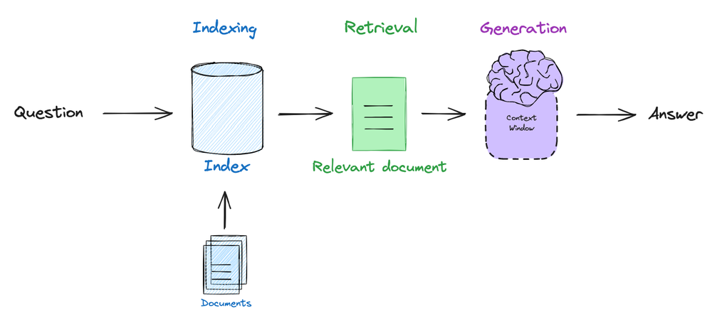
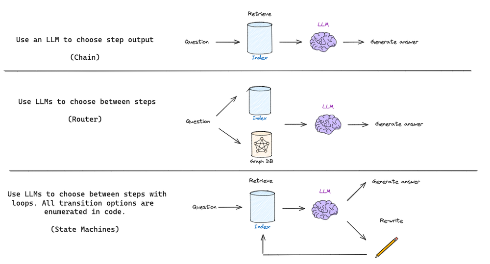
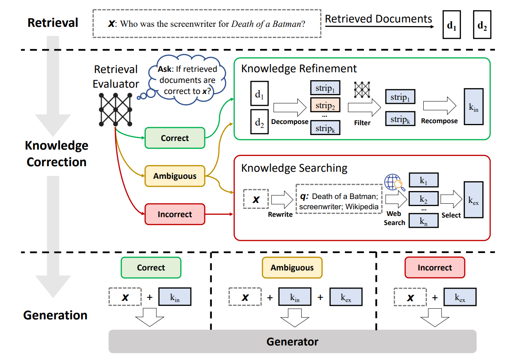
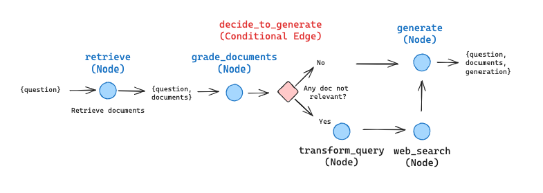
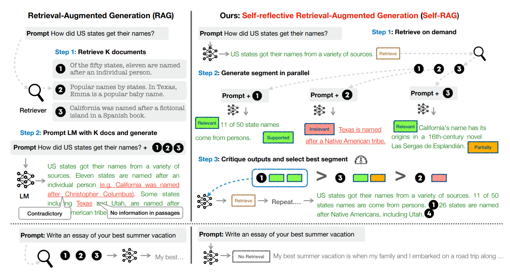
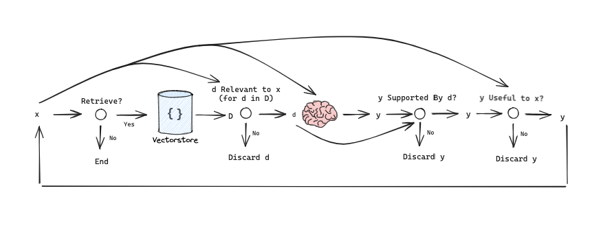
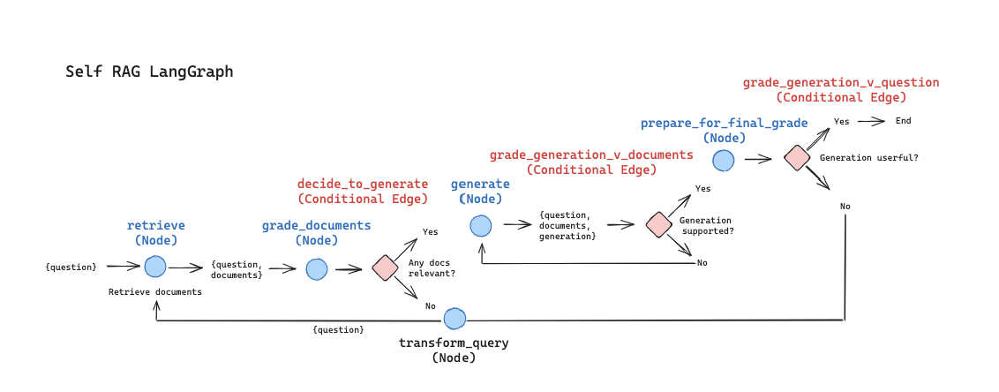

# 检索增强智能体（RAG Agents）

## 1 简介

大型语言模型（LLMs）的出现展示了强大的能力，但也面临着幻觉、知识过时、不透明和推理过程无法追踪等问题。检索增强生成（RAG）通过使用来自外部数据库的知识，将外部数据检索无缝集成到生成过程中。这种增强使模型能够提供不仅准确而且与上下文相关的响应，使RAG成为解决这些问题的一个有前途的解决方案。具体而言，RAG相对于普通生成新增了一个初始检索步骤，LLMs在回答问题或生成文本之前，向外部数据源查询相关信息；这一过程不仅为后续生成阶段提供信息，还确保响应以检索到的内容为基础，大大提高了输出的准确性和相关性。

RAG的基础流程为：

1. 嵌入用户查询与相关文档；
2. 根据问题以相似度为标准检索相关文档；
3. 将文档传递给LLM，以生成基于检索到的上下文的答案。




### 1.1 使用LangGraph构建RAG的优势

在使用LangChain构造一个基本的RAG流程（如上所示）时，仅仅只需定义一个链(Chain)，就可以完成LLM根据检索到的文档确定生成内容的过程。随着RAG技术的发展，RAG本身的流程也日渐复杂，越来越多的独立模块与逻辑分支判断被提出，以满足不同的下游任务需求。例如，当需要使用路由去判断是否应该使用RAG，以及应该使用哪一个RAG检索器时，仅仅定义链已经无法满足任务需要，而往往需要定义一个智能体(Agent)以进行逻辑判断；而当RAG流程进一步复杂，包括了循环、重写、重排序等步骤时，仍然自定义智能体与链已近乎不可能，而使用LangGraph将流表示为图形，实现各种类型的循环和决策无疑能极大的简化这些操作：



当人们创建更复杂的LLMs应用程序时，例如将循环引入运行时，这些循环通常使用LLMs来推理循环中下一步要做什么。LLMs的一个重要提升是能够将它们用于这些推理任务。这本质上可以被认为是在for循环中运行LLMs。这些类型的系统通常称为智能体。在典型的RAG应用程序中，会调用检索器来返回一些文档。然后这些文档被传递到LLMs以生成最终答案。虽然这通常很有效，但在第一个检索步骤无法返回任何有用结果的情况下，它就会崩溃。在这种情况下，如果LLMs可以推断检索器返回的结果很差，并且可能向检索器发出第二个（更精确的）查询，并使用这些结果，那么通常是理想的。本质上，在循环中运行 LLM 有助于创建更灵活的应用程序，从而可以完成可能未预定义的更模糊的用例。

后续使用三个案例演示使用LangGraph构建复杂RAG框架的必要性与便捷性。

## 2 Agentic RAG

Agentic RAG的主要目的在于判断特定问题是否需要RAG检索。如果需要使用外部知识，则进行检索辅助生成；否则直接进入生成环节。

### 2.1 Agentic RAG的LangGraph实现

1. 首先做好准备工作，本次的外部知识均从urls列表中获取，使用ChromaDB将三篇文章嵌入到向量库中：

```python
from langchain.text_splitter import RecursiveCharacterTextSplitter
from langchain_community.document_loaders import WebBaseLoader
from langchain_community.vectorstores import Chroma
from langchain_openai import OpenAIEmbeddings

import os
os.environ['OPENAI_API_KEY'] = 'sk-xxxxxx'
os.environ['TAVILY_API_KEY'] = 'tvly-xxxx'

urls = [
    "https://lilianweng.github.io/posts/2023-06-23-agent/",
    "https://lilianweng.github.io/posts/2023-03-15-prompt-engineering/",
    "https://lilianweng.github.io/posts/2023-10-25-adv-attack-llm/",
]

docs = [WebBaseLoader(url).load() for url in urls]
docs_list = [item for sublist in docs for item in sublist]

text_splitter = RecursiveCharacterTextSplitter.from_tiktoken_encoder(
    chunk_size=100, chunk_overlap=50
)
doc_splits = text_splitter.split_documents(docs_list)

# 加入到向量数据库中
vectorstore = Chroma.from_documents(
    documents=doc_splits,
    collection_name="rag-chroma",
    embedding=OpenAIEmbeddings(),
)
retriever = vectorstore.as_retriever()
```

2. 设置检索器，将其包装为LangChain中的工具(tool)，用于以特定的相似度算法根据问题从外部知识库中检索相关文档：

```python
from langchain.tools.retriever import create_retriever_tool

tool = create_retriever_tool(
    retriever,
    "retrieve_blog_posts",
    "Search and return information about Lilian Weng blog posts on LLM agents, prompt engineering, and adversarial attacks on LLMs.",
)

tools = [tool]

from langgraph.prebuilt import ToolExecutor

tool_executor = ToolExecutor(tools)
```

3. 定义智能体状态，用于在不同的节点与边中传递状态信息：

```python
import operator
from typing import Annotated, Sequence, TypedDict

from langchain_core.messages import BaseMessage

class AgentState(TypedDict):
    messages: Annotated[Sequence[BaseMessage], operator.add]
```

4. 根据LangGraph的规则为流程添加节点和边，其中每个节点包含了对状态信息的改变，即RAG的子步骤，而条件边则用于判断下一步应转向哪一个节点；

RAG逻辑如图：


```python
import json
import operator
from typing import Annotated, Sequence, TypedDict

from langchain import hub
from langchain.output_parsers import PydanticOutputParser
from langchain.prompts import PromptTemplate
from langchain.tools.render import format_tool_to_openai_function
from langchain_core.utils.function_calling import convert_to_openai_tool
from langchain_core.messages import BaseMessage, FunctionMessage
from langchain.output_parsers.openai_tools import PydanticToolsParser
from langchain_core.pydantic_v1 import BaseModel, Field
from langchain_openai import ChatOpenAI
from langgraph.prebuilt import ToolInvocation
from langchain_core.output_parsers import StrOutputParser

### 定义边，边规定了状态的流向，一般都有分支返回，根据不同的情况有不同的返回结果

# 定义是否应该使用RAG
def should_retrieve(state):
    """
    Decides whether the agent should retrieve more information or end the process.

    This function checks the last message in the state for a function call. If a function call is
    present, the process continues to retrieve information. Otherwise, it ends the process.

    Args:
        state (messages): The current state

    Returns:
        str: A decision to either "continue" the retrieval process or "end" it
    """
    
    print("---DECIDE TO RETRIEVE---")
    messages = state["messages"]
    last_message = messages[-1]
    
    # 如果没有函数调用，意味着不需要进行RAG，进入结束流程
    if "function_call" not in last_message.additional_kwargs:
        print("---DECISION: DO NOT RETRIEVE / DONE---")
        return "end"
    # 否则有函数调用，意味着需要RAG，进入继续步骤
    else:
        print("---DECISION: RETRIEVE---")
        return "continue"

# 对检索到的内容打分，评价是否与问题相关
def grade_documents(state):
    """
    Determines whether the retrieved documents are relevant to the question.

    Args:
        state (messages): The current state

    Returns:
        str: A decision for whether the documents are relevant or not
    """

    print("---CHECK RELEVANCE---")

    # 评分模型，仅需判断“是”或“否”相关，不需给出详细的分数
    class grade(BaseModel):
        """Binary score for relevance check."""

        binary_score: str = Field(description="Relevance score 'yes' or 'no'")

    # 模型这里使用GPT-3.5
    model = ChatOpenAI(temperature=0, model="gpt-3.5-turbo", streaming=True)

    # 将评分过程包装为工具
    grade_tool_oai = convert_to_openai_tool(grade)
    llm_with_tool = model.bind(
        tools=[convert_to_openai_tool(grade_tool_oai)],
        tool_choice={"type": "function", "function": {"name": "grade"}},
    )
    parser_tool = PydanticToolsParser(tools=[grade])

    # 设置prompt，向模型解释工作内容，工作内容是根据问题与检索到的文档评价是否相关
    prompt = PromptTemplate(
        template="""You are a grader assessing relevance of a retrieved document to a user question. \n 
        Here is the retrieved document: \n\n {context} \n\n
        Here is the user question: {question} \n
        If the document contains keyword(s) or semantic meaning related to the user question, grade it as relevant. \n
        Give a binary score 'yes' or 'no' score to indicate whether the document is relevant to the question.""",
        input_variables=["context", "question"],
    )

    # 该步骤较为简单，使用chain足以进行
    chain = prompt | llm_with_tool | parser_tool

    messages = state["messages"]
    last_message = messages[-1]

    question = messages[0].content
    docs = last_message.content
    
    score = chain.invoke(
        {"question": question, 
        "context": docs}
    )
    
    grade = score[0].binary_score

    # 由于是判断边，故而根据结果不同走向不同的后续节点
    if grade == "yes":
        print("---DECISION: DOCS RELEVANT---")
        return "yes"

    else:
        print("---DECISION: DOCS NOT RELEVANT---")
        print(grade)
        return "no"


### 定义节点，节点内包含真正对状态的处理，即RAG的子步骤与可选步骤

# 定义智能体，此处决定是否调用检索的函数
def agent(state):
    """
    Invokes the agent model to generate a response based on the current state. Given
    the question, it will decide to retrieve using the retriever tool, or simply end.

    Args:
        state (messages): The current state

    Returns:
        dict: The updated state with the agent response apended to messages
    """
    print("---CALL AGENT---")
    messages = state["messages"]
    model = ChatOpenAI(temperature=0, streaming=True, model="gpt-3.5-turbo")
    functions = [format_tool_to_openai_function(t) for t in tools]
    model = model.bind_functions(functions)
    response = model.invoke(messages)
    # 返回值为列表，随着步骤的进行列表不断扩充
    return {"messages": [response]}

# 定义检索过程
def retrieve(state):
    """
    Uses tool to execute retrieval.

    Args:
        state (messages): The current state

    Returns:
        dict: The updated state with retrieved docs
    """
    print("---EXECUTE RETRIEVAL---")
    messages = state["messages"]
    # 根据“继续”条件，最后一条信息应是函数调用
    last_message = messages[-1]

    action = ToolInvocation(
        tool=last_message.additional_kwargs["function_call"]["name"],
        tool_input=json.loads(
            last_message.additional_kwargs["function_call"]["arguments"]
        ),
    )

    # 将函数调用封装为工具，获取到返回值 
    response = tool_executor.invoke(action)
    function_message = FunctionMessage(content=str(response), name=action.tool)

    # 将新获取到的返回值作为信息添加到信息列表中
    return {"messages": [function_message]}

# 如果检索到的内容经过判断与问题不够相关，则触发对问题的重写以进行更贴切的重新检索
def rewrite(state):
    """
    Transform the query to produce a better question.
    
    Args:
        state (messages): The current state
    
    Returns:
        dict: The updated state with re-phrased question
    """
    
    print("---TRANSFORM QUERY---")
    messages = state["messages"]
    question = messages[0].content

    msg = [HumanMessage(
        content=f""" \n 
    Look at the input and try to reason about the underlying semantic intent / meaning. \n 
    Here is the initial question:
    \n ------- \n
    {question} 
    \n ------- \n
    Formulate an improved question: """,
    )]

    # 打分过程
    model = ChatOpenAI(temperature=0, model="gpt-3.5-turbo", streaming=True)
    response = model.invoke(msg)
    return {"messages": [response]}

# 得到合适的文档后根据文档生成最终结果
def generate(state):
    """
    Generate answer

    Args:
        state (messages): The current state

    Returns:
        dict: The updated state with re-phrased question
    """
    print("---GENERATE---")
    messages = state["messages"]
    question = messages[0].content
    last_message = messages[-1]

    question = messages[0].content
    docs = last_message.content

    # Prompt
    prompt = hub.pull("rlm/rag-prompt")

    # LLM
    llm = ChatOpenAI(model_name="gpt-3.5-turbo", temperature=0, streaming=True)

    # 后处理
    def format_docs(docs):
        return "\n\n".join(doc.page_content for doc in docs)

    # Chain
    rag_chain = prompt | llm | StrOutputParser()

    # 运行
    response = rag_chain.invoke({"context": docs, "question": question})
    return {"messages": [response]}
```

5. 定义好流程的所有节点和边后，定义外层的图，将节点与边根据设计的逻辑连接起来：

```python
from langgraph.graph import END, StateGraph

# 定义一个图
workflow = StateGraph(AgentState)

# 添加之前定义的所有节点
workflow.add_node("agent", agent)  # 智能体
workflow.add_node("retrieve", retrieve)  # 检索
workflow.add_node("rewrite", rewrite)  # 重写
workflow.add_node("generate", generate)  # 生成

# 设置初始节点为智能体
workflow.set_entry_point("agent")

# 设置判断边的分支——是否应该检索
workflow.add_conditional_edges(
    "agent",
    # 定义智能体的决策线
    should_retrieve,
    {
        # Call tool node
        "continue": "retrieve",
        "end": END,
    },
)

# 设置判断边的分支——检索的内容是否相关，从而是重写问题还是进入生成
workflow.add_conditional_edges(
    "retrieve",
    # 定义智能体的决策线
    grade_documents,
    {
        "yes": "generate",
        "no": "rewrite",  
    },
)

# 设置重写与生成边
workflow.add_edge("generate", END)
workflow.add_edge("rewrite", "agent")

# 最后编译
app = workflow.compile()
```

### 2.2 Agentic RAG运行结果


```python
import pprint
from langchain_core.messages import HumanMessage

inputs = {
    "messages": [
        HumanMessage(
            content="What does Lilian Weng say about the types of agent memory?"
        )
    ]
}
for output in app.stream(inputs):
    for key, value in output.items():
        pprint.pprint(f"Output from node '{key}':")
        pprint.pprint("---")
        pprint.pprint(value, indent=2, width=80, depth=None)
    pprint.pprint("\n---\n")


```

对于提问 `What does Lilian Weng say about the types of agent memory?`，运行结果为：

```python
---CALL AGENT---
"Output from node 'agent':"
'---'
{ 'messages': [ AIMessage(content='', additional_kwargs={'function_call': {'arguments': '{"query":"types of agent memory"}', 'name': 'retrieve_blog_posts'}})]}
'\n---\n'
---DECIDE TO RETRIEVE---
---DECISION: RETRIEVE---
---EXECUTE RETRIEVAL---
"Output from node 'retrieve':"
'---'
{ 'messages': [ FunctionMessage(content='Table of Contents\n\n\n\nAgent System Overview\n\nComponent One: Planning\n\nTask Decomposition\n\nSelf-Reflection\n\n\nComponent Two: Memory\n\nTypes of Memory\n\nMaximum Inner Product Search (MIPS)\n\n\nComponent Three: Tool Use\n\nCase Studies\n\nScientific Discovery Agent\n\nGenerative Agents Simulation\n\nProof-of-Concept Examples\n\n\nChallenges\n\nCitation\n\nReferences\n\nPlanning\n\nSubgoal and decomposition: The agent breaks down large tasks into smaller, manageable subgoals, enabling efficient handling of complex tasks.\nReflection and refinement: The agent can do self-criticism and self-reflection over past actions, learn from mistakes and refine them for future steps, thereby improving the quality of final results.\n\n\nMemory\n\nMemory\n\nShort-term memory: I would consider all the in-context learning (See Prompt Engineering) as utilizing short-term memory of the model to learn.\nLong-term memory: This provides the agent with the capability to retain and recall (infinite) information over extended periods, often by leveraging an external vector store and fast retrieval.\n\n\nTool use\n\nThe design of generative agents combines LLM with memory, planning and reflection mechanisms to enable agents to behave conditioned on past experience, as well as to interact with other agents.', name='retrieve_blog_posts')]}
'\n---\n'
---CHECK RELEVANCE---
---DECISION: DOCS RELEVANT---
---GENERATE---
"Output from node 'generate':"
'---'
{ 'messages': [ 'Lilian Weng discusses short-term and long-term memory in the '
                'context of agent memory. She mentions that short-term memory '
                'is utilized for in-context learning, while long-term memory '
                'allows agents to retain and recall information over extended '
                'periods.']}
'\n---\n'
"Output from node '__end__':"
'---'
{ 'messages': [ HumanMessage(content='What does Lilian Weng say about the types of agent memory?'),
...
                'is utilized for in-context learning, while long-term memory '
                'allows agents to retain and recall information over extended '
                'periods.']}
'\n---\n'

```

可以看到每一步骤均按设想的逻辑执行，先后执行了两次逻辑分支判断，分别为“需要执行检索”与“检索到的内容与问题相关”。

完整运行逻辑如下：

<EgoAlpha id="28329f84-ea5d-45d2-8f47-bba512e3312b"/>

## 3 Corrective RAG

### 3.1 Corrective RAG的设计原理

Corrective RAG (CRAG)的理念来自于论文 [Corrective Retrieval Augmented Generation](https://arxiv.org/pdf/2401.15884.pdf) ，其RAG设计框架如下图所示：



对于根据问题检索到的文档，框架会依据是否与问题相关做出评价：

1. 若文档相关：
- 至少有一篇文档与问题相关，则进入生成环节；
- 在具体生成之前，进行知识提炼：
    - 将相关文档再拆分为更小的知识条；
    - 对每个小知识条再次进行评分，剔除不相关的知识条，以缩短知识条的长度；
2. 若文档不相关：
- 如果所有文档都低于相关性阈值或者评分器不确定是否相关，则框架会寻求额外的数据源：
    - 使用网络检索工具从互联网获取相关知识；
    - 对查询重写，以求检索到更相关的内容；


因为其逻辑相对复杂，因而使用LangGraph将极大的简化Agent与Chain的设计。

### 3.2 Corrective RAG的LangGraph实现

1. 首先做好准备工作，本次的外部知识均从urls列表中获取，使用ChromaDB将三篇文章嵌入到向量库中：
         


```python
from langchain.text_splitter import RecursiveCharacterTextSplitter
from langchain_community.document_loaders import WebBaseLoader
from langchain_community.vectorstores import Chroma
from langchain_openai import OpenAIEmbeddings

import os
os.environ['OPENAI_API_KEY'] = 'sk-xxxxxx'
os.environ['TAVILY_API_KEY'] = 'tvly-xxxx'

urls = [
    "https://lilianweng.github.io/posts/2023-06-23-agent/",
    "https://lilianweng.github.io/posts/2023-03-15-prompt-engineering/",
    "https://lilianweng.github.io/posts/2023-10-25-adv-attack-llm/",
]

docs = [WebBaseLoader(url).load() for url in urls]
docs_list = [item for sublist in docs for item in sublist]

text_splitter = RecursiveCharacterTextSplitter.from_tiktoken_encoder(
    chunk_size=250, chunk_overlap=0
)
doc_splits = text_splitter.split_documents(docs_list)

# 将三篇文章内容添加到chromadb中
vectorstore = Chroma.from_documents(
    documents=doc_splits,
    collection_name="rag-chroma",
    embedding=OpenAIEmbeddings(),
)
retriever = vectorstore.as_retriever()
```

2. 定义外层图结构为字典，以储存后续设置的处理节点与逻辑边：

```python
from typing import Dict, TypedDict

from langchain_core.messages import BaseMessage

class GraphState(TypedDict):
    """
    Represents the state of our graph.

    Attributes:
        keys: A dictionary where each key is a string.
    """

    keys: Dict[str, any]
```

3. 根据设计的RAG逻辑定义处理节点、逻辑边与流向，注意案例对论文本身的设计进行了适当简化，如跳过了知识细化阶段，不再将检索到的相关文档切分为更小的知识条，以及当检索到的内容均不相关时，重写问题与调用网络搜索两个方法线性进行：



```python
import json
import operator
from typing import Annotated, Sequence, TypedDict

from langchain import hub
from langchain.output_parsers.openai_tools import PydanticToolsParser
from langchain.prompts import PromptTemplate
from langchain.schema import Document
from langchain_community.tools.tavily_search import TavilySearchResults
from langchain_community.vectorstores import Chroma
from langchain_core.messages import BaseMessage, FunctionMessage
from langchain_core.output_parsers import StrOutputParser
from langchain_core.pydantic_v1 import BaseModel, Field
from langchain_core.runnables import RunnablePassthrough
from langchain_core.utils.function_calling import convert_to_openai_tool
from langchain_openai import ChatOpenAI, OpenAIEmbeddings

### 定义节点 ###

# 定义检索过程

def retrieve(state):
    """
    Retrieve documents

    Args:
        state (dict): The current graph state

    Returns:
        state (dict): New key added to state, documents, that contains retrieved documents
    """
    print("---RETRIEVE---")
    state_dict = state["keys"]
    question = state_dict["question"]
    documents = retriever.get_relevant_documents(question)
    return {"keys": {"documents": documents, "question": question}}

# 定义生成过程
def generate(state):
    """
    Generate answer

    Args:
        state (dict): The current graph state

    Returns:
        state (dict): New key added to state, generation, that contains LLM generation
    """
    print("---GENERATE---")
    state_dict = state["keys"]
    question = state_dict["question"]
    documents = state_dict["documents"]

    # Prompt
    prompt = hub.pull("rlm/rag-prompt")

    # LLM
    llm = ChatOpenAI(model_name="gpt-3.5-turbo", temperature=0, streaming=True)

    # 后处理
    def format_docs(docs):
        return "\n\n".join(doc.page_content for doc in docs)

    # Chain
    rag_chain = prompt | llm | StrOutputParser()

    # 运行生成结果
    generation = rag_chain.invoke({"context": documents, "question": question})
    return {
        "keys": {"documents": documents, "question": question, "generation": generation}
    }

# 定义对检索到的文档评分，这里与上个案例相同，调用模型评价文档，给出二元结果
def grade_documents(state):
    """
    Determines whether the retrieved documents are relevant to the question.

    Args:
        state (dict): The current graph state

    Returns:
        state (dict): Updates documents key with relevant documents
    """

    print("---CHECK RELEVANCE---")
    state_dict = state["keys"]
    question = state_dict["question"]
    documents = state_dict["documents"]

    # 打分模型
    class grade(BaseModel):
        """Binary score for relevance check."""

        binary_score: str = Field(description="Relevance score 'yes' or 'no'")

    # LLM
    model = ChatOpenAI(temperature=0, model="gpt-3.5-turbo", streaming=True)

    # Tool
    grade_tool_oai = convert_to_openai_tool(grade)

    # LLM with tool and enforce invocation
    llm_with_tool = model.bind(
        tools=[grade_tool_oai],
        tool_choice={"type": "function", "function": {"name": "grade"}},
    )

    # Parser
    parser_tool = PydanticToolsParser(tools=[grade])

    # Prompt
    prompt = PromptTemplate(
        template="""You are a grader assessing relevance of a retrieved document to a user question. \n 
        Here is the retrieved document: \n\n {context} \n\n
        Here is the user question: {question} \n
        If the document contains keyword(s) or semantic meaning related to the user question, grade it as relevant. \n
        Give a binary score 'yes' or 'no' score to indicate whether the document is relevant to the question.""",
        input_variables=["context", "question"],
    )

    # Chain
    chain = prompt | llm_with_tool | parser_tool

    # Score
    filtered_docs = []
    search = "No"  # Default do not opt for web search to supplement retrieval
    for d in documents:
        score = chain.invoke({"question": question, "context": d.page_content})
        grade = score[0].binary_score
        if grade == "yes":
            print("---GRADE: DOCUMENT RELEVANT---")
            filtered_docs.append(d)
        else:
            print("---GRADE: DOCUMENT NOT RELEVANT---")
            search = "Yes"  # Perform web search
            continue

    return {
        "keys": {
            "documents": filtered_docs,
            "question": question,
            "run_web_search": search,
        }
    }

# 对于文档不相关的结果，重写问题
def transform_query(state):
    """
    Transform the query to produce a better question.

    Args:
        state (dict): The current graph state

    Returns:
        state (dict): Updates question key with a re-phrased question
    """

    print("---TRANSFORM QUERY---")
    state_dict = state["keys"]
    question = state_dict["question"]
    documents = state_dict["documents"]

    # 设置重写问题的prompt
    prompt = PromptTemplate(
        template="""You are generating questions that is well optimized for retrieval. \n 
        Look at the input and try to reason about the underlying sematic intent / meaning. \n 
        Here is the initial question:
        \n ------- \n
        {question} 
        \n ------- \n
        Formulate an improved question: """,
        input_variables=["question"],
    )

    # Grader
    model = ChatOpenAI(temperature=0, model="gpt-3.5-turbo", streaming=True)

    # Prompt
    chain = prompt | model | StrOutputParser()
    better_question = chain.invoke({"question": question})

    return {"keys": {"documents": documents, "question": better_question}}

# 调用tavily以进行网络搜索，获取网络上的相关文档
def web_search(state):
    """
    Web search based on the re-phrased question using Tavily API.

    Args:
        state (dict): The current graph state

    Returns:
        state (dict): Updates documents key with appended web results
    """

    print("---WEB SEARCH---")
    state_dict = state["keys"]
    question = state_dict["question"]
    documents = state_dict["documents"]

    tool = TavilySearchResults()
    docs = tool.invoke({"query": question})
    web_results = "\n".join([d["content"] for d in docs])
    web_results = Document(page_content=web_results)
    documents.append(web_results)

    return {"keys": {"documents": documents, "question": question}}


### 定义逻辑边，此案例仅有一个逻辑分支，故而只需定义一个逻辑边

# 根据检索内容是否相关而决定是否进入生成环节
def decide_to_generate(state):
    """
    Determines whether to generate an answer or re-generate a question for web search.

    Args:
        state (dict): The current state of the agent, including all keys.

    Returns:
        str: Next node to call
    """

    print("---DECIDE TO GENERATE---")
    state_dict = state["keys"]
    question = state_dict["question"]
    filtered_documents = state_dict["documents"]
    search = state_dict["run_web_search"]

    if search == "Yes":
        # 所有文档都被检查过且不相关，则进入问题重写环节
        print("---DECISION: TRANSFORM QUERY and RUN WEB SEARCH---")
        return "transform_query"
    else:
        # 有相关文档，进入生成环节，此处省略了切分知识条环节
        print("---DECISION: GENERATE---")
        return "generate"
```

4. 构建图表，将上一步定义好的节点与边置于之前定义好的图内：

```python
import pprint

from langgraph.graph import END, StateGraph

workflow = StateGraph(GraphState)

# 添加节点
workflow.add_node("retrieve", retrieve)  # 检索
workflow.add_node("grade_documents", grade_documents)  # 相关性评分
workflow.add_node("generate", generate)  # 生成
workflow.add_node("transform_query", transform_query)  # 重写问题
workflow.add_node("web_search", web_search)  # 网络搜索

# 添加逻辑分支边与流向边
workflow.set_entry_point("retrieve")
workflow.add_edge("retrieve", "grade_documents")
workflow.add_conditional_edges(
    "grade_documents",
    decide_to_generate,
    {
        "transform_query": "transform_query",
        "generate": "generate",
    },
)
workflow.add_edge("transform_query", "web_search")
workflow.add_edge("web_search", "generate")
workflow.add_edge("generate", END)

# 流程编译
app = workflow.compile()
```

### 3.3 Corrective RAG运行结果

本案例有两个分支情况，即检索到相关内容并生成与未检索到相关内容，借助网络搜索内容辅助生成，故针对两种情况均作了演绎：

1. 检索到相关内容并生成：
         

```python
inputs = {"keys": {"question": "Explain how the different types of agent memory work?"}}
for output in app.stream(inputs):
    for key, value in output.items():
        # 打印节点已知晓执行到哪一步
        pprint.pprint(f"Node '{key}':")
        # 可选为完整打印：
        # pprint.pprint(value["keys"], indent=2, width=80, depth=None)
    pprint.pprint("\n---\n")

# 打印最终生成内容
pprint.pprint(value["keys"]["generation"])

```

对于文档中有相关内容的问题 `Explain how the different types of agent memory work?` ，运行结果为：
         

```python
---RETRIEVE---
"Node 'retrieve':"
'\n---\n'
---CHECK RELEVANCE---
---GRADE: DOCUMENT RELEVANT---
---GRADE: DOCUMENT RELEVANT---
---GRADE: DOCUMENT RELEVANT---
---GRADE: DOCUMENT RELEVANT---
"Node 'grade_documents':"
'\n---\n'
---DECIDE TO GENERATE---
---DECISION: GENERATE---
---GENERATE---
"Node 'generate':"
'\n---\n'
"Node '__end__':"
'\n---\n'
('Short-term memory stores information needed for immediate cognitive tasks '
 'and lasts for about 20-30 seconds. Long-term memory can retain information '
 'for extended periods, with subtypes including explicit (facts and events) '
 'and implicit (skills and routines) memory. Sensory memory retains sensory '
 'impressions briefly, while long-term memory stores information for a long '
 'time.')
```

可以看到评分完成后直接进入生成阶段，即检索到的内容与问题相关；

完整运行逻辑如下：
         
<EgoAlpha id="f77086a7-7ae1-4b77-8a87-d8a6deca456e"/>

2. 未检索到相关内容，借助网络搜索：
         
```python
inputs = {
    "keys": {
        "question": "What is the approach for code generation taken in the AlphaCodium paper?"
    }
}
for output in app.stream(inputs):
    for key, value in output.items():
        # 打印节点已知晓执行到哪一步
        pprint.pprint(f"Node '{key}':")
        # 可选为完整打印：
        # pprint.pprint(value["keys"], indent=2, width=80, depth=None)
    pprint.pprint("\n---\n")

# 打印最终生成内容
pprint.pprint(value["keys"]["generation"])
```

对于文档中没有相关内容的问题`What is the approach for code generation taken in the AlphaCodium paper?`，运行结果为：
         

```python
---RETRIEVE---
"Node 'retrieve':"
'\n---\n'
---CHECK RELEVANCE---
---GRADE: DOCUMENT NOT RELEVANT---
---GRADE: DOCUMENT RELEVANT---
---GRADE: DOCUMENT NOT RELEVANT---
---GRADE: DOCUMENT NOT RELEVANT---
"Node 'grade_documents':"
'\n---\n'
---DECIDE TO GENERATE---
---DECISION: TRANSFORM QUERY and RUN WEB SEARCH---
---TRANSFORM QUERY---
"Node 'transform_query':"
'\n---\n'
---WEB SEARCH---
"Node 'web_search':"
'\n---\n'
---GENERATE---
"Node 'generate':"
'\n---\n'
"Node '__end__':"
'\n---\n'
('The AlphaCodium paper describes its approach to code generation as a '
 'test-based, multi-stage, code-oriented iterative flow that improves the '
 'performance of LLMs on code problems. It focuses on matching the exact '
 'syntax of the target language, identifying happy paths and edge cases, and '
 'addressing other code-specific issues and requirements. The approach '
 'involves a process of knowledge accumulation from easy to difficult stages '
 'to enhance code generation.')
```

可以看到再执行完打分过程后判断文档不相关，进入问题重写与网络搜索阶段，最终凭借搜索到的内容生成结果。

完整运行逻辑如下：
         
<EgoAlpha id="e3247748-e92b-4b0d-95ff-a6f515179c69"/>

## 4 Self RAG

### 4.1 Self RAG的设计原理

Self-RAG的理念来自于论文 [SELF-RAG: LEARNING TO RETRIEVE, GENERATE, AND CRITIQUE THROUGH SELF-REFLECTION](https://arxiv.org/pdf/2310.11511.pdf) ，认为自我反思可以增强RAG，从而能够纠正质量较差的检索或生成。最近的几篇论文重点关注这个主题，但由于设计逻辑复杂（如下图），实施这些想法可能很棘手，使用LangGraph可以降低实现困难。



该框架训练一个语言模型（LLaMA2-7B或13B）来生成多个管理RAG流程，决定RAG步骤走向的令牌：

1. 是否应该检索令牌 `R`：
- 令牌：`Retri`eve` 
- 输入: `x(question)` 或 `x(question), y(generation)`
- 决定何时使用检索器 `R` 去`检索文档块 `D`
- 输出：`{yes, no, continue}` （三选一）

2. 检索到的文档块`D`是否与问题`x`相关：
- 令牌：`ISREL`
- 输入：对于文档块`D`中的每个文档`d`，输入为`(x(question), d(chunk))`
- 文档`d`应当为解决问题`x`提供了有效信息
- 输出：`{relevant, irrelevant}`（二选一）

3. 模型根据文档块`D`中的每个文档`d`生成的内容`y`是否与`d`本身相关（即相关文档是否真的被使用到）：
- 令牌：`ISSUP`
- 输入：对于文档块`D`中的每个文档`d`，输入为`x(question), d(chunk), y(generation)`
- 输出的所有内容`y`均应依据于参考的文档`d`
- 输出：`{fully supported, partially supported, no support}`（三选一）

4. 模型生成的内容`y`是否是针对问题`x`的有效解答：
- 令牌：`ISUSE`
- 输入：对于文档块`D`中的每个文档 `d`，输入为`x(question), y(generation)`
- `y(generation)` 应当是`x(question)`的有效答案
- 输出： `{5,4,3,2,1}`（五选一）

下面将该设计转为LangGraph逻辑并实现。

### 4.2 Self RAG的LangGraph实现

Self RAG的逻辑抽象为循环与判断如下：



使用LangGraph实现该逻辑：

1. 选用三篇文章作为外部知识库，与前两个案例类似，不再细述：
         
```python
from langchain.text_splitter import RecursiveCharacterTextSplitter
from langchain_community.document_loaders import WebBaseLoader
from langchain_community.vectorstores import Chroma
from langchain_openai import OpenAIEmbeddings

import os
os.environ["OPENAI_API_KEY"] = getpass.getpass("OpenAI API Key:")
os.environ["TAVILY_API_KEY"] = getpass.getpass("Tavily API Key:")
os.environ['http_proxy'] = 'http://127.0.0.1:7890'
os.environ['https_proxy'] = 'http://127.0.0.1:7890'

urls = [
    "https://lilianweng.github.io/posts/2023-06-23-agent/",
    "https://lilianweng.github.io/posts/2023-03-15-prompt-engineering/",
    "https://lilianweng.github.io/posts/2023-10-25-adv-attack-llm/",
]

docs = [WebBaseLoader(url).load() for url in urls]
docs_list = [item for sublist in docs for item in sublist]

text_splitter = RecursiveCharacterTextSplitter.from_tiktoken_encoder(
    chunk_size=250, chunk_overlap=0
)
doc_splits = text_splitter.split_documents(docs_list)

# Add to vectorDB
vectorstore = Chroma.from_documents(
    documents=doc_splits,
    collection_name="rag-chroma",
    embedding=OpenAIEmbeddings(),
)
retriever = vectorstore.as_retriever()
```

2. 定义外部的图，也与前两个案例相同：
         
```python
from typing import Dict, TypedDict

from langchain_core.messages import BaseMessage


class GraphState(TypedDict):
    """
    Represents the state of our graph.

    Attributes:
        keys: A dictionary where each key is a string.
    """

    keys: Dict[str, any]
```

3. 定义逻辑结构中的节点与边，其结构如图，较前两个案例更为复杂，有三个逻辑分支边：



```python
import json
import operator
from typing import Annotated, Sequence, TypedDict

from langchain import hub
from langchain.output_parsers.openai_tools import PydanticToolsParser
from langchain.prompts import PromptTemplate
from langchain_community.vectorstores import Chroma
from langchain_core.messages import BaseMessage, FunctionMessage
from langchain_core.output_parsers import StrOutputParser
from langchain_core.pydantic_v1 import BaseModel, Field
from langchain_core.runnables import RunnablePassthrough
from langchain_core.utils.function_calling import convert_to_openai_tool
from langchain_openai import ChatOpenAI, OpenAIEmbeddings

### 定义节点 ###

# 定义检索过程
def retrieve(state):
    """
    Retrieve documents

    Args:
        state (dict): The current graph state

    Returns:
        state (dict): New key added to state, documents, that contains retrieved documents
    """
    print("---RETRIEVE---")
    state_dict = state["keys"]
    question = state_dict["question"]
    documents = retriever.get_relevant_documents(question)
    return {"keys": {"documents": documents, "question": question}}

# 定义生成过程
def generate(state):
    """
    Generate answer

    Args:
        state (dict): The current graph state

    Returns:
        state (dict): New key added to state, generation, that contains LLM generation
    """
    print("---GENERATE---")
    state_dict = state["keys"]
    question = state_dict["question"]
    documents = state_dict["documents"]

    # Prompt
    prompt = hub.pull("rlm/rag-prompt")

    # LLM
    llm = ChatOpenAI(model_name="gpt-3.5-turbo", temperature=0)

    # 后处理
    def format_docs(docs):
        return "\n\n".join(doc.page_content for doc in docs)

    # Chain
    rag_chain = prompt | llm | StrOutputParser()

    # Run
    generation = rag_chain.invoke({"context": documents, "question": question})
    return {
        "keys": {"documents": documents, "question": question, "generation": generation}
    }

# 定义文档相关性评分过程
def grade_documents(state):
    """
    Determines whether the retrieved documents are relevant to the question.

    Args:
        state (dict): The current graph state

    Returns:
        state (dict): Updates documents key with relevant documents
    """

    print("---CHECK RELEVANCE---")
    state_dict = state["keys"]
    question = state_dict["question"]
    documents = state_dict["documents"]

    # Data model
    class grade(BaseModel):
        """Binary score for relevance check."""

        binary_score: str = Field(description="Relevance score 'yes' or 'no'")

    # LLM
    model = ChatOpenAI(temperature=0, model="gpt-3.5-turbo", streaming=True)

    # Tool
    grade_tool_oai = convert_to_openai_tool(grade)

    # LLM with tool and enforce invocation
    llm_with_tool = model.bind(
        tools=[grade_tool_oai],
        tool_choice={"type": "function", "function": {"name": "grade"}},
    )

    # Parser
    parser_tool = PydanticToolsParser(tools=[grade])

    # Prompt
    prompt = PromptTemplate(
        template="""You are a grader assessing relevance of a retrieved document to a user question. \n 
        Here is the retrieved document: \n\n {context} \n\n
        Here is the user question: {question} \n
        If the document contains keyword(s) or semantic meaning related to the user question, grade it as relevant. \n
        Give a binary score 'yes' or 'no' score to indicate whether the document is relevant to the question.""",
        input_variables=["context", "question"],
    )

    # Chain
    chain = prompt | llm_with_tool | parser_tool

    # Score
    filtered_docs = []
    for d in documents:
        score = chain.invoke({"question": question, "context": d.page_content})
        grade = score[0].binary_score
        if grade == "yes":
            print("---GRADE: DOCUMENT RELEVANT---")
            filtered_docs.append(d)
        else:
            print("---GRADE: DOCUMENT NOT RELEVANT---")
            continue

    return {"keys": {"documents": filtered_docs, "question": question}}

# 定义问题重写
def transform_query(state):
    """
    Transform the query to produce a better question.

    Args:
        state (dict): The current graph state

    Returns:
        state (dict): Updates question key with a re-phrased question
    """

    print("---TRANSFORM QUERY---")
    state_dict = state["keys"]
    question = state_dict["question"]
    documents = state_dict["documents"]

    # 设置重写问题的prompt
    prompt = PromptTemplate(
        template="""You are generating questions that is well optimized for retrieval. \n 
        Look at the input and try to reason about the underlying sematic intent / meaning. \n 
        Here is the initial question:
        \n ------- \n
        {question} 
        \n ------- \n
        Formulate an improved question: """,
        input_variables=["question"],
    )

    # Grader
    model = ChatOpenAI(temperature=0, model="gpt-3.5-turbo", streaming=True)

    # Prompt
    chain = prompt | model | StrOutputParser()
    better_question = chain.invoke({"question": question})

    return {"keys": {"documents": documents, "question": better_question}}

# 定义最终评分，即后三个token评价
def prepare_for_final_grade(state):
    """
    Passthrough state for final grade.

    Args:
        state (dict): The current graph state

    Returns:
        state (dict): The current graph state
    """

    print("---FINAL GRADE---")
    state_dict = state["keys"]
    question = state_dict["question"]
    documents = state_dict["documents"]
    generation = state_dict["generation"]

    return {
        "keys": {"documents": documents, "question": question, "generation": generation}
    }


### 定义逻辑边 ###

# 决定是否需要检索
def decide_to_generate(state):
    """
    Determines whether to generate an answer, or re-generate a question.

    Args:
        state (dict): The current state of the agent, including all keys.

    Returns:
        str: Next node to call
    """

    print("---DECIDE TO GENERATE---")
    state_dict = state["keys"]
    question = state_dict["question"]
    filtered_documents = state_dict["documents"]

    if not filtered_documents:
        # 所有文档都不相关时需要重写问题
        print("---DECISION: TRANSFORM QUERY---")
        return "transform_query"
    else:
        # 有相关文档，进入生成阶段# 决定生成内容是否与文档相关
        print("---DECISION: GENERATE---")
        return "generate"

# 决定生成内容是否与文档相关
def grade_generation_v_documents(state):
    """
    Determines whether the generation is grounded in the document.

    Args:
        state (dict): The current state of the agent, including all keys.

    Returns:
        str: Binary decision
    """

    print("---GRADE GENERATION vs DOCUMENTS---")
    state_dict = state["keys"]
    question = state_dict["question"]
    documents = state_dict["documents"]
    generation = state_dict["generation"]

    # Data model
    class grade(BaseModel):
        """Binary score for relevance check."""

        binary_score: str = Field(description="Supported score 'yes' or 'no'")

    # LLM
    model = ChatOpenAI(temperature=0, model="gpt-3.5-turbo", streaming=True)

    # Tool
    grade_tool_oai = convert_to_openai_tool(grade)

    # LLM with tool and enforce invocation
    llm_with_tool = model.bind(
        tools=[grade_tool_oai],
        tool_choice={"type": "function", "function": {"name": "grade"}},
    )

    # Parser
    parser_tool = PydanticToolsParser(tools=[grade])

    # Prompt
    prompt = PromptTemplate(
        template="""You are a grader assessing whether an answer is grounded in / supported by a set of facts. \n 
        Here are the facts:
        \n ------- \n
        {documents} 
        \n ------- \n
        Here is the answer: {generation}
        Give a binary score 'yes' or 'no' to indicate whether the answer is grounded in / supported by a set of facts.""",
        input_variables=["generation", "documents"],
    )

    # Chain
    chain = prompt | llm_with_tool | parser_tool

    score = chain.invoke({"generation": generation, "documents": documents})
    grade = score[0].binary_score

    if grade == "yes":
        print("---DECISION: SUPPORTED, MOVE TO FINAL GRADE---")
        return "supported"
    else:
        print("---DECISION: NOT SUPPORTED, GENERATE AGAIN---")
        return "not supported"

# 决定生成内容是否有效回答了问题
def grade_generation_v_question(state):
    """
    Determines whether the generation addresses the question.

    Args:
        state (dict): The current state of the agent, including all keys.

    Returns:
        str: Binary decision
    """

    print("---GRADE GENERATION vs QUESTION---")
    state_dict = state["keys"]
    question = state_dict["question"]
    documents = state_dict["documents"]
    generation = state_dict["generation"]

    # Data model
    class grade(BaseModel):
        """Binary score for relevance check."""

        binary_score: str = Field(description="Useful score 'yes' or 'no'")

    # LLM
    model = ChatOpenAI(temperature=0, model="gpt-3.5-turbo", streaming=True)

    # Tool
    grade_tool_oai = convert_to_openai_tool(grade)

    # LLM with tool and enforce invocation
    llm_with_tool = model.bind(
        tools=[grade_tool_oai],
        tool_choice={"type": "function", "function": {"name": "grade"}},
    )

    # Parser
    parser_tool = PydanticToolsParser(tools=[grade])

    # Prompt
    prompt = PromptTemplate(
        template="""You are a grader assessing whether an answer is useful to resolve a question. \n 
        Here is the answer:
        \n ------- \n
        {generation} 
        \n ------- \n
        Here is the question: {question}
        Give a binary score 'yes' or 'no' to indicate whether the answer is useful to resolve a question.""",
        input_variables=["generation", "question"],
    )

    # Prompt
    chain = prompt | llm_with_tool | parser_tool

    score = chain.invoke({"generation": generation, "question": question})
    grade = score[0].binary_score

    if grade == "yes":
        print("---DECISION: USEFUL---")
        return "useful"
    else:
        print("---DECISION: NOT USEFUL---")
        return "not useful"

```

4. 按设计逻辑将节点与边的流向定义到图内：
         
```python
import pprint

from langgraph.graph import END, StateGraph

workflow = StateGraph(GraphState)

workflow.add_node("retrieve", retrieve)  # 检索
workflow.add_node("grade_documents", grade_documents)  # 相关性评分
workflow.add_node("generate", generate)  # 生成
workflow.add_node("transform_query", transform_query)  # 重写问题
workflow.add_node("prepare_for_final_grade", prepare_for_final_grade)  # 最终评分

workflow.set_entry_point("retrieve")
workflow.add_edge("retrieve", "grade_documents")
workflow.add_conditional_edges(
    "grade_documents",
    decide_to_generate,
    {
        "transform_query": "transform_query",
        "generate": "generate",
    },
)
workflow.add_edge("transform_query", "retrieve")
workflow.add_conditional_edges(
    "generate",
    grade_generation_v_documents,
    {
        "supported": "prepare_for_final_grade",
        "not supported": "generate",
    },
)
workflow.add_conditional_edges(
    "prepare_for_final_grade",
    grade_generation_v_question,
    {
        "useful": END,
        "not useful": "transform_query",
    },
)

app = workflow.compile()
```

### 4.3 Self RAG运行结果

```python
inputs = {"keys": {"question": "Explain how the different types of agent memory work?"}}
for output in app.stream(inputs):
    for key, value in output.items():
        pprint.pprint(f"Node '{key}':")
        # pprint.pprint(value["keys"], indent=2, width=80, depth=None)
    pprint.pprint("\n---\n")

pprint.pprint(value["keys"]["generation"])

```

对于问题 `Explain how the different types of agent memory work?`，执行结果为：

```python
---RETRIEVE---
"Node 'retrieve':"
'\n---\n'
---CHECK RELEVANCE---
---GRADE: DOCUMENT RELEVANT---
---GRADE: DOCUMENT RELEVANT---
---GRADE: DOCUMENT RELEVANT---
---GRADE: DOCUMENT RELEVANT---
"Node 'grade_documents':"
'\n---\n'
---DECIDE TO GENERATE---
---DECISION: GENERATE---
---GENERATE---
"Node 'generate':"
'\n---\n'
---GRADE GENERATION vs DOCUMENTS---
---DECISION: SUPPORTED, MOVE TO FINAL GRADE---
---FINAL GRADE---
"Node 'prepare_for_final_grade':"
'\n---\n'
---GRADE GENERATION vs QUESTION---
---DECISION: USEFUL---
"Node '__end__':"
'\n---\n'
('Short-term memory stores information needed for complex cognitive tasks and '
 'lasts for 20-30 seconds. Long-term memory can store information for a long '
 'time with unlimited capacity, including explicit and implicit memory types. '
 'Sensory memory retains sensory impressions briefly after stimuli end.')

```

可以看到按设计逻辑完整的执行了整个流程，包括文档相关性评价、生成内容忠于文档评价以及生成内容对于解决问题有效性评价，结果均为正面，最后输出了生成结果。

完整运行逻辑如下：

<EgoAlpha id="719e15f3-71fc-4947-b2fc-6c7d6853b4ac"/>
