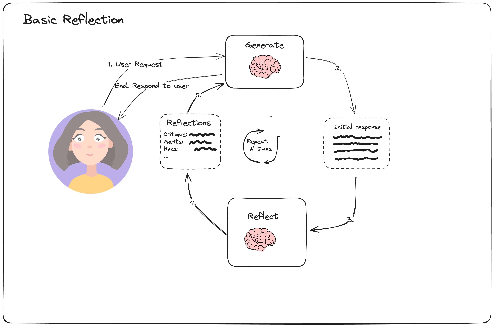
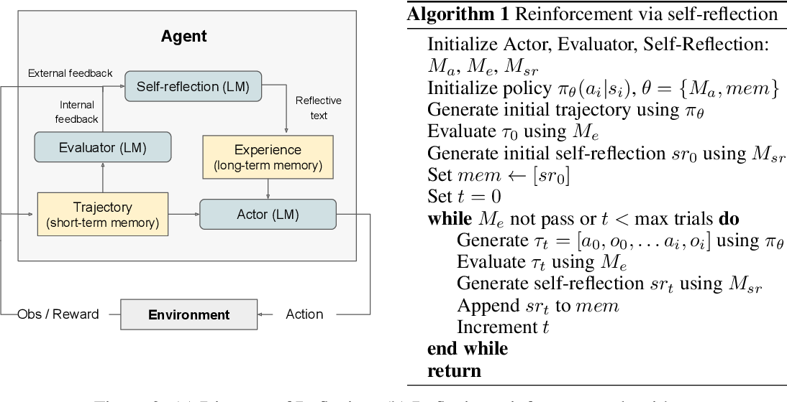
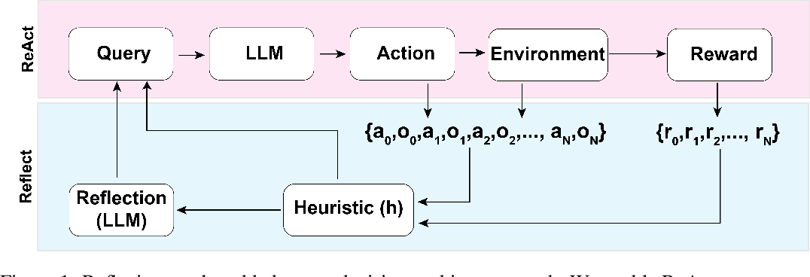
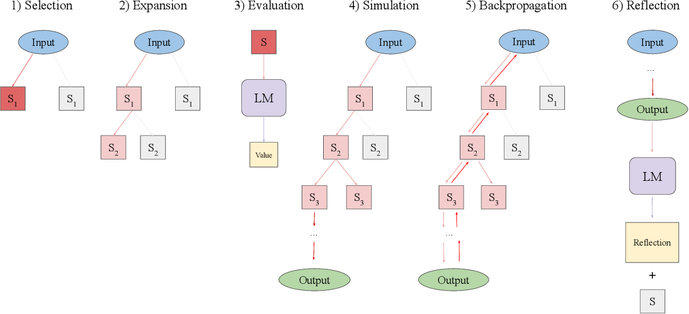
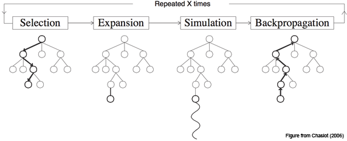
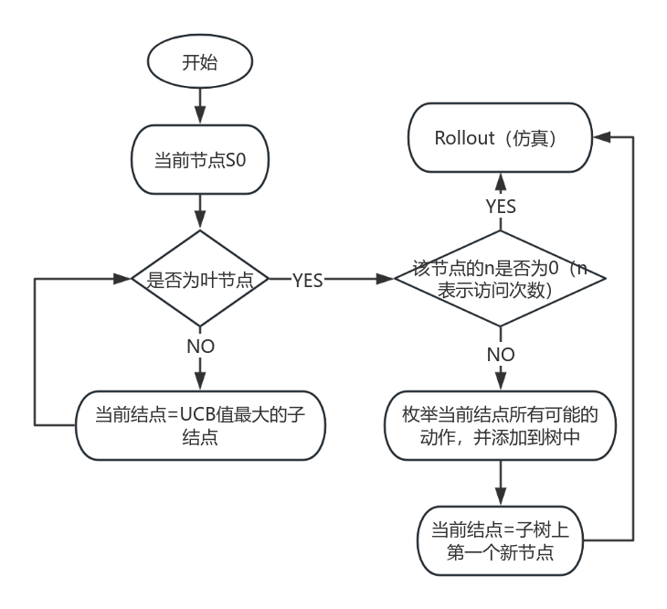

# 反思智能体（Reflection Agents）

## 1 Reflection

在LLM智能体，构建的背景下，反思是指促使LLM观察其过去的步骤（以及来自工具/环境的潜在观察）以评估所选操作的质量的过程。然后，将其用于下游的重新规划、搜索或评估等操作。



### 1.1 实现

```python
#生成结点
from langchain_community.chat_models.fireworks import ChatFireworks
from langchain_core.messages import AIMessage, BaseMessage, HumanMessage
from langchain_core.prompts import ChatPromptTemplate, MessagesPlaceholder

prompt = ChatPromptTemplate.from_messages(
    [
        (
            "system",
            "You are an essay assistant tasked with writing excellent 5-paragraph essays."
            " Generate the best essay possible for the user's request."
            " If the user provides critique, respond with a revised version of your previous attempts.",
        ),
        MessagesPlaceholder(variable_name="messages"),
    ]
)
llm = ChatFireworks(
    model="accounts/fireworks/models/mixtral-8x7b-instruct",
    model_kwargs={"max_tokens": 32768},
)
generate = prompt | llm

#文本输出
essay = ""
request = HumanMessage(
    content="Write an essay on why the little prince is relevant in modern childhood"
)
for chunk in generate.stream({"messages": [request]}):
    print(chunk.content, end="")
    essay += chunk.content

```

```python
#反思结点
reflection_prompt = ChatPromptTemplate.from_messages(
    [
        (
            "system",
            "You are a teacher grading an essay submission. Generate critique and recommendations for the user's submission."
            " Provide detailed recommendations, including requests for length, depth, style, etc.",
        ),
        MessagesPlaceholder(variable_name="messages"),
    ]
)
reflect = reflection_prompt | llm

reflection = ""
for chunk in reflect.stream({"messages": [request, HumanMessage(content=essay)]}):
    print(chunk.content, end="")
    reflection += chunk.content

```

```python
#迭代
for chunk in generate.stream(
    {"messages": [request, AIMessage(content=essay), HumanMessage(content=reflection)]}
):
    print(chunk.content, end="")

```

```python
#图的构建
from typing import List, Sequence

from langgraph.graph import END, MessageGraph


async def generation_node(state: Sequence[BaseMessage]):
    return await generate.ainvoke({"messages": state})


async def reflection_node(messages: Sequence[BaseMessage]) -> List[BaseMessage]:
    # Other messages we need to adjust
    cls_map = {"ai": HumanMessage, "human": AIMessage}
    # First message is the original user request. We hold it the same for all nodes
    translated = [messages[0]] + [
        cls_map[msg.type](content=msg.content) for msg in messages[1:]
    ]
    res = await reflect.ainvoke({"messages": translated})
    # We treat the output of this as human feedback for the generator
    return HumanMessage(content=res.content)


builder = MessageGraph()
builder.add_node("generate", generation_node)
builder.add_node("reflect", reflection_node)
builder.set_entry_point("generate")


def should_continue(state: List[BaseMessage]):
    if len(state) > 6:
        # End after 3 iterations
        return END
    return "reflect"


builder.add_conditional_edges("generate", should_continue)
builder.add_edge("reflect", "generate")
graph = builder.compile()

```

## 2 Reflexion

**Reflexion** 是一个框架，为Agent提供 **动态记忆** 和 **自我反思** 的能力以提高推理技能。Reflexion采用标准的强化学习设置，奖励模型提供简单的二元奖励（即判断行动正确与否），而行动空间遵循 ReAct 中的设置，通过语言加强特定任务的行动空间，增加了复杂的推理步骤。在每个行动之后，Agent会计算一个启发式值，并根据自我反思的结果决定是否重置环境以开始新的试验。

参考论文[Reflexion：Language agents with verbal Reinforcement Learning](https://arxiv.org/abs/2303.11366)



Reflexion是一种强化学习方法，与传统强化学习调整参数调优的方法不同，本模型使用语言反馈而不是更新参数权重来强化语言智能体。旨在分析错误，形成反思并保存，作为上下文帮助后续决策。

构造了一个基于 **当前环境的短期存储** 和基于 **反思的长期存储** 相结合的模型。



引入Heuristic(h)一个环节是为了消除幻觉，通过判断Omega（最大重复动作周期数）和Epsilon（最大总动作数）来决定该任务是否进行反思。

`reflection=LLM(St,rt,[a0,o0,...,at,ot],mem)`,反思过程，在第一次试验中，Actor 通过与环境交互产生轨迹τ0。然后评估器产生一个分数 r0；rt是标量奖励；为了放大r0，自我反思模型分析 {τ0, r0}集合以生成存储在内存mem中的摘要sr0。srt是对试验t的语言反馈。Actor、Evaluator和Self-Reflection模型通过循环试验协同工作，直到Evaluator认为τt是正确的。每次试验后t、srt都会附加存入mem。在实践中，通过存储经验的最大数量Ω（通常设置为 1-3）来限制mem，从而不超过LLM的上下文限制。

### 2.1 实现

Reflexion的主要组成部分是"actor"，它反思自己的反应，并根据自我批评重新执行以改进。它的主要子组件包括：

1.Tools/tool execution

```python
from langchain_community.tools.tavily_search import TavilySearchResults
from langchain_community.utilities.tavily_search import TavilySearchAPIWrapper

search = TavilySearchAPIWrapper()
tavily_tool = TavilySearchResults(api_wrapper=search, max_results=5)

#这些工具是在上下文中调用的。创建一个调用所有请求的工具的函数。
from collections import defaultdict
from typing import List

from langchain.output_parsers.openai_tools import (
    JsonOutputToolsParser,
    PydanticToolsParser,
)
from langchain_core.messages import AIMessage, BaseMessage, HumanMessage, ToolMessage
from langgraph.prebuilt.tool_executor import ToolExecutor, ToolInvocation

#我们有一个辅助类，对于运行工具很有用,它接受一个智能体操作并调用该工具并返回结果
tool_executor = ToolExecutor([tavily_tool])
# 解析执行/调用的工具消息
parser = JsonOutputToolsParser(return_id=True)

def execute_tools(state: List[BaseMessage]) -> List[BaseMessage]:
    tool_invocation: AIMessage = state[-1]
    parsed_tool_calls = parser.invoke(tool_invocation)
    ids = []
    tool_invocations = []
    for parsed_call in parsed_tool_calls:
        for query in parsed_call["args"]["search_queries"]:
            tool_invocations.append(
                ToolInvocation(
                    tool="tavily_search_results_json",
                    tool_input=query,
                )
            )
            ids.append(parsed_call["id"])

    outputs = tool_executor.batch(tool_invocations)
    outputs_map = defaultdict(dict)
    for id_, output, invocation in zip(ids, outputs, tool_invocations):
        outputs_map[id_][invocation.tool_input] = output

    return [
        ToolMessage(content=json.dumps(query_outputs), tool_call_id=id_)
        for id_, query_outputs in outputs_map.items()
    ]

```

输出示例

```python
[ToolMessage(content='{"successful climate policies examples": [{"url": "https://www.washingtonpost. ...

```

2.Initial responder:生成初始响应（和自我反思）

```python
import datetime

from langchain_core.prompts import ChatPromptTemplate, MessagesPlaceholder
from langchain_core.pydantic_v1 import BaseModel, Field, ValidationError
from langchain_openai import ChatOpenAI
from langsmith import traceable

#创建一个actor提示模板
actor_prompt_template = ChatPromptTemplate.from_messages(
    [
        (
            "system",
            """You are expert researcher.
Current time: {time}

1. {first_instruction}
2. Reflect and critique your answer. Be severe to maximize improvement.
3. Recommend search queries to research information and improve your answer.""",
        ),
        MessagesPlaceholder(variable_name="messages"),
        ("system", "Answer the user's question above using the required format."),
    ]
).partial(
    time=lambda: datetime.datetime.now().isoformat(),
)

#反思的主要方向是智能体做决策时容易发生的反馈消息错误和冗余反馈（即幻觉）
class Reflection(BaseModel):
    missing: str = Field(description="Critique of what is missing.")
    superfluous: str = Field(description="Critique of what is superfluous")


class AnswerQuestion(BaseModel):
    """Answer the question."""

    answer: str = Field(description="~250 word detailed answer to the question.")
    reflection: Reflection = Field(description="Your reflection on the initial answer.")
    search_queries: List[str] = Field(
        description="1-3 search queries for researching improvements to address the critique of your current answer."
    )


llm = ChatOpenAI(model="gpt-4-turbo-preview")

initial_answer_chain = actor_prompt_template.partial(
    first_instruction="Provide a detailed ~250 word answer."
) | llm.bind_tools(tools=[AnswerQuestion], tool_choice="AnswerQuestion")
validator = PydanticToolsParser(tools=[AnswerQuestion])

class ResponderWithRetries:
    def __init__(self, runnable, validator):
        self.runnable = runnable
        self.validator = validator

    @traceable
    def respond(self, state: List[BaseMessage]):
        response = []
        for attempt in range(3):
            try:
                response = self.runnable.invoke({"messages": state})
                self.validator.invoke(response)
                return response
            except ValidationError as e:
                state = state + [HumanMessage(content=repr(e))]
        return response
first_responder = ResponderWithRetries(
    runnable=initial_answer_chain, validator=validator
)
example_question = "Why is reflection useful in AI?"
initial = first_responder.respond([HumanMessage(content=example_question)])
parsed = parser.invoke(initial)
parsed

```

3.Revisor: 根据先前的反思进行重新响应（在最大范围内迭代反思）

```python
# 扩展初始答案架构并且包含引用。
# 在模型中强制引用这一部分会引导模型做出更加可靠的回应
revise_instructions = """Revise your previous answer using the new information.
    - You should use the previous critique to add important information to your answer.
        - You MUST include numerical citations in your revised answer to ensure it can be verified.
        - Add a "References" section to the bottom of your answer (which does not count towards the word limit). In form of:
            - [1] https://example.com
            - [2] https://example.com
    - You should use the previous critique to remove superfluous information from your answer and make SURE it is not more than 250 words.

class ReviseAnswer(AnswerQuestion):
    """Revise your original answer to your question."""

    references: List[str] = Field(
        description="Citations motivating your updated answer."
    )


revision_chain = actor_prompt_template.partial(
    first_instruction=revise_instructions
) | llm.bind_tools(tools=[ReviseAnswer], tool_choice="ReviseAnswer")
revision_validator = PydanticToolsParser(tools=[ReviseAnswer])

revisor = ResponderWithRetries(runnable=revision_chain, validator=revision_validator)
import json

revised = revisor.respond(
    [
        HumanMessage(content=""),
        initial,
        ToolMessage(
            tool_call_id=initial.additional_kwargs["tool_calls"][0]["id"],
            content=json.dumps(
                tavily_tool.invoke(str(parsed[0]["args"]["search_queries"]))
            ),
        ),
    ]
)
parsed = parser.invoke(revised)
parsed

```

反馈示例

```python
#反馈输出格式
[{'type': 'ReviseAnswer',
  'args': {'answer': "Reflection in AI refers to the ability of AI systems to analyze and adapt their behavior and algorithms autonomously. This introspective capability enhances AI's performance and adaptability, making it crucial for learning, transparency, and optimization. \n\nReflection enables AI to learn from experiences, adjusting strategies for better decision-making. For example, Google DeepMind's AI has shown significant advancements in learning and adapting strategies in various environments [1]. Moreover, AI systems can explain their decisions, supporting the development of explainable AI (XAI), vital in sensitive sectors like healthcare and autonomous driving. This increases user trust and acceptance by providing insights into AI's decision-making processes. \n\nAdditionally, reflection aids in debugging and improving AI models by identifying weaknesses and suggesting enhancements. For instance, AI in healthcare, like the Mayo Clinic's use of medical data analytics, demonstrates how reflective AI can optimize algorithms to provide better patient care [2]. \n\nIn summary, reflection in AI fosters learning and adaptation, enhances transparency and trust, and facilitates model optimization, contributing to the development of sophisticated, reliable AI systems.",
   'reflection': {'missing': 'The previous answer lacked specific examples and case studies to illustrate the benefits of reflection in AI. Including such examples would provide a more concrete understanding of the concept and its applications.',
    'superfluous': 'The initial answer was comprehensive but could benefit from direct examples to demonstrate the practical applications and benefits of reflection in AI, rather than a broad overview without concrete cases.'},
   'search_queries': ['Google DeepMind reflective AI examples',
    'Mayo Clinic AI case study',
    'Reflective AI benefits in healthcare'],
   'references': ['https://casestudybuddy.com/blog/best-ai-case-study-examples/',
    'https://indatalabs.com/blog/artificial-intelligence-case-studies']},
  'id': 'call_0kZkZgn5DP2Z8VhRtxGkXDp5'}]

```

4.图的构建

```python
from langgraph.graph import END, MessageGraph

MAX_ITERATIONS = 5
builder = MessageGraph()
builder.add_node("draft", first_responder.respond)
builder.add_node("execute_tools", execute_tools)
builder.add_node("revise", revisor.respond)
# draft -> execute_tools
builder.add_edge("draft", "execute_tools")
# execute_tools -> revise
builder.add_edge("execute_tools", "revise")

# 定义循环逻辑：
def event_loop(state: List[BaseMessage]) -> str:
    # 在我们的案例中，超过 N 步骤后结束
    num_iterations = _get_num_iterations(state)
    if num_iterations > MAX_ITERATIONS:
        return END
    return "execute_tools"


# revise -> execute_tools 或结束
builder.add_conditional_edges("revise", event_loop)
builder.set_entry_point("draft")
graph = builder.compile()

```

## 3 Language Agents Tree Search

通用的LLM智能体搜索算法，结合了反射/评估和搜索(特别是蒙特卡罗树搜索)可以实现更好的整体任务性能。它采用标准的强化学习(RL)任务框架，将RL智能体、值函数和优化器全部替换为对LLM的调用，帮助智能体适应和解决复杂任务的问题，避免陷入重复循环。

LATS通过将ReAct扩展为对可能的推理和行为步骤的组合的空间的搜索，统一了LM规划、行为和推理策略。我们将蒙特卡罗树搜索(MCTS) 转向语言智能体，将预训练的LLM重新用作智能体、价值函数和优化器。利用现代LM强大的自然语言理解和上下文学习能力，我们使用文本作为框架各组件之间的接口，允许LM在没有额外训练的情况下适应环境条件的规划。

LATS:



1. **选择** 在第一个操作中，算法识别当前树中最适合后续扩展的一段。从根节点(表示为初始状态50)开始，在每个树级别上选择一个子节点，直到到达叶节点。为了平衡探索和利用，我们使用UCT算法。
2. **扩张** 在选择一个节点之后，第二个操作通过从pθ中采样n个动作来扩展树，如前一节所述。环境接收每个动作并作为观察返回相应的反馈。这将导致向树中添加n个子节点。该树存储在外部长期记忆结构中。
3. **评估** 第三个操作为每个新子节点分配一个标量值，用于选择和反向传播。这个值有效地量化了智能体在任务完成方面的进度，作为启发式算法来引导搜索算法走向树中最有希望的区域。 我们通过提示其对给定状态进行推理，将pθ重新定位为值函数。为了获得标量值，我们指示pθ以表示轨迹正确性的分数结束其推理轨迹。这种方法比编程启发式具有更高的灵活性，比学习启发式具有更高的效率。
4. **模拟** 第四个操作展开当前选定的节点，直到达到终端状态。在每个深度级别，我们使用相同的操作对节点进行采样和评估，但优先考虑值最高的节点。到达终端状态提供了对轨迹正确性的客观反馈。如果任务成功完成，则LATS终止搜索。如果解决方案部分成功或不成功，那么我们执行如下所述的两个附加操作。
5. **反向传播** 该操作根据轨迹的结果更新树的值。 对于每个节点s0, s1，…， sn在搜索树从根(初始状态50)到叶(终端状态sn)的轨迹中，通过N(si) = Nold(si) + 1和V (si) = [r+Nold(si)*Vold(si)]/N(si)更新其值以反映模拟结果，其中r为返回值，Nold, Vold为旧访问次数和值函数。在UCB公式中使用这些更新的值来指导选择下一个节点进行探索。
6. **反射** 除了环境反馈，我们还利用自我反思来进一步完善决策过程。当遇到不成功的终端节点时，pθ会受到轨迹和最终奖励的提示，进行口头自我反思，总结推理或行动过程中的错误，并提出更好的替代方案。我们将失败的轨迹和相应的反射都存储在记忆中。在随后的迭代中，这些被集成为智能体和价值函数的附加上下文，通过上下文学习对两者进行细化。这使得语义梯度信号比标量值更有用，使智能体能够从试验和错误中学习，而不需要昂贵的优化过程(如强化学习)的成本。


```python
Require: Initial state s1, action generator pθ, value function pV , reflection generator pref, number
of generated actions n, depth limit L, number of roll-outs K, context c, and exploration weight w
Initialize action space A, observation space O

Initialize the state-action value function pV : S × A 7→ R and visit counter N : S 7→ N to zero

for k ← 0, . . . , K − 1 do
   for t ← 0, . . . , L − 1 do
       if st not terminal then            ▷ Expansion & Simulation
          for i ← 1, . . . , n do
             Sample a(i)t ∼ pθ(a | st)
             Get o(i)t from environment, s(i)t+1 ← (c(i)t , o(i)t , a(i)t ), c(i)t+1 ← (o(i)t , a(i)t )
             Evaluate V (i)t ∼ pV (s(i)t )       ▷ Evaluation
             V (st) ← V (i)t
             Add s(i)t to children
          end for
       end if
       
       if st is terminal then              ▷ Reflection
          Get r from environment
          if r not success then
             reflection ← pref(ct)
             c ← reflection
          end if
       end if
       
       at ← arg maxa∈e(st)=V (st) + w*sqr{[ln N(st−1)]/N(st)}     ▷ Selection
       N(st+1) ← N(st+1) + 1
       if at is an output action then break
   end for
   T ← the actual number of steps
   
   for t ← T − 1, . . . , 0 do ▷ Backpropagation
      V (st) ← [V (st)(N(st)−1)+r]/N(st)
   end for
end for

```

### 3.1 实现

1. 蒙特卡洛搜索树(MCTS)部分的构建





LATS是基于蒙特卡洛树搜索的。对于每个搜索步骤，它都会选择具有最高"上限置信界限"的节点，这是平衡利用(最高平均奖励)和探索(最低访问)的度量。从该节点开始，它生成N个(本例中为5个)新的候选操作，并将它们添加到树中。它在生成有效解决方案或达到最大rollroll数(搜索树深度)时停止搜索。

```python
from __future__ import annotations

import math
from typing import List, Optional
from langchain_core.messages import AIMessage, BaseMessage, HumanMessage, ToolMessage

class Node:
    def __init__(
        self,
        messages: List[BaseMessage],
        reflection: Reflection,
        parent: Optional[Node] = None,
    ):
        self.messages = messages
        self.parent = parent
        self.children = []
        self.value = 0
        self.visits = 0
        self.reflection = reflection
        self.depth = parent.depth + 1 if parent is not None else 1
        self._is_solved = reflection.found_solution if reflection else False
        if self._is_solved:
            self._mark_tree_as_solved()
        self.backpropagate(reflection.normalized_score)

    def __repr__(self) -> str:
        return (
            f"<Node value={self.value}, visits={self.visits},"
            f" solution={self.messages} reflection={self.reflection}/>"
        )

    @property
    def is_solved(self):
        """If any solutions exist, we can end the search."""
        return self._is_solved

    @property
    def is_terminal(self):
        return not self.children

    @property
    def best_child(self):
        """Select the child with the highest UCT to search next."""
        if not self.children:
            return None
        all_nodes = self._get_all_children()
        return max(all_nodes, key=lambda child: child.upper_confidence_bound())

    @property
    def best_child_score(self):
        """Return the child with the highest value."""
        if not self.children:
            return None
        return max(self.children, key=lambda child: int(child.is_solved) * child.value)

    @property
    def height(self) -> int:
        """Check for how far we've rolled out the tree."""
        if self.children:
            return 1 + max([child.height for child in self.children])
        return 1

    def upper_confidence_bound(self, exploration_weight=1.0):
        """Return the UCT score. This helps balance exploration vs. exploitation of a branch."""
        if self.parent is None:
            raise ValueError("Cannot obtain UCT from root node")
        if self.visits == 0:
            return self.value
        # Encourages exploitation of high-value trajectories
        average_reward = self.value / self.visits
        # Encourages exploration of less-visited trajectories
        exploration_term = math.sqrt(math.log(self.parent.visits) / self.visits)
        return average_reward + exploration_weight * exploration_term

    def backpropagate(self, reward: float):
        """Update the score of this node and its parents."""
        node = self
        while node:
            node.visits += 1
            node.value = (node.value * (node.visits - 1) + reward) / node.visits
            node = node.parent

    def get_messages(self, include_reflections: bool = True):
        if include_reflections:
            return self.messages + [self.reflection.as_message()]
        return self.messages

    def get_trajectory(self, include_reflections: bool = True) -> List[BaseMessage]:
        """Get messages representing this search branch."""
        messages = []
        node = self
        while node:
            messages.extend(
                node.get_messages(include_reflections=include_reflections)[::-1]
            )
            node = node.parent
        # Reverse the final back-tracked trajectory to return in the correct order
        return messages[::-1]  # root solution, reflection, child 1, ...

    def _get_all_children(self):
        all_nodes = []
        nodes = deque()
        nodes.append(self)
        while nodes:
            node = nodes.popleft()
            all_nodes.extend(node.children)
            for n in node.children:
                nodes.append(n)
        return all_nodes

    def get_best_solution(self):
        """Return the best solution from within the current sub-tree."""
        all_nodes = [self] + self._get_all_children()
        best_node = max(
            all_nodes,
            # We filter out all non-terminal, non-solution trajectories
            key=lambda node: int(node.is_terminal and node.is_solved) * node.value,
        )
        return best_node

    def _mark_tree_as_solved(self):
        parent = self.parent
        while parent:
            parent._is_solved = True
            parent = parent.parent
The graph state itself
The main component is the tree, represented by the root node.

from typing_extensions import TypedDict


class TreeState(TypedDict):
    # The full tree
    root: Node
    # The original input
    input: str

```

2. 反思

智能体将有三个主要的llm驱动进程:

（1）反映:根据工具响应对行动进行评分。

反思链根据决策结果和工具响应对代理的输出进行评分，并将在其他两个节点中调用。

```python
from langchain.chains import create_structured_output_runnable
from langchain.output_parsers.openai_tools import (
    JsonOutputToolsParser,
    PydanticToolsParser,
)
from langchain_core.prompts import ChatPromptTemplate, MessagesPlaceholder
from langchain_core.pydantic_v1 import BaseModel, Field
from langchain_core.runnables import chain as as_runnable


class Reflection(BaseModel):
    reflections: str = Field(
        description="The critique and reflections on the sufficiency, superfluency,"
        " and general quality of the response"
    )
    score: int = Field(
        description="Score from 0-10 on the quality of the candidate response.",
        gte=0,
        lte=10,
    )
    found_solution: bool = Field(
        description="Whether the response has fully solved the question or task."
    )

    def as_message(self):
        return HumanMessage(
            content=f"Reasoning: {self.reflections}\nScore: {self.score}"
        )

    @property
    def normalized_score(self) -> float:
        return self.score / 10.0


prompt = ChatPromptTemplate.from_messages(
    [
        (
            "system",
            "Reflect and grade the assistant response to the user question below.",
        ),
        ("user", "{input}"),
        MessagesPlaceholder(variable_name="candidate"),
    ]
)

reflection_llm_chain = (
    prompt
    | llm.bind_tools(tools=[Reflection], tool_choice="Reflection").with_config(
        run_name="Reflection"
    )
    | PydanticToolsParser(tools=[Reflection])
)


@as_runnable
def reflection_chain(inputs) -> Reflection:
    tool_choices = reflection_llm_chain.invoke(inputs)
    reflection = tool_choices[0]
    if not isinstance(inputs["candidate"][-1], AIMessage):
        reflection.found_solution = False
    return reflection

```

（2）初始响应:创建根节点并开始搜索。

从第一步生成的根节点开始，使用工具调用或响应来响应用户输入。

```python
from typing import List

from langchain_core.prompt_values import ChatPromptValue
from langchain_core.pydantic_v1 import BaseModel, Field, ValidationError
from langchain_core.runnables import RunnableConfig

prompt_template = ChatPromptTemplate.from_messages(
    [
        (
            "system",
            "You are an AI assistant.",
        ),
        ("user", "{input}"),
        MessagesPlaceholder(variable_name="messages", optional=True),
    ]
)


initial_answer_chain = prompt_template | llm.bind_tools(tools=tools).with_config(
    run_name="GenerateInitialCandidate"
)


parser = JsonOutputToolsParser(return_id=True)

```

对于提问 `Write a research report on lithium pollution.`给出的初始相应为：`AIMessage(content='', additional_kwargs={'tool_calls': [{'id': 'call_APBQsd15wnSNPhyghCvFrNC8', 'function': {'arguments': '{"query":"lithium pollution research report"}', 'name': 'tavily_search_results_json'}, 'type': 'function'}]})`

将候选生成和反射打包到图的单个节点中。

```python
import json


#定义我们将添加到图形的节点
def generate_initial_response(state: TreeState) -> dict:
    """Generate the initial candidate response."""
    res = initial_answer_chain.invoke({"input": state["input"]})
    parsed = parser.invoke(res)
    tool_responses = tool_executor.batch(
        [ToolInvocation(tool=r["type"], tool_input=r["args"]) for r in parsed]
    )
    output_messages = [res] + [
        ToolMessage(content=json.dumps(resp), tool_call_id=tool_call["id"])
        for resp, tool_call in zip(tool_responses, parsed)
    ]
    reflection = reflection_chain.invoke(
        {"input": state["input"], "candidate": output_messages}
    )
    root = Node(output_messages, reflection=reflection)
    return {
        **state,
        "root": root,
    }

```

（3）展开:从当前树的最佳位置生成5个候选行为

```python
#生成N个候选行为
#用于从环境中采样动作的单个输入
def generate_candidates(messages: ChatPromptValue, config: RunnableConfig):
    n = config["configurable"].get("N", 5)
    bound_kwargs = llm.bind_tools(tools=tools).kwargs
    chat_result = llm.generate(
        [messages.to_messages()],
        n=n,
        callbacks=config["callbacks"],
        run_name="GenerateCandidates",
        **bound_kwargs
    )
    return [gen.message for gen in chat_result.generations[0]]


expansion_chain = prompt_template | generate_candidates

```

把候选生成和反射步骤打包到下面的“expand”节点中,我们将所有的操作作为一个批处理过程来加速执行。

```python
from collections import defaultdict, deque

def expand(state: TreeState, config: RunnableConfig) -> dict:
    """Starting from the "best" node in the tree, generate N candidates for the next step."""
    root = state["root"]
    best_candidate: Node = root.best_child if root.children else root
    messages = best_candidate.get_trajectory()
    #从单个子候选对象生成N个候选对象
    new_candidates = expansion_chain.invoke(
        {"input": state["input"], "messages": messages}, config
    )
    parsed = parser.batch(new_candidates)
    flattened = [
        (i, tool_call)
        for i, tool_calls in enumerate(parsed)
        for tool_call in tool_calls
    ]
    tool_responses = tool_executor.batch(
        [
            ToolInvocation(tool=tool_call["type"], tool_input=tool_call["args"])
            for _, tool_call in flattened
        ]
    )
    collected_responses = defaultdict(list)
    for (i, tool_call), resp in zip(flattened, tool_responses):
        collected_responses[i].append(
            ToolMessage(content=json.dumps(resp), tool_call_id=tool_call["id"])
        )
    output_messages = []
    for i, candidate in enumerate(new_candidates):
        output_messages.append([candidate] + collected_responses[i])

    #反思每一个候选生成
    #并在这里添加带有外部验证的任务。
    reflections = reflection_chain.batch(
        [{"input": state["input"], "candidate": msges} for msges in output_messages],
        config,
    )
    #生成蒙特卡洛树
    child_nodes = [
        Node(cand, parent=best_candidate, reflection=reflection)
        for cand, reflection in zip(output_messages, reflections)
    ]
    best_candidate.children.extend(child_nodes)
    #已经获得扩展了的树，只需返回状态
    return state

```

（4）图的构建

```python
from langgraph.graph import END, StateGraph

def should_loop(state: TreeState):
    """Determine whether to continue the tree search."""
    root = state["root"]
    if root.is_solved:
        return END
    if root.height > 5:
        return END
    return "expand"


builder = StateGraph(TreeState)
builder.add_node("start", generate_initial_response)
builder.add_node("expand", expand)
builder.set_entry_point("start")


builder.add_conditional_edges(
    "start",
    # Either expand/rollout or finish
    should_loop,
)
builder.add_conditional_edges(
    "expand",
    # Either continue to rollout or finish
    should_loop,
)

graph = builder.compile()

```

### 3.2 总结

**使用LLM进行推理规划**  ，我们有了CoT（将问题逐步拆解为小问题）、ToT（使用深度或广度优先算法对可能的选择全部进行拆解与规划）、RAP（引入MCTS，已解决传统树形搜索方式轨迹不聚焦与轨迹利用不足的问题）等树形结构模型。但此类方法单一，依赖内部信息，缺乏环境信息的交互与反馈。 **用LLM进行动作** ，我们提出ReAct（将推理行动结合）、Reflexion（在ReAct的基础上加入Reflection，进行自我反思，消除幻觉）。但此类方法都是针对其历史轨迹学习，不能提纲挈领，缺乏规划能力。

我们在树形搜索对多种可能进行选取规划的过程中加入来自外部的反馈，在传统的自我反思模型中应用搜索树的框架结构以提高其规划能力。实验结果显示，LATS在多项基准测试中表现性能优异。

