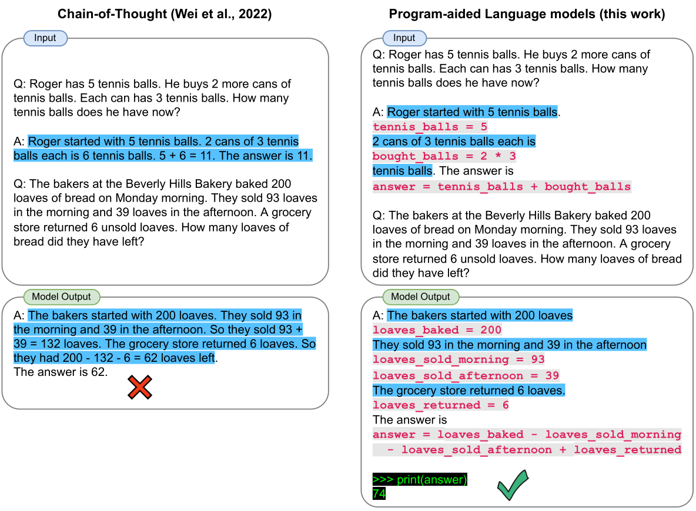

# PAL Prompting

## Introduction

[[Gao et al., 2022]](https://arxiv.org/abs/2211.10435) The PAL framework is introduced, which involves lowering the reasoning steps and computation of the LLM's final results to the interpreter to ensure accuracy of the answers. This reduces the failure rate of LLM's logic and computation errors.

By outsourcing the reasoning steps to the interpreter, PAL eliminates the need for LLM to perform computations. The results show that even when a stronger COT is used by LLM, PAL still outperforms it in accuracy. Additionally, PAL can work collaboratively with weaker LLMs and expand its advantages when working with stronger LLMs.

## How it Works?

While LLMs can decompose natural language problems into steps and perform simple arithmetic operations, their perfor-mance falls dramatically when dealing with complex arith-metic  or large numbers . In fact, even when fine-tuning a PaLM-based model on 164B tokens of explicit mathematical content, its two most common failures are reportedly “incorrect reasoning” and “incorrect calculation”

Because previous LLMs only performed calculations internally, they were unable to handle large calculations and complex algorithms. PAL breaks down the problem into multiple reasoning steps and delegates these reasoning steps and calculations to a Python interpreter. Therefore, as long as the coding ability of an LLM is sufficient, it can accurately execute any calculation.



## Prompt Example

### *Prompt*

```
Q: I have a drum, a flute, a clarinet, a violin, four accordions, a piano, a trombone, and a trumpet. How many musical instruments do I have?

# solution using Python:

def solution():
    """Q: I have a drum, a flute, a clarinet, a violin, four accordions, a piano, a trombone, and a trumpet. How many musical instruments do I have?"""
    musical_instruments_to_count = {
        'drum': 1,
        'flute': 1,
        'clarinet': 1,
        'violin': 1,
        'accordion': 4,
        'piano': 1,
        'trombone': 1,
        'trumpet': 1
    }
    num_musical_instruments = sum(musical_instruments_to_count.values())
    return num_instruments


Q: I have a chair, two ovens, and three tables. How many objects do I have?

# solution using Python:

def solution():
    """Q: I have a chair, two ovens, and three tables. How many objects do I have?
    """
    objects_to_count = {
        'chair': 1,
        'oven': 2,
        'table': 3
    }
    num_objects = sum(objects_to_count.values())
    return num_objects


Q: I have a chair, two potatoes, a cauliflower, a lettuce head, two tables, a cabbage, two onions, and three fridges. How many vegetables do I have?

# solution using Python:

def solution():
    """Q: I have a chair, two potatoes, a cauliflower, a lettuce head, two tables, a cabbage, two onions, and three fridges. How many vegetables do I have?
    """
    # note: I'm not counting the chair, tables, or fridges as vegetables
    vegetables_to_count = {
        'potato': 2,
        'cauliflower': 1,
        'lettuce head': 1,
        'cabbage': 1,
        'onion': 2
    }
    num_vegetables = sum(vegetables_to_count.values())
    return num_vegetables


Q: I have a raspberry, a cat, a rabbit, a mouse, a pig, two snails, a fish, two cows, a snake, a goat, and a duck. How many animals do I have?

# solution using Python:

def solution():
    """Q: I have a raspberry, a cat, a rabbit, a mouse, a pig, two snails, a fish, two cows, a snake, a goat, and a duck. How many animals do I have?
    """
    # note: I'm not counting the raspberry as an animal
    animals_to_count = {
        'cat': 1,
        'rabbit': 1,
        'mouse': 1,
        'pig': 1,
        'snail': 2,
        'fish': 1,
        'cow': 2,
        'snake': 1,
        'goat': 1,
        'duck': 1
    }
    num_animals = sum(animals_to_count.values())
    return num_animals


Q: {There are three chairs, two tables, and three beds in the room. How many pieces of furniture are there in total?}

# solution using Python:
```

### *Output*

```

def solution():
    """Q: There are three chairs, two tables, and three beds in the room. How many pieces of furniture are there in total?"""
    furniture_to_count = {
        'chair': 3,
        'table': 2,
        'bed': 3
    }
    num_furniture = sum(furniture_to_count.values())
    return num_furniture
```

## Datasets

We experiment with three broad classes of reasoning tasks:

(1) mathematical problems from a wide range of datasets including GSM8K, SVAMP, ASDIV,
and MAWPS;

(2) symbolic reasoning from BIG-Bench Hard;

(3) algorithmic problems from BIG-Bench Hard as well.

### [GSM8K](https://www.huggingface.co/datasets/gsm8k)
GSM8K is a data set consisting of 8.5K high quality language diverse primary math word problems. These problems are divided into 7.5K training problems and 1K test problems. These problems take between two and eight steps to solve, and are solved by performing a series of basic calculations using basic arithmetic operations (+ - / *) to arrive at the final answer.

### [Defects4J](https://github.com/rjust/defects4j)
This dataset contains known defects and fixes for 5 Java projects, including Commons Math, Joda Time, etc

### [MultiArith](https://www.huggingface.co/datasets/ChilleD/MultiArith)
The MultiArith dataset is a multi-step algorithm dataset containing 600 scenario-based math problems at the elementary level.

### [Django](https://www.huggingface.co/datasets/AhmedSSoliman/DJANGO)
This dataset is also a natural language to code semantic parsing task dataset, which includes Python code from the Django Web framework and related natural language descriptions.

### [Codeforces](https://www.kaggle.com/datasets/immortal3/codeforces-dataset)
This dataset is an online programming competition platform that contains millions of lines of code submitted by programmers from around the world.

### [SQuAD](https://www.huggingface.co/datasets/squad)
This dataset is a question and answer dataset widely used in Natural language processing tasks, which contains questions from Wikipedia and their corresponding answers

## References

\[1\] Brown, T. B., Mann, B., Ryder, N., Subbiah, M., Kaplan,
J., Dhariwal, P ., Neelakantan, A., Shyam, P ., Sastry, G.,
Askell, A., Agarwal, S., Herbert-V oss, A., Krueger, G.,
Henighan, T., Child, R., Ramesh, A., Ziegler, D. M., Wu,
J., Winter, C., Hesse, C., Chen, M., Sigler, E., Litwin, M.,
Gray, S., Chess, B., Clark, J., Berner, C., McCandlish,
S., Radford, A., Sutskever, I., and Amodei, D. [Language Models are Few-Shot Learners.](https://proceedings.neurips.cc/paper/2020/hash/1457c0d6bfcb4967418bfb8ac142f64a-Abstract.html)
In NeurIPS, 2020.

\[2\] Wang, X., Wei, J., Schuurmans, D., Le, Q., Chi, E.,
and Zhou, D. [Self-Consistency Improves Chain of Thought Reasoning in Language Models.](https://arxiv.org/abs/2203.11171v2) arXiv preprint
arXiv:2203.11171, 2022b.

\[3\] Wei, J., Wang, X., Schuurmans, D., Bosma, M., Chi, E., Le,
Q., and Zhou, D. [Chain of Thought Prompting Elicits Reasoning in Large Language Models.](https://arxiv.org/abs/2201.11903) arXiv preprint
arXiv:2201.11903, 2022.