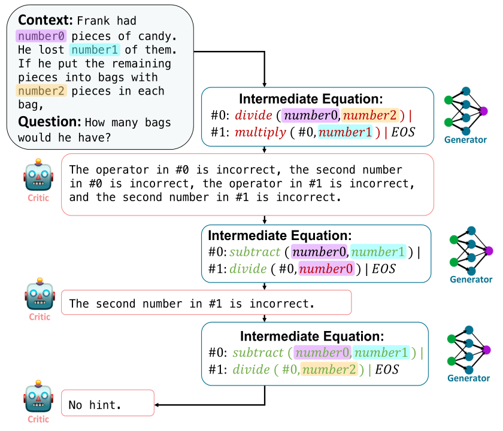
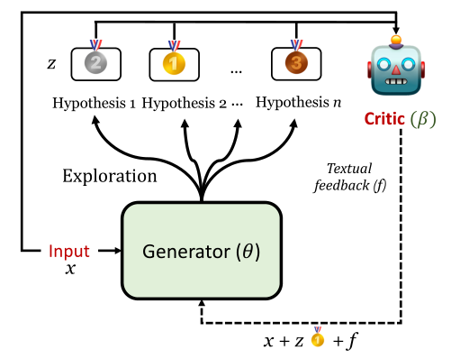

# **REFINER: Reasoning Feedback on Intermediate Representations**

## Introduction

[[Paul et al., 2023]](https://arxiv.org/abs/2304.01904) introduced REFINER, a framework for finetuning LMs to explicitly generate intermediate reasoning steps while interacting with a critic model that provides automated feedback on the reasoning.

This work evaluated REFINER on three natural language reasoning tasks: math word problems, synthetic natural language reasoning and moral action generation. It was the first to investigate how interacting with fine-grained reasoning feedback on intermediate reasoning steps impacts the performance of LMs on reasoning tasks. Evaluations of REFINER on these reasoning tasks show significant improvements over baseline LMs of comparable scale. Furthermore, when using GPT3.5 as the reasoner, the trained critic significantly improves reasoning without finetuning the reasoner.

Results showed that REFINER framework is very general. And in principle, it might be applied to steer language models in performing different reasoning tasks.


## How it Works?

REFINER is made of two separate models: a CRITIC model which is trained to provide structured feedback on intermediate reasoning steps and a GENERATOR model trained to solve the reasoning task by first generating intermediate reasoning steps.

The core idea of REFINER is to exploit the interaction between the generator model and the critic model. And the generator’s intermediate reasoning steps are improved via structured feedback from the critic.

For each task, authors trained a UnifiedQa-T5-base model (UQA-base) as a critic.  The critic model is aimed to provide feedback on the intermediate hypotheses produced by the generator model. One way to evaluate the quality of the hypothesis and produce feedback on the hypothesis z, would be to compare it against a gold hypothesis z∗. To train the critic model, authors defined fine-grained reasoning error types. Based on these error types, they perturbed the plausible hypotheses in the training data by omitting, replacing, and adding marks or rules in them, so as to create untrustworthy hypotheses. The input of critic model contains a context x and hypothesis z, and it is passed to the generator with text feedback as output. 

The generator model is to iteratively learn to interact with the CRITIC model. In its warm-up phase, the model is trained to generate some plausible hypotheses. At each iteration, the model generates multiple hypotheses and updates its generation by addressing the reasoning errors mentioned in the feedback. 

The following picture shows the process of REFINER. The critic model provides the generator model with feedback on its reasoning errors after evaluating the generated intermediate steps. The feedback, alongside the original question and previous intermediate equation, are fed back to the generator model.



The following picture shows the overview of REFINER interaction loop. In each iteration, the generator model creates several hypotheses. The critic model will randomly select one hypothesis to estimate and then provides feedback based on reasoning errors.



## Prompt Example

### *Prompt*

```
Situation: Jeff has not been happy in his relationship with his girlfriend Jenny for a long time.
Intention: Jeff wants to break up with Jenny. 
Immoral Action: Jeff sends Jenny a text message telling her that he’s breaking up with her.
```

### *Output* 

```
Moral norm output(z): It’s wrong to break up with someone over text.
Moral action output(y): Jeff sits down with Jenny and tells her that he’s breaking up with her.
```

## Datasets

### SVAMP
A challenge set for elementary-level Math Word Problems (MWP).  An MWP consists of a short Natural Language narrative that describes a state of the world and poses a question about some unknown quantities.

The examples in SVAMP test a model across different aspects of solving MWPs: 1) Is the model question sensitive?  2) Does the model have robust reasoning ability?  3) Is it invariant to structural alterations?

### MS
Moral Stories(MS), a crowd-sourced dataset of structured, branching narratives for the study of grounded, goal-oriented social reasoning.  
