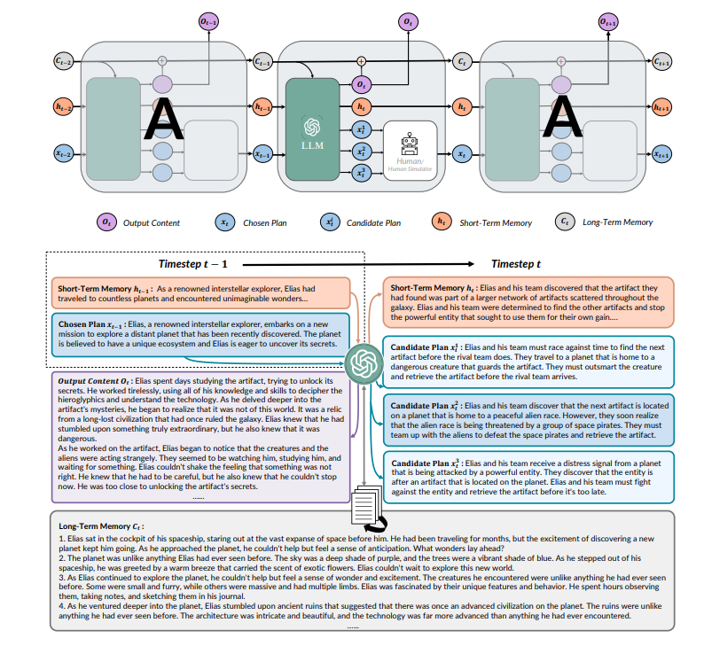

 

# **RecurrentGPT**

## Introduction

[[Wangchunshu et al., 2023\]](https://arxiv.org/abs/2305.13304) introduce RECURRENTGPT, a language-based simulacrum of the recurrence mechanism in RNNs. 

Is built upon a large language model (LLM) and uses natural language to simulate the Long Short-Term Memory mechanism in an LSTM. At each timestep, RECURRENTGPT generates a paragraph of text and updates its language-based long-short term memory stored on the hard drive and the prompt, respectively. This recurrence mechanism enables RECURRENTGPT to generate texts of arbitrary length without forgetting.

Since human users can easily observe and edit the natural language memories, RECURRENTGPT is interpretable and enables interactive generation of long text. In addition to producing AI-generated content (AIGC), we also demonstrate the possibility of using RECURRENTGPT as an interactive fiction that directly interacts with consumers.

## How it Works?

### 1. Long/Short term memory

Long-term memory summarizes all previously generated contents to minimize information lost when generating long texts. Short-term memory is a short paragraph of texts summarizing key information across recent timesteps. By combining long-short term memory, RECURRENTGPT can maintain coherence with recently generated content and also recall key information that was generated long before. 

### 2. RecurrentGPT

RECURRENTGPT replaces the vectorized elements (cell state, hidden state, input, and output) in a Long-short Term Memory RNN (LSTM) with natural language (paragraphs of texts), and simulates the recurrence mechanism with prompt engineering. At each timestep t, RECURRENTGPT receives a paragraph of text and a brief plan of the next paragraph, which are both generated in step t − 1. It then attends to the long-term memory, which contains the summaries of all previously generated paragraphs and can be stored on hard drives, and relevant paragraphs can be retrieved with semantic search. RECURRENTGPT also maintains a short-term memory that summarizes key information within recent timesteps in natural language and is updated at each time step. RECURRENTGPT combines all aforementioned inputs in a prompt and asks the backbone LLM to generate a new paragraph, a short plan for the next paragraph, and updates the long-short term memory by rewriting the short-term memory and appending the summary of the output paragraph to the long-term memory. These components are then re-used in the next time step, resulting in a recurrence mechanism for the generation process.



## Prompt Example

### *Prompt*

```
I need you to help me write a novel. Now I give you a memory (a brief summary) of 400 words, you should use it to store the key content of what has 
been written so that you can keep track of very long context. For each time, I will give you your current memory (a brief summary of previous 
stories. You should use it to store the key content of what has been written so that you can keep track of very long context), the previously 
written paragraph, and instructions on what to write in the next paragraph. I need you to write:

1. Output Paragraph: the next paragraph of the novel. The output paragraph should contain around 20 sentences and should follow the input 
instructions.

2. Output Memory: The updated memory. You should first explain which sentences in the input memory are no longer necessary and why, and then 
explain what needs to be added into the memory and why. After that you should write the updated memory. The updated memory should be similar to the 
input memory except the parts you previously thought that should be deleted or added. The updated memory should only store key information. The 
updated memory should never exceed 20 sentences!

3. Output Instruction: instructions of what to write next (after what you have written). You should output 3 different instructions, each is a 
possible interesting continuation of the story. Each output instruction should contain around 5 sentences
```

 ### *Input* 

```
Input Memory: 
{short_memory}

Input Paragraph:
{input_paragraph}

Input Instruction:
{input_instruction}

Input Related Paragraphs:
{input_long_term_memory}
```

### *Output* 

```
Output Paragraph:
<string of output paragraph>, around 20 sentences.

Output Memory:
Rational: <string that explain how to update the memory>;
Updated Memory: <string of updated memory>, around 10 to 20 sentences

Output Instruction:
Instruction 1: <content for instruction 1>, around 5 sentences
Instruction 2: <content for instruction 2>, around 5 sentences
Instruction 3: <content for instruction 3>, around 5 sentences
```

## Datasets

### Vector Database
Vector Database is a specialized database system designed for storing and managing vector data. Vector data, composed of points, lines, and polygons, is commonly used in geographic information systems (GIS) and mapping applications. Compared to traditional relational databases, vector databases provide more efficient storage and querying methods to support the storage, indexing, and analysis of spatial data.