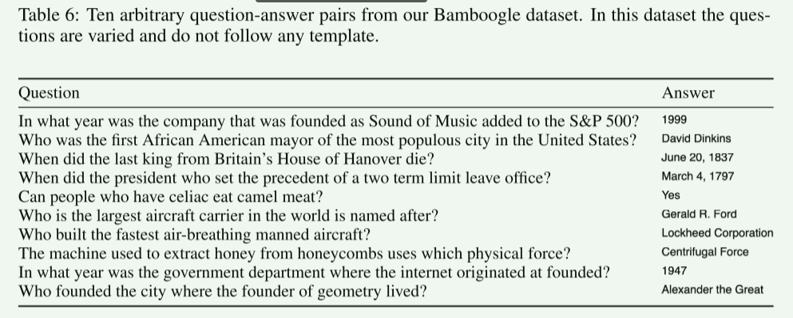

# **测量和缩小语言模型中的合成性差距**

## 简介

[[Press et al., 2022\]](https://arxiv.org/abs/2210.03350) 研究语言模型执行组合推理任务的能力，其中整体解决方案取决于正确组合子问题的答案。

衡量模型能够正确回答所有子问题但不能生成整体解决方案的频率被称为合成性差距，通过问多跳问题来评估，这些问题的答案需要合成多个事实，而这些事实在预训练过程中不太可能一起观察到。

演示了启发性提示（如思维链）如何通过显式而非隐式推理来缩小复合性差距，并提出了一种新的方法，即自我提问，这进一步改进了思维链。

在该方法中，模型在回答初始问题之前明确地问自己（然后回答）后续问题。他们最终表明，自我提问的结构化提示可以很容易地插入搜索引擎来回答后续问题，这进一步提高了准确性。

## 原理

### 1.SELF-ASK

Self-ask建立在思想链提示的基础上，但是，不是输出一个连续的未标记的思想链，提示是让模型在回答之前明确说明它想问的下一个后续问题。此外，该方法插入了“follow-up:”之类的支架，这被发现可以提高以易于解析的方式输出正确最终答案的能力，这使得该方法可以很容易地与互联网搜索引擎集成，以回答后续问题，从而进一步提高了性能。

通过使用self-ask，当模型得到一个或几个镜头的提示时，它会在提示的末尾插入短语“这里需要后续问题吗：”，然后输出一个响应。在大多数情况下，它首先输出“是”，这意味着后续问题是必要的。LM然后输出第一个后续问题，回答它，并继续询问和回答后续问题，直到它决定有足够的信息为止；在这一点上，它在提供最终答案之前输出“所以最终答案是：”；这使得最终答案可以很容易地解析为最后一行输出行“：”之后的内容。在极少数情况下，LM决定不需要提出后续问题，可以立即回答问题。


### 2. 用搜索引擎提升self-ask

与思维链不同，self-ask清楚地划分了每个子问题的开始和结束。因此，我们可以使用搜索引擎来回答子问题，而不是LM。搜索引擎具有LM所缺乏的功能，例如易于快速更新的能力；如果LM输出“Follow-up:”，则使其完成生成问题，通过输出字符串“Intermediate answer:”来指示。收到此响应后，停止LM，并将模型提出的完整子问题输入搜索引擎API，而不是让它输出自己的答案。然后，在要求LM继续生成其答案之前，将搜索引擎返回的答案添加到提示中。

LM将组成问题作为输入，并通过首先输出输入到搜索引擎的初始子问题来对其进行分解；答案被反馈给LM，LM生成另一个子问题，以此类推，直到它输出最终答案。


## *Prompt:*

```
Question: Who lived longer, Muhammad Ali or Alan Turing?
Are follow up questions needed here: Yes.
Follow up: How old was Muhammad Ali when he died?
Intermediate answer: Muhammad Ali was 74 years old when he died.
Follow up: How old was Alan Turing when he died?
Intermediate answer: Alan Turing was 41 years old when he died.
So the final answer is: Muhammad Ali 

Question: When was the founder of craigslist born?
Are follow up questions needed here: Yes.
Follow up: Who was the founder of craigslist?
Intermediate answer: Craigslist was founded by Craig Newmark.
Follow up: When was Craig Newmark born?
Intermediate answer: Craig Newmark was born on December 6, 1952.
So the final answer is: December 6, 1952

Question: Who was the maternal grandfather of George Washington?
Are follow up questions needed here: Yes.
Follow up: Who was the mother of George Washington?
Intermediate answer: The mother of George Washington was Mary Ball Washington.
Follow up: Who was the father of Mary Ball Washington?
Intermediate answer: The father of Mary Ball Washington was Joseph Ball.
So the final answer is: Joseph Ball 

Question: Are both the directors of Jaws and Casino Royale from the same country? 
Are follow up questions needed here: Yes. 
Follow up: Who is the director of Jaws? 
Intermediate Answer: The director of Jaws is Steven Spielberg. 
Follow up: Where is Steven Spielberg from? 
Intermediate Answer: The United States. 
Follow up: Who is the director of Casino Royale? 
Intermediate Answer: The director of Casino Royale is Martin Campbell. 
Follow up: Where is Martin Campbell from? 
Intermediate Answer: New Zealand. 
So the final answer is: No

Question: What is the hometown of the reigning men's U.S. Open champion?
Are follow up questions needed here:
```

 

## *Output:* 

```
 Yes.
Follow up: Who is the reigning men's U.S. Open champion?
Intermediate answer: Carlos Alcaraz.
Follow up: Where is Carlos Alcaraz from?
Intermediate answer: El Palmar, Murcia, Spain.
So the final answer is: El Palmar, Murcia, Spain
```

## 数据集：

### Compositional Celebrities(CC)

对于根据名人的出生日期提出组成问题的三个类别，他们从这个5 URL中抓取了名人列表（将1992年更改为所需的出生年份）。对于根据名人出生国提出构图问题的14个类别，他们从这个URL中抓取了名人的名字。对于14个提出基于位置的问题的类别所使用的国家属性，他们使用了这个数据集。他们手动检查了随机抽取的问题样本，以验证他们的答案是否正确。


### Bamboogle

Bamboogle是通过阅读维基百科上的随机文章并试图提出关于它们的两个问题而设计的。他们限制我们在维基百科上的搜索仅限于重要文章（由维基百科编辑手动指定，用于处理重要主题）。



### 2WikiMultiHopQA

该数据集包含多个维基百科页面之间的多跳问答，可用于机器阅读理解和自然语言推理任务的研究。

### Musique

Musique数据集是一个用于音乐信息检索研究的数据集，包含了来自Last.fm的用户听歌历史记录和音乐元数据。