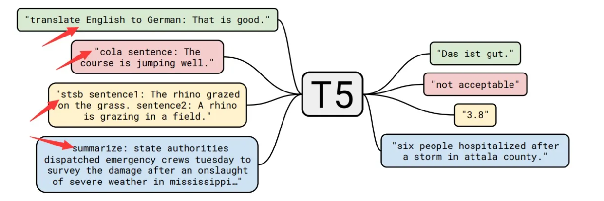
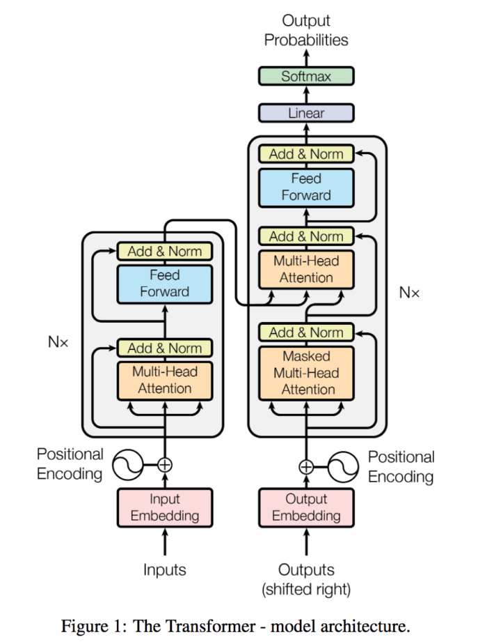
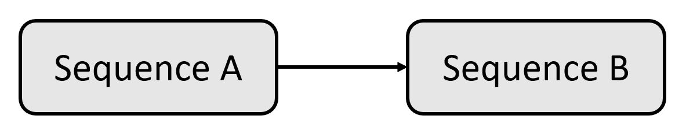
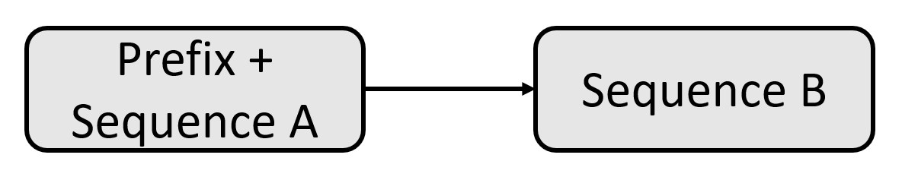
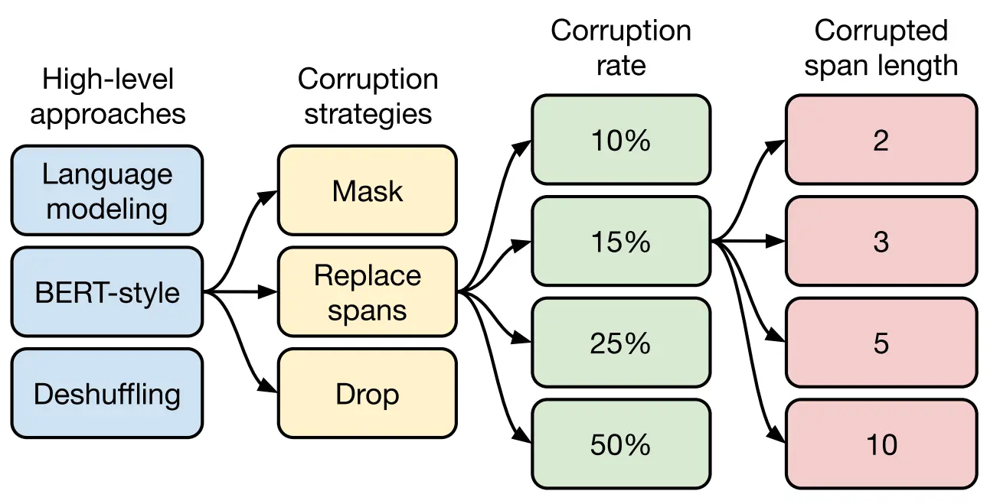

# T5
- [T5](#t5)
  - [Introduction](#introduction)
  - [Data set](#data-set)
  - [Architecture](#architecture)
    - [Model structure](#model-structure)
    - [Input-output representation](#input-output-representation)
    - [Pre-training process](#pre-training-process)
  - [Analysis](#analysis)
    - [Application scenario](#application-scenario)
    - [Advantages and disadvantages](#advantages-and-disadvantages)
    - [Direction of development](#direction-of-development)
    - [Conclusion](#conclusion)
  - [References](#references)

## Introduction
T5 (Text-to-Text Transfer Transformer) is a large pre-trained language model proposed by the Google team in a 2019 [《Exploring the Limits of Transfer Learning with a Unified Text-to-Text Transformer》](https://arxiv.org/pdf/1910.10683.pdf) paper. T5 model is based on Transformer architecture, uses Encoder-Decoder structure, and uses large-scale data sets for pre-training.

The T5 model is unique in its versatility and flexibility. Unlike traditional language models, T5 is designed as a "Text-to-Text" model, which means that it can handle a variety of natural language processing tasks by expressing the input and output in the corresponding textual form. T5 can be applied directly to various tasks by adding different prefixes (shown by arrows on the figure) to the input corresponding to each task. This enables the T5 model to handle a variety of tasks including text classification, question answering, named entity recognition, machine translation, and so on.

The pre-training process of T5 model uses a large-scale text data set, including various types of text data from the Internet. Through large-scale pre-training, the T5 model learns a wealth of language knowledge and representation, so that it can better understand and generate natural language.

In the application phase, the T5 model performs task-specific training through fine-tuning. Through fine-tuning, the T5 model can adjust and optimize parameters according to the needs of specific tasks to achieve better performance and effect.

T5 model has achieved remarkable results in the field of natural language processing, not only achieving leading performance on several benchmark tasks, but also performing well on multilingual and multi-domain tasks. Its versatility and flexibility make the T5 model a powerful tool that provides a unified framework and underlying model for a variety of natural language processing tasks.

## Data set
T5 The authors selected the Common Crawl data set, which grabs about 20 terabytes of text data per month. Although the data set has extracted text, it is actually not clean, and it also contains a lot of non-natural language things, such as error messages, menus, repeated text, so the data is processed more carefully:
* Keep only lines that end with a terminal symbol (that is, a period, exclamation point, question mark, or quotation mark);
* Delete any web pages that contain words in List-of-Dirty-Naughty-Obscene-and-Otherwise Bad-Words;
* Delete lines containing Javascript words;
* Remove pages that contain braces, which are common in programming languages;
* Delete all pages where the phrase "lorem ipsum" " (i.e.," test of composition ") appears;
* The data set is deduplicated, and only one sentence is retained when three consecutive sentences are repeated;
* Filter out non-English web pages.
The author named the cleaned data set "Colossal Clean Crawled Corpus", that is, C4 data set.

## Architecture
### Model structure

T5 model adopts the encoder-decoder structure of Transformer, which is basically the same as the original Transformer structure:
* The encoder and decoder remain in the model. The encoder and decoder layers become blocks and the sublayers become subcomponents containing the self-attention layer and the feedforward network. Transformer components are standard components that can be assembled in a variety of ways.
* Self-attention is order-independent. Instead of recursion, the dot product of matrices is used. It explores the relationship between each word and the others in a sequence. The position encoding is added to the embedding of the word before the dot product is taken.
* The original Transformer uses sine and cosine functions to calculate the position embedding, while T5 uses relative position embedding. In T5, all layers share a set of position embeddings, and each layer is calculated once, making the model more sensitive to position.

### Input-output representation
When we humans communicate, we always start with one sequence and then another. T5 model explores the prospect of NLP transfer learning technology by introducing a unified framework. The core idea is to find an abstract model like human beings to transform problems into text-to-text format.

The T5 model can be summarized as a Transformer of text-to-text transfer, so that all NLP tasks can be described as text-to-text problems.

The idea of the T5 model is to find a uniform and specific format for each task submitted to Transformer. In this way, the model parameters are trained on all types of tasks using one text-to-text format. The T5 team came up with a simple solution: add a prefix to the input sequence. This prefix is not just a label or an indicator for classification like [CLS]. The T5 prefix contains the essence of the task that Transformer needs to solve.

In this way, we obtain a uniform format for a wide range of NLP tasks:

* Input: directly spell the task name as prefix and input, for example: "translate English to German: That is good."
* Output: The classification task needs to output "entailment", "neutral", and "contradiction"; the regression task outputs floating point numbers of str type. For other tasks, please refer to the appendix of the original text.

Here, the selection of the prefix for each task can be considered as a hyperparameter, that is, by artificially designing the prefix style. The authors found that different prefixes have limited impact on the model, so they did not do a lot of experiments to compare the results of choosing different prefixes.

This unified process allows us to use the same model, hyperparameters, and optimizer for a wide range of tasks.

### Pre-training process

As shown in the figure below, the pre-training process of the T5 model can be divided into four levels.
* First of all, the high-level self-supervised pre-training method is compared:
    * Prefix language modeling: Divide the sample into two parts, the first part is used as the input of encoder, which is full-visible mask, and the second part is used as the target output of decoder, which is causal mask;
    * BERT-style (masked language modeling): Select 15% tokens, replace 90% with [MASK] and 10% with random tokens, and predict the 15% tokens;
    * Deshuffling: The token is scrambled and the target is predicted to be the original sequence.
 
Among them, the BERT-style pre-training target effect is the best.

* Secondly, there are three strategies for destroying part of the text:
    * Mask method: 15% of tokens are replaced by [MASK], and the target is predicted as the original sequence;
    * Replace span method: replace the continuous segment of the selected 15% token with the sentry token as the input, and the target predicts the 15% token;
    * Drop method: directly remove 15% of tokens when inputting, and predict them when predicting.

Experiments show that these three variants have the same effect as BERT-style, but the latter two methods have a great attraction that they do not need to predict the original sentence, but only predict the selected 15% token, which is faster to train, while the second method has a slightly better effect, so the next experiment. The authors all use the Replace span method as the pre-training target.

* Again, choosing the degree of damage to the text, the author of the T5 model chose four values: 10%, 15%, 25%, 50%. Finally, through experiments, it is found that the proportion of 15% is good, which also proves that the choice of BERT model is correct.

* Finally, after determining the selection of the proportion of text destruction, we need to determine the length of the small segment replacement. The T5 model mainly compares the four values of 2, 3, 5 and 10, and finally finds that the effect of replacing the length of 3 is the best.
  
## Analysis
### Application scenario
* Text classification: It can be used for text classification tasks such as sentiment analysis and spam detection.
* Text generation: can generate text content such as articles, summaries, dialogues, etc.
* Machine Translation: Excellent performance in translation tasks, able to translate in multiple languages.
* Question-answering system: It can be used as a question-answering model to answer users' questions.
* Natural Language Reasoning: Can be used to determine the logical relationship between two sentences.

### Advantages and disadvantages
* Unified architecture: T5 adopts a unified Transformer encoder-decoder structure, which makes it possible to use the same model for different tasks and simplifies model design and deployment.
* Large-scale pre-training: T5 uses large-scale data sets for pre-training and learns rich language representations, thus performing well on multiple tasks.
* Ability to handle a variety of tasks: T5 can translate different natural language processing tasks into text-to-text problems, thus achieving versatility.
* Open source: The code and pre-trained weights of the T5 model are publicly available, making it easy for researchers and engineers to use and extend the model.

The strengths of T5 include its ability to achieve state-of-the-art results in a variety of NLP tasks, its versatility and flexibility, and its excellence in language translation tasks. T5 has been applied in many industries such as medical, financial, e-commerce and so on.
  
However, T5 has some limitations and challenges. One of the main challenges is the large computational resources required for training and fine-tuning. In addition, the text-to-text approach of T5 may not be appropriate for all NLP tasks, and there may be ethical concerns that it may produce biased or misleading text.

### Direction of development
The proposal of T5 model brings new ideas and development directions for the field of natural language processing. In the future, it is expected to see more improved and derived models based on T5 to further improve the performance and applicability of the model. At the same time, with the continuous improvement of computing resources and the expansion of data sets, the application of T5 model in more fields and tasks will be further expanded, bringing more possibilities for the development of natural language processing technology.

### Conclusion
T5 model is a large pre-trained language model based on Transformer architecture, which was proposed by Google in 2020. The design concept of T5 is to transform all natural language processing tasks into text-to-text problems, using a unified encoder-decoder structure, making it possible to use the same model on different tasks. This versatility allows the T5 to perform well on multiple tasks and achieve significant performance gains.

T5 model learns rich language representation through large-scale pre-training, and can achieve excellent results in many natural language processing tasks, such as text classification, text generation, machine translation, question answering system, natural language reasoning and so on. Its open source and pre-trained weights make it easy for researchers and engineers to use and extend the model.

Although the T5 model has a wide range of applications, due to the large scale of the model, the large consumption of computing resources, the long pre-training time and the high demand for a large amount of data, it may be necessary to consider the limitations of computing resources and data in practical applications. In general, the T5 model has brought new ideas and development directions for the field of natural language processing, and its versatility and excellent performance have brought great impetus to the development of natural language processing technology.

## References
* [《Exploring the Limits of Transfer Learning with a Unified Text-to-Text Transformer》](https://arxiv.org/pdf/1910.10683.pdf)
* [T5: Text-to-Text Transfer Transformer 阅读笔记](https://cloud.tencent.com/developer/article/1537682)