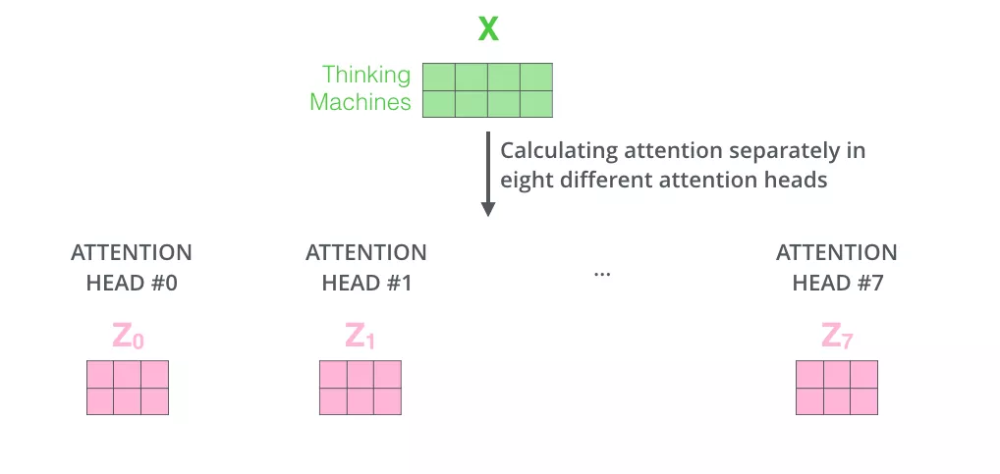

# Transformer
- [Transformer](#transformer)
  - [Introduction](#introduction)
  - [Model description](#model-description)
    - [Overall architecture](#overall-architecture)
    - [Input](#input)
    - [Encoder](#encoder)
      - [Self-attention layer](#self-attention-layer)
      - [Multi-head attention mechanism](#multi-head-attention-mechanism)
      - [Residual linking and normalization](#residual-linking-and-normalization)
    - [Decoder](#decoder)
      - [Mask](#mask)
    - [The linear layer and the softmax layer](#the-linear-layer-and-the-softmax-layer)
  - [Code](#code)
    - [Embedding](#embedding)
      - [Positional Embedding](#positional-embedding)
    - [Encoder](#encoder-1)
      - [Muti-Head-Attention](#muti-head-attention)
    - [Decoder](#decoder-1)
  - [References](#references)

## Introduction
In 2017, the Google team first proposed the Transformer model structure by using the attention idea in the paper [《Attention Is All You Need》](https://proceedings.neurips.cc/paper_files/paper/2017/file/3f5ee243547dee91fbd053c1c4a845aa-Paper.pdf). Compared with the previous neural network structure such as RNN, Transformer computes the whole sequence input in parallel when processing the sequence input, and does not need to process the input sequence recursively according to the time step, which has achieved innovative results in the task of seq2seq. In 2018, Google used Transformer for the first time in the paper [《BERT: Pre-training of Deep Bidirectional Transformers for Language Understanding》](https://arxiv.org/pdf/1810.04805.pdf) to pre-train large models and fine-tune downstream tasks. Since then, researchers have combined the model structure of Transformer with the training method of pre-training and fine-tuning, and proposed a series of improvements to the model structure and training method of Transformer. Nowadays, various deep learning models based on Transformer have made many achievements in NLP directions such as machine translation, question answering system, text summarization and speech recognition.

## Model description
### Overall architecture
We can learn the macroscopic structure of Transformer from the perspective of seq2seq. Taking the machine translation task as an example, Transformer can be regarded as a black box, the input of which is a Spanish text sequence and the output is an English text sequence.

Disassemble the black box in the above figure into the standard structure of seq2seq to obtain an Encoders module and a Decoders module. As shown in the following figure.

The details of the encoder and decoder in the above figure are shown below. From the figure below, we can see that the Encoder module consists of 6 encoders. Similarly, the Decoder module is also composed of six decoders. The number of basic components here is a manually set hyperparameter, which is also the first adjustable parameter in Transformer. Each encoder network structure is the same, and each decoder network structure is the same. The network structure of that encoder and decoders of different layer do not share parameters.

The single-layer encoder consists of two parts:
* Self-Attention Layer: When encoding a specific word, it will help the encoder to pay attention to the information of other words in the sentence and obtain the semantics of the context.
* Feed Forward Neural Network: The output of the self-attention layer will be processed by the feed forward neural network to obtain a new vector, which will be sent to the next layer of encoder to continue the same operation.

The single-layer decoder consists of three parts, in addition to the two layers mentioned in the encoder, it also adds:
* Encoder-Decoder Attention Layer: This layer helps the decoder focus on the most relevant parts of the input sequence, similar to Attention in the seq2seq model.

This is the overall architecture of Transformer.

### Input
Like most natural language processing tasks, Transformer first uses a word embedding algorithm to convert each word in the input text sequence into a corresponding word vector. In practical applications, the embedding vector of each word is generally 512-dimensional. In order to be concise and easy to understand, four lattices are used here. In fact, the dimension of the embedding vector is the second hyperparameter in Transformer that we can set manually. Generally, this dimension is the maximum value of the sentence length in the training set. (In practice, we usually choose an appropriate length as the maximum length of the input text sequence. If a sentence does not reach this length, a special "padding" word needs to be used first; if the sentence exceeds this length, it needs to be truncated.)

In order to deal with the lack of a way to explain the order of words in the input sequence in the model, Transformer adds Positional Encoding to the embedding vector of each input, whose dimension is consistent with the embedding vector. These location vectors follow certain specific patterns, which help the model to determine the location characteristics of each word and the distance characteristics between different words.

In this paper [《Attention Is All You Need》](https://proceedings.neurips.cc/paper_files/paper/2017/file/3f5ee243547dee91fbd053c1c4a845aa-Paper.pdf), the following calculation method is given for the position vector:
$PE(pos,2i)=sin(\frac{pos}{10000^{\frac{2i}{d_{model}}}})$ 和
$PE(pos,2i+1)=cos(\frac{pos}{10000^{\frac{2i}{d_{model}}}})$
 where, $pos$ is the position of the current word in the sentence, $d_{model}$ represents the dimension of the position vector, and $i \in (0, d_{model})$ represents the $i$th dimension of the position vector. At even positions, sine coding is used, and at odd positions, cosine coding is used.

Positional Encoding is added to the value of embedding and sent as input to the next layer.

### Encoder
The vector obtained after input processing will be sent to the encoder of the first layer. After self-attention processing, the data will be sent to the feedforward neural network. The calculation of the feedforward neural network can be parallel, and the output will be input to the encoder of the next layer. The flow of the vector sequence in the single-layer encoder is shown in the following figure.

#### Self-attention layer
Take machine translation as an example to analyze the Self Attention mechanism.

Suppose the sentence we want to translate is: 
"The animal didn't cross the street because it was too tired".

Look at this sentence, in which "it" is a pronoun, so which word in the original sentence does it refer to? Does it mean "animal" or "street"? This problem is easy for humans to distinguish, but not for models. The Self Attention mechanism helps the model associate the word "it" with "animal" when dealing with it. Similarly, when the model processes other words in a sentence, the Self Attention mechanism enables the model to focus not only on the word at the current position, but also on related words at other positions in the sentence, so as to better understand the word at the current position and find a better way to encode the current word.

Using the visualization of [Tensor2Tensor](https://colab.research.google.com/github/tensorflow/tensor2tensor/blob/master/tensor2tensor/notebooks/hello_t2t.ipynb), we can intuitively see the state of Transformer when it encodes "it" at Layer 5. After visualization, it shows that some of its attention is focused on "The animal" "and the information of these two words is integrated into "it".

Several steps of the Self Attention mechanism calculation are explained in detail below.

*First, Self Attention calculates three vectors query, key, and value for each input from the encoder. They are $q$, $k$, $v$. Where, $v$ is the vector representing input features, and $q$ and $k$ are the eigenvectors for calculating Attention weight.They are all obtained by multiplying the input word embedding vector with three weight matrices, which are obtained in the model training phase. Generally speaking, in order to make the calculation more stable, the dimensions of these three vectors will be smaller than the dimensions of the input vector, which we assume to be 64.
  

* The second step is to calculate the input attention score, which determines how much attention the encoder pays to words at other positions in the sentence when encoding words at a certain position. Take the following figure as an example, suppose we are now calculating the attention score of the first word "Thinking" in the input, which is multiplied by the query and key points. The first fraction of Thinking is the inner product of $q_1$ and $k_1$, and the second fraction is the dot product of $q_1$ and $k_2$.

* The third step is to divide each fraction by $\sqrt{d_k}$, $d_{k}$, which is the dimension of the key vector. This is the square root of 8 divided by 64. This is the default, but it can also be divided by other values in order to make the gradient calculation more stable during backpropagation. These scores are then normalized using the Softmax function so that the resulting attention scores are all positive and sum to 1, as shown in the figure below. The attention score at this time indicates how much attention other words receive when calculating the current position.

* The fourth step is to multiply the value obtained by softmax with the corresponding Value vector. By doing so, we can pay more attention to the words with high scores, while the words with low scores get very little attention. Finally, the Value vectors obtained above are added to obtain the output $z_1$ corresponding to the current position of Self Attention, and the result is passed to the feedforward neural network.

So far, it is the whole process of self-attention mechanism calculation.

In practice, in order to make the calculation faster, we choose to put all the word vectors into a matrix as input, and multiply them with three weight matrices to get $Q$, $K$, $V$ matrices. Each row in the matrix X represents a word vector for each word in the sentence. Each row in the $Q$, $K$, $V$ matrix represents a Query vector, a Key vector, and a Value vector, respectively. The vector dimension is $d_k$.

Finally, we summarize the above steps into a formula:

In fact, this method of determining the weight distribution of value by the similarity between query and key is called scaled dot-product attention, and the formula is as follows:
$$ Attention(Q,K,V) = softmax(\frac{QK^T}{\sqrt{d_k}}) V $$

#### Multi-head attention mechanism

The paper [《Attention Is All You Need》](https://proceedings.neurips.cc/paper_files/paper/2017/file/3f5ee243547dee91fbd053c1c4a845aa-Paper.pdf) adds the multi-head attention mechanism as an improvement. This mechanism is also relatively easy to understand, that is, initializing multiple sets of $Q$, $K$, $V$ matrices for calculation. Take the paper as an example, first set eight different weights $W^Q, W^K$ and $W^V$, and multiply them with the input matrix to get eight $Q$, $K$, $V$ matrices.

In the same way, 8 $Z$ matrices are calculated.

But because the feedforward neural network can only input a single matrix, we combine the eight matrices into a large matrix, and then multiply the combined large matrix with an additional weight matrix $W^O$ to get a final $Z$ matrix.

The enhancement of the multi-head attention mechanism to the original attention layer is reflected in:
* The multi-head attention mechanism divides the model into multiple attention heads, which can map the input vector to multiple corresponding subspaces. Let the model focus on different aspects of information, and finally integrate all aspects of information to help the network capture richer features and information. To translate the sentence: The animal didn't cross the street because it was too tired, for example, we want the model to focus on "it" itself, as well as "the" and "animal". You may also want the model to focus on "tired". In this case, the long attention mechanism will come into play.

Through [Tensor2Tensor](https://colab.research.google.com/github/tensorflow/tensor2tensor/blob/master/tensor2tensor/notebooks/hello_t2t.ipynb) visualization, we can more intuitively feel the role of the multi-head attention mechanism.

#### Residual linking and normalization
There is an Add & Normalize module after each sub-module of the decoder. The residual link and normalization module.
* The purpose of residual connection is to improve the representation ability of the network and reduce the feature degradation caused by the symmetry of the network with the deepening of the number of neural network layers.
  
* Normalization converts the input to data with a mean of 0 and a variance of 1. We normalize the data before feeding it into the activation function to prevent the data from becoming more biased as the number of network layers increases.

Full details inside the encoder are shown in the figure below:

### Decoder
The structure and principle of the decoder are similar to those of the encoder. After being processed by multiple layers of encoders, the last layer of encoders will output a set of sequence vectors, which will be used as the $K$ and $V$ input of the decoder. These two sets of vectors will help the decoder to focus on the appropriate position in the input sequence. Each time step of the decoding stage outputs a translated word, and the output of the decoder at the current time step is taken as the input $Q$ again, and the outputs $K$ and $V$ of the encoder are taken as the input of the decoder at the next time step. This process is then repeated until a terminator is output.

#### Mask
After the decoder gets the input with the position vector added, there will be a mask operation in the self-attention layer. A mask is a mask that masks certain values so that they have no effect when the parameter is updated. Transformer has the following two mask modes:
* Padding mask: This method is used in scaled dot-product attention. The padding mask is a tensor where each position is Boolean, where the false value corresponds to the position we are working on. For each batch of input sequences, we need to align them. Shorter sequences are filled with 0, and longer sequences are truncated. For the filling part, there is no value for the attention mechanism, so the method will add a huge negative number to these positions that should not attract attention, and the probability of these positions will be infinitely close to 0 after softmax processing.
* Sequence mask: This method is only used in the self-attention of the decoder. The sequence mask prevents the decoder from seeing future information. That is to say, for a sequence, at the time when time_step is t, the decoding output can only depend on the output before time t, and cannot depend on the output after t. This is done by generating an upper triangular matrix with all upper triangular values being 0. Act this matrix on every sequence.

### The linear layer and the softmax layer
The final linear and softmax layers need to convert the vector output by the decoder into the word to be translated. The linear layer is a simple fully connected neural network, which can map the vector generated by the decoder into a large vector logits. The dimension of the logits vector should be consistent with the size of the model vocabulary. Assuming that the output vocabulary of the model has 10000 English words, the corresponding dimension of the logits vector is also 10000, where each number corresponds to a score of a word. The Softmax layer will convert these scores into corresponding probabilities, and the word corresponding to the position with the highest probability is the word output at the current time step.

The overall schematic diagram of the above contents is as follows:

## Code
### Embedding

~~~python
class Embeddings(nn.Module):
    def __init__(self, d_model, vocab):
        super(Embeddings, self).__init__()
        self.lut = nn.Embedding(vocab, d_model)
        self.d_model = d_model

    def forward(self, x):
        return self.lut(x) * math.sqrt(self.d_model) 
~~~
The code is very simple, and the only thing to note is that the forward process uses the nn. Embedding to Embedding the input x, as well as dividing by $\sqrt{d\_model}$.

#### Positional Embedding

~~~python
def positional_encoding(inputs,
                        maxlen,
                        masking=True,
                        scope="positional_encoding"):

    E = inputs.get_shape().as_list()[-1] # static
    N, T = tf.shape(inputs)[0], tf.shape(inputs)[1] # dynamic
    with tf.variable_scope(scope, reuse=tf.AUTO_REUSE):
        position_ind = tf.tile(tf.expand_dims(tf.range(T), 0), [N, 1]) # (N, T)

        position_enc = np.array([
            [pos / np.power(10000, (i-i%2)/E) for i in range(E)]
            for pos in range(maxlen)])

        position_enc[:, 0::2] = np.sin(position_enc[:, 0::2])  # dim 2i
        position_enc[:, 1::2] = np.cos(position_enc[:, 1::2])  # dim 2i+1
        position_enc = tf.convert_to_tensor(position_enc, tf.float32) # (maxlen, E)

        outputs = tf.nn.embedding_lookup(position_enc, position_ind)

        if masking:
            outputs = tf.where(tf.equal(inputs, 0), inputs, outputs)

        return tf.to_float(outputs)
~~~
Because the model does not contain RNN and CNN structure, in order to make the model can effectively use the sequence order features, we need to add the information of the relative position of each Token in the sequence or the absolute position of the Token in the sequence. The model encodes where the words in the sequence occur. The positional encoding and embedding have the same dimension, and the two vectors are added to get the input containing the positional information. The encoding method used in the paper uses sine encoding at even positions and cosine encoding at odd positions. The method of calculation is as follow (described in detail in that previou input section, I won't repeat it here): 
$$ PE(pos,2i)=sin(\frac{pos}{10000^{\frac{2i}{d_{model}}}}) $$
$$ PE(pos,2i+1)=cos(\frac{pos}{10000^{\frac{2i}{d_{model}}}}) $$

### Encoder

~~~python
class Encoder(nn.Module):
    "Core encoder is a stack of N layers"

    def __init__(self, layer, N):
        super(Encoder, self).__init__()
        self.layers = clones(layer, N)
        self.norm = LayerNorm(layer.size)

    def forward(self, x, mask):
        "Pass the input (and mask) through each layer in turn."
        for layer in self.layers:
            x = layer(x, mask)
        return self.norm(x)
~~~
The Encoder will map the input sequence to a continuous representation sequence. The Encoder is an instantiation of the EncoderLayer, which is composed of 6 layers of EncoderLayers. Of course, different layers can be selected.

~~~python
class EncoderLayer(nn.Module):
    "Encoder is made up of self-attn and feed forward (defined below)"
    def __init__(self, size, self_attn, feed_forward, dropout):
        super(EncoderLayer, self).__init__()
        self.self_attn = self_attn #sublayer 1 
        self.feed_forward = feed_forward #sublayer 2 
        self.sublayer = clones(SublayerConnection(size, dropout), 2) 
        self.size = size

    def forward(self, x, mask):
        "Follow Figure 1 (left) for connections."
        x = self.sublayer[0](x, lambda x: self.self_attn(x, x, x, mask))
        return self.sublayer[1](x, self.feed_forward) 
~~~
The EncoderLayer is divided into two sub-layers, one for the Multi-Head Self Attention and the other for the Feed-Forward network.

 #### Muti-Head-Attention

~~~python
 class MultiHeadedAttention(nn.Module):
    def __init__(self, h, d_model, dropout=0.1):
        "Take in model size and number of heads."
        super(MultiHeadedAttention, self).__init__()
        assert d_model % h == 0
        # We assume d_v always equals d_k
        self.d_k = d_model // h  # d_v=d_k=d_model/h 
        self.h = h 
        self.linears = clones(nn.Linear(d_model, d_model), 4)
        self.attn = None  
        self.dropout = nn.Dropout(p=dropout)

    def forward(self, query, key, value, mask=None):
        "Implements Figure 2"
        if mask is not None:
            # Same mask applied to all h heads.
            mask = mask.unsqueeze(1)
        nbatches = query.size(0)

        query, key, value = \         # q,k,v [batch_size,Len,d_model = 512]
            [l(x).view(nbatches, -1, self.h, self.d_k).transpose(1, 2)
             for l, x in zip(self.linears, (query, key, value))]

        x, self.attn = attention(query, key, value, mask=mask,
                                 dropout=self.dropout)

        x = x.transpose(1, 2).contiguous() \
            .view(nbatches, -1, self.h * self.d_k) 
        return self.linears[-1](x)
~~~
Muti-Head-Attention is composed of H Self-Attention. In the text, H is 8. In the text, 512 dimensions are divided into H, each of which is self-attention. The parameters are not shared with each other. The essence of Multi-Head Attention is: Under the condition that the total amount of parameters remains unchanged, the same query, key, and value are mapped to different subspaces of the original high-dimensional space for attention calculation, and attention information in different subspaces is merged in the last step. This reduces the dimension of each vector when calculating the attention of each head, in a sense preventing overfitting; Because Attention has different distributions in different subspaces, Multi-head Attention actually finds the association relationships between sequences from different angles, and in the last concat step, the association relationships captured in different subspaces are synthesized again.

~~~python
def attention(query, key, value, mask=None, dropout=None):
    "Compute 'Scaled Dot Product Attention'"
    d_k = query.size(-1)
    scores = torch.matmul(query, key.transpose(-2, -1)) \
             / math.sqrt(d_k) [batch,len,h,d_k] * [batch,len,d_k,len] 
    if mask is not None:
        scores = scores.masked_fill(mask == 0, -1e9)
    p_attn = F.softmax(scores, dim = -1)
    if dropout is not None:
        p_attn = dropout(p_attn)
    return torch.matmul(p_attn, value), p_attn
~~~
The Attention function maps a Query and a set of key-value pairs to the output, where Query, Key, Value, and output are vectors. The output is a weighted sum of values, where the weight assigned to each Value is calculated by a compatible function of Query with the corresponding Key. Different Linear layers are used to calculate keys, queries and values based on X. K, Q and V after Linear are independent of each other and have different weights.

### Decoder

~~~python
class Decoder(nn.Module): 
	def __init__(self, layer, N):
		super(Decoder, self).__init__()
		self.layers = clones(layer, N)
		self.norm = LayerNorm(layer.size)
	
	def forward(self, x, memory, src_mask, tgt_mask):
		for layer in self.layers:
			x = layer(x, memory, src_mask, tgt_mask)
		return self.norm(x)
~~~
Decoder is also a stack of N DecoderLayers. The parameter layer is DecoderLayer, which is also a callable. Finally, the __call__ will call the DecoderLayer. Forward method, which requires four parameters (described later). Input X, output memory of Encoder layer, Mask (SRC_mask) of input Encoder and Mask (TGT_mask) of input Decoder. All the forward of the Decoder here also requires these four parameters.

~~~python
class DecoderLayer(nn.Module):
	def __init__(self, size, self_attn, src_attn, feed_forward, dropout):
		super(DecoderLayer, self).__init__()
		self.size = size
		self.self_attn = self_attn
		self.src_attn = src_attn
		self.feed_forward = feed_forward
		self.sublayer = clones(SublayerConnection(size, dropout), 3)
	
	def forward(self, x, memory, src_mask, tgt_mask): 
		m = memory
		x = self.sublayer[0](x, lambda x: self.self_attn(x, x, x, tgt_mask))
		x = self.sublayer[1](x, lambda x: self.src_attn(x, m, m, src_mask))
		return self.sublayer[2](x, self.feed_forward)
~~~
DecoderLayer has one more src-attn layer than EncoderLayer, which is the output (memory) of attend to Encoder during Decoder. The implementation of src-attn is the same as that of self-attn, but the inputs of Query, Key, and Value are different. Query of ordinary Attention (src-attn) is input from the lower layer (output from self-attn), and Key and Value are the output memory of the last layer of Encoder; The Query, Key, and Value of Self-Attention are all input from the lower level.

## References
* [《Attention Is All You Need》](https://proceedings.neurips.cc/paper_files/paper/2017/file/3f5ee243547dee91fbd053c1c4a845aa-Paper.pdf)
* [Diagram transformer | The Illustrated Transformer.](https://blog.csdn.net/qq_36667170/article/details/124359818)
* [Introduction to natural language processing (NLP) based on transformers](https://datawhalechina.github.io/learn-nlp-with-transformers/#/./%E7%AF%87%E7%AB%A02-Transformer%E7%9B%B8%E5%85%B3%E5%8E%9F%E7%90%86/2.2-%E5%9B%BE%E8%A7%A3transformer?id=attention%e4%bb%a3%e7%a0%81%e5%ae%9e%e4%be%8b)
* [The Annotated Transformer](https://nlp.seas.harvard.edu/2018/04/03/attention.html)