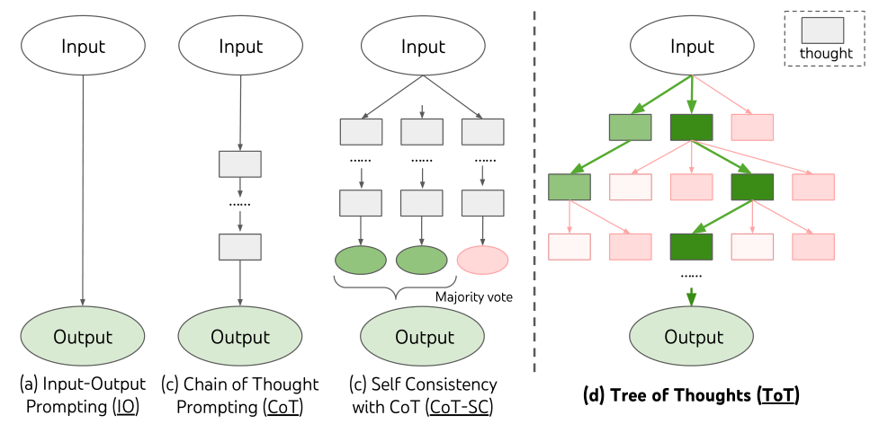

# **Tree of Thoughts (ToT)**

## Introduction

[[Yao et al., 2023]](https://arxiv.org/abs/2305.10601) introduced a new framework for language 
model inference, “Tree of Thoughts” (ToT), which generalizes over the
popular “Chain of Thought” approach to prompting language models, and enables
exploration over coherent units of text (“thoughts”) that serve as intermediate steps
toward problem solving. ToT allows LMs to perform deliberate decision making
by considering multiple different reasoning paths and self-evaluating choices to
decide the next course of action, as well as looking ahead or backtracking when
necessary to make global choices.

Experiments were conducted on three tasks requiring non-trivial planning or search: 
Game of 24, Creative Writing, and Mini Crosswords.
Results showed that ToT obtains superior results on
all three tasks by being general and flexible enough to support different levels of thoughts, different
ways to generate and evaluate thoughts, and different search algorithms that adapt to the nature of
different problems. 


## How it Works?

ToT frames any problem as a search over a tree, where each node is a state s = [x, z<sub>1..i</sub>] representing a partial solution with the input and the sequence of thoughts so far. A specific instantiation of ToT involves answering four questions:
1. How to decompose the intermediate process into thought steps; 
2. How to generate potential thoughts from each state; 
3. How to heuristically evaluate states; 
4. What search algorithm to use.



To answer the four questions, the process of ToT can be summarized as follows:

1. **Thought decomposition.** Depending on different problems, a thought could be a couple of words (Crosswords), a line of equation (Game of 24), or a whole paragraph of writing plan (Creative Writing). In general, a thought should be “small” enough so that LMs can generate promising and diverse, yet “big” enough so that LMs can evaluate its prospect toward problem.
2. **Thought generator.** 

   (a) Sample i.i.d. thoughts from a CoT prompt (Creative Writing).This works better when the thought space is rich (e.g. each thought is a paragraph), and i.i.d. samples lead to diversity;

   (b) Propose thoughts using a “propose prompt” (Game of 24, Crossword).This works better when the thought space is more constrained (e.g. each thought is just a word or a line), so proposing different thoughts in the same context avoids duplication.
3. **State evaluator.** Use the LM to deliberately reason about states. We consider two strategies to evaluate states either independently or together:
   
   (a)Value each state independently;
   
   (b)Vote across states.
4. **Search algorithm.** Finally, within the ToT framework, one can plug and play different search algorithms depending on the tree structure.
   
   (a) Breadth-first search (BFS) maintains a set of the b most promising states per step. This is used for Game of 24 and Creative Writing where the tree depth is limit (T ≤ 3), and initial thought steps can be evaluated and pruned to a small set (b ≤ 5).

   (b) Depth-first search (DFS) explores the most promising state first, until the final output is reached (t > T ), or the state evaluator deems it impossible to solve the problem from the current s. In the latter case, the subtree from s is pruned to trade exploration for exploitation. In both cases, DFS backtracks to the parent state of s to continue exploration. This is used for Mini Crosswords.


## Prompt Example

### *Prompt*

#### *Game of 24 Prompt*
```
propose_prompt:
Input: 2 8 8 14
Possible next steps:
2 + 8 = 10 (left: 8 10 14)
8 / 2 = 4 (left: 4 8 14)
14 + 2 = 16 (left: 8 8 16)
2 * 8 = 16 (left: 8 14 16)
8 - 2 = 6 (left: 6 8 14)
14 - 8 = 6 (left: 2 6 8)
14 /  2 = 7 (left: 7 8 8)
14 - 2 = 12 (left: 8 8 12)
Input: 4 9 10 13
Possible next steps:

value_prompt:
Evaluate if given numbers can reach 24 (sure/likely/impossible)
4 4 10
4 + 4 + 10 = 8 + 10 = 18
4 * 10 - 4 = 40 - 4 = 36
(10 - 4) * 4 = 6 * 4 = 24
sure
5 7 8
5 + 7 + 8 = 12 + 8 = 20
(8 - 5) * 7 = 3 * 7 = 21
I cannot obtain 24 now, but numbers are within a reasonable range
likely
10 10 11
10 + 10 + 11 = 31
(11 - 10) * 10 = 10
10 10 10 are all too big
impossible
10 13 13
```
#### *Creative Writing Prompt*
```
cot_prompt (5 times):
Write a coherent passage of 4 short paragraphs. 
The end sentence of each paragraph must be: 1.It isn't difficult to do a handstand if you just stand on your hands. 2.It caught him off guard that space smelled of seared steak. 3.When she didn’t like a guy who was trying to pick her up, she started using sign language. 4.Each person who knows you has a different perception of who you are.
Make a plan then write. Your output should be of the following format:
Plan:
Your plan here.

vote_prompt (5 times):
Given an instruction and several choices, decide which choice is most promising. Analyze each choice in detail, then conclude in the last line "The best choice is {s}", where s the integer id of the choice.
```
#### *Mini Crosswords Prompt*
```
propose_prompt:
Let's play a 5 x 5 mini crossword, where each word should have exactly 5 letters.
h1. One who saws
h2. A fungus genus
h3. An assessor
h4. Pasture land
h5. Receiving by the ear
v1. To swell; to increase
v2. The Brazilian macaw; an Australian bird
v3. A Timorese island
v4. Excessive fluid accumulation
v5. Dewy; roscid
Given the current status, list all possible answers for unfilled or changed words, and your confidence levels (certain/high/medium/low), using the format "h1. apple (medium)". Use "certain" cautiously and only when you are 100% sure this is the correct word. You can list more then one possible answer for each word.

value_prompt:
Evaluate if there exists a five letter word of some meaning that fit some letter constraints (sure/maybe/impossible).
Incorrect; to injure: w _ o _ g
The letter constraint is: 5 letters, letter 1 is w, letter 3 is o, letter 5 is g.
Some possible words that mean "Incorrect; to injure":
wrong (w r o n g): 5 letters, letter 1 is w, letter 3 is o, letter 5 is g. fit!
sure
Dewy; roscid: r _ _ _ l
The letter constraint is: 5 letters, letter 1 is r, letter 5 is l.
Some possible words that mean "Dewy; roscid":
moist (m o i s t): 5 letters, letter 1 is m, not r
humid (h u m i d): 5 letters, letter 1 is h, not r
I cannot think of any words now. Only 2 letters are constrained, it is still likely
maybe
Chance; a parasitic worm; a fish: w r a k _
The letter constraint is: 5 letters, letter 1 is w, letter 2 is r, letter 3 is a, letter 4 is k.
Some possible words that mean "Chance; a parasitic worm; a fish":
fluke (f l u k e): 5 letters, letter 1 is f, not w
I cannot think of any words now. 4 letters are constrained, and it is extremely unlikely to have a word with pattern w r a k _ to mean "Chance; a parasitic worm; a fish"
impossible
To swell; to increase: s u r _ _
The letter constraint is: 5 letters, letter 1 is s, letter 2 is u, letter 3 is r.
Some possible words that mean " To swell; to increase ":
```
### *Output* 
#### *Game of 24 Output*
```
output of propose_prompt:
4 + 9 = 13 (left: 10 13 13)
9 - 4 = 5 (left: 5 10 13)
10 - 4 = 6 (left: 6 9 13)
13 - 9 = 4 (left: 4 10 13)
4 * 9 = 36 (left: 10 13 36)
10 + 4 = 14 (left: 9 13 14)

output of vote_prompt:
10 + 13 + 13 = 36
(13 - 10) * 13 = 39
10 13 13 are all too big
impossible
```
#### *Creative Writing Output*
```
output of cot_prompt (1th output):
Plan:
1.Introduce the concept of doing a handstand by standing on one's hands.
2.Transition to a surprising observation about the smell of space.
3.Shift to a scenario where a woman uses sign language to discourage unwanted advances.
4.Conclude by emphasizing the unique perspectives people have of an individual.

output of vote_prompt:
Analyzing each choice:
Choice 1 focuses on a physical activity and provides practical tips for achieving a handstand. While it can be interesting, it doesn't contribute significantly to the overall coherence of the passage.
Choice 2 introduces an intriguing scenario in space, where the unexpected smell of seared steak surprises a character. This choice adds an element of surprise and captivation to the passage, making it engaging for readers.
Choice 3 highlights a unique response to an unwanted suitor by using sign language. It brings in a diverse perspective on communication and personal boundaries. However, it may not flow as smoothly with the other choices in the passage.
Choice 4 delves into the topic of perception and identity, emphasizing the complexity of human understanding. It adds depth and introspection to the passage, making it more thought-provoking.
Choice 5 offers a well-rounded conclusion to the passage, providing practical plans for personal growth and self-exploration. It brings together elements from the previous choices and offers a comprehensive approach to understanding oneself and the world.
Based on the analysis, the best choice is 5.
```
#### *Mini Crosswords Output*
```
output of propose_prompt:
Certainly! Let's go through each clue and provide possible answers for the unfilled or changed words, along with confidence levels:
h1. One who saws: sawer (certain)
h2. A fungus genus: uredo (certain)
h3. An assessor: rater (medium),judge (medium)
h4. Pasture land: grass (medium)
h5. Receiving by the ear: hearing (medium), eavesdrop (low)
v1. To swell; to increase: surge (medium)
v2. The Brazilian macaw; an Australian bird: ara (low), cockatoo (medium)
v3. A Timorese island: wetar (medium), alor (low)
v4. Excessive fluid accumulation: edema (medium)
v5. Dewy; roscid: moist (medium)
Please note that the confidence levels provided are subjective and based on the information available up to September 2021.

output of value_prompt:
surge (s u r g e): 5 letters, letter 1 is s, letter 2 is u, letter 3 is r. Fit!
sure
```


## Datasets

In experiments, data was obtained from several websites for three games.

### Game of 24
We scrape data from [4nums.com](https://www.4nums.com/game/difficulties/), which has 1,362 games that are sorted from easy 
to hard by human solving time, and use a subset of relatively hard games indexed
901-1,000 for testing.

For each task, we consider the output as success if it is a valid equation that
equals 24 and uses the input numbers each exactly once. We report the success 
rate across 100 games as the metric.

### Creative Writing
We sample random sentences from [randomwordgenerator.com](https://randomwordgenerator.com/sentence.php) to form 100 inputs, 
and there is no groundtruth passage for each input constraint. 
As we find that GPT-4 can follow the input constraints most of the time, 
we focus on evaluating passage coherency in two ways: using a GPT-4 zero-shot 
prompt to provide a 1-10 scalar score, or using human judgments to compare 
pairs of outputs from different methods. 

### Mini Crosswords
We scrape data from [GooBix](https://www.goobix.com/crosswords/0505/), which contains 156 games of 5 × 5 mini crosswords. As
we observe adjacent games contain similar clues, we use 20 games with indices 1, 6, · · · , 91, 96 for
testing, and games 136, 141, 146, 151, 156 for prompting.

## References
[1] S. A. Sloman. [The empirical case for two systems of reasoning.](https://psycnet.apa.org/record/1996-01401-001) Psychological bulletin, 119(1):
3, 1996. 

[2] X. Wang, J. Wei, D. Schuurmans, Q. Le, E. Chi, and D. Zhou. [Self-consistency improves chain
of thought reasoning in language models.](https://arxiv.org/abs/2203.11171v2) arXiv preprint arXiv:2203.11171, 2022.

[3] J. Wei, X. Wang, D. Schuurmans, M. Bosma, E. Chi, Q. Le, and D. Zhou. [Chain of thought
prompting elicits reasoning in large language models.](https://arxiv.org/abs/2201.11903) arXiv preprint arXiv:2201.11903, 2022.
