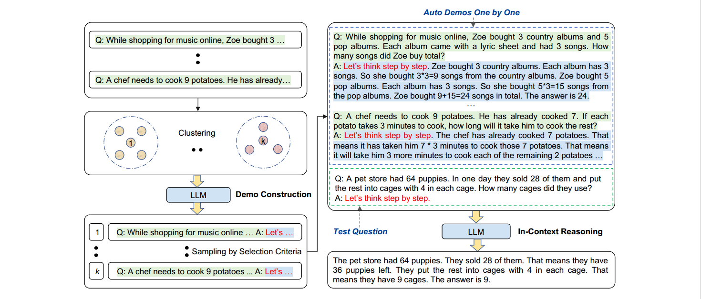

*Auto-CoT prompting*

*Automatic Chain of Thought Prompting in Large Language Models*

## Brief introduction

[\[Zhang et al., 2022\]](https://arxiv.org/abs/2210.03493) proposes an automatic CoT prompting method: AutoCoT. It samples questions with diversity and generates reasoning chains to construct demonstrations.In practice, Manual-CoT has obtained stronger performance than Zero-Shot-CoT. However, this superior performance hinges on the hand-drafting of effective demonstrations. Specifically, the

hand-drafting involves nontrivial efforts in designs of both questions and their reasoning chains for demonstrations.

Moreover, human efforts for designing task-specific demonstrations are even more: different tasks, such as arithmetic and commonsense reasoning , require different ways of demonstrations.

To eliminate such manual designs, we advocate another Auto-CoT paradigm to automatically construct demonstrations with questions and reasoning chains.

We evaluate Auto-CoT on ten benchmark reasoning tasks including: (i) arithmetic reasoning; (ii) commonsense reasoning; (iii) symbolic reasoning. Experimental results show that with GPT-3, Auto-CoT consistently matches or exceeds the performance of Manual-CoT that requires manual designs.

## How it Works?

First we can leverage LLMs with the “Let’s think step by step” prompt to generate reasoning chains for demonstrations one by one, i.e., let’s think not just step by step, but also one by one, and our analysis shows that diversity of demonstration questions is the key to mitigate the effect of reasoning chain mistakes from Zero-Shot-CoT.Based on this insight, we propose an Auto-CoT method to automatically construct demonstrations. Auto-CoT consists of two main steps. First, partition questions of a given dataset into a few clusters. Second, select a representative question from each cluster and generate its reasoning chain using Zero-Shot-CoT with simple heuristics.With the auto-constructed demonstrations we can then prompt the LLMs in the few-shot way.

The figure below shows the complete workflow of Auto-CoT prompting.



**⭐Demo construction:problems clustering+zero-shot CoT prompting**

**⭐In-Context Reasoning i.e. few-shot CoT prompting**

*Prompt:*

```
*Q: Roger has 5 tennis balls. He buys 2 more cans of tennis balls. Each can has 3 tennis balls. How many tennis balls does he have now?*

*A: Roger started with 5 balls. 2 cans of 3 tennis balls each is 6 tennis balls. 5 +6= 11. The answer is 11.*

*Q: John takes care of 10 dogs. Each dog takes.5 hours a day to walk and take care of their business. How many hours a week does he spend taking care of dogs?*

*A：John takes 0.5×10=5 a day to walk and take care of dogs’ business.A week contains 7 days.*

*5×7=35 .The answer is 35 hours a week.*

*Q: A juggler can juggle 16 balls. Half of the balls are golf balls,and half of the golf balls are blue. How many blue golf balls are there?*

*A:*
```

*Output:*

```
*The juggler can juggle 16 balls. Half of the balls are golf balls. So there are 16/ 2 = 8 golf balls. Half of the golf balls are blue. So there are 8/2 = 4 blue golf balls. The answer is 4.*
```
