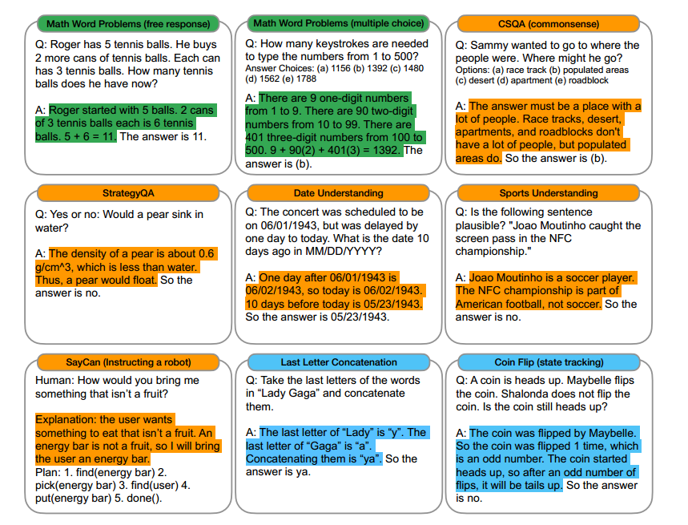

*One-shot/few-shot CoT prompting*

*Chain-of-Thought Prompting Elicits Reasoning in Large Language Models*

## introduction

[\[Wei et al., 2022a\]](https://arxiv.org/abs/2201.11903) explore how generating a chain of thought—a series of intermediate reasoning steps—significantly improves the ability of large language models to perform complex reasoning. Since simply scaling up large language model size alone has not proved sufficient for achieving high performance on challenging tasks such as arithmetic, commonsense, and symbolic reasoning,which we call them “reasoning-heavy tasks”,here comes an idea to explores how the reasoning ability of large language models can be unlocked.

chain-of-thought prompting,a new approach which endows language models with the ability to generate a similar chain of thought—a coherent series of intermediate reasoning steps that lead to the final answer for a problem outperforms standard prompting, sometimes to a striking degree. This work underscores how large language models can learn via a few examples with natural language data about the task (c.f. automatically learning the patterns underlying inputs and outputs via a large training dataset).

## How it Works?

Consider one’s own thought process when solving a complicated reasoning task such as a multi-step math word problem. It is typical to decompose the problem into intermediate steps and solve each before giving the final answer. A chain of thought is a series of intermediate natural language reasoning steps that lead to the final output.This work explores how the reasoning ability of large language models can be unlocked by a simple method motivated by two ideas. First, techniques for arithmetic reasoning can benefit from generating natural language

rationales that lead to the final answer. Second, large language models offer the exciting prospect of in-context few-shot learning via prompting. That is, instead of finetuning a separate language model checkpoint for each new task, one can simply “prompt” the model with a few input–output exemplars demonstrating the task. Remarkably, this has been successful for a range of simple question-answering tasks.

Both of the above ideas, however, have key limitations. For rationale-augmented training and

finetuning methods, it is costly to create a large set of high quality rationales, which is much more complicated than simple input–output pairs used in normal machine learning.

For the traditional few-shot prompting method used in Brown et al. (2020), it works poorly on tasks that require reasoning abilities, and often does not improve substantially with increasing language model scale.In this paper, the strengths of these two ideas are combined in a way that avoids their limitations.

Specifically, chain-of-thought prompting explores the ability of language models to perform few-shot prompting for reasoning tasks, given a prompt that consists of triples: <input, chain of thought, output>.The figure below shows an example of chain of thoughts used in few-shot prompting demostrations,which are highlighted.



Prompt示例：

```
*Prompt:*

*Q: Roger has 5 tennis balls. He buys 2 more cans of tennis balls. Each can has 3 tennis balls. How many tennis balls does he have now?*

*A: Roger started with 5 balls. 2 cans of 3 tennis balls each is 6 tennis balls. 5 +6= 11. The answer is 11.*

*Q: John takes care of 10 dogs. Each dog takes.5 hours a day to walk and take care of their business. How many hours a week does he spend taking care of dogs?*

*A：John takes 0.5×10=5 a day to walk and take care of dogs’ business.A week contains 7 days.5×7=35 .The answer is 35 hours a week.*

*Q: A juggler can juggle 16 balls. Half of the balls are golf balls,and half of the golf balls are blue. How many blue golf balls are there?*

*A:*

*Output:*

*The juggler can juggle 16 balls. Half of the balls are golf balls. So there are 16/ 2 = 8 golf balls. Half of the golf balls are blue. So there are 8/2 = 4 blue golf balls. The answer is 4.*
```
