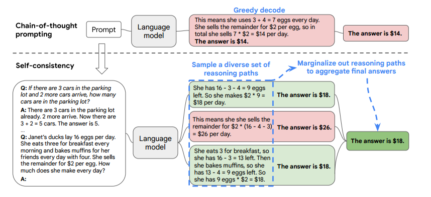

# Prompting extension->Self-consistency

## introduction

[\[Wang et al. (2023)\]](https://arxiv.org/abs/2203.11171) proposes a new decoding strategy, self-consistency, to replace the naive greedy decoding used in chain-of-thought prompting. It first samples a diverse set of reasoning paths instead of only taking the greedy one, and then selects the most consistent answer by marginalizing out the sampled reasoning paths. Extensive empirical evaluation shows that self-consistency boosts the performance of chain-of-thought prompting with a striking margin on a range of popular arithmetic and commonsense reasoning benchmarks, including GSM8K (+17.9%), SVAMP (+11.0%), AQuA (+12.2%),StrategyQA (+6.4%) and ARC-challenge (+3.9%).

## How it Works?

It has been observed that chain-of-thought prompting significantly improves model performance across a variety of multi-step reasoning tasks.In this paper, we introduce a novel decoding strategy called self-consistency to replace the greedy decoding strategy used in chain-of-thought prompting (Wei et al., 2022), that further improves language models’ reasoning performance by a significant margin. Self-consistency leverages the intuition that complex reasoning tasks typically admit multiple reasoning paths that reach a correct answer (Stanovich & West, 2000). The more that deliberate thinking and analysis is required for a problem (Evans, 2010), the greater the diversity of reasoning paths that can recover the answer.

We first prompt the language model with chain-of-thought prompting, then instead of greedily decoding the optimal reasoning path, we propose a ”sample-and-marginalize”decoding procedure: we first sample from the language model’s decoder to generate a diverse set of reasoning paths; each reasoning path might lead to a different final answer, so we determine the optimal answer by marginalizing out the sampled reasoning paths to find the most consistent answer in the final answer set. Such an approach is analogous to the human experience that if multiple different ways of thinking lead to the same answer, one has greater confidence that the final answer is correct. Compared to other decoding methods, self-consistency avoids the repetitiveness and local-optimality that plague greedy decoding, while mitigating the stochasticity of a single sampled generation.



Prompt示例：

```
*Prompt:*

*Q: There are 15 trees in the grove. Grove workers will plant trees in the grove today. After they are done,there will be 21 trees. How many trees did the grove workers plant today?*

*A: We start with 15 trees. Later we have 21 trees. The difference must be the number of trees they planted.So, they must have planted 21 - 15 = 6 trees. The answer is 6.*

*Q: If there are 3 cars in the parking lot and 2 more cars arrive, how many cars are in the parking lot?*

*A: There are 3 cars in the parking lot already. 2 more arrive. Now there are 3 + 2 = 5 cars. The answer is 5.*

*Q:When I was 6, my sister was half my age. Now I’m 70, how old is my sister?*

*A:*
```

*⭐Sample a diversity set of reasoning paths as below:*

```
*Output 1:When I was 6 my sister was half my age, so she was 3. Now I am 70, so she is 70 - 3 = 67. The answer is 67.*

*Output 2:When the narrator was 6, his sister was half his age, which is 3. Now that the narrator is 70, his sister would be 70 - 3 = 67 years old. The answer is 67.*

*Output 3:When I was 6 my sister was half my age, so she was 3. Now I am 70, so she is 70/2 = 35.*

``*The answer is 35.*

*⭐majority voting:*

*The answer is 67.（final answer）*

```
