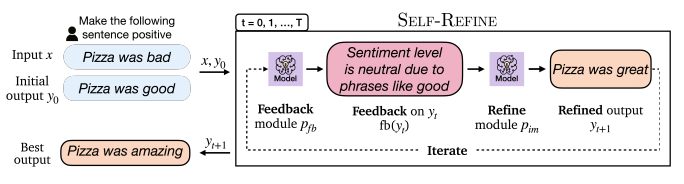
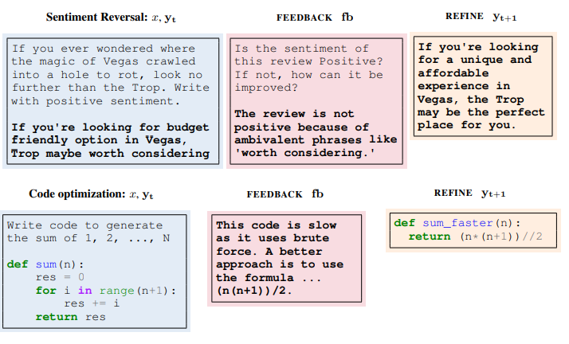
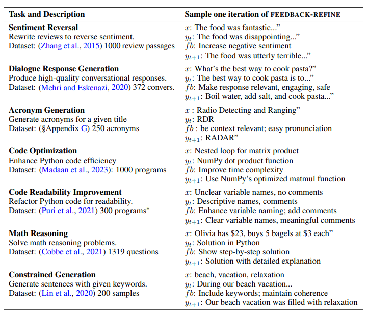

## Self-Refine: Iterative Refinement with Self-Feedback

## 介绍

​		[\[Aman Madaan et al. (2023)\]](https://arxiv.org/abs/2303.17651)设计了一个自反馈的迭代改进框架，以改进大语言模型的输出质量。不同于前人之处在于，该方法不需要监督训练数据于强化学习，只用一个LLM生成最初的输出，并使用该模型根据最初输出不断自我反馈和优化输出结果。在七个不同领域的任务上，包括评论重写、首字母缩略词生成、约束生成、故事生成、代码重写和数学原理解释等，验证了框架的性能，发现相较于直接输出的结果都得到了约20%的性能提升。

## 它是如何工作的

​		Self-refine由一个包含两个模块的迭代循环组成，两个模块是FEEDBACK和REFINE。使用一个LLM生成最初的输出，将它送回原模型以获取反馈；再将反馈送回原模型以指导优化输出。该循环有两种途径停止：达到预先设定的循环次数或模型本身认为不再有继续优化的必要。

​		FEEDBACK模块接收最初的输出并且给出应如何改进输出的提示。反馈取决于任务的种类并且涉及输入的多个方面（例如情感强烈程度）。Self-refine的一个关键贡献是使用了可操作的反馈，从而精确定位输出符合或不符合要求的原因。反馈包括两个方面：定位问题和指导如何改进。

​		REFINE模块根据接收到的反馈信息和之前不断循环的输出来优化更新自己的输出。

## 提示示例

