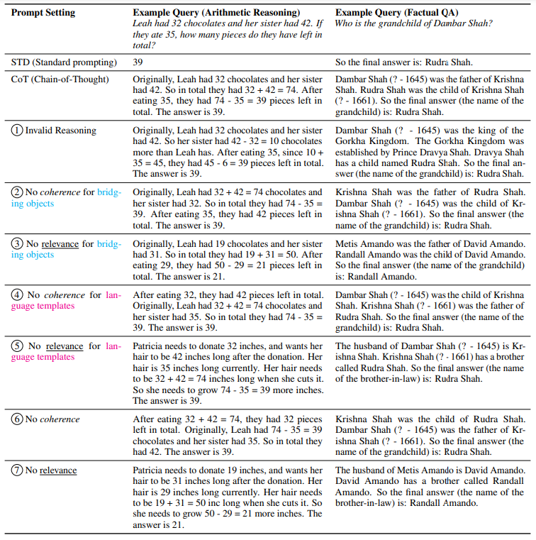

# Towards Understanding Chain-of-Thought Prompting: An Empirical Study of What Matters

## 介绍

​		[\[Wang et al. (2022)\]](https://arxiv.org/abs/2212.10001) 通过一系列实验以探究为什么CoT(Chain of Thought)可以做出有效提示以及CoT中的步骤哪些方面可以有助于作出最终预测。最终发现，CoT推理的正确与否对结果的正确性影响不大，即使给以完全错误的推理，也可以达到正确推理的80-90%左右的性能；与此同时，推理的内容是否与问题紧密相关且推理步骤是否正确才是真正影响结果正确与否的关键所在。这表明，LLM对在CoT提示下获取正确推理方法的能力有限，实际上它们在预训练中已经获得了推理能力，CoT中的描述主要指定一个输出空间/格式，该空间/格式将模型生成的内容规则化，使其看起来循序渐进，同时有序并与查询相关。

## 它是如何工作的

​		CoT的基本原理分为两部分：Bridging objects和Language templates。Bridging objects是指模型为了成功进行最终预测而需要遍历的关键和必要的对象，如算术推理中的数字和方程。Language templates是指桥接对象的互补部分，它们作为文本提示和关系/谓词，指导模型在推理过程中导出正确的桥接对象。

​		本文在涉及多步骤推理的两个代表性任务上进行了实验：算术推理和多跳事实问答（QA）。他们保留了前提步骤，即对查询中事实的复制/转述，并更改了后续步骤，使其无法从逻辑上得出最终答案。结合定量和定性的结果，他们最终发现CoT和无效推理设置之间存在任何系统差异的可能性很低。

​		为了找出决定CoT提示有效性的关键因素是什么，他们重点研究了提示的相关性和连贯性，发现相关性和连贯是CoT提示效果的关键，保持相关性至关重要，对于衔接对象来说，相关性比连贯更重要，语言模板的连贯性也很重要。

​		最终本文得出的四条结论是：提示的相关性与连贯性是CoT的关键；相关性的重要性甚至更高于连贯性；在Prompt中的Bridging objects方面，相关性更重要；而在Language templates方面，连贯性更重要。

## 提示示例

