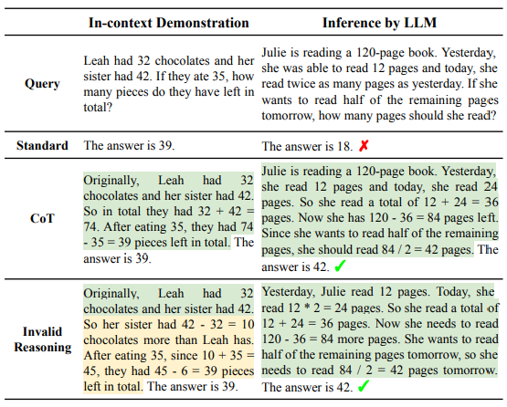

# Towards Understanding Chain-of-Thought Prompting: An Empirical Study of What Matters

## Introduction

In this work, [\[Wang et al. (2022)\]](https://arxiv.org/abs/2212.10001) designed a series of experiments and gained two conclusions: 

1. The validity of reasoning matters only a small portion to the performance—by providing rationales with completely invalid reasoning steps, the LLM can still achieve over 80-90% of the performance of CoT under various metrics while generating coherent lines of reasoning towards the answer; 
2. Being relevant to the query and correctly ordering the reasoning steps are the key for the effectiveness of CoT prompting.

This means what LLMs learn about how to reason under CoT prompting could be limited. Rather, they have already gained a lot of such “reasoning abilities” from pretraining, and the demonstrations may mainly specify an output space/format that regularizes the model generation to look step-by-step while being in order and relevant to the query. 

## How it works

The CoT rationale is divided in two compositions in this works: Bridging objects and Language templates. Bridging objects means the key and necessary objects that the model needs to traverse in order to make a successful final prediction, like numbers & equations in  arithmetic reasoning. Language templates means the complementary parts of bridging objects, which serve as textual hints and relations/predicates that guide the model to derive the correct bridging objects along the reasoning process.

They experimented on two representative tasks involving multi-step reasoning: arithmetic reasoning & multi-hop factual question answering (QA). They kept the premise steps which are copies/paraphrases of facts from the query, and changed the subsequent steps such that they do not logically derive the final answer. Combining the quantitative and qualitative results, they finally found there is a low chance for any systematic difference between CoT and the invalid reasoning setting to exist.

To find out what are the key aspects that determine the effectiveness of CoT prompting, they focused on Relevance and Coherence aspect of the prompts, and found that relevance and coherence are key for the performance of CoT prompting, Keeping relevance is crucial, Relevance matters more than coherence for bridging objects and Coherence of language templates is important.

## Prompt example

