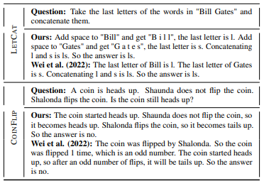
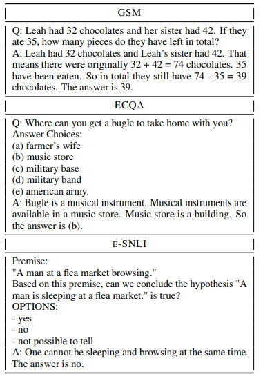

# Complementary Explanations for Effective In-Context Learning

## Introduction

[\[Ye et al. (2022)\]](https://arxiv.org/abs/2211.13892) present a series of studies on what makes effective explanations for in-context learning. Firstly, they investigate the impacts of computation traces and natural language in explanations. Through a set of probing experiments, they find that LLMs rely on both of them to effectively learn from explanations. They further examined the interplay among exemplars within prompts and the interplay between exemplars and the query. The analysis uncovered the benefits of constructing prompts by selecting complementary explanations that are relevant to the query. Lastly, they proposed an MMR-based exemplar selection strategy, which successfully improved the end task performance across three important datasets.

## How it works

Unlike conventional in-context learning, in-context learning with explanations adds an explanation of the answer to the example's "question-answer" tuple, forming the "question explanation answer" triplet. Adding explanations in the examples can significantly improve the performance of in-context learning, as shown in the figure.

Firstly, focus on whether explanation can work, which is divided into two parts:   whether actual computation traces matter and whether natural language works; Finally, investigate whether incorrect explanations work. The relevant settings are shown in the figure, with three different comparison settings, namely masking  computation trace (Mask1, Mask2), masking natural language (No NL), and providing incorrect explanations (Incorrect).

In-context performance obtained using various perturbed explanations on three datasets. Perturbed explanations achieve inferior performance than complete ones, but many of the perturbed explanations still grant performance gains over standard prompting.

Secondly, study Exemplar-Exemplar Interplay and  Query-Exemplar Interplay. The experimental setup is shown in the figure, dividing the examples into only addition, only multiplication, and a mixture of addition and multiplication to investigate whether LLM can fuse the reasoning process that is spread over different exemplars.

Considering that only examples similar to the problem can be selected when selecting examples, and complementary examples should be selected to cover all features, this article designs the following algorithm:

The performance of MMR exemplar selection strategy with varying λ.

## Prompt example

In-context learning prompt with explanation is shown in the figure:

Construct in-context learning prompts with explanations on three different datasets:

