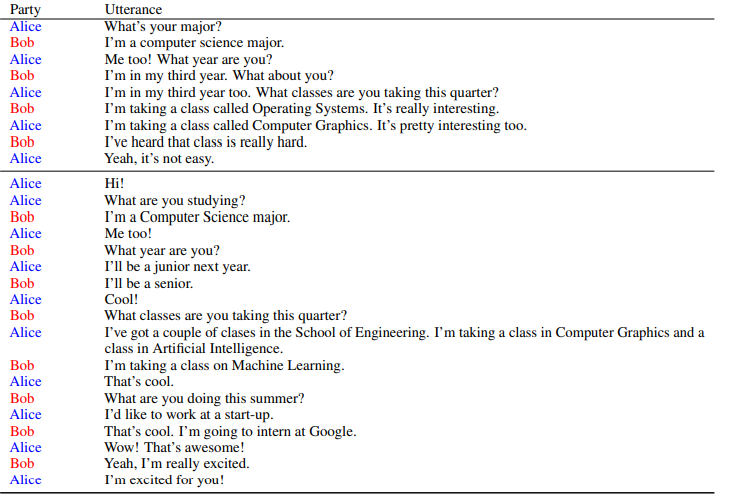

# PLACES: Prompting Language Models for Social Conversation Synthesis

## Introduction

In this paper, [\[Chen et al. (2023)\]](https://arxiv.org/abs/2302.03269) explored  a novel application of Prompting Language models for social Conversation Synthesis (PLACES). They used a small set of expert-written conversations as in-context examples to synthesize a social conversation dataset using prompting. PLACES match the quality of two widely adopted social dialogue datasets, DailyDialog and TopicalChat, can be used as a finetuning dataset, and can be applied to synthesize data for an under-studied subfield of dialogue research: multi-party conversations. 

## How it works

Firstly, they simply wrote a pool of ten conversations between two speakers representing everyday dialogue using proper grammar. Each conversation has a brief 'recipe' includes the topic, the background of two speakers, etc. When creating conversations, they makes a prompt consists of three randomly sampled conversations from the aforementioned pool, along with the 'recipe'. After experiments, they uses OPT-30B and generate with nucleus sampling with p = 0.92. The output includes three categories: start-to-finish, excerpts from the start to the middle and  excerpts from the middle to the end. They wrote 315 different background information for different topics. After Synthesizing, they evaluated the output in several aspects including Interesting, Coherent, Natural and Consistent, found that the outputs are of high qualities and can be used in fine-tuning. 

## Prompt example

Along with each conversation, they wrote a brief conversation “recipe” which includes a topic, as well as background information for the two speakers.

Conversations in the prompt are prefixed by recipes. Blue text: topic labels. Red text: seed background information metadata.

 Handwritten conversation examples of varying length. In-context examples are randomly sampled from this pool and used as part of a prompt for dyadic conversation generation.

Pair of dyadic conversations generated using OPT 30B. The prompt recipe given is: “The following is a conversation between Alice and Bob about their hometowns. Bob is from Austin, Texas, and Alice is from New York City.”

Pair of dyadic conversations generated using OPT 175B. The prompt recipe given is: “The following is a conversation between Alice and Bob about their majors. They are both students at Stanford University.”

