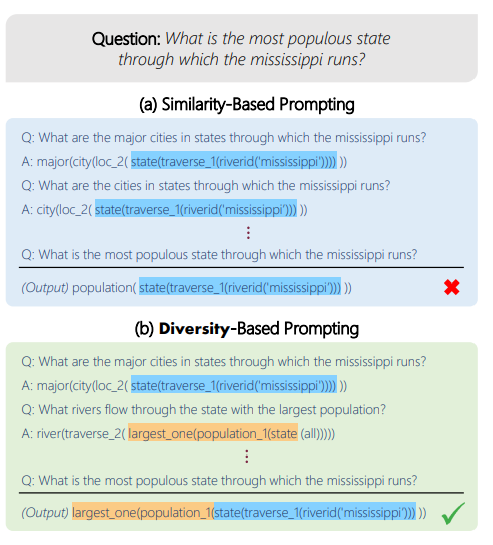
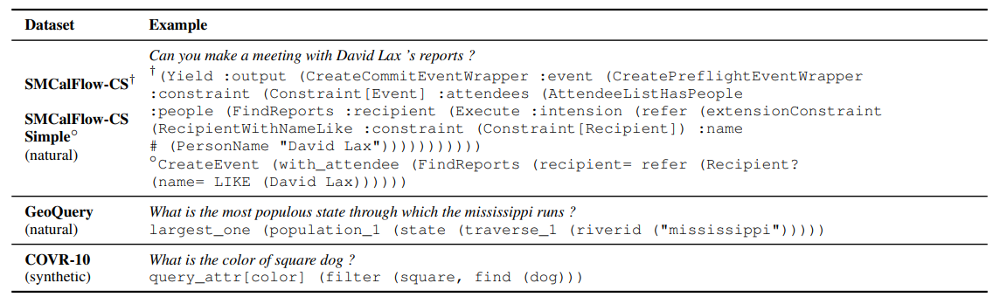

# Diverse Demonstrations Improve In-context Compositional Generalization

## Introduction

In the setup of compositional generalization, where models are tested on outputs with structures that are absent from the training set, selecting similar demonstrations is insufficient, as often no example will be similar enough to the input. [\[Itay Levy et al. (2022)\]](https://arxiv.org/abs/2212.06800) study how to leverage ICL to improve compositional generalization for semantic parsing, by increasing diversity among demonstrations. They find that choosing demonstrations that cover the structures required in the output program substantially improves performance across three compositional semantic parsing datasets in the pure in-context learning setup and when combined with finetuning. 

## How it works

Despite strong performance of pretrained language models (LMs) across many tasks, they have been shown to struggle in a compositional generalization setting, for example:

The method of leverage ICL to improve compositional generalization for semantic parsing is optimizing the entire set of demonstrations and increasing the diversity of examples in this set. They investigate two approaches for increasing diversity: (a) a coverage-based approach, define a set of elements conditioned on the input utterance, and select examples that cover those elements; (b) a second approach, select a subset of examples that are most dissimilar from one another, such that diversity is independent of the input utterance.

(a): They propose **Cover-LS**,  an algorithm that given the test utterance X_test, attempts to choose examples that collectively cover as many local structures as possible from the set S_Ytest, of local structures of the program Y_test. Since have no access to Y_test at test time, they predict what local structures are likely using an auxiliary model, assuming that predicting local structures is easier than predicting the entire program. Then, they iteratively select examples that cover the predicted local structures. The framework of this method as shown in the figure. Given an utterance, They construct a prompt by selecting a set of diverse demonstrations. Then feeding the prompt to the model yields the predicted target. Optionally, models can be fine-tuned (FT setup).

(b): An alternative approach is to define diversity more explicitly and select a subset of demonstrations that are dissimilar from one another (while being relevant for the input utterance). A natural approach for choosing a subset of high-quality and diverse demonstrations from the training set is Determinantal Point Process, a probabilistic model that defines a probability distribution over subsets of items, giving high probability to subsets that contain relevant and diverse items. DPP requires a relevance score for each item and a similarity score between pairs of items. They define the relevance of a demonstration through its retriever score for the input test utterance. 

After choosing demonstrations, they order them according to their retriever score with respect to the input utterance in ascending order, in accordance to common practices, then be formatted to a prompt. They evaluate two methods on three datasets, an example utterance-program pair for each of the datasets is shown below:

## Prompt example

Prompts produced with different demonstration selection methods for a specific test example. Each prompt contains k = 4 demonstrations.

