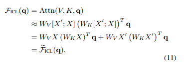
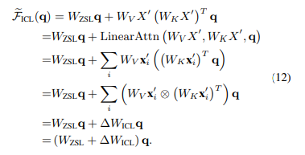
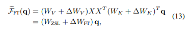

# Why Can GPT Learn In-Context? Language Models Secretly Perform Gradient Descent as Meta-Optimizers

## Introduction

To better understand how ICL works, [\[Dai et al. (2022)\]](https://arxiv.org/abs/2212.10559) explained language models as meta-optimizers and understood ICL as a kind of implicit finetuning. They figured out a dual form between Transformer attention and gradient descent based optimization, and explained language models as meta-optimizers, built connections between ICL and explicit finetuning and proposed to understand ICL as a kind of implicit finetuning and then made several experiments to prove it, at last they designed a momentum-based attention that achieves consistent performance improvements, which shows the potential of their understanding of meta-optimization to aid in future model designing.

## How it works

By analysing, they explained ICL as a process of meta-optimization: 

1. a Transformer-based pretrained language model serves as a meta-optimizer;
2. it produces meta-gradients according to the demonstration examples through forward computation; 
3. through attention, the meta-gradients are applied to the original language model to build an ICL model.

 In the ICL setting, the attention result of a head is formulated as

then approximate the standard attention to a relaxed linear attention by removing the softmax operation and the scaling factor:

is the attention result in the Zero-Shot Learning (ZSL) setting, where no demonstrations are given.

Comparing ICL with finetuning:

the attention result of a finetuned head is formulated as

For a more fair comparison with ICL, they gave finetuning three restricts: (1)specify the training examples as the demonstration examples for ICL; (2) train each example for only one step in the same order as demonstrated for ICL; (3) format each training example with the same template used for ICL and use the causal language modeling objective for finetuning.

After experiment, they organized common properties between ICL and finetuning from four aspects: (1)ICL Covers Most of Correct Predictions of Finetuning; (2)ICL Tends to Change Attention Outputs in the Same Direction as Finetuning; (3) ICL Is Inclined to Generate Similar Attention Weights to Finetuning; (4)ICL and Finetuning Tend to Pay Similar Attention to Training Tokens.

Considering all of these common properties between ICL and finetuning, they made the conclusion that ICL can be seen as a kind of implicit finetuning.

