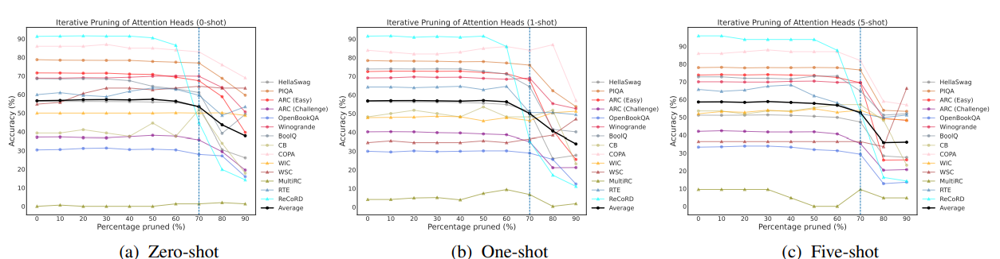
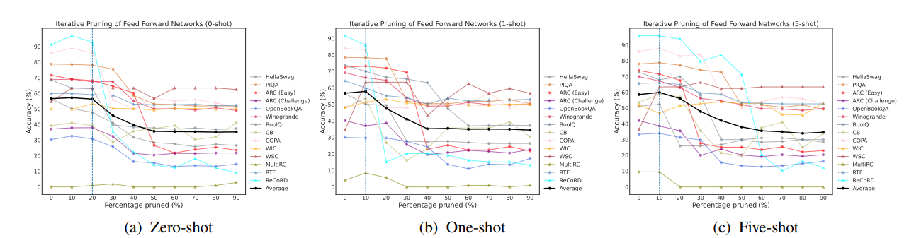

# Rethinking the Role of Scale for In-Context Learning: An Interpretability-based Case Study at 66 Billion Scale

## Introduction

In this paper, [\[Bansal et al. (2022)\]](https://arxiv.org/abs/2212.09095) use two ways to address the question that are all LLM components really needed to perform in-context learning. 

The first way is through the lens of task-specific importance scores and structured pruning of components underlying modern LLMs, found that  the ability to perform zero/few-shot in-context learning on almost all of a variety of 14 NLP datasets/tasks stays nearly intact when up to 70% (∼15.7B parameters in OPT-66B) of the attention heads are removed, but only up to 20% of the FFNs (∼8.5B parameters) can be removed with minimal decline in zero/few-shot in-context learning performance. 

The other way is by quantifying the capacity of all attention heads in OPT-66B to perform a subset of task-agnostic primitive operations associated with in-context learning, namely, prefix matching and copying. By using a framework for reverse engineering Transformer to find such attention heads, this article calculated the task-agnostic scores of prefix matching and copying for each attention head. It was found that a small portion of the heads in OPT-66B (called induction heads) had non-trivial scores for both primitives, and these heads overlapped with the previously determined heads that were important for contextual learning through 14 NLP datasets/tasks.

## How it works

To remove a head h in layer l in practice, they set $A^h(M)$ to be the zero matrix in Equation

$$
MHA^l(M) = [A^1(M); · · · ; A^H(M)]W^lo
$$
This implies that $W^hk,W^hq,W^hv$ can be entirely removed, and the corresponding d rows in W can also be removed. In total, there are 4608 attention heads across 64 layers in OPT-66B that constitute 21.7B of the total 66B parameters.

To remove an FFN in layer l in practice, they set $FFN^l(M)$ to be the zero matrix in Equation
$$
FFN^l(M) = ReLU(LN^l(M)W^l1)W^l2
$$
This implies W and the layer norm LN for the FFN can be entirely removed. In total, FFNs constitute 43.4B parameters in OPT-66B.

Effect on in-context learning accuracy when removing attention heads in OPT-66B in an iterative manner based on task-specific and shot-specific importance scores: 

Effect on in-context learning accuracy when removing feed forward networks (FFNs) in OPT-66B in an iterative manner based on task-specific and shot-specific importance scores:

