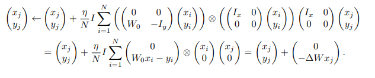
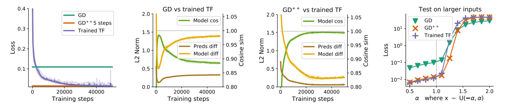

## Transformers learn in-context by gradient descent

## Introduction

In this paper, [\[Johannes von Oswald et al. (2022)\]](https://arxiv.org/abs/2212.07677) aim to bridge the gap between in-context and meta-learning, and show that in-context learning in Transformers can be an emergent property approximating gradient-based few-shot learning within its forward pass.

What they contribute includes:

1. They construct explicit weights for a linear self-attention layer that induces an update identical to a single step of gradient descent (GD) on a regression loss and show how several self attention layers can iteratively perform curvature correction improving on plain gradient descent.
2. When optimized on linear regression datasets, they demonstrate that linear self-attention-only Transformers either converge to the construction and therefore the gradient descent algorithm or generate models that closely align with models trained by GD, both in in- and out-of-distribution validation tasks.
3. By incorporating multi-layer-perceptrons (MLPs) into the Transformer architecture, they enable solving non-linear regression tasks within Transformers by showing its equivalence to learning a linear model on deep representations. They empirically compare meta-learned MLPs and a single step of GD on its output layer with trained Transformers and demonstrate striking similarities between the identified solutions.
4. They resolve the dependency on the specific token construction by providing evidence that learned Transformers first encode incoming tokens into a format amenable to the in-context gradient descent learning that occurs in the later layers of the Transformer.

## How it works

Firstly, they change the standard multi-head self-attention layer:

to the linear self-attention layer they designed:

Then They induce the squared-error loss of e a reference linear model: 

Thus, they can view the outcome of a gradient descent step as an update to our regression loss, where data, and not weights, are updated.

Set Q,K,V matrix like: $W_K = W_Q = (\begin{matrix} I_X&0\\0&0 \end {matrix}),W_V = (\begin{matrix} 0&0\\W_0&-I_y \end {matrix})$

then obtain the following dynamics

Comparing one step of gradient descent with a trained single linear self-attention layer:

Comparing two steps of gradient descent with trained recurrent two-layer Transformers:

Comparing five steps of gradient descent with trained five-layer Transformers:

