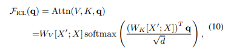
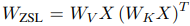
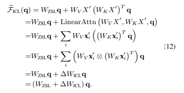

## Why Can GPT Learn In-Context? Language Models Secretly Perform Gradient Descent as Meta-Optimizers

## 介绍

​		这篇文章旨在探究ICT的原理。[\[Dai et al. (2022)\]](https://arxiv.org/abs/2212.10559)提出ICL是一种隐式的梯度下降过程。他们找出了Transformer注意力机制和基于梯度下降的优化之间的双重形式，并将语言模型解释为元优化器，在ICL和显式微调之间建立了联系，并提出将ICL理解为一种隐式微调，然后进行了几次实验来证明这一点。在证明了ICL与梯度下降的优化之间的双重形式后，基于带动量的梯度下降提出了带动量的attention，并作出证明，与普通attention相比，在一些分类任务上性能有所提高。

## 它是如何工作的

​		通过分析，他们将ICL解释为元优化过程：

1. 基于Transformer的预训练语言模型用作元优化器；

2. 根据示范实例，通过正向计算生成元梯度；

3. 通过注意力，将元梯度应用于原始语言模型，建立ICL模型。

   ICL中attention的计算方式：

   

​		去除softmax操作和缩放因子将标准注意力近似为线性注意力：

​		如果去除few-shot中的示例部分，直接预测即为zero-shot:

​		将该式代入上式：

​		可以发现in-context tuning形式与fine-tuning的形式非常类似：

​		为了便于实验，他们从四个方面规定了ICL和fine-tuning之间的共同特性：（1）两者都执行梯度下降；（2） 相同的训练信息；（3） 训练实例的因果顺序相同；（4） 两者都以注意力为目标。

​		实验得出ICL与fine-tuning的相似性有：（1）ICL涵盖了fine-tuning的大多数正确预测；（2）ICL倾向于以与fine-tuning相同的方向改变注意力输出； （3）ICL倾向于生成与fine-tuning相似的注意力权重； （4）ICL和fine-tuning倾向于对训练信息的token给予类似关注。

​		考虑到ICL和微调之间的所有这些共同性质，他们得出结论，ICL可以被视为一种隐式微调。

