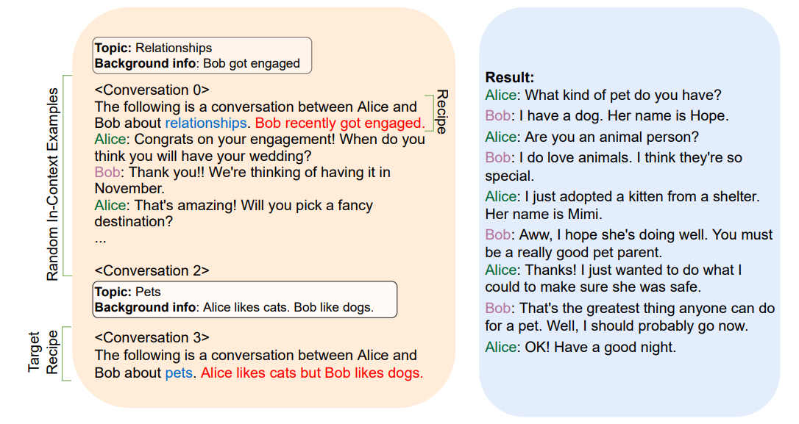

## PLACES: Prompting Language Models for Social Conversation Synthesis

## 介绍

​		 训练对话模型需要大量数据，但是收集该类数据相当困难，会遇到诸如法律问题、隐私问题等大量阻碍。同时，该类数据也没有“正确”与否这种评价标准。因此，[\[Chen et al. (2023)\]](https://arxiv.org/abs/2302.03269)探索了提示语言模型在对话生成中的新应用，并命名为PLACES。通过使用一小段专家编写出来的对话作为示例，生成大量的类似对话数据，并且在质量上与被广泛认可的两大对话数据集，DailyDialog与TopicalChat接近。优于前人之处在于，PLACES还能生成三方，甚至多方会谈的对话数据。该方法生成的数据，可以用做微调数据集，也可用于为一个尚未被广泛关注的对话研究子领域：多方对话的研究生成研究数据。

## 它是如何工作的

​		为了生成高质量对话，需要先由专家生成一个对话库，每个对话还应包括一个语境信息，语境信息有对话的主题以及对话人的人物背景等。当需要生成对话时，从之前的库中随机取出三个作为prompt。经过实验，使用OPT-30B模型，并且p=0.92的核采样生成结果是最优的。输出的对话有三种类别：从开始到结束、从中途到结束与从开始到中途。为了与Feedback for Interactive Talk & Search Dataset (FITS; Xu et al. (2022))的数据相符，所以对话涵盖了52个不同话题下的315个子类别。生成完毕后，对输出在有趣性、贴切性、自然性与连贯性四个方面做了评估，得出结论输出结果的质量与DailyDialog与TopicalChat等数据集相近，可以用作fine-tuning等用途。

## 提示示例

​		在每次对话前，他们都会写一份简短的对话“情境”，其中包括一个主题，以及两位演讲者的背景信息，并给出一小部分对话作为in-context信息。

​		提示中的对话以情境为前缀。蓝色文本：主题标签；红色文本：关键背景信息。

​		不同长度的手写对话示例。in-context示例是从这个池中随机采样的，并用作二元对话生成提示的一部分。该对话池非常庞大，下图为截取一部分：

​		使用OPT-30B生成的一组二元对话。给出的prompt是：“以下是Alice和Bob关于他们家乡的对话。Bob来自德克萨斯州奥斯汀，Alice来自纽约市。”

​		使用OPT-175B生成的一对二元对话。给出的prompt是：“下面是Alice和Bob关于他们专业的对话。他们都是斯坦福大学的学生。”

