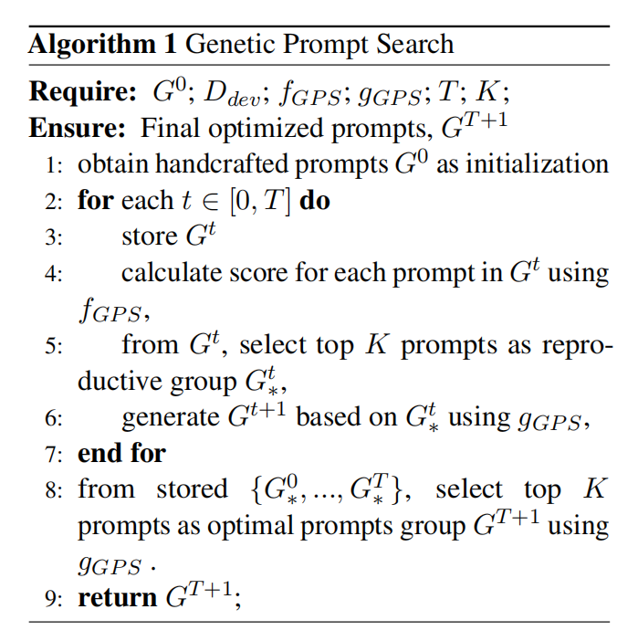

# GPS Genetic Prompt Search for Efficient Few-shot Learning

## 简介

[Hanwei Xu et al., 2022](https://arxiv.org/pdf/2210.17041.pdf)提出了一种新的遗传提示搜索（GPS）算法，该算法用生成模型逐渐变异提示，并根据它们在小开发集上的性能选择候选者。这种进化过程依赖于一小组标记数据，仅用于验证，而不用于训练。

GPS不需要更新任何参数，只需要搜索每个下游任务的最佳硬提示。与即时调谐类似，GPS允许预训练的模型同时服务于大量应用。同时，GPS比提示调谐更容易部署，因为它不需要存储调谐后的连续软提示。从经验上看，GPS在手动提示的基线基础上实现了显著的改进，并且它也优于其他参数有效的少镜头调谐方法。

作者遵循T0基线，使用十个T0测试任务比较了五种方法，即模型调整、提示调整、黑匣子调整、上下文学习和GRIPS。结果表明，GPS不仅优于手动提示基线，而且优于其他参数有效的少镜头学习方法。大量实验验证了所提出的GPS的有效性。

## 原理

对于一个新的看不见的任务，自动找到高性能的提示是一项挑战。受遗传算法（Mitchell，1980）的启发，我们为此提出了遗传提示搜索（GPS）。具体算法如下图所示：

在GPS中，我们将首先对少量数据进行采样，作为每个下游任务的开发集Ddev。然后，我们将设计两个遗传函数，其中fGPS是决定每次迭代时保留或消除哪些提示的度量函数，gGPS代表生成新提示的遗传函数。根据算法，GPS首先用一组手工制作的提示G0进行初始化。GPS的关键过程是再现当前生成的提示，并使用重新评分来迭代选择提示。对于每次迭代，我们使用fGPS计算Gt中提示的分数，并选择前K个提示作为Gt*。然后，我们使用基于Gt*的gGPS生成Gt+1。经过几个步骤的基因搜索，我们将收集每一代中所有的前K个提示，并重新搜索所有这些提示，以最终决定哪些提示是最佳的。使用gGPS有三种不同的方法。

**反向翻译**：反翻译（BT）是NLP中常用的数据扩充技术，用于即时再现。在这里，我们首先将手册提示从英语翻译成其他11种语言，包括中文、日语、韩语、法语、西班牙语、意大利语、俄语、德语、阿拉伯语、希腊语、粤语，然后再翻译回英语。

**完形填空**：我们使用大的预训练文本到文本转换器（T5）来生成模板。对于每个输入示例及其描述器，我们使用占位符作为前缀和后缀组成模板，并让T5填充占位符。我们应用波束搜索来生成多个提示候选者。然而，由于我们的设置不进行参数更新，这与原始论文中的少数镜头训练设置不同，因此这种方法效果不佳。因此，我们改为使用手动提示作为初始模板，用占位符替换一些随机标记，然后让T5填空以生成新的提示。

**句子延续**：使用模板“写两个意思相同的句子。句子1：手动提示，句子2：”到预训练的模型，并让它生成连续句作为新的提示。我们用GPT2-XL（1.5B）和T5LM-XXL（11B）作为我们的即时生成模型进行了实验。

最后，根据提示生成方式的不同，我们相应的评分标准也不同。具体评分规则如下：

**对于完形填空**：我们遵循之前的工作，在验证集Ddev上用平均logits对提示进行评分。

**对于反向翻译和句子延续**：由于平均logits不适用，我们在Ddev上使用准确性对每个提示进行评分。

## Prompt 示例

暂无prompt示例。

## 数据集

### 自然语言推理
ANLI R1,ANLI R2, ANLI R3, CB, RTE.

### 指代消解
WSC, Winogrande.

### 完形填空
COPA, HellaSwag.

### 词义消歧
WiC.