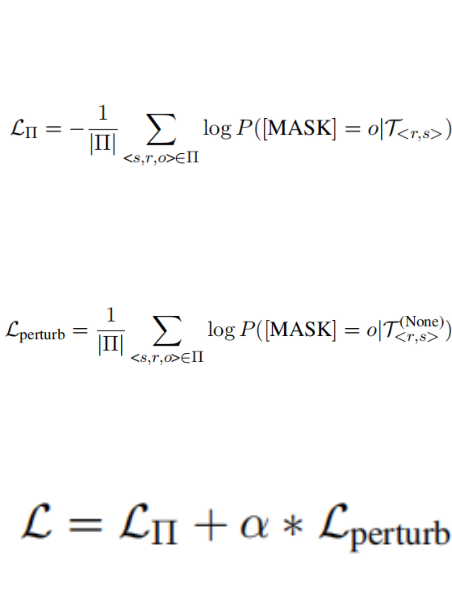

# PromptGen Automatically Generate Prompts using Generative Models

## 简介

[Yue Zhang, Hongliang Fei et al., 2022](https://pdfs.semanticscholar.org/5e27/3f5f35f6b6619212e3e41c582679ae5f7180.pdf)提出了一个动态提示生成模型，称为PromptGen，通过利用预先训练的生成模型BART，根据输入自动生成提示。通常 PromptGen由编码器和基于Transformer的自回归解码器组成。

知识事实被定义为三元组：```<sub,rel,obj>```.编码器从输入```<sub，rel>```中产生潜在表示，并且解码器自回归地生成```[sub][D1]...[MASK]..., [Dm+n]```.形式的提示，然后将生成的提示传递给固定的预训练LM（例如BERT），以将```<MASK>```填充为```[obj]```。

通过预训练，生成模型可以存储有关输入主题的相关知识，但我们希望在不泄漏标签信息（即对象）的情况下生成上下文感知（即```<sub，rel>```）提示。为了减少标签泄漏，我们将生成提示的```[sub]```替换为“None”，并将扰动提示传递给LM，并使用Loss进行微调。

结果表明，PromptGen利用了预先训练的生成模型，例如BART。PromptGen是端到端可训练的，可以微调生成模型的参数，同时保持下游预先训练的MLM冻结。在基准LAMA数据集上评估PromptGen，并观察到性能的显著改善。


## 原理

给定一个主题s，关系r，一个生成的提示```T<r，s>```和一个MLM，我们可以识别单词oˆ∈V，这个单词是MLM按照P(```[MASK] = oˆ|T<r,s>```)得到的最高概率的单词，其中```T<r，s>```表示以关系r和主题s为条件的生成的提示；V表示预定义的词汇表。如果MLM可以用正确的对象填充掩码，我们得出结论，MLM对有关事实的信息进行了编码。

输入格式：我们的生成模型的输入是LAMA数据集提供的手动提示。例如：对于关系“place of birth”,我们的输入是“```[sub]``` was born in ```[MASK]```”；编码器上原始提示的编码形式如下:假设词汇表中标记的BART单词嵌入矩阵Vcommon为$\epsilon_V ∈ R^{|V|×d}$.我们知道每个```[Di]```是Vcommon上的多项式分布，因此每一个```[Di]```的嵌入向量$\epsilon_{Di}$是一个在$\epsilon_V$上面的线性组合：


输出格式：提示由解码器生成。我们的提示形式如下：```[sub] [D]1 [D]2...[D]m [MASK] [D]m+1...[D]m+n```。（每个```[D]i```表示词汇表Vcommon上的多项式分布）。其中m是```[sub]```和```[MASK]```之间预定义的最大触发词个数；n是```[MASK]```之后的最大触发词个数；

方法结构如下图所示：


上图说明：我们详细阐述了LAMA任务的应用方法，其中下游MLM是BERT。我们的生成模型（编码器-解码器）采用预训练的BART。在每个解码步骤，我们使用先前时间的模型输出作为当前输入。在每个解码步骤t，我们的解码器在先前序列```[D1], ..., [Dt−1]```,和编码器的输出$h_{encode}$的基础上计算当前隐藏状态$h_t$和当前令牌分布$D_t$：


为了避免标签泄漏，我们开发了一种新的约束。我们将```T<r，s>```的```[sub]```替换为“None”。例如，假设我们将“None was born in ```[MASK]```”代入MLM。在不知道“Obama”主题的情况下，用“Hawaii”填充mask的可能性很低。因此，我们使用这样的损失函数来调整生成模型，以避免标签泄露:




## Prompt 示例

目前没有可用的提示示例。

## 数据集

### [LAMA](https://github.com/facebookresearch/LAMA)
LAMA 数据集中包含的句子用于描述两个实体之间的关系，而其中一个实体被遮盖，需要语言模型来预测，如果预测正确则说明模型学会了这一关系。然而，很多时候其实从这些 query 中是看不出这种关系的，或者说，即便模型没有回答正确，也不能说明模型不懂这个关系（比如存在一对多的情形，或者模型未见过的实体等）。

## 参考文献

斜角巷奇遇.(2019).自然语言处理基础学习（一）word embedding，word2vec，skip-grams，CBOW.[在线].CSDN博客.取自:https://blog.csdn.net/WTQTakee/article/details/103442222

weixin_51182518.(2021).NLP 3.5 Transformer的结构，BERT&masked language model.[在线].CSDN博客.取自:https://blog.csdn.net/weixin_51182518/article/details/113929301

Terry_dong.(2019).图解Transformer.[在线].CSDN博客.取自:https://blog.csdn.net/sjyttkl/article/details/98784410/