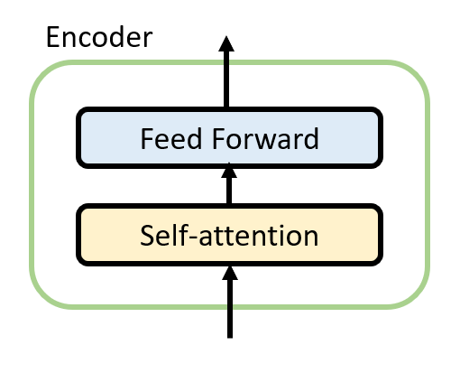
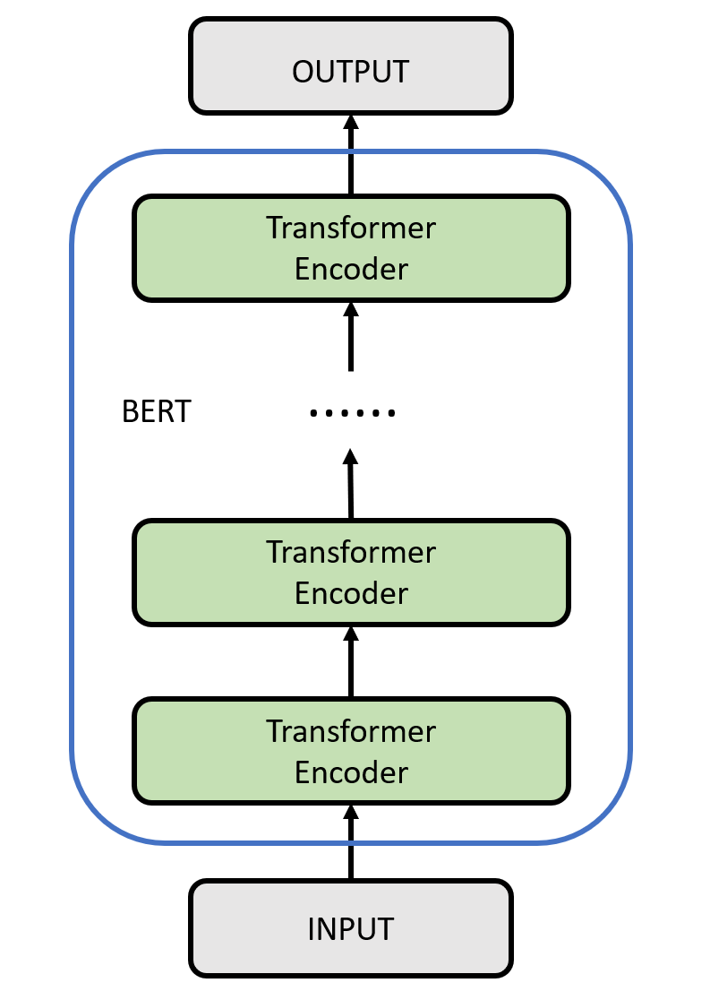
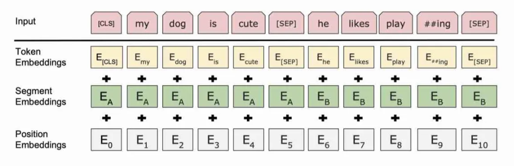
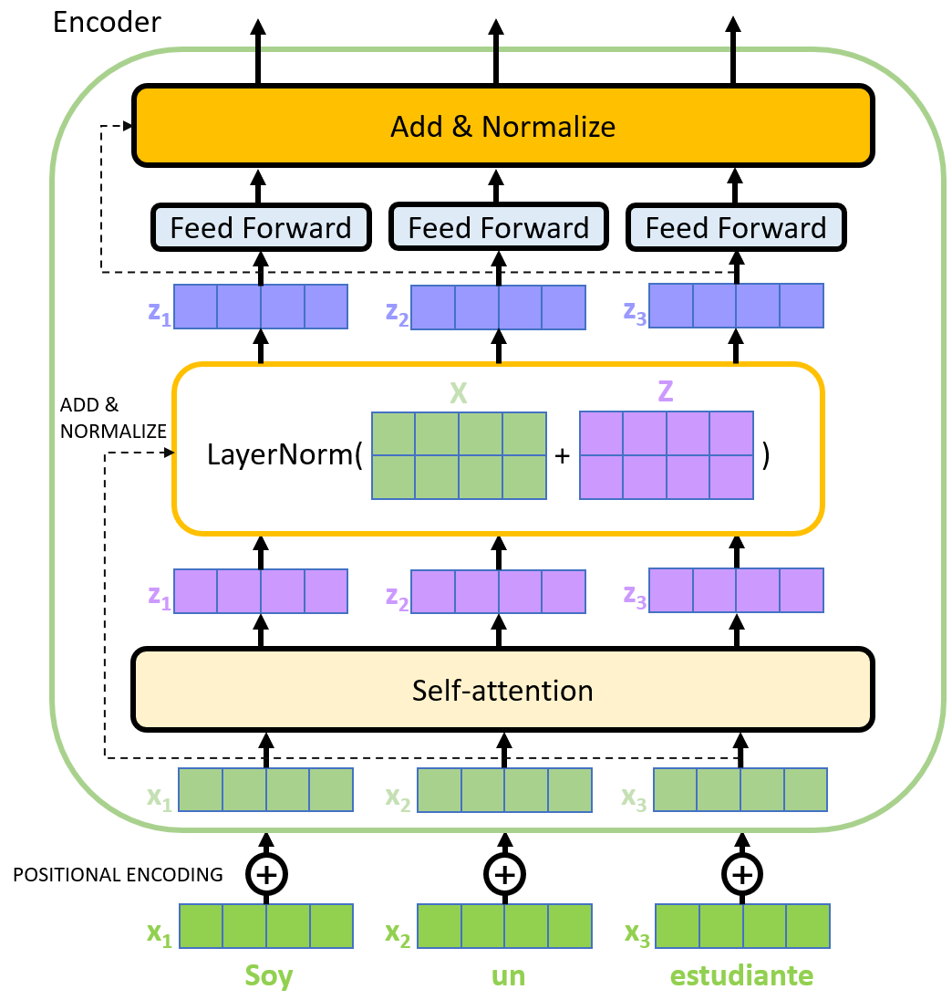
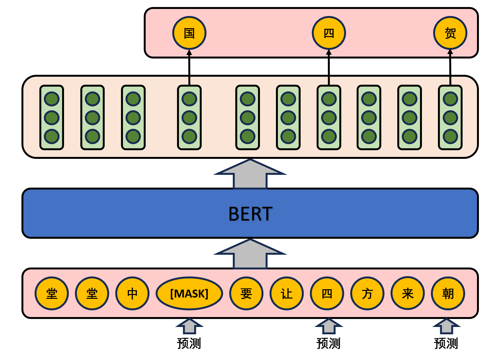
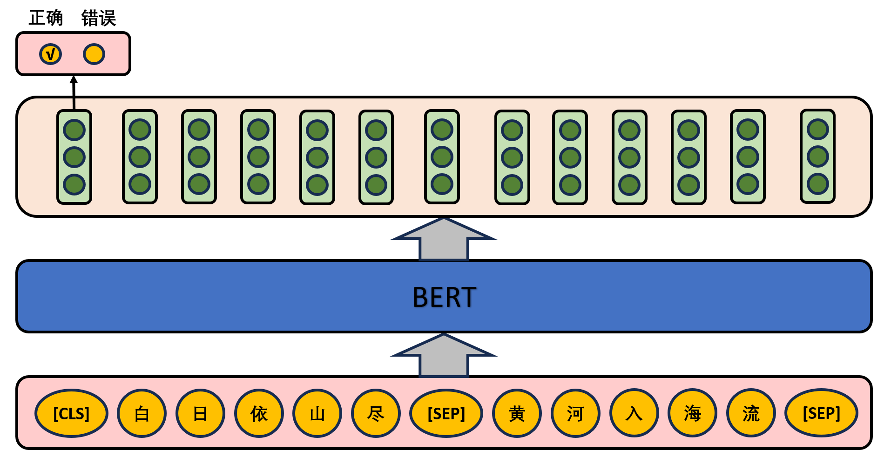
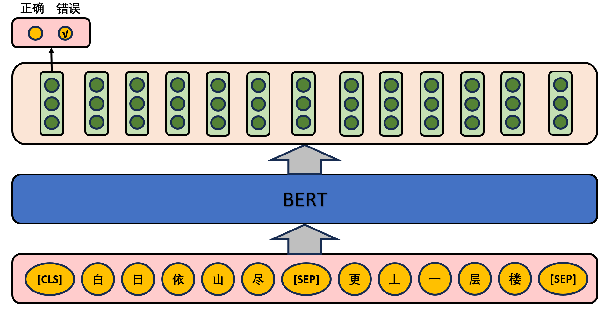
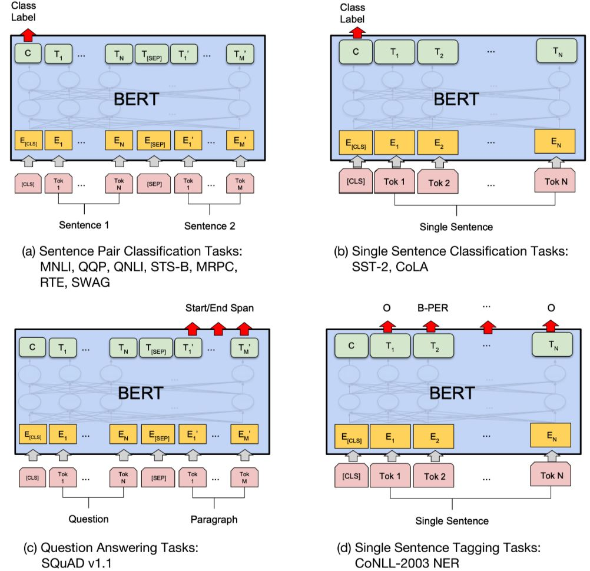

# BERT
- [BERT](#bert)
  - [简介](#简介)
  - [Transformer模型概述](#transformer模型概述)
  - [模型结构](#模型结构)
    - [输入](#输入)
    - [编码器](#编码器)
  - [预训练任务](#预训练任务)
    - [MLM](#mlm)
    - [NSP](#nsp)
  - [微调任务](#微调任务)
  - [应用](#应用)
  - [参考文献](#参考文献)

## 简介
BERT（Bidirectional Encoder Representations from Transformers）是一种革命性的预训练语言模型。2018年，Google研究团队在论文[《BERT: Pre-training of Deep Bidirectional Transformers for Language Understanding》](https://arxiv.org/pdf/1810.04805.pdf)中首次提出。

BERT模型的提出受益于Transformer模型的成功应用。Transformer是一种基于自注意力机制的神经网络架构，它在机器翻译等任务中表现出色。BERT模型利用了Transformer的编码器结构，并通过预训练的方式在大规模文本语料上学习通用的语言表示。这使得BERT模型能够对文本进行深层次的理解，捕捉上下文信息，从而提供更加准确和丰富的语言表示。

BERT模型的重要性在于它在多项自然语言处理任务中取得了突破性的成果。通过在海量文本数据上进行预训练，BERT模型学习到了丰富的语言知识和上下文表示能力。这使得它能够以无监督的方式获得深层次的语义理解，从而在各种任务中取得卓越的表现。例如，在文本分类任务中，BERT模型能够准确地捕捉关键信息，提高分类的准确性。在命名实体识别任务中，BERT模型能够准确地识别和分类实体。在问答系统和机器翻译任务中，BERT模型能够生成更加准确和流畅的回答或翻译结果。

由于BERT模型在语言理解任务中的优异表现，它被广泛应用于各种自然语言处理领域。研究人员和工程师们利用BERT模型构建了强大的文本处理系统，取得了显著的进展。同时，BERT模型也为其他模型和算法的改进提供了新的思路和方法。它在自然语言处理领域的重要性不言而喻，对于推动语言理解和语言生成的研究和应用具有深远的影响。

## Transformer模型概述
BERT的底层使用了Transformer的编码器模块。Transformer模型的基本结构由编码器和解码器组成。编码器负责将输入序列转换为高维度的语义表示，而解码器则利用编码器的输出和自身的输入来生成输出序列。核心组件之一是自注意力机制（Self-Attention），它允许模型在处理序列数据时更好地理解不同位置之间的依赖关系。自注意力机制通过计算每个位置与其他位置的关联度，并根据这些关联度对位置进行加权，从而实现了全局信息的交互和整合。这使得Transformer模型能够捕捉到长程依赖关系，避免了RNN中梯度消失或梯度爆炸的问题。Transformer模型的另一个优势是其并行计算能力。由于自注意力机制和多头注意力机制的特性，Transformer模型能够高效地进行并行计算，从而加快训练和推理的速度。这种并行性使得Transformer模型在处理大规模序列数据时表现出色，尤其适用于机器翻译、文本生成和语言建模等任务。

Transformer模型为BERT模型的设计和优化提供了重要的基础和思路。它的自注意力机制、多头注意力机制和并行计算能力都对BERT模型的性能和应用产生了深远的影响。Transformer的创新和发展为自然语言处理领域带来了全新的范式，并在BERT等模型的成功中发挥了关键作用。

## 模型结构
BERT的模型结构如下图所示。编码器是BERT的核心组件，它由多个相同的层组成，每个层都是一个具有自注意力机制和前馈神经网络的Transformer模型。这些层的堆叠使得BERT具有强大的语言建模能力和上下文理解能力。BERT模型的编码器可以同时处理句子中的所有位置，通过自注意力机制捕捉词语之间的关系，并生成上下文相关的表示。

### 输入

首先，为了更好地适应下游任务，BERT需要在输入中添加两个特殊的标记符[CLS]和[SEP]。
* [CLS]标记的表示向量可以用于下游任务的分类或判断。[CLS]的表示向量包含了整个序列的语义信息，因此它可以被视为整个序列的语义表示。同时，[CLS]标记在预训练任务中也有特殊的用途。在预训练任务中的下一句预测（Next Sentence Prediction，NSP）任务中，[CLS]的表示向量还会与另一个特殊标记[SEP]的表示向量一起用于判断两个句子是否是连续的。
* [SEP]符号在BERT模型中用于标记句子之间的分隔，帮助模型理解和处理多个句子之间的关系。

同时，BERT模型还有三种类型的embedding：
* 词嵌入（Token Embedding）：BERT模型将输入的文本序列中的每个单词映射到一个固定维度的实数向量表示，称为词嵌入。这种嵌入捕捉了单词的语义和上下文信息，使得模型能够更好地理解单词的含义和关系。
* 分段嵌入（Segment Embedding）：分段嵌入是指给每个输入片段分配一个特定的标识符，如[SEP]符号，以区分不同片段的开始和结束。
* 位置嵌入（Position Embedding）：为了捕捉单词在句子中的顺序，BERT引入了位置嵌入。和Transformer不同的是，BERT使用的不是三角函数型的encoding方式，而是直接采用类似Word embedding的方式，直接获得position embedding。
  
BERT将上述的三种嵌入向量组合起来，通过一个堆叠的Transformer编码器层进行处理，从而获取输入文本的上下文相关表示。BERT模型能够从输入序列中学习丰富的语义信息，以支持多种自然语言处理任务的处理和解决。

### 编码器
BERT的中间层和Transformer的编码器一样，具体可以参照Transformer部分的对应内容进行学习，在此不做赘述。

## 预训练任务
BERT的预训练任务主要包括掩码语言建模（Masked Language Modeling，MLM）和下一句预测（Next Sentence Prediction，NSP）。

### MLM

在该任务中，模型会随机遮盖掉输入文本中的一些词语，并尝试预测这些被遮盖的词语。这个任务的目的是让BERT学会通过上下文信息来推测被遮盖的词语。具体的做法是，在一句话中随机选择15%的词汇用于预测。对于在原句中被抹去的词汇，80%的词汇采用一个特殊符号[MASK]替换，10%的词汇采用一个任意词替换，剩余10%的词汇保持不变。这么做的主要原因是：在后续微调任务中语句中并不会出现[MASK]标记，而且这么做的另一个好处是：预测一个词汇时，模型并不知道输入对应位置的词汇是否为正确的词汇（10%概率），这就迫使模型更多地依赖于上下文信息去预测词汇，并且赋予了模型一定的纠错能力。

### NSP
给定一篇文章中的两句话，判断第二句话在文本中是否紧跟在第一句话之后，如下图所示。

在实际预训练过程中，文章作者从文本语料库中随机选择50%正确语句对和50%错误语句对进行训练，与Masked LM任务相结合，让模型能够更准确地刻画语句乃至篇章层面的语义信息。

## 微调任务
BERT模型的微调任务是指在预训练之后，将BERT模型应用于特定的下游任务，并在该任务的数据集上进行微调（Fine-tuning）。
* 基于句子对的分类任务：
  * MNLI：给定一个前提 (Premise) ，根据这个前提去推断假设 (Hypothesis) 与前提的关系。该任务的关系分为三种，蕴含关系 (Entailment)、矛盾关系 (Contradiction) 以及中立关系 (Neutral)。所以这个问题本质上是一个分类问题，我们需要做的是去发掘前提和假设这两个句子对之间的交互信息。
  * QQP：基于Quora，判断 Quora 上的两个问题句是否表示的是一样的意思。
  * QNLI：用于判断文本是否包含问题的答案，类似于我们做阅读理解定位问题所在的段落。
  * STS-B：预测两个句子的相似性，包括5个级别。
  * MRPC：也是判断两个句子是否是等价的。
  * RTE：类似于MNLI，但是只是对蕴含关系的二分类判断，而且数据集更小。
  * SWAG：从四个句子中选择为可能为前句下文的那个。
* 基于单个句子的分类任务：
  * SST-2：电影评价的情感分析。
  * CoLA：句子语义判断，是否是可接受的（Acceptable）。 

对于GLUE数据集的分类任务（MNLI，QQP，QNLI，SST-B，MRPC，RTE，SST-2，CoLA），BERT的微调方法是根据[CLS]标志生成一组特征向量$C$，并通过一层全连接进行微调。损失函数根据任务类型自行设计，例如多分类的softmax或者二分类的sigmoid。SWAG的微调方法与GLUE数据集类似，只不过其输出是四个可能选项的softmax。
* 问答任务：
  * SQuAD v1.1：给定一个句子（通常是一个问题）和一段描述文本，输出这个问题的答案，类似于做阅读理解的简答题。SQuAD的输入是问题和描述文本的句子对，输出是特征向量，通过在描述文本上接一层激活函数为softmax的全连接来获得输出文本的条件概率，全连接的输出节点个数是语料中Token的个数。
* 命名实体识别NER:
  * CoNLL-2003 NER：判断一个句子中的单词是不是Person，Organization，Location，Miscellaneous或者other（无命名实体）。微调CoNLL-2003 NER时将整个句子作为输入，在每个时间片输出一个概率，并通过softmax得到这个Token的实体类别。
下图展示了BERT在11个不同任务中的模型，它们只需要在BERT的基础上再添加一个输出层便可以完成对特定任务的微调。这些任务类似于我们做过的文科试卷，其中有选择题，简答题等等。其中Tok表示不同的Token，$E$表示嵌入向量，$T_i$表示第$i$个Token在经过BERT处理之后得到的特征向量。

## 应用
BERT模型在自然语言处理任务中的应用广泛，它的上下文相关的词向量表示能力和强大的特征提取能力使其超越了传统模型，在语言理解任务上取得了显著的性能提升，并为其他任务提供了更好的特征表示。这使得BERT模型成为自然语言处理领域中的重要工具和研究热点。其重要的应用场景包括：
* 情感分析：通过学习上下文相关的词向量表示，BERT模型能够更好地捕捉句子中的情感和情绪信息，从而提高情感分析的准确性。
* 机器翻译：通过将源语言和目标语言的句子作为输入，BERT模型能够学习到句子级别的语义表示，从而提高翻译的准确性和流畅性。
* 文本生成：BERT模型可以用于生成各种类型的文本，如自动摘要、对话系统和文本生成任务。通过学习上下文相关的词向量表示，BERT模型能够生成更具语义和语法正确性的文本。
* 文本分类：BERT模型在文本分类任务中广泛应用，如新闻分类、垃圾邮件过滤和用户评论分类等。通过将文本输入BERT模型，可以获得更准确的文本分类结果。
* 命名实体识别：通过学习上下文相关的词向量表示，BERT模型能够准确地识别出文本中的人名、地名、组织名等命名实体。
* 关系抽取：通过学习上下文相关的词向量表示，BERT模型能够识别文本中的实体和它们之间的关系，从而提高关系抽取的准确性。

## 参考文献
* [《BERT: Pre-training of Deep Bidirectional Transformers for Language Understanding》](https://arxiv.org/pdf/1810.04805.pdf)
* [图解BERT模型：从零开始构建BERT](https://cloud.tencent.com/developer/article/1389555)
* [BERT详解](https://zhuanlan.zhihu.com/p/130913995)