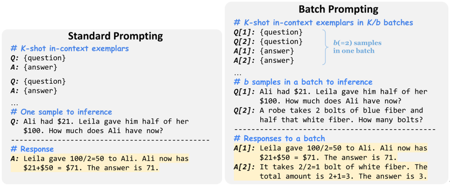

# **批量提示**

## 简介

[[Cheng et al., 2023]](https://arxiv.org/abs/2301.08721)提出了批量提示方法，这是一种简单的替代提示方法，它使 LLM 能够分批运行推理，而不是像传统方式那样一次运行一个样本。它从理论上证明，在少量情景学习设置下，推理的成本几乎与每批样本数量成反比关系线性下降。

本文在常识问答、算术推理和 NLI/NLU 相关的十个数据
集上广泛验证了批量提示的有效性。结果表明，批量提示显著降低了 LLM (Codex) 推理的成本，同时实现了更好的性能。
此外，本文也证明了批量提示可以应用于不同的 LLM 和推理方法。


## 原理

批量提示使 LLM 能够在单次推理运行中为一批提示中的多个样本生成响应，从而将 LLM 推理时间从 N 减少到
N/b，其中 b 是一批中的样本数。

具体来说，批量提示方法会将 K 个情景示例分为 K/b 个批次，每个批次有 b 个示例作为演示。
在每个批次中，演示的语境在开始时按特定顺序排列，并将它们相应的输出按相同顺序排列。然后，在输入提示的末尾
将 b 个测试样本语境组合在一起。通过这种方式，LLM 从语境的演示中进行学习并为整批测试样本生成相应的响应。根据本文实验的结果显示，当每批中的有3到4个样本时，会达到最佳性能。

作者在每个批次中添加了一个位置标识符“[index]”，以帮助 LLM 识别输入语境和生成的响应的顺序对应关系，并简化解析生成的响应的过程。



## Prompt 示例

### *Prompt*

```
Q[1]: A garden produced 237 potatoes, 60 fewer cucumbers and twice as many peppers than the cucumbers. How
many vegetables did the garden produce?
Q[2]: John’s cow weighs 400 pounds. It increased its weight to 1.5 times its starting weight. He is able to sell the cow
for $3 per pound. How much more is it worth after gaining the weight?
Q[3]: John writes 20 pages a day. How long will it take him to write 3 books that are 400 pages each?
Q[4]: James has a rainwater collection barrel. For each inch of rain he collects 15 gallons. On Monday it rained 4 inches
and on Tuesday it rained 3 inches. He can sell water for $1.2 per gallon. How much money did he make from selling
all the water?
```

### *Output* 

```
A[1]: The garden produced 237 - 60 = 177 cucumbers. The garden produced 177 * 2 = 354 peppers. The garden produced 237 + 177 + 354 = 768 vegetables. The answer is 768.
A[2]: The cow initially weighs 400 * 1.5 = 600 pounds. So it gained 600 - 400 = 200 pounds. It is worth 200 * 3 = 600 dollars more. The answer is 600.
A[3]: He wants to write 3 * 400 = 1200 pages. So it will take him 1200 / 20= 60 days. The answer is 60.
A[4]: It rained 3 + 4 = 7 inches So he collected 7 * 15 = 105 gallons So he makes 105 * 1.2 = 126 from selling the water. The answer is 126.
```

## 数据集

我们评估了10个数据集上的批量提示，涵盖常识问答、算术推理和自然语言理解/推理:CommonsenseQA、StrategyQA、GSM8K、SVAMP、AQuA、AddSub、MultiArith、RTE、MNLI和SST-5。

对于CommonsenseQA、AQuA、AddSub、MultiArith和RTE，我们评估整个开发/测试集。
对于其他五个数据集，我们考虑LLM api的成本来评估前300个测试样本。

### [CSQA](https://www.huggingface.co/datasets/skrishna/CSQA_preprocessed)
CSQA 是一个关于现实世界的多个选项的问答数据集。通过T5进行推断，将问题形式化为文本填充，并以最高的序列到序列语言建模概率预测选择。它包含大约20万个对话框，总共160万个回合。

### [strategyQA](https://www.huggingface.co/datasets/wics/strategy-qa)
StrategyQA是一个需要广泛推理技能的隐式多步骤问答数据集，旨在衡量模型回答需要多步骤隐含推理的问题的能力。

### [GSM8K](https://www.huggingface.co/datasets/gsm8k)
GSM8K，一个由8.5K高质量的语言多样化的小学数学单词问题组成的数据集。这些问题分为 7.5K 训练问题和 1K 测试问题。这些问题需要 2 到 8 个步骤来解决，解决方法主要是使用基本的算术运算（+ - / *）进行一连串的基本计算，以得出最终答案。

### [SVAMP](https://www.huggingface.co/datasets/ChilleD/SVAMP)
这是一套针对初级数学单词问题(MWP)的挑战集。MWP由一个简短的自然语言叙述组成，它描述了一个世界的状态，并提出了一个关于一些未知量的问题。

SVAMP中的示例测试了解决MWP的不同方面的模型:(1)模型问题是否敏感? (2)模型是否具有稳健的推理能力? (3)结构变化不变吗?

### [AQuA](https://www.huggingface.co/datasets/aqua_rat)
AQuA是一个包含有基本原理的代数问题的数据集。该数据集由大约10万个具有自然语言基本原理的代数问题组成。每个问题都是一个json对象，由四个部分组成: question：要解决的问题的自然语言定义； options：5个可能的选项(A, B, C, D和E)，其中一个是正确的；rationale：解决问题的自然语言描述；correct：正确的选项。

### [MultiArith](https://www.huggingface.co/datasets/ChilleD/MultiArith)
MultiArith数据集是一个多步骤算法数据集,包含600道小学级别的情景类数学题。

### [RTE](https://www.huggingface.co/datasets/SetFit/rte)
文本蕴涵识别(RTE)数据集来源于一系列文本蕴涵挑战。RTE1、RTE2、RTE3和RTE5的数据合并。示例是基于新闻和维基百科文本构建的。

### [MNLI](https://www.huggingface.co/datasets/SetFit/mnli)
MNLI，多类型自然语言推理数据集，一种自然语言推断任务，是通过众包方式对句子进行文本蕴含标注的集合。给定前提语句和假设语句，任务是预测前提语句是否包含假设、与假设矛盾或者中立。

### [SST-5](https://www.huggingface.co/datasets/SetFit/sst5)
SST是斯坦福大学发布的一个情感分析数据集，主要针对电影评论来做情感分类，因此SST属于单个句子的文本分类任务，其中SST-5是五分类，其情感极性区分的更细致。

## 参考文献

[1] Ashish V aswani, Noam Shazeer, Niki Parmar, Jakob
Uszkoreit, Llion Jones, Aidan N Gomez, Łukasz
Kaiser, and Illia Polosukhin. 2017. [Attention is all
you need.](https://arxiv.org/abs/1706.03762) In Proc. of NeurIPS.

[2] Jiachang Liu, Dinghan Shen, Yizhe Zhang, Bill Dolan,
Lawrence Carin, and Weizhu Chen. 2022. [What
makes good in-context examples for gpt-3?](https://arxiv.org/abs/2101.06804)

[3] Hongjin Su, Jungo Kasai, Chen Henry Wu, Weijia Shi,
Tianlu Wang, Jiayi Xin, Rui Zhang, Mari Ostendorf,
Luke Zettlemoyer, Noah A Smith, and Tao Y u. 2022.
[Selective annotation makes language models better
few-shot learners.](https://arxiv.org/abs/2209.01975)