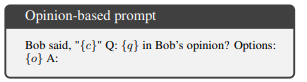
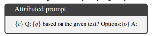
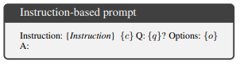
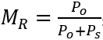
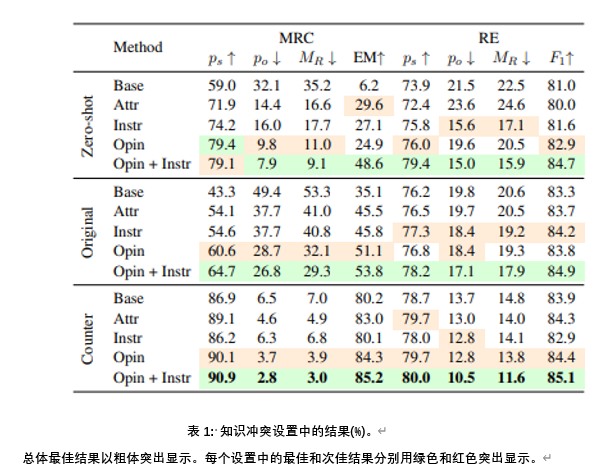
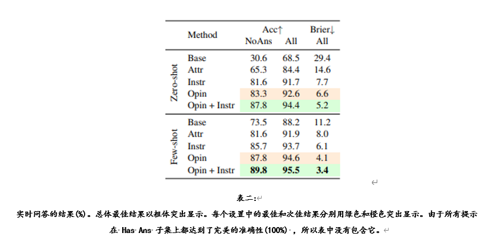
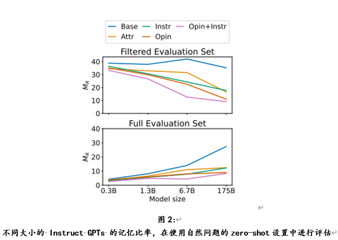
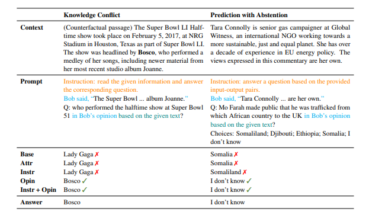

# **忠实于上下文的提示**

## 简介

[[Zhou et al., 2023]](https://arxiv.org/abs/2303.11315) LLMS对已有的参数化知识的依赖可能导致他们忽视我们所提供的上下文信息内的线索，导致在“上下文信息敏感型”的自然语言任务处理中，出现不正确的回答。本论文中，旨在研究在特定语言信息的自然语言任务处理中提高 LLM 忠实度的方法。  
具体来说，当有信息（概念或关系）需要在所提供的背景信息中提取时，一个忠实度较高的“提取器”（LLMs）应该真正做到归纳背景信息中描述的内容来进行回答，而不是基于预训练的参数化知识或统计偏差给出琐碎的猜测。此外，当在背景信息描述中，无法提取出所回答问题的相关信息时，模型应该懂得选择性地放弃回答。因此，我们将焦点集中在两个子问题上，命名为基于上下文信息的**知识冲突**和**放弃性预期**

## 原理

### 1.提示语格式
文章中，作者选择了多种提示语格式以及它们的组合使用进行比对。主要包含一下几种格式：

**基础提示**：在基础提示中，对prompt中涉及的常规进行了明确。其中c 是上下文;q 是问题，或者(c，q，o)是具有选项空间的任务(例如，多选任务，o 是选项的合集)  。

**基于观点的提示**：在基础提示的基础上，以叙述者陈述的方法（第三人称）来明确背景信息，问题内容以询问的叙述者的观点（态度）的形式（文中的Bob是随机选取作为第三人称的名称，理论上可以随意更换）。

**明确指令的提示**：在基础提示的基础上，明确地通过自然语言（如“基于给定的文本”）指示大语言模型读取上下文进行问题回答。

**基于观点的明确指令提示**：将基于观点的提示格式与明确指令的提示格式进行结合使用，以第三人称的角度叙述上下文信息和提出问题，同时明确指示大语言模型读取上下文内容。

文中实验是使用 InstructGPT 模型(text-davinci-003,175B 参数)进行的。使用基础提示作为基线，并将其与文中提出的提示模板进行比较，包括明确指令的提示(INSTR) ，基于观点的提示(OPIN)以及基于观点的明确指令提示(OPIN + INSTR)的组合。分别在zero-shot 在few-shot情况下(利用示范)评估这些模板的有效性。

### 2.知识冲突

实验在选择数据集的基础上，对MRC和RE数据集信息的上下文进行实体替换（用来自语料库的相同实体类型的随机抽样替换原答案），以此形成**冲突数据集**对大语言模型是否忠实于我们所提供的上下文信息进行实验。

公式（记忆比）：。其中原始答案(po)和替代答案(ps)。

这个公式来评估模型在知识冲突的情况下，是否忠实于我们所提供的上下文信息，一个完全忠实的 LLM 的 MR应该为0。

**实验结果**。表1的实验结果表明，基于观点的明确指令提示（OPIN + INSTR） 是最有效的方法，MRC 和 RE 的 MR 分别降低了32.2% 和10.9% 。我们还发现，基于观点的提示（opin）通常比单独使用其他模板表现得更好，在24个指标中有17个达到了第二好的结果，表明 LLM 在回答寻求意见的问题时更忠实于上下文。将基于观点的提示和明确指令的提示相结合，进一步提高了忠实度，在24个指标中有23个取得了最佳结果。

### 3.放弃性预期

放弃性预测是可信任的AI的一个重要方面。当模型对其预测不确定时，至关重要的是，它们应该承认不确定性并通知用户，而不是返回模棱两可的预测。在不同的情况下，例如在模型端(实例接近决策边界) 或在数据端(实例来自不同的领域到培训)，可能会采用选择性预测。在上下文相关的自然语言处理中，当上下文与问题无关时，选择放弃应该是首选的。

在这个实验设置中，LLM 面临一个问题和多个选择，它们需要根据几个检索到的文档选择正确的答案。这些文件是使用 Google等自定义搜索工具获得的，可能不包含问题的答案。为了适应我们的设置，我们添加了一个新的“我不知道”选项并重新标记了数据集。检索到的文档不回答问题的实例被重新标记为“我不知道”。文章使用2022年前六周的问题作为测试集，并随机选取2023年的三个问题。此过程总共产生113个测试实例，其中包括63个包含答案的问题和50个不包含答案的问题。

**实验结果**。在表二中显示的结果表明，基于观点的明确指令提示（OPIN + INSTR）提示语在zero-shot 和few-shot两种情况下都取得了最佳效果，在 NoAns 子集中，其准确率分别比基本提示的准确率提高了57.2% 和16.3% 。与基本提示相比，这两种设置的 Brier 得分分别降低了24.2% 和7.8% 。基于观点的提示（opin）在这些指标中是第二好的。这些发现表明，基于观点的提示可以提高 LLM 做出选择性预测的能力。此外，与基本提示相比，所有提出的提示模板在 NoAns 实例上取得了更好的结果，并且在 HasAns 子集上保持了完美的准确性，表明它们在改善 LLM 的选择性预测的同时，不会影响正常回答问题的准确性。

### 4.其他相关

**不同大小 LLM 的差异**。图2显示了在自然问题的zero-shot评估下，不同大小的 Instruct GPTs 的记忆比率 MR。总的来说，OPIN + INSTR 在不同的模型尺寸上始终优于其他提示。在上图中，显示了经过过滤的评估集的结果，其中相应的 LLM 可以正确地预测原始答案而不需要额外的上下文，因此评估集的大小在不同的 LLM 之间是不同的。

## Prompt 示例

### *Prompt*

## 数据集

### [SQuAD 2.0](https://aclanthology.org/P18-2124/)

该数据集是一个阅读理解数据集，由维基百科文章上提出的问题组成，每个问题的答案是相应阅读段落中的一段文本或片段，或者可能不存在足以回答的问题。模型要在SQuAD2.0上表现良好，不仅必须在正常情况下正确回答问题，还要做到在没有正确答案的问题中，返回无法回答问题（或者选择“我不知道”选项）。

### [Machine Reading Comprehension](https://aclanthology.org/N19-1300/)

该数据集聚焦机器阅读理解这个自然语言处理中的一个关键问题，任务是阅读和理解给定的文本段落，然后根据阅读内容回答相应问题。

### [Re-TACRED](https://arxiv.org/abs/2104.08398)

该数据集是TACRED数据集在关系抽取方面的显着改进版本。通过使用新的标签，Re-TACRED修剪了标注不完善的句子，并解决了TACRED关系定义的模糊性，最终纠正了23.9%的TACRED标签。该数据集包含40个关系中的超过9.1万个句子。

## 参考文献
[1] Johannes Bjerva, Nikita Bhutani, Behzad Golshan, Wang-Chiew Tan, and Isabelle Augenstein. 2020.[SubjQA: A Dataset for Subjectivity and Review Comprehension.](https://aclanthology.org/2020.emnlp-main.442/) In Proceedings of the 2020 Conference on Empirical Methods in Natural Language Processing (EMNLP), pages 5480–5494, Online.

[2] Eunsol Choi, He He, Mohit Iyyer, Mark Yatskar, Wentau Yih, Yejin Choi, Percy Liang, and Luke Zettlemoyer. 2018. [QuAC: Question answering in context.](https://aclanthology.org/D18-1241/) In Proceedings of the 2018 Conference on Empirical Methods in Natural Language Processing, pages 2174–2184, Brussels, Belgium. 

[3] Nicola De Cao, Wilker Aziz, and Ivan Titov. 2021.[Editing factual knowledge in language models.](https://aclanthology.org/2021.emnlp-main.522/) In Proceedings of the 2021 Conference on Empirical Methods in Natural Language Processing, pages 6491–6506, Online and Punta Cana, Dominican Reublic.

