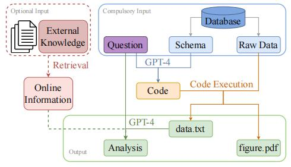
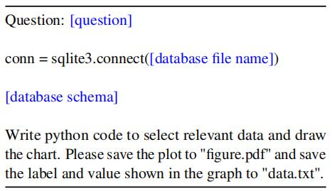
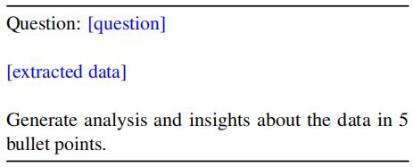

# 🏞️ 评估和可靠性

## 🏔️ 目录内容
- [以人为中心基准的评估模型](#以人为中心基准的评估模型)
- [大语言模型已经足够先进了吗？一个针对LLMS的具有挑战性的问题解决基准](#大语言模型已经足够先进了吗一个针对llms的具有挑战性的问题解决基准)
- [EVEVAL:大型语言模型事件语义的综合评价](#大型语言模型事件语义的综合评价)
- [GPT-4是一个好的数据分析师吗？](#gpt-4是一个好的数据分析师吗)
---

## 以人为中心基准的评估模型

&ensp;&ensp;&ensp;&ensp;本文提出AGIEval，AGIEval是一种专门用于在以人为中心的标准化考试的背景下评估基础模型。作者使用这个基准评估了几个最先进的基础模型，包括GPT-4、ChatGPT和Text-Davinci-003。
该评估模型使用的数据集来自于人类社会各种高标准考试，包括：
大学入学考试和职业资格考试等。确保了对LLM进行有力和标准化的评估
同时此评估基准是双语的包括中文和英文版本，目的是为了更全面的评估LLMs在不同语言、文化下的处理能力。  
&ensp;&ensp;&ensp;&ensp;作者使用该基准在上述三个LLMs上进行实验得出实验结论。
作者发现GPT-4显著优于ChatGPT和Text-Davinci-003，在高考英语和SAT上的准确率分别达到了93.8%和95%，
这表示了它在处理以人为中心的任务方面优越的通用能力。ChatGPT在需要高度外部知识的任务中，表现明显优于Text-Davinci-003，
比如涉及地理、生物、化学、物理和数学的课程。这表明ChatGPT拥有更强大的知识库，能够更好地处理需要深入理解特定领域的任务。
尽管以上三个大模型表现出色但在处理需要更高级推理和解决问题能力的任务时表现出了局限性。这也为针对未来增强模型的通用推理能力的研究和发展提供了机会。
作者将少样本提示与零样本提示实验进行对比，实验中发现少样本提示相比于零样本提示只有有限的提升，
这表明当前大语言模型的零样本学习能力正在接近其少样本学习能力。同时论文中提到了原始GPT-3少样本学习表现比零样本好得多，
GPT-3取得进步的原因是由于当前大模型中人工对齐与指令调优这些改进，使模型能够提前更好地理解任务的含义和背景，从而使他们表现更好。  
&ensp;&ensp;&ensp;&ensp;本篇作者通过人工的方式从理解力维度、知识维度、推理维度、计算维度。四个维度来评估LLM模型的能力。

1. 理解力维度：大模型的理解能力较好，对于大多数任务可以正确理解其意思，体现了大模型理解语境的能力。
2. 知识维度：在知识维度上，大模型在回忆特定领域知识时遇到困难，如法律、生物和物理等科目考试，这一观察强调了将更多特定领域知识集成到模型中的重要性，可以通过利用专门的特定领域知识库或知识增强的预训练技术。
3. 推理维度：模型的推理能力相对欠发达，对于需要复杂的多步骤推理的任务模型很难准确地执行多步骤推理过程。这强调了未来专注于增强大模型推理的研究的重要性。
4. 计算维度：模型的计算能力弱于其理解能力，并且在不同学科之间表现出差异性。
他们在数学考试中表现更好，但在化学和生物考试中表现较差，这些考试通常需要频繁地进行涉及化学元素的变量替换，这就要求提高计算和组合的抽象和计算能力。

最后通过对实验数据进行分析，得到目前LLMs仍可以取得进步的方面。主要包括  

1. 让模型让模型包含外部知识和公式 将知识库和专业知识引入模型中，使模型能够更有效地适应不同领域。
2. 更严格的复杂逻辑推理 创建强调复杂推理的新数据集，以及结合api和外部符号编译器，可执行严格的逻辑或数学推导，并使用执行结果进一步便于逻辑分析和推理验证。
3. 多语言推理能力的泛化 模型的能力在不同的语言中是不同的，但其中推理能力是相对的可以更多地关注增强基础模型的多语言泛化推理能力。
4. 多模态评估 扩展评估框架以包括多模态任务
5. 更好的以人为中心的任务自动评估指标 发展更强大的更有意义的自动评测指标
6. 推理能力的稳健性 提高模型推理能力的健壮性对于确保它们在各种背景下的一致性和可靠性

## 大语言模型已经足够先进了吗？一个针对LLMS的具有挑战性的问题解决基准

作者提出JEEBench数据集用于评估LLMS解决复杂问题的能力，该数据集是作者从 IIT JEE-Advanced Exam(印度一个入学考试，录取率仅为5%)
中选取了450个具有挑战性的问题，包括数学、物理、化学问题，LLMs需要从深层次的领域知识之上进行数学和逻辑推理。作者对GPT系列模型进行评估，表现最好的为GPT-4，但即使使用了
自我一致性与cot提示等技术最高提升也不到40%。作者分析到代数操作的错误和检索相关领域特定概念的失败是造成GPT-4低效率的主要原因.  

### JEEBench数据集设计

该数据集由450个问题组成，来自印度工程预科班考试包括数学、物理、化学。需要注意的时本次数据集选取不包括图表类问题。
物理问题中占比最大的是机器学内容，化学问题中占比最大的是无机化学，数学问题中占比最大的是代数和微积分。
对上述三种问题LLMs给出的答案包含单项正确的选择题、多项正确的选择题、整数型和数字型。在整数型问题中，答案是一个无界的非负整数，而在数字型问题中，答案是一个浮点数，必须精确到2位数。  

### 实验设计和结果

作者带着三个问题进行实验：

1. GPT系列模型在JEEBench这样复杂的基准测试中的表现如何？
2. 诸如 "思维链提示 "和 "自我一致性 "等方法对提高LLMs的推理能力有多大作用？
3. 限制这些模型性能的主要因素和误差来源是什么？  

#### 衡量标准

对于单项选项和整数型问题，作者使用准确性作为衡量标准，也就是说，如果模型给出的答案与正确答案相匹配，则得1分，否则得0 分。对于数字型问题，如果模型答案与正确答案相差不超过0.01 ，则得1分，否则为0分。对于多项选择问题，如果模型回答与所有正确的选项相匹配，我们就给1 分。如果模型选对但不全，那么对于输出中的每一个正确的选项，模型将得到0.25分。

#### 实验方式

作者对GPT系列模型进行一系列测试，并针对GPT-4设计了对比实验，包括思维链提示技术、自我一致性技术。
GPT-3表现出接近随机的性能，但GPT-3.5和GPT-4的性能明显更好。GPT-4远远优于GPT-3.5，差距很大，二者总分相差12.5分。其中，化学的性能提升是最高的，其次是物理，最后是数学。这可能是因为在测试数据集中，数学题的推理复杂性最高，化学题的推理复杂性最低。
对GPT-4进行思维链提示，发现这种方法能显著提升成绩，总分提高4.2分。对GPT-4进行思维链提示与自我一致性使用最佳采样温度0.5并通过多次投票对结果进行汇总发现相较于普通gpt-4性能并没有很大提升。

#### 人工分析

作者对GPT-4采用思维链提示技术在实验数据集中所犯错误进行人工注释，对GPT-4针对：

1. GPT-4能否正确检索出解决问题所需要的概念，无法做到这一点会导致概念性的错误
2. 如果相关正确的概念被检索出来，他们能否正确的解决方程式，如果无法做到这一点会导致基础性的错误。
3. 代数和算数是否正确，如果不能正确处理算数问题会出现计算错误。
带着以上三个问题作者对GPT-4错误的实验结果进行人工分析
实验分析表明，大多数错误是由于不能检索重要的概念，而这些概念对于解决问题至关重要，第二导致错误的原因是代数错误造成的，这些错误占总错误的百分之八十以上，需要注意的是作者提出导致错误的原因可能有多种情况，作者只统计了解决方案中的第一个错误。

#### 总结

作者发现更多的时候，GPT-4至少能给出一个正确的、类似人类的解决方案的草图，考虑到测试数据集问题所涉及的推理难度，GPT-4的表现是优秀的。然而，作者的分析也揭示了需要进步的主要领域。虽然GPT-4似乎能够在某些情况下进行类似人类的逻辑和数学推理，但有时它在执行琐碎的步骤时也会出现严重的错误。代数操作和计算对GPT系列来说仍然是困难的。大型语言模型能够利用黑盒科学计算器作为API，将会有可能提高计算正确率。
另一个可以探索的有趣方向是自我完善。如果训练一个验证器，能够用自然语言验证数学推理的正确性，并可能提供一些关于错误性质的反馈，这样的方法有可能大大改善LLM的推理能力。物理问题往往需要通过空间推理以理解现实世界的物理动态。我们发现，虽然GPT- 4的物理推理远非完美，但它能够在有限的意义上对基本的物理概念进行推理。
以上就是作者针对实验进行的总结，此外作者还提出了未来的发展展望如计算器增强的GPT、GPT-4的多模式评估以及GPT在考试环境中的规划能力。作者希望该基准能够指导未来使用LLM的研究。

## 大型语言模型事件语义的综合评价

最近的研究已经开始利用大型语言模型（llm）来处理事件语义处理。但是llm能否有效应对这些挑战的程度仍不确定。并且由于缺乏对事件语义处理的全面评估框架，因此对评估这些能力来说是一个挑战。为了全面评估模型的事件语义处理能力，我们引入了一种新的基准测试EVEVAL。我们收集了8个数据集，涵盖了对事件语义的理解、推理和预测。在EVEVAL上进行了大量的实验，在所得到的结果的基础上得到了几个值得注意的结果。

### 任务

#### 理解

1. 事件内的任务。 给定两个事件，模型应该挑选出更合理的事件。该任务评估模型理解事件中涉及的角色和参与者的能力，以及生成可信事件的能力。
2. 事件间任务。 给定一个事件和两个候选事件，模型应该找到候选事件中哪一个在语义上更类似于那个事件。此任务评估区分事件语义的能力。

#### 推理

1. 因果关系。 给定一个事件和一个可以是因果关系的目标关系，模型应该根据目标关系从候选事件中挑选出正确的事件。
2. 时间。给定事件和一个可以在时间之前或之后的目标关系，模型应该根据目标关系从候选事件中挑选出正确的事件。
3. 反事实。给定一个前提事件Ep、一个开始事件Eb和一个起源故事结尾Do。模型应该能够根据一个反事实的开始事件编辑一个新的故事结尾。
4. 意向。给定一个事件E，模型应该从最能反映代理意图的事件中挑选出正确的事件。

#### 预测

1. 脚本。给定一个按时间顺序排列的结构化脚本事件，所有事件都有主题、触发器和一些对象。任务是从给定的候选事件中选择正确的未来事件。
2. 故事。给定自然语言中按时间顺序排列的故事事件，任务是从给定的候选事件中选择正确的未来事件。

### 数据集

1. DTFit数据集（Pedinotti等人，2021）。数据集由具有单个不同参数的事件对组成，表示所描述事件中特定角色的典型或非典型填充。
2. HardSim数据集（Ding et al.，2019）。每个数据都有一个事件和两个选项。这两个选项中一个语义相似但词汇重叠很少，而另一个语义不同但词汇重叠很高。
3. ECARE数据集（Du et al.，2022）。该数据集是为可解释的因果原因而设计的，包括因果问题，以及大量独特的概念解释，有助于深入理解因果事实。
4. TRACIE数据集（Zhou et al.，2020）。该数据集的主要重点围绕短篇小说中隐含事件的时间关系。TRACIE数据集包含了注释的开始和结束时间查询。
5. TIMETRAVEL数据集（Qin et al.，2019）。它引入了反事实故事重写的概念，即对原始故事进行最小限度的修改，以使其与所提供的反事实事件保持一致。
6. SocialIQA数据集（Sap et al.，2019）。它包括一组多项选择题，旨在评估不同日常场景中的情绪和社会活动。
7. MCNC数据集（Granroth-Wilding and Clark，2016）。适用于叙事填充任务，但更适合作为叙事预测的一个组成部分来比较系统的有用性。
8. SCT数据集（Mostafazadeh et al.，2016）。它包含了日常事件之间的各种因果和时间常识关系，是日常生活故事的高质量汇编。

### 实验结果

1. LLM理解单个事件，但不理解事件之间的语义相似性。
2. LLM在因果关系和意向关系中表现出熟练的推理能力，但在其他类型的关系中表现相对较弱。
3. 上下文越多，LLM就能更好的预测未来的事件。
4. 用于事件语义处理的CoT可能需要更好地利用事件知识、上下文和模式。
5. 结构性事件表示法比自然语言表现得更好。

## GPT-4是一个好的数据分析师吗？

随着大型语言模型（llm）在许多领域和任务中展示了其强大的能力，包括上下文理解、代码生成、语言生成、数据讲故事等，许多数据分析师可能会担心他们的工作是否将被人工智能（AI）所取代。这个有争议的话题已经引起了公众的极大关注。在这个基础上，本文提出了“GPT-4是一个好的数据分析师吗？”通过进行面对面的比较研究来回答这个问题。我们通过仔细设计GPT-4的实验promrt，提出了一个解决这些问题的框架。我们还设计了几个特定任务的评估指标，系统地比较几个专业人类数据分析师和GPT-4之间的性能。实验结果表明，GPT-4可以达到与人类相当的性能。

### 实验设计

首先根据给定的问题，确定数据库中是否包含图表必要数据的相关表和方案，然后从数据库中提取数据，最后，需要分析数据，来帮助回答最初的问题。由于实际的数据分析师角色通常需要相关的业务背景知识，因此我们设计了一个外部知识检索模型，从外部知识源（如谷歌）查询实时在线信息。

### prompt设计

#### 步骤1：代码生成

第一步的输入包含一个问题和数据库模式。这里的目标是在后面的步骤中生成提取数据和绘制图表的代码。我们利用GPT-4来理解模式中多个数据库表之间的问题和关系。通过这些，我们可以得到一个包含SQL查询的python代码。

#### 步骤2：代码执行

此步骤中的输入是从步骤1生成的代码和来自数据库的原始数据。此步骤中涉及大量原始数据。通过执行python代码，我们能够在“figure.pdf”中获得图表和在“data.txt”中提取的数据。

#### 步骤3：分析生成

为了确保数据分析与原始查询对齐，我们同时使用问题和提取的数据作为输入。我们没有生成一段关于提取数据的描述，而是指示GPT-4生成5个要点的分析和见解，以强调关键要点。

### 数据集

NvBench数据集。我们从不同的图表类型和不同的难度级别的不同领域随机选择100个问题来进行主要实验。图表类型包括柱状图、条形图、折线图、散点图、分组散点图和饼图。难度等级包括：简单、中等、难和极难。领域包括：体育、艺术、交通工具、公寓租赁、大学等。在现有的NvBench数据集的基础上，我们还使用我们的框架为每个实例编写从5个要点的数据中提取的见解，并使用我们自己设计的评估指标来评估质量。

### 评估指标

#### 图表评价

信息的正确性：图中显示的数据和信息是否正确？
图表类型的正确性：图表类型是否符合问题中的要求？
美观：图形是否美观、清晰，没有任何格式错误？
信息正确性和图表类型正确性从0到1计算，美学在0到3。

#### 分析评价

正确性：分析是否包含错误的数据或信息？
一致性：这个分析与这个问题一致吗？
复杂性：这个分析到底有多复杂、有多深入？
流畅性：生成的分析是否流畅，语法健全，没有不必要的重复？
我们评分0到1的正确性和一致性，评分0到3的复杂性和流畅性。

#### 实验结果

1.GPT-4存在幻觉问题，数据分析工作不仅需要这些技术技能和分析技能，而且还需要保证较高的准确性。因此，一个专业的数据分析师总是试图避免这些错误，包括计算错误和任何类型的幻觉问题。
2.在提供深刻的建议之前，专业的数据分析师通常对所有的假设都很有信心。然而GPT-4是直接给出建议或从数据中做出猜测，它应该做到小心所有的假设，并使声明严格执行。
3.GPT-4在性能方面可以超过入门级数据分析师，其性能与高级级数据分析师相当。在成本和时间方面，GPT-4比雇佣数据分析师便宜得多、也快得多。GPT-4可以达到与人类相当的性能，但在得出GPT-4可以取代数据分析师的结论之前，还需要进一步的研究。
