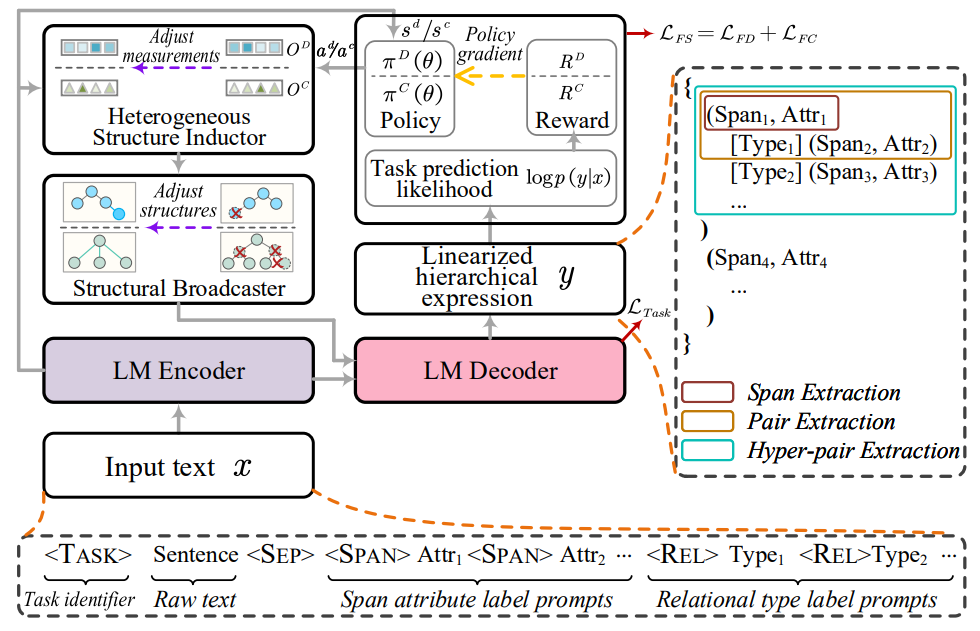
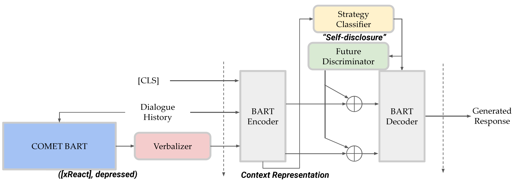
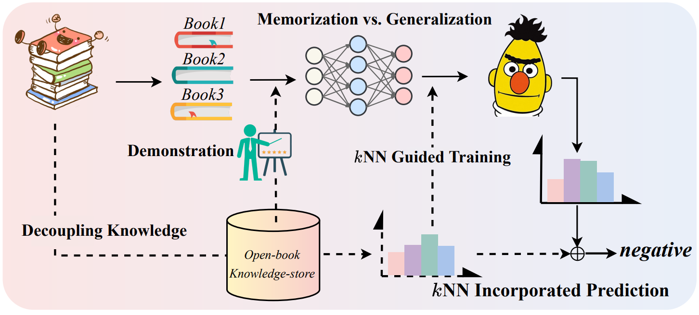
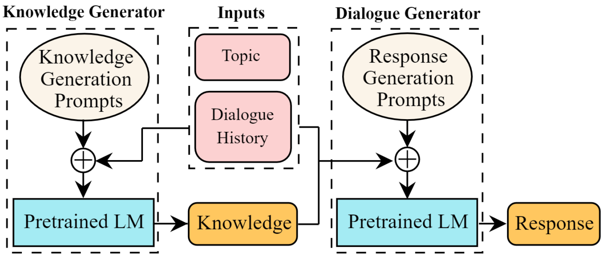
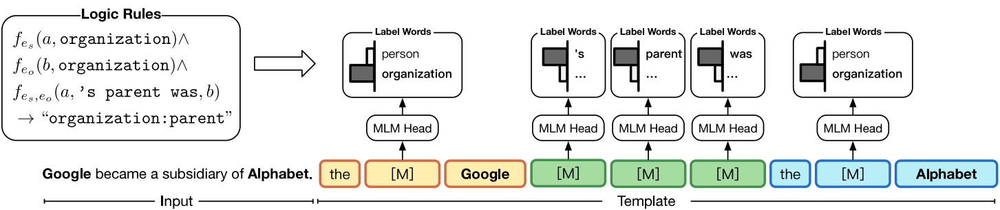

# 💾 Knowledge Augmented Prompt

# 📂 Table of Contents

- [**LasUIE: Unifying Information Extraction with Latent Adaptive Structure-aware Generative Language Model**](https://arxiv.org/abs/2304.06248)
- [**Commonsense-Aware Prompting for Controllable Empathetic Dialogue Generation**](https://doi.org/10.48550/arXiv.2302.01441)
- [**REPLUG: Retrieval-Augmented Black-Box Language Models**](https://doi.org/10.48550/arXiv.2301.12652)
- [**Self-Instruct: Aligning Language Model with Self Generated Instructions**](https://doi.org/10.48550/arXiv.2212.10560)
- [**The Impact of Symbolic Representations on In-context Learning for Few-shot Reasoning**](https://doi.org/10.48550/arXiv.2212.08686)
- [**Don’t Prompt, Search! Mining-based Zero-Shot Learning with Language Models**](https://doi.org/10.48550/arXiv.2210.14803)
- [**Knowledge Prompting in Pre-trained Language Model for Natural Language Understanding**](https://doi.org/10.48550/arXiv.2210.08536)
- [**Knowledge Injected Prompt Based Fine-tuning for Multi-label Few-shot ICD Coding**](https://doi.org/10.48550/arXiv.2210.03304)
- [**Unified Knowledge Prompt Pre-training for Customer Service Dialogues**](https://doi.org/10.1145/3511808.3557718)
- [**DocPrompting: Generating Code by Retrieving the Docs**](https://arxiv.org/abs/2207.05987)
- [**Towards Unified Conversational Recommender Systems via Knowledge-Enhanced Prompt Learning**](https://doi.org/10.1145/3534678.3539382)
- [**Decoupling Knowledge from Memorization: Retrieval-augmented Prompt Learning**](https://doi.org/10.48550/arXiv.2205.14704)
- [**Relation Extraction as Open-book Examination: Retrieval-enhanced Prompt Tuning**](https://doi.org/10.1145/3477495.3531746)
- [**Contrastive Demonstration Tuning for Pre-trained Language Models**](https://doi.org/10.48550/arXiv.2204.04392)
- [**Recommendation as Language Processing (RLP): A Unified Pretrain, Personalized Prompt & Predict Paradigm (P5)**](https://doi.org/10.1145/3523227.3546767)
- [**Multi-Stage Prompting for Knowledgeable Dialogue Generation**](https://doi.org/10.48550/arXiv.2203.08745)
- [**Training Data is More Valuable than You Think: A Simple and Effective Method by Retrieving from Training Data**](https://doi.org/10.48550/arXiv.2203.08773)
- [**AdaPrompt: Adaptive Model Training for Prompt-based NLP**](https://arxiv.org/abs/2202.04824)
- [**Generated Knowledge Prompting for Commonsense Reasoning**](https://doi.org/10.18653/v1/2022.acl-long.225)
- [**Label Verbalization and Entailment for Effective Zero and Few-Shot Relation Extraction**](https://doi.org/10.18653/v1/2021.emnlp-main.92)
- [**Knowledgeable Prompt-tuning: Incorporating Knowledge into Prompt Verbalizer for Text Classification**](https://doi.org/10.18653/v1/2022.acl-long.158)
- [**PTR: Prompt Tuning with Rules for Text Classification**](https://doi.org/10.1016/j.aiopen.2022.11.003)
- [**Retrieval-Augmented Generation for Knowledge-Intensive NLP Tasks**](https://arxiv.org/abs/2005.11401)
- [**REALM: Retrieval-Augmented Language Model Pre-Training**](https://arxiv.org/abs/2002.08909)
- [**Prompt as a Knowledge Probe for Chinese Spelling Check**](https://doi.org/10.1007/978-3-031-10989-8_41)

---

## [**LasUIE: Unifying Information Extraction with Latent Adaptive Structure-aware Generative Language Model**](https://arxiv.org/abs/2304.06248)

- 通过一个**生成类语言模型**结合**句法结构信息**统一信息抽取任务的语义表达，设计出一种从预训练生成类模型到面向任务进行微调的统一信息抽取机制

### 简介

句法结构信息应该是一种对于所有类型的文本信息提取任务（**UIE**）都有益的有效特征类型。在这篇工作中，他们提出了一种新颖的结构感知生成式语言模型（**GLM**），充分发挥句法知识在UIE中的作用。

### 工作原理

训练出一种多结构感知器对不同结构的信息进行表示，实现对已有生成式语言模型的延长训练。另外，设计了一个结构广播器，将各种潜在树结构压缩成显式的高阶森林，有助于在解码过程中得到更好的生成效果。最后引入了一个面向任务的结构微调机制，进一步对学习到的参数进行调整，使其与最终任务的需求最为一致。

### 微调机制

- 延长训练与多结构检测

  

- 面向任务的微调

  

## [**Commonsense-Aware Prompting for Controllable Empathetic Dialogue Generation**](https://doi.org/10.48550/arXiv.2302.01441)

- 结合常识信息并根据当前对话的表达内容修改决策以提高预训练模型的情绪感知对话生成能力

### 简介

This study  proposes a framework that improves empathetic dialogue generation using pre-trained language models by 1) incorporating commonsense knowledge through prompt verbalization, and 2) controlling dialogue generation using a strategy-driven future discriminator.

本研究提出了一个框架，通过以下两个方面来改进使用预训练语言模型生成共情对话：1）通过提示性言语表达融入常识知识，2）使用基于策略驱动的辨别器来控制对话生成。

### 总体结构

## [**REPLUG: Retrieval-Augmented Black-Box Language Models**](https://doi.org/10.48550/arXiv.2301.12652)

- 将一个语言模型作为一个 retriever 进行增强依据，将下游任务的语言模型视作黑盒接受知识增强

### 简介

This work introduces REPLUG, a retrieval-augmented language modeling framework that treats the language model (LM) as a black box and augments it with a tuneable retrieval model. Unlike prior retrieval-augmented LMs that train language models with special cross attention mechanisms to encode the retrieved text, REPLUG simply prepends retrieved documents to the input for the frozen black-box LM. This simple design can be easily applied to any existing retrieval and language models. Furthermore, the LM can be used to supervise the retrieval model, which can then find documents that help the LM make better predictions.

本文介绍了REPLUG，一种检索增强的语言建模框架，将语言模型（LM）视为黑盒，并通过可调整的检索模型进行增强。与先前的检索增强语言模型不同，先前的模型通过特殊的交叉注意机制训练语言模型来编码检索到的文本，而REPLUG将检索到的文档置于冻结的黑盒语言模型的输入之前。这种简单的设计可以轻松应用于任何现有的检索和语言模型。此外，预训练模型可以用于监督检索模型，从而帮助预训练模型做出更好预测。

### 主要思路

### 应用举例

## [**Self-Instruct: Aligning Language Model with Self Generated Instructions**](https://doi.org/10.48550/arXiv.2212.10560)

- 将模型自己的原本的输出作为之后微调训练的数据形成模型增强

### 简介

本研究介绍了SELF-INSTRUCT，一种通过利用预训练语言模型自身生成结果来提升其指令引导效果的框架。

### 工作原理

该流程利用语言模型生成引导、输入和输出样本，然后在使用它们对原始模型进行微调之前对其进行修剪。

### SELF-INSTRUCT 总览

## [**The Impact of Symbolic Representations on In-context Learning for Few-shot Reasoning**](https://doi.org/10.48550/arXiv.2212.08686)

- 通过自然语言与从知识库构建的符号语言构成数据集，用语言模型在数据集上反向重构以研究模型的 In-context Learning 推理过程，这种将模型当作逻辑规划器的方法称为 LMLP

### 简介

为了在上下文学习方面取得进展，这篇工作策划了一系列合成数据集，其中包含等价的（自然的、符号的）数据对，其中符号示例包含来自知识库（KB）的一阶逻辑规则和谓词。然后重新审视神经符号方法，并使用语言模型进行逻辑规划（LMLP），从包含逻辑规则和相应示例的示例中学习，通过迭代对知识库进行推理，复现反向链接算法。

### 比较 LMLP 与 CoT

#### 6.[**Don’t Prompt, Search! Mining-based Zero-Shot Learning with Language Models**](https://doi.org/10.48550/arXiv.2210.14803) （**2022.10.26**）

$\color{red}{勉强算知识增强，本质上是在构建数据集}$

- 用一种基于正则表达式匹配的方式在未标注的语料中找出可用数据，通过模型进行 zero-shot 过滤数据得到用于模型预训练的语料数据

##### 简介

该论文提出了一种基于挖掘的零样本学习的替代方法。与提示语言模型不同，他们使用正则表达式从未标记的语料库中挖掘带标签的示例（即与不同标签的基于正则表达式模式匹配的示例）。这些示例可以选择性地通过提示进行过滤，并用于对预训练模型进行微调。

### 主要流程

## [**Knowledge Prompting in Pre-trained Language Model for Natural Language Understanding**](https://doi.org/10.48550/arXiv.2210.08536)

- 根据知识库构建知识子图后转化为自然语言 prompt 并结合对不同任务设计的规则来提升模型效果

### 简介

大多数现有方法通过堆叠复杂模块来修改固定类型的预训练语言模型的内部结构，并从知识库（KB）中引入冗余和无关的事实知识。为了解决这些问题，本文引入了一种知识提示范式，并进一步提出了基于知识提示的PLM框架**KP-PLM**。该框架可以与现有的主流PLM灵活地结合使用。

### 工作原理

首先，为每个上下文从知识库中构建知识子图。然后设计了多个连续的提示规则，并将知识子图转化为自然语言提示。为了进一步利用这些提示中的事实知识，提出了两个新颖的知识感知自监督任务，包括提示相关性检验和掩码提示。

## [**Knowledge Injected Prompt Based Fine-tuning for Multi-label Few-shot ICD Coding**](https://doi.org/10.48550/arXiv.2210.03304)

- 通过注入语义结构、同义词及缩略词领域知识以提高预训练语言模型在医学领域的效果

### 简介

自动国际疾病分类（ICD）编码的目标是为平均长度为3,000+标记的医疗记录分配多个ICD编码。本研究通过采用基于提示的微调技术与标签语义相结合的方式来应对长尾问题，该方法已被证明在少样本情况下有效。为了进一步提升在医疗领域的性能，他们提出了一种知识增强的长文本模型（longformer），通过注入三种领域特定的知识：层次结构、同义词和缩写，并使用对比学习进行额外的预训练。

### 与以往方法比较

## [**Unified Knowledge Prompt Pre-training for Customer Service Dialogues**](https://doi.org/10.1145/3511808.3557718)

- 在客服对话程序的语言模型中引入知识增强方法，将所有对话任务转为统一的 text-to-text 生成任务，并在这一框架下通过实践收集的数据完成模型预训练

### 简介

本文中提出了一个统一的知识提示预训练框架，**UFA**（Unified Model For All Tasks），用于客户服务对话。他们将所有的客户服务对话任务都统一为文本生成任务，并引入了一个基于知识驱动的提示策略，以学习来自不同对话任务的混合数据。他们在大规模的中文客户服务语料库上对UFA进行预训练，并在自然语言理解（NLU）和自然语言生成（NLG）基准测试中取得了显著的效果提升。

### 总体结构

## [**DocPrompting: Generating Code by Retrieving the Docs**](https://arxiv.org/abs/2207.05987)

- 为了解决代码生成模型不能生成从未见过的代码的问题，引入代码说明文档信息作为知识对模型的生成能力进行增强

### 简介

现有的代码生成模型无法推广到使用未见过的函数和库，因为这些内容从未出现在它们的训练数据中。本文介绍了DocPrompting：一种利用代码文档的自然语言进行代码生成方法，具体包括：（1）根据自然语言意图检索相关文档片段，（2）然后基于自然语言意图和检索到的文档生成代码。DocPrompting具有通用性：它可以应用于任何编程语言，并且与底层神经模型无关。

### 主要流程

## [**Towards Unified Conversational Recommender Systems via Knowledge-Enhanced Prompt Learning**](https://doi.org/10.1145/3534678.3539382)

- 使用知识图谱进行增强的预训练语言模型提升对话推荐系统的效果

### 简介

为了解决在对话式推荐系统（CRS）中整合推荐模块和对话模块的问题，本研究提出了一种基于知识增强的提示学习的统一模型，称为UniCRS。该方法将推荐和对话子任务统一到提示学习范式中，并利用基于固定参数的预训练语言模型的知识增强提示来统一完成这两个子任务。

### 工作原理

在提示设计中，包括融合的知识表示、任务特定的标记和对话上下文，这些可以提供足够的上下文信息来让预训练语言模型适应CRS任务。此外，对于推荐子任务，他们还将生成的响应模板作为提示的重要部分，以增强两个子任务之间的信息交融。

### 结构总览

## [**Decoupling Knowledge from Memorization: Retrieval-augmented Prompt Learning**](https://doi.org/10.48550/arXiv.2205.14704)

- 从训练数据实例中构建知识库来帮助模型在应用时得到知识增强

### 简介

本研究开发了**RETROPROMPT**，旨在将知识与模型记忆解耦，帮助模型在泛化和记忆之间取得平衡。**RETROPROMPT**通过训练实例构建一个开放式知识存储库，并在输入、训练和推断过程中实现了检索机制，从而赋予模型从训练语料库中检索相关上下文的能力以作为增强的依据。

### 概览

### 主要概念

## [**Relation Extraction as Open-book Examination: Retrieval-enhanced Prompt Tuning**](https://doi.org/10.1145/3477495.3531746)

- 将关系抽取问题视为开卷测试，构建知识库以供语言模型在抽取关系时参考

### 简介

本研究将关系抽取视为一种开卷考试，并提出了一种新的用于关系抽取的检索增强提示微调范式。

### 工作原理

他们构建了一个开放式的数据存储库，用于检索基于提示的实例和相应的关系标签作为记忆的键值对。在推断过程中，模型可以通过线性插值基于预训练语言模型的基本输出和数据存储库上的非参数最近邻分布来推断关系。通过这种方式，模型不仅可以通过在训练期间存储在权重中的知识推断关系，还可以通过拓展查询开放式数据存储库中的示例来帮助决策。

### 应用流程

## [**Contrastive Demonstration Tuning for Pre-trained Language Models**](https://doi.org/10.48550/arXiv.2204.04392) 

- 一种易拓展的组件式模型微调训练方式，通过对比进行学习判断

### 简介

本论文提出了一种可插拔、可扩展和高效的不需要抽取示例的方法，称为对比示例微调（contrastive demonstration tuning）。该方法可以：(i) 融入任何先前的提示调优方法；(ii) 扩展到具有大量类别的广泛分类任务中。

### 示例微调示意

## [**Recommendation as Language Processing (RLP): A Unified Pretrain, Personalized Prompt & Predict Paradigm (P5)**](https://doi.org/10.1145/3523227.3546767) 

- 针对不同的推荐任务建立统一框架 “Pretrain, Personalized Prompt, and Predict Paradigm” (P5)，本质上就是为了推荐任务预训练了一个通用模型

### 简介

本研究提出了一种灵活且统一的文本到文本范式，称为“预训练、个性化提示和预测范式”（P5），用于推荐任务，它在一个共享的框架中统一了各种推荐任务。

### 工作原理

在P5中，所有数据，例如用户-物品交互、用户描述、物品元数据和用户评论，都被转换为一种通用的格式：自然语言序列。自然语言中的丰富信息有助于P5捕捉个性化和推荐的更深层语义。具体来说，在预训练期间，P5通过相同的语言任务目标学习不同的任务。因而它作为各种下游推荐任务的基础模型，可以与其他形式的模块结合，实现基于指示的推荐。P5将推荐系统从浅层模型推进到深度模型和大模型，并将推荐系统的技术形式革新为通用推荐引擎。通过针对不同用户的自适应个性化提示，P5能够以零样本或少样本的方式进行预测，并大大减少了微调的必要性。

### P5的预训练与下游任务

## [**Multi-Stage Prompting for Knowledgeable Dialogue Generation**](https://doi.org/10.48550/arXiv.2203.08745) 

- 提出一种多步 prompt 方法，先通过语言模型得到关于上下文的描述，再将描述和上下文一起作为 prompt 完成对话生成

### 简介

在这项工作中，他们提出了一种多阶段提示方法，以从单个预训练语言模型生成具有知识性的回复。首先，通过提示语言模型根据对话上下文生成知识。然后进一步提示它根据对话上下文和先前生成的知识生成输出。

### 概览

## [**Training Data is More Valuable than You Think: A Simple and Effective Method by Retrieving from Training Data**](https://doi.org/10.48550/arXiv.2203.08773)

- 将训练数据作为知识增强依据，在进行模型应用时将与输入内容最相近的训练数据与输入内容拼接后形成 prompt 来提升模型效果

### 简介

从训练数据中检索（**RE**trieving from the tra**IN**ing dat**A**，REINA）可以在多个自然语言生成（NLG）和自然语言理解（NLU）任务上带来显著的提升。在这项工作中，他们检索与输入文本最相似的带标签的训练示例，然后将它们与输入拼接起来输入模型得到输出。

### 流程示意

## [**AdaPrompt: Adaptive Model Training for Prompt-based NLP**](https://arxiv.org/abs/2202.04824)

- 根据训练任务和应用任务的不同特点自适应地提供额外信息进行知识增强

### 简介

本研究提出了AdaPrompt，通过利用任务和提示特征，自适应地检索外部数据用于延长对模型的预训练。此外，他们利用自然语言推理模型中的知识来得到自适应的语言表达方式。

### 概览

## [**Generated Knowledge Prompting for Commonsense Reasoning**](https://doi.org/10.18653/v1/2022.acl-long.225)

- 在常识问答中使用语言模型为问答模型提供额外的信息进行知识增强

### 简介

本研究开发了生成式知识提示方法，该方法通过从语言模型中生成知识，然后在回答问题时将知识一并输入。该方法不需要针对知识整合进行任务特定的监督，也不需要访问结构化的知识库。

### 应用流程

## [**Label Verbalization and Entailment for Effective Zero and Few-Shot Relation Extraction**](https://doi.org/10.18653/v1/2021.emnlp-main.92)

- 在实体关系抽取中为每种关系类型设定语义表达形式的描述，在应用时将每种关系类型的语义描述输入给模型来实现关系抽取

### 简介

在这项工作中，他们将关系抽取重新定义为一个蕴含任务，并使用不到15分钟的时间手动创建了关系的简单语言表达。该系统依赖于一个预训练的文本表示引擎，可以直接使用（无需训练样本，zero-shot），或者进一步使用标记的示例进行微调（few-shot或完全训练）。

### 应用流程

## [**Knowledgeable Prompt-tuning: Incorporating Knowledge into Prompt Verbalizer for Text Classification**](https://doi.org/10.18653/v1/2022.acl-long.158)

- 使用额外知识库进行知识增强提升文本分类效果，根据标签从知识库中提炼更充分的信息

### 简介

这项工作重点关注将外部知识融入到语言表达中，形成一种知识增强的提示微调（KPT）方法，以改进和稳定提示微调。具体而言，他们利用外部知识库（KBs）扩展语言表达的标签词空间，并在使用扩展的标签词空间进行预测之前，利用预训练语言模型自身对扩展的标签词空间进行提炼。

### 总览

## [**PTR: Prompt Tuning with Rules for Text Classification**](https://doi.org/10.1016/j.aiopen.2022.11.003)

- 根据已有的分类任务信息制定规则，通过规则为分类任务设计 prompt

### 简介

在本文中，提出将分类任务的先验知识编码为规则，然后根据这些规则设计子提示，最后将这些子提示组合起来处理任务。他们将这种基于规则的提示调优方法命名为“PTR”（Prompt Tuning with Rules）。

### PTR 在关系提取中的示例

## [**Retrieval-Augmented Generation for Knowledge-Intensive NLP Tasks**](https://arxiv.org/abs/2005.11401)

- 用额外的维基数据作为知识库，在任务中根据句子或词元进行匹配选取进行知识增强以提升模型效果

### 简介

这项工作探索了一种用于检索增强生成的通用微调方法RAG——这些模型结合了预训练的参数化和非参数化记忆来进行语言生成。RAG模型中参数化记忆是预训练得到的seq2seq模型，非参数化记忆通过预训练的神经网络检索器检索维基百得到紧凑的向量来体现。文中比较了两种RAG的表达方式，一种在整个生成序列中都以相同的检索段落作为条件，另一种可以为每个词元使用不同的检索段落。

### 总览

## [**REALM: Retrieval-Augmented Language Model Pre-Training**](https://arxiv.org/abs/2002.08909)

- 在作为知识库的数据上训练一个知识选取器 knowledge retriever 来给出用于增强的知识

### 简介

在这项工作中，为了以更模块化和可解释的方式捕捉知识，他们通过隐式的知识检索器增强了语言模型的预训练，使模型能够在预训练、微调和推理过程中检索和关注大型语料库（例如维基百科）中的文档。这个模型被称为检索增强语言模型（REALM）。

### 总览

左：无监督预训练

右：监督微调

## [**Prompt as a Knowledge Probe for Chinese Spelling Check**](https://doi.org/10.1007/978-3-031-10989-8_41)

- 使用 prompt 方法用 BERT 判断句中存在错别字的位置，再用 BERT 的 mask LM 对有错别字的位置进行更正

### 简介与工作原理

提出了一个端到端的生成模型，称为**PromptCSC**。由于字符的拼写错误会导致句子的语义不连贯，通过将提示模板作为知识探测器，PromptCSC会检测并输出句子中每个字符的错误概率。然后使用BERT的软掩码机制来纠正错误位置。

### 总览

​ 
