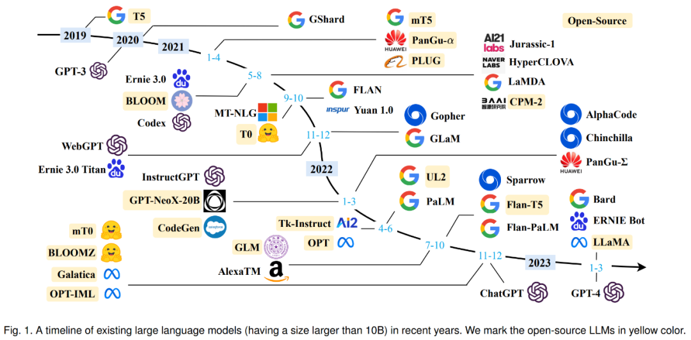

# 大语言模型概述
- [大语言模型概述](#大语言模型概述)
  - [简介](#简介)
  - [发展历史](#发展历史)
  - [涌现能力](#涌现能力)
  - [技术路线](#技术路线)
  - [训练方式](#训练方式)
  - [推理优化](#推理优化)
  - [参考文献](#参考文献)

## 简介
大规模语言模型（Large Language Model，LLM），是一种基于深度学习的自然语言处理模型，它能够学习到自然语言的语法和语义，从而可以生成人类可读的文本。

所谓 "语言模型"，就是只用来处理语言文字（或者符号体系）的 AI 模型，发现其中的规律，可以根据提示，自动生成符合这些规律的内容。

LLM 通常基于神经网络模型，使用大规模的语料库进行训练，比如使用互联网上的海量文本数据。这些模型通常拥有数十亿到数万亿个参数，能够处理各种自然语言处理任务，如自然语言生成、文本分类、文本摘要、机器翻译、语音识别等。

## 发展历史

大语言模型的历史可以追溯到早期的语言模型和自然语言处理研究。以下是大语言模型的一些关键历史里程碑：
* 规则阶段大致从1956年到1992年，基于规则的机器翻译系统是在内部把各种功能的模块串到一起，由人先从数据中获取知识，归纳出规则，写出来教给机器，然后机器来执行这套规则，从而完成特定任务。
* 统计机器学习阶段大致从1993年到2012年，机器翻译系统可拆成语言模型和翻译模型，这里的语言模型与现在的GPT-3/3.5的技术手段一模一样。该阶段相比上一阶段突变性较高，由人转述知识变成机器自动从数据中学习知识，主流技术包括SVM、HMM、MaxEnt、CRF、LM等，当时人工标注数据量在百万级左右。
* 预训练阶段是从2018年到2022年，相比之前的最大变化是加入自监督学习，张俊林认为这是NLP领域最杰出的贡献，将可利用数据从标注数据拓展到了非标注数据。该阶段系统可分为预训练和微调两个阶段，将预训练数据量扩大3到5倍，典型技术栈包括Encoder-Decoder、Transformer、Attention等。
* 大型语言模型阶段从2023年起，目的是让机器能听懂人的命令、遵循人的价值观。其特性是在第一个阶段把过去的两个阶段缩成一个预训练阶段，第二阶段转换成与人的价值观对齐，而不是向领域迁移。这个阶段的突变性是很高的，已经从专用任务转向通用任务，或是以自然语言人机接口的方式呈现。

## 涌现能力
LLM的涌现能力被正式定义为「在小型模型中不存在但在大型模型中出现的能力」，这是LLM与以前的PLM区分开来的最显著特征之一。当出现这种新的能力时，它还引入了一个显著的特征：当规模达到一定水平时，性能显著高于随机的状态。以此类推，这种新模式与物理学中的相变现象密切相关。原则上，这种能力也可以与一些复杂的任务有关，而人们更关心可以应用于解决多个任务的通用能力。这里简要介绍了LLM的三种代表性的涌现能力：

* 上下文学习。GPT-3正式引入了上下文学习能力：假设语言模型已经提供了自然语言指令和多个任务描述，它可以通过完成输入文本的词序列来生成测试实例的预期输出，而无需额外的训练或梯度更新。
* 指令遵循。通过对自然语言描述格式化的多任务数据集的混合进行微调，LLM在微小的任务上表现良好，这些任务也以指令的形式所描述。这种能力下，指令调优使LLM能够在不使用显式样本的情况下通过理解任务指令来执行新任务，这可以大大提高泛化能力。
* 循序渐进的推理。对于小语言模型，通常很难解决涉及多个推理步骤的复杂任务，例如数学学科单词问题。同时，通过思维链推理策略，LLM可以通过利用涉及中间推理步骤的prompt机制来解决此类任务得出最终答案。据推测，这种能力可能是通过代码训练获得的。

## 技术路线
近5年来，大型语言模型研究的发展有三条技术路线：Bert模式、GPT模式、混合模式。其中国内大多采用混合模式，多数主流大型语言模型走的是GPT技术路线，直到2022年底在GPT-3.5的基础上产生了ChatGPT。

到2019年后，Bert路线基本上就没有什么标志性的新模型出现了，而GPT技术路线趋于繁荣。从Bert往GPT走，模型越来越大，做的事越来越通用。大型语言模型按照从数据到知识来划分，数据可分为通用数据和领域数据，知识分为语言知识和世界知识；从任务类型来划分，可以分为单一任务和多任务、理解类和生成类。

* Encoder-Only：以谷歌的BERT为代表。
* Encoder-Decoder：以谷歌的T5、Meta的BART、清华大学的GLM为代表。
* Decoder-Only：以OpenAI的GPT、谷歌的Bard、Meta的LLaMA、DeepMind的Chinchilla、Anthropic的Claude为代表。

目前的研究结论是，如果模型规模不是特别大，面向单一领域的理解类任务，适合用T5模式。做生成类任务时，用GPT模式效果最好。如果单独考虑zero-shot，GPT模式效果最好；如果在预训练后引入多任务fine-tuning，则T5模式效果好。综合来看，当前几乎所有参数规模超过千亿的大型语言模型都采取GPT模式。

## 训练方式
训练语言模型需要向其提供大量的文本数据，模型利用这些数据来学习人类语言的结构、语法和语义。这个过程通常是通过无监督学习完成的，使用一种叫做自我监督学习的技术。在自我监督学习中，模型通过预测序列中的下一个词或标记，为输入的数据生成自己的标签，并给出之前的词。

训练过程包括两个主要步骤：预训练（pre-training）和微调（fine-tuning）：
* 在预训练阶段，模型从一个巨大的、多样化的数据集中学习，通常包含来自不同来源的数十亿词汇，如网站、书籍和文章。这个阶段允许模型学习一般的语言模式和表征。
* 在微调阶段，模型在与目标任务或领域相关的更具体、更小的数据集上进一步训练。这有助于模型微调其理解，并适应任务的特殊要求。

## 推理优化
目前很多研究已证明LLM对于知识具有强大的记忆能力，但是，一般我们不会因为一个人记忆能力强，就说这人很聪明，是否具有强大的推理能力，往往是我们判断一个人是否聪明的重要标准。当模型规模足够大的时候，LLM本身是具备推理能力的，在简单推理问题上，LLM已经达到了很好的能力，但是复杂推理问题上，还需要更多深入的研究。如果梳理现有LLM推理相关工作的话，我把它们归到两大类，体现出挖掘或促进LLM推理能力不同的技术思路：
* 第一类研究比较多，可以统称为基于Prompt的方法，核心思想是通过合适的提示语或提示样本，更好地激发出LLM本身就具备的推理能力，Google在这个方向做了大量很有成效的工作。
* 第二类做法是在预训练过程中引入程序代码，和文本一起参与预训练，以此进一步增强LLM的推理能力，这应该是OpenAI实践出的思路。比如ChatGPT肯定具备很强的推理能力，但它并不要求用户必须提供一些推理示例，所以ChatGPT强大的推理能力，大概率来源于使用代码参与GPT 3.5的预训练。

## 参考文献
* [A Survey of Large Language Models](https://arxiv.org/pdf/2303.18223.pdf)
* [通向AGI之路：大型语言模型（LLM）技术精要](https://zhuanlan.zhihu.com/p/597586623)
* [大型语言模型综述全新出炉：从T5到GPT-4最全盘点，国内20余位研究者联合撰写](https://zhuanlan.zhihu.com/p/619083290)
