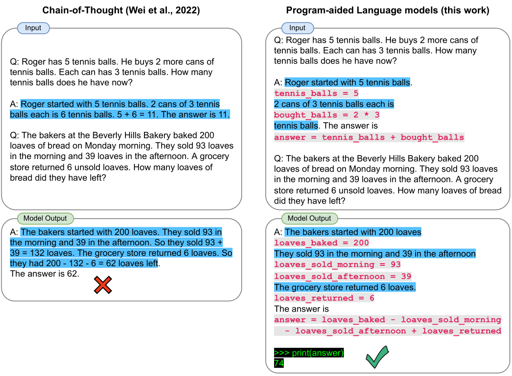

# **PAL Prompting**

## 简介

[Gao et al., 2022](https://arxiv.org/abs/2211.10435)引入了PAL框架，该框架包括降低推理步骤和LLM最终结果的计算，以确保答案的准确性。这降低了LLM的逻辑和计算错误的失败率。

通过将推理步骤外包给解释器，PAL消除了LLM执行计算的需要。结果表明，即使LLM使用更强的COT，PAL在精度上仍然优于它。此外，PAL可以与较弱的LLM协同工作，并在与较强的LLM合作时扩大其优势。

## 原理

虽然LLM可以将自然语言问题分解为多个步骤并执行简单的算术运算，但在处理复杂的算术或大数字时，它们的性能会显著下降。事实上，即使在基于164B明确数学内容的令牌对基于PaLM的模型进行微调时，据报道其最常见的两个失败是“错误推理”和“错误计算”

由于以前的LLM只在内部执行计算，因此无法处理大型计算和复杂的算法。PAL将问题分解为多个推理步骤，并将这些推理步骤和计算委托给Python解释器。因此，只要LLM的编码能力足够，它就可以准确地执行任何计算。



## Prompt 示例

### *Prompt*

```
Q: I have a drum, a flute, a clarinet, a violin, four accordions, a piano, a trombone, and a trumpet. How many musical instruments do I have?

# solution using Python:

def solution():
    """Q: I have a drum, a flute, a clarinet, a violin, four accordions, a piano, a trombone, and a trumpet. How many musical instruments do I have?"""
    musical_instruments_to_count = {
        'drum': 1,
        'flute': 1,
        'clarinet': 1,
        'violin': 1,
        'accordion': 4,
        'piano': 1,
        'trombone': 1,
        'trumpet': 1
    }
    num_musical_instruments = sum(musical_instruments_to_count.values())
    return num_instruments


Q: I have a chair, two ovens, and three tables. How many objects do I have?

# solution using Python:

def solution():
    """Q: I have a chair, two ovens, and three tables. How many objects do I have?
    """
    objects_to_count = {
        'chair': 1,
        'oven': 2,
        'table': 3
    }
    num_objects = sum(objects_to_count.values())
    return num_objects


Q: I have a chair, two potatoes, a cauliflower, a lettuce head, two tables, a cabbage, two onions, and three fridges. How many vegetables do I have?

# solution using Python:

def solution():
    """Q: I have a chair, two potatoes, a cauliflower, a lettuce head, two tables, a cabbage, two onions, and three fridges. How many vegetables do I have?
    """
    # note: I'm not counting the chair, tables, or fridges as vegetables
    vegetables_to_count = {
        'potato': 2,
        'cauliflower': 1,
        'lettuce head': 1,
        'cabbage': 1,
        'onion': 2
    }
    num_vegetables = sum(vegetables_to_count.values())
    return num_vegetables


Q: I have a raspberry, a cat, a rabbit, a mouse, a pig, two snails, a fish, two cows, a snake, a goat, and a duck. How many animals do I have?

# solution using Python:

def solution():
    """Q: I have a raspberry, a cat, a rabbit, a mouse, a pig, two snails, a fish, two cows, a snake, a goat, and a duck. How many animals do I have?
    """
    # note: I'm not counting the raspberry as an animal
    animals_to_count = {
        'cat': 1,
        'rabbit': 1,
        'mouse': 1,
        'pig': 1,
        'snail': 2,
        'fish': 1,
        'cow': 2,
        'snake': 1,
        'goat': 1,
        'duck': 1
    }
    num_animals = sum(animals_to_count.values())
    return num_animals


Q: {屋子里有三把椅子两个桌子，三张床，请问一共有多少的家具？}

# solution using Python:
```

### *Output*

```
以下是Python代码：

def solution():
    """Q: 屋子里有三把椅子两个桌子，三张床，请问一共有多少的家具？"""
    furniture_to_count = {
        'chair': 3,
        'table': 2,
        'bed': 3
    }
    num_furniture = sum(furniture_to_count.values())
    return num_furniture
答案是：你有八件家具。
```

## 数据集

我们实验了三大类推理任务:

(1)来自GSM8K、SVAMP、ASDIV和MAWPS等广泛数据集的数学问题;
(2)来自BIG-Bench Hard的符号推理;
(3)来自BIG-Bench Hard中的算法问题。

### [GSM8K](https://www.huggingface.co/datasets/gsm8k)

GSM8K是一个由8.5K高质量语言多样的初级数学单词问题组成的数据集。这些问题分为7.5K训练问题和1K测试问题。这些问题需要两到八个步骤才能解决，并通过使用基本算术运算（+-/*）进行一系列基本计算来获得最终答案。

### [Defects4J](https://github.com/rjust/defects4j)

该数据集包含5个Java项目的已知缺陷和修复，包括Commons Math、Joda Time等

### [MultiArith](https://www.huggingface.co/datasets/ChilleD/MultiArith)

MultiArith数据集是一个多步骤算法数据集，包含600个初级基于场景的数学问题。

### [Django](https://www.huggingface.co/datasets/AhmedSSoliman/DJANGO)

该数据集也是一个自然语言到代码的语义解析任务数据集，其中包括来自Django Web框架的Python代码和相关的自然语言描述。

### [Codeforces](https://www.kaggle.com/datasets/immortal3/codeforces-dataset)

该数据集是一个在线编程竞赛平台，包含来自世界各地的程序员提交的数百万行代码。

### [SQuAD](https://www.huggingface.co/datasets/squad)

该数据集是一个广泛用于自然语言处理任务的问答数据集，其中包含维基百科上的问题及其相应的答案

## 参考文献

\[1\] Brown, T. B., Mann, B., Ryder, N., Subbiah, M., Kaplan,
J., Dhariwal, P ., Neelakantan, A., Shyam, P ., Sastry, G.,
Askell, A., Agarwal, S., Herbert-V oss, A., Krueger, G.,
Henighan, T., Child, R., Ramesh, A., Ziegler, D. M., Wu,
J., Winter, C., Hesse, C., Chen, M., Sigler, E., Litwin, M.,
Gray, S., Chess, B., Clark, J., Berner, C., McCandlish,
S., Radford, A., Sutskever, I., and Amodei, D. [Language Models are Few-Shot Learners.](https://proceedings.neurips.cc/paper/2020/hash/1457c0d6bfcb4967418bfb8ac142f64a-Abstract.html)
In NeurIPS, 2020.

\[2\] Wang, X., Wei, J., Schuurmans, D., Le, Q., Chi, E.,
and Zhou, D. [Self-Consistency Improves Chain of Thought Reasoning in Language Models.](https://arxiv.org/abs/2203.11171v2) arXiv preprint
arXiv:2203.11171, 2022b.

\[3\] Wei, J., Wang, X., Schuurmans, D., Bosma, M., Chi, E., Le,
Q., and Zhou, D. [Chain of Thought Prompting Elicits Reasoning in Large Language Models.](https://arxiv.org/abs/2201.11903) arXiv preprint
arXiv:2201.11903, 2022.
