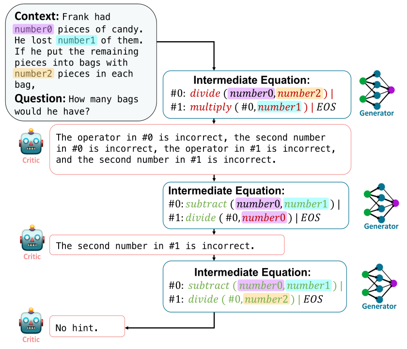
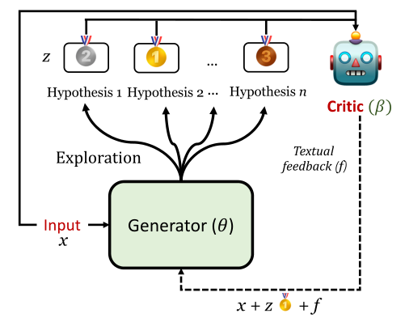

# REFINER: 使用大型语言模型API进行高效推理

## 简介

[[Paul et al., 2023]](https://arxiv.org/abs/2304.01904)介绍了Refiner，这是一个用于微调LMS的框架，它用于显式地生成中间推理步骤，同时与提供自动推理反馈的critic model（批评者模型）交互。

本研究在math word problems（数学应用问题）, synthetic natural language reasoning（综合自然语言推理）and moral action generation（道德行为生成）三个自然语言推理任务上对精化算法进行了评估。这是第一个研究在中间推理步骤上与细粒度推理反馈交互如何影响LMS在推理任务中的性能的研究。Refiner在这些推理任务上的实证评估显示，与规模相当的基线LM相比，Refiner有明显的改进。此外，当使用GPT3.5作为推理器时，训练有素的critic model在没有微调推理器的情况下显著提高了推理能力。

结果表明，Refiner具有很强的通用性，原则上可以用来指导语言模型执行不同的推理任务。

## 原理

Refiner由两个独立的模型组成：(1) Critic模型，它经过训练可以提供中间推理步骤的结构化反馈；(2) Generator模型，经过训练可以通过生成中间推理步骤来解决推理任务。

Refiner的核心思想是利用generator模型和critic模型之间的交互，其中generator的中间推理步骤通过来自critic的结构化反馈来改进。

对于每个任务，训练一个统一Qa-T5-base模型（UQA-base）作为critic. Critic模型的任务是对generator模型产生的中间假设提供反馈。评估假设的质量并对中间假设z产生反馈的一种方法是将其与黄金假设z∗进行比较。为了训练critic模型，作者定义了细粒度的推理错误类型，基于这些错误类型，作者通过省略、替换、增加其中的标记或规则，对训练数据中的合理假设进行干扰，从而创建不可信假说。Critic模型的输入为语境x和假设z，并以文本反馈为输出传递给generator.

Generator的任务是反复学习如何与critic模型交互。在其中的Warm-up阶段，该模型被训练以生成比较可信的假设。在每次迭代中，generator模型会生成多个假设，然后它将通过解决反馈中提到的推理错误来学习和更新其生成的结果。

下图显示了Refiner的过程。其中，Critic模型在评估生成的中间步骤后，向generator模型提供其推理错误的反馈。这些反馈会连同原始问题和先前的中间方程，都反馈给generator模型。



下图显示了Refiner交互循环的概况。在每个迭代中，generator产生多个假说。Critic随机选择一个假说，并根据推理错误提供反馈。



## Prompt 示例

### *Prompt*

```
Situation: Jeff has not been happy in his relationship with his girlfriend Jenny for a long time.
Intention: Jeff wants to break up with Jenny. 
Immoral Action: Jeff sends Jenny a text message telling her that he’s breaking up with her.
```

### *Output* 

```
Moral norm output(z): It’s wrong to break up with someone over text.
Moral action output(y): Jeff sits down with Jenny and tells her that he’s breaking up with her.
```

## 数据集

### SVAMP
这是一套针对初级数学单词问题(MWP)的挑战集。MWP由一个简短的自然语言叙述组成，它描述了一个世界的状态，并提出了一个关于一些未知量的问题。

SVAMP中的示例测试了解决MWP的不同方面的模型:(1)模型问题是否敏感? (2)模型是否具有稳健的推理能力? (3)结构变化不变吗?

### MS
MS是一个基于群体的结构化分支叙事数据集，用于研究基于目标导向的社会推理。

