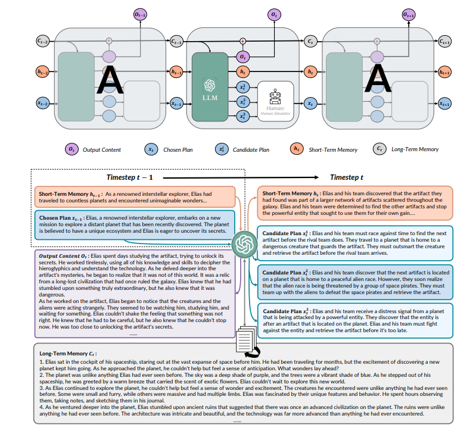

# 循环GPT

## 简介

[[Wangchunshu et al., 2023\]](https://arxiv.org/abs/2305.13304) 介绍了RECURRENTGPT，一种在语言模型中模拟循环神经网络（RNN）中循环机制的语言仿真器。

基于大型语言模型（LLM）构建的，它使用自然语言来模拟长短时记忆网络（LSTM）中的机制。在每个时间步长，RECURRENTGPT生成一个段落的文本，并分别更新存储在硬盘和提示中的基于语言的长短时记忆。这种循环机制使得RECURRENTGPT能够生成任意长度的文本而不会遗忘。

由于人类用户可以轻松观察和编辑自然语言记忆，RECURRENTGPT具有可解释性，并能够实现交互式生成长文本。除了生成人工智能内容（AIGC），我们还展示了将RECURRENTGPT用作与消费者直接互动的交互式小说的可能性。

## 原理

### 1. 长短期记忆

长期记忆总结了之前生成的所有内容，以最小化在生成长文本时丢失的信息。短期记忆是一段简短的段落，总结了最近时间步的关键信息。通过结合长短期记忆，RECURRENTGPT可以保持与最近生成内容的连贯性，还可以回忆起很久之前生成的关键信息。

### 2. RecurrentGPT

RECURRENTGPT将Long-short Term Memory RNN (LSTM)中的向量化元素（即细胞状态、隐藏状态、输入和输出）替换为自然语言（即段落文本），并通过提示工程来模拟循环机制。在每个时间步 t，RECURRENTGPT接收到一段文本和下一段文本的简要计划，这两者都是在步骤 t-1中生成的。然后，它会注意到包含所有先前生成段落摘要的长期记忆，并且可以存储在硬盘上，可以通过语义搜索检索相关段落。RECURRENTGPT还维护一个短期记忆，以自然语言总结最近时间步内的关键信息，并在每个时间步更新。RECURRENTGPT将所有上述输入组合在提示中，并要求主干LLM生成一个新的段落，下一段段落的简要计划，并通过重写短期记忆和将输出段落的摘要追加到长期记忆来更新长短期记忆。这些组件在下一个时间步中被重新使用，从而形成了生成过程的循环机制。



## Prompt 示例

### *Prompt*

```
I need you to help me write a novel. Now I give you a memory (a brief summary) of 400 words, you should use it to store the key content of what has 
been written so that you can keep track of very long context. For each time, I will give you your current memory (a brief summary of previous 
stories. You should use it to store the key content of what has been written so that you can keep track of very long context), the previously 
written paragraph, and instructions on what to write in the next paragraph. I need you to write:

1. Output Paragraph: the next paragraph of the novel. The output paragraph should contain around 20 sentences and should follow the input 
instructions.

2. Output Memory: The updated memory. You should first explain which sentences in the input memory are no longer necessary and why, and then 
explain what needs to be added into the memory and why. After that you should write the updated memory. The updated memory should be similar to the 
input memory except the parts you previously thought that should be deleted or added. The updated memory should only store key information. The 
updated memory should never exceed 20 sentences!

3. Output Instruction: instructions of what to write next (after what you have written). You should output 3 different instructions, each is a 
possible interesting continuation of the story. Each output instruction should contain around 5 sentences
```

 ### *Input* 

```
Input Memory: 
{short_memory}

Input Paragraph:
{input_paragraph}

Input Instruction:
{input_instruction}

Input Related Paragraphs:
{input_long_term_memory}
```

### *Output* 

```
Output Paragraph:
<string of output paragraph>, around 20 sentences.

Output Memory:
Rational: <string that explain how to update the memory>;
Updated Memory: <string of updated memory>, around 10 to 20 sentences

Output Instruction:
Instruction 1: <content for instruction 1>, around 5 sentences
Instruction 2: <content for instruction 2>, around 5 sentences
Instruction 3: <content for instruction 3>, around 5 sentences
```

## 数据集

### [Vector Database](https://aws.amazon.com/what-is/vector-databases/)
Vector Database 是一种专门用于存储和管理矢量数据的数据库系统。矢量数据由点、线和多边形等几何要素构成，常用于地理信息系统（GIS）和地图应用中。与传统的关系型数据库相比，矢量数据库提供了更高效的存储和查询方式，以支持空间数据的存储、索引和分析。


## 参考文献

[1] Alec Radford, Karthik Narasimhan, Tim Salimans, Ilya Sutskever, et al. [Improving language understanding by generative pre-training.](https://www.cs.ubc.ca/~amuham01/LING530/papers/radford2018improving.pdf) 2018.

[2] Alec Radford, Jeffrey Wu, Rewon Child, David Luan, Dario Amodei, Ilya Sutskever, et al. [Language models are unsupervised multitask learners.](https://cdn.openai.com/better-language-models/language_models_are_unsupervised_multitask_learners.pdf) OpenAI blog, 1(8):9, 2019.

[3] Jeffrey L. Elman. [Finding structure in time.](https://www.sciencedirect.com/science/article/pii/036402139090002E) Cognitive Science, 14(2):179–211, 1990. ISSN 0364-0213.


