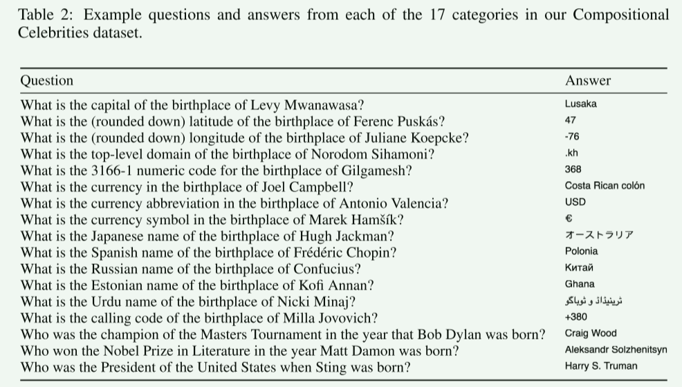

 

# **MEASURING AND NARROWING** **THE COMPOSITIONALITY GAP IN LANGUAGE MODELS**

## Introduction

[[Press et al., 2022\]](https://arxiv.org/abs/2210.03350) investigate the ability of language models to perform compositional reasoning tasks where the overall solution depends on correctly composing the answers to sub-problems.

Meauring how often models can correctly answer all sub-problems but not generate the overall solution, a ratio is called the compositionality gap and is evaluated by asking multi-hop questions with answers that require composing multiple facts unlikely to have been observed together during pretraining.

Demonstrating how elicitive prompting (such as chain of thought) narrows the compositionality gap by reasoning explicitly instead of implicitly and present a new method, self-ask, that further improves on chain of thought.

In the method, the model explicitly asks itself (and then answers) follow-up questions before answering the initial question. They finally show that self-ask’s structured prompting can easily plug in a search engine to answer the follow-up questions, which additionally improves accuracy.

## How it Works?

### 1.SELF-ASK

Self-ask builds on chain of thought prompting, but, instead of outputting a continuous undemarcated chain-of-thought, the prompt has the model explicitly state the next follow-up question it wants to ask before answering it. In addition, the method inserts scaffolds like “Follow up:”, which is found to improve the ability to output the correct final answer in an easily parseable way, this makes it easy to integrate the method with an internet search engine to answer follow-up questions, which further improves performance.

By use self-ask, when the model get a one- or few-shot prompt, it will insert the phrase “Are follow up questions needed here:” at the end of the prompt, then outputs a response. In most cases it first outputs “Yes.”, meaning that follow-up questions are necessary. The LM then outputs the first follow-up question, answers it, and continues asking and answering follow-up questions until it decides it has sufficient information; at this point, it outputs “So the final answer is:” before providing the final answer; this makes the final answer easily parseable as what appears after ’:’ on the last output line. In rare cases the LM decides that it need not ask follow-up questions and can answer the question immediately.


### 2. IMPROVING SELF-ASK WITH A SEARCH ENGINE

Unlike chain of thought, self-ask clearly demarcates the beginning and end of every sub-question. Therefore, we can use a search engine to answer the sub-questions instead of the LM. Search engines have features that LMs lack, such as an ability to be easily and quickly updated.Inputing the prompt to the language model; if the LM outputs “Follow up:”, leting it finish generating the question, indicated by outputting the string “Intermediate answer:”. Upon this response, stop the LM, and, instead of having it output its own answer, input the full sub-question the model asked to a search engine API. Then add the answer returned by the search engine to the prompt before asking the LM to continue generating its answer.

The LM takes as input a compositional question and decomposes it by first outputting an initial sub-question that is fed into the search engine; the answer is fed back to the LM, which generates another sub-question, and so on, until it outputs the final answer.


## *Prompt:*

```
Question: Who lived longer, Muhammad Ali or Alan Turing?
Are follow up questions needed here: Yes.
Follow up: How old was Muhammad Ali when he died?
Intermediate answer: Muhammad Ali was 74 years old when he died.
Follow up: How old was Alan Turing when he died?
Intermediate answer: Alan Turing was 41 years old when he died.
So the final answer is: Muhammad Ali 

Question: When was the founder of craigslist born?
Are follow up questions needed here: Yes.
Follow up: Who was the founder of craigslist?
Intermediate answer: Craigslist was founded by Craig Newmark.
Follow up: When was Craig Newmark born?
Intermediate answer: Craig Newmark was born on December 6, 1952.
So the final answer is: December 6, 1952

Question: Who was the maternal grandfather of George Washington?
Are follow up questions needed here: Yes.
Follow up: Who was the mother of George Washington?
Intermediate answer: The mother of George Washington was Mary Ball Washington.
Follow up: Who was the father of Mary Ball Washington?
Intermediate answer: The father of Mary Ball Washington was Joseph Ball.
So the final answer is: Joseph Ball 

Question: Are both the directors of Jaws and Casino Royale from the same country? 
Are follow up questions needed here: Yes. 
Follow up: Who is the director of Jaws? 
Intermediate Answer: The director of Jaws is Steven Spielberg. 
Follow up: Where is Steven Spielberg from? 
Intermediate Answer: The United States. 
Follow up: Who is the director of Casino Royale? 
Intermediate Answer: The director of Casino Royale is Martin Campbell. 
Follow up: Where is Martin Campbell from? 
Intermediate Answer: New Zealand. 
So the final answer is: No

Question: What is the hometown of the reigning men's U.S. Open champion?
Are follow up questions needed here:
```

 

## *Output:* 

```
 Yes.
Follow up: Who is the reigning men's U.S. Open champion?
Intermediate answer: Carlos Alcaraz.
Follow up: Where is Carlos Alcaraz from?
Intermediate answer: El Palmar, Murcia, Spain.
So the final answer is: El Palmar, Murcia, Spain
```

## Dataset：

### Compositional Celebrities(CC)

For the three categories that ask compositional questions based on a celebrity’s birth date, they crawled the list of celebrities from this5 URL (change 1992 to the desired birth year). For the fourteen categories that ask compositional questions based on a celebrity’s country of birth,  they crawled the lit of celebrities from this URL. For the country properties used for the fourteen categories that ask location-based questions, they used this  dataset. They manually checked a random sample of questions to verify that their answers were correct.



### Bamboogle

Bamboogle was designed by reading random Wikipedia articles and trying to come up with 2-hop questions about them. They limit our search through Wikipedia only to vital articles (manually designated by Wikipedia editors to address important topics).


### 2WikiMultiHopQA

This dataset contains multi hop questions and answers between multiple Wikipedia pages, which can be used for research on machine reading comprehension and natural language inference tasks.

### Musique

The Music dataset is a dataset used for music information retrieval research, which includes user listening history and music metadata from Last. fm.