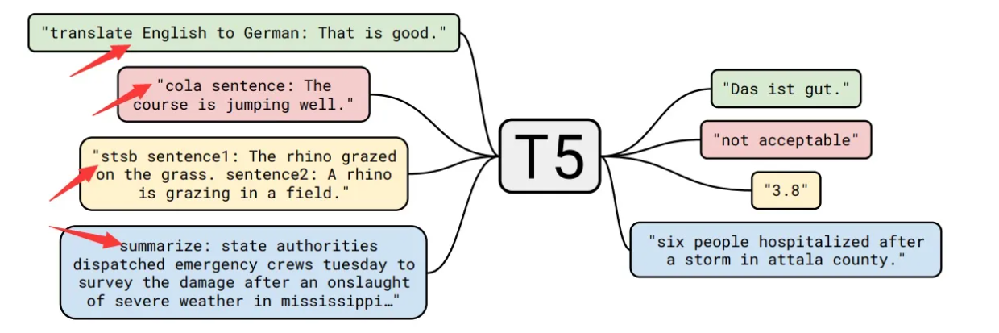
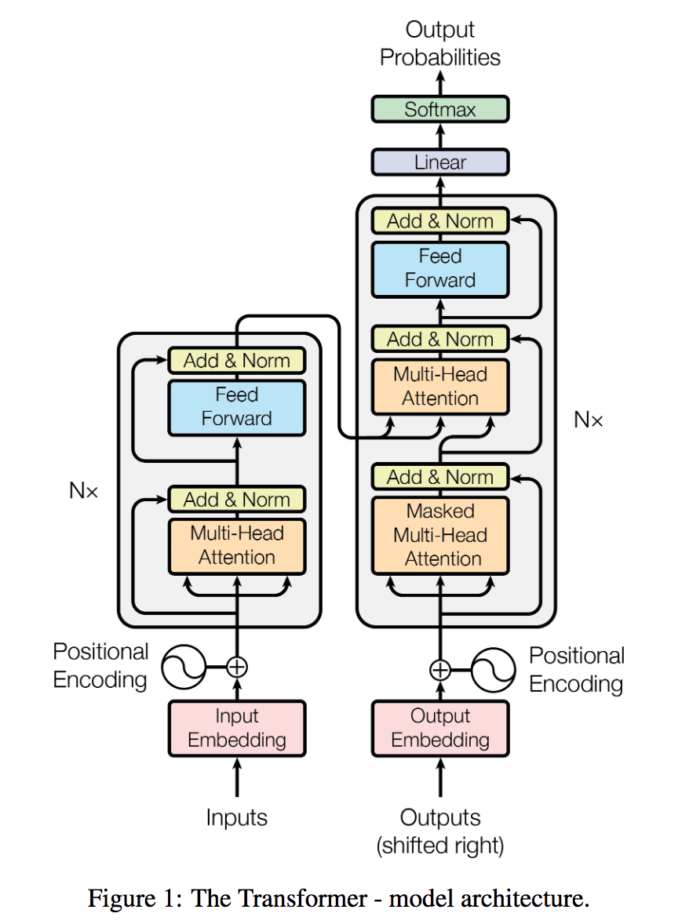
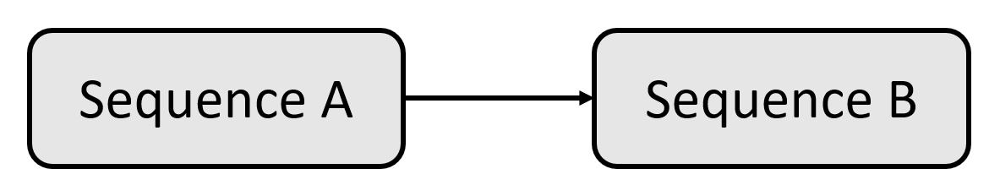
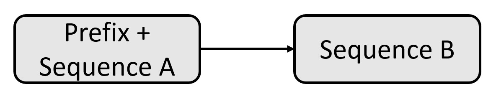
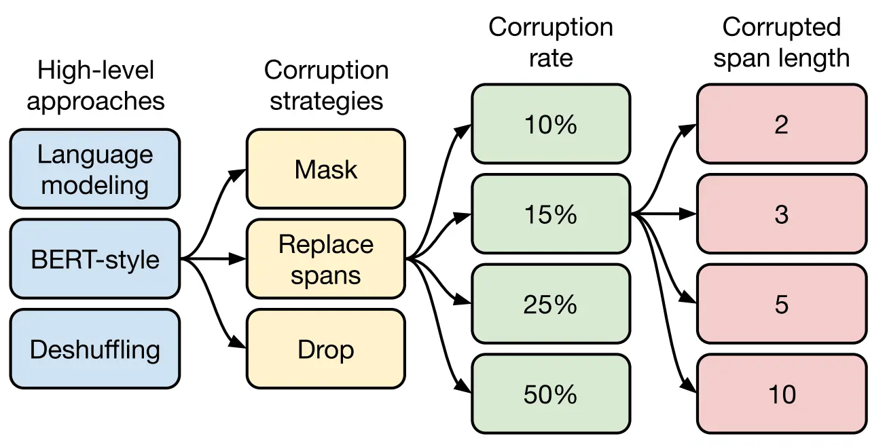

# T5

## 简介
T5（Text-to-Text Transfer Transformer）是一种大型预训练语言模型，在2019年的论文[《Exploring the Limits of Transfer Learning with a Unified Text-to-Text Transformer》](https://arxiv.org/pdf/1910.10683.pdf)中由Google团队提出。T5模型基于Transformer架构，采用了Encoder-Decoder结构，并使用了大规模的数据集进行预训练。

T5模型的独特之处在于其通用性和灵活性。与传统的语言模型不同，T5模型被设计为一个"文本到文本（Text-to-Text）"模型，意味着它可以处理各种不同的自然语言处理任务，只需将输入和输出表达为相应的文本形式即可。T5通过为每个任务对应的输入添加不同的前缀（图上箭头所示），可以很好地直接应用在各种任务上。这使得T5模型可以处理包括文本分类、问答、命名实体识别、机器翻译等多种任务。

T5模型的预训练过程使用了大规模的文本数据集，包括了来自互联网的多种类型的文本数据。通过大规模的预训练，T5模型学习到了丰富的语言知识和表示，从而可以更好地理解和生成自然语言。

在应用阶段，T5模型通过微调（fine-tuning）的方式进行任务特定的训练。通过微调，T5模型可以根据具体任务的需求进行参数调整和优化，以实现更好的性能和效果。

T5模型在自然语言处理领域取得了令人瞩目的成果，不仅在多个基准任务上取得了领先的性能，而且在多语种、多领域的任务上也表现出色。其通用性和灵活性使得T5模型成为一个强大的工具，为各种自然语言处理任务提供了一个统一的框架和基础模型。

## 数据集
T5作者选取了Common Crawl数据集，这个数据集每个月大概抓取20TB文本数据。虽然数据集已经抽取了文本，但实际上并不干净，里面还包含了很多非自然语言的东西，比如错误消息、菜单、重复文本，于是对数据进行了比较细致的处理：
* 只保留以终点符号（即句点，感叹号，问号或引号）为结尾的行；
* 删除任何包含List-of-Dirty-Naughty-Obscene-and-Otherwise-Bad-Words中单词的网页；
* 删除包含Javascript单词的行；
* 删除包含编程语言中常用大括号的页面；
* 删除出现“lorem ipsum”短语（即排版测试）的所有页面；
* 对数据集进行重复数据删除，当连续的三句话重复出现时只保留一个；
* 过滤掉非英文的网页。
作者将清洗完的数据集取名为“Colossal Clean Crawled Corpus（超大型干净爬取数据）”，即C4数据集。

## 架构
### 模型结构

T5模型采用Transformer的encoder-decoder结构，和原始的Transformer结构基本一致:
* 编码器和解码器仍保留在模型中。编码器和解码器层成为块(block)，子层成为包含自注意层和前馈络的子组件(subcomponent)。Transformer组件是标准构件，可以用多种方式组装。
* 自注意是顺序无关的。使用矩阵的点积，而不是递归。它探索了一个序列中每个单词和其他单词之间的关系。在进行点积之前，将位置编码添加到单词的嵌入中。
* 原来的Transformer采用正余弦函数计算得到位置嵌入，而T5使用相对位置嵌入。在T5中，所有的层共享一套位置嵌入，每一层都计算一次，让模型对位置更加敏感。

### 输入输出表示
当我们人类交流时，我们总是从一个序列开始，然后是另一个序列。T5模型通过引入统一的框架来探索NLP迁移学习技术的前景，核心想法是找到一个能像人类这样的抽象模型，将问题都转换为text-to-text格式。

T5模型可以总结为文本到文本迁移的Transformer，这样，所有的NLP任务都可以被描述为文本到文本问题来解决。

T5模型的想法是为每个提交给Transformer的任务找到一种统一的特定的格式。这样，使用一种文本到文本的格式对所有类型的任务训练模型参数。T5团队想到一个简单的解决方法：为输入序列增加前缀（prefix）。这种前缀不仅仅是一个标签或像[CLS]这种用于分类的指示器。T5前缀包含Transformer需要解决的任务的本质。

这样，我们得到了一种为广泛的NLP任务的统一格式：

* 输入：直接将任务名称当作prefix和输入拼在一起，例如："translate English to German: That is good."
* 输出：分类任务需要输出"entailment", "neutral", "contradiction"这三种文本；回归任务输出str（序列）类型的浮点数。还有其他任务可以参考原文的附录。

这里每个任务前缀的选择可以认为是一种超参数，即通过人为设计前缀样式。论文作者发现不同的前缀对模型的影响有限，因此没有做大量实验比较选择不同前缀的结果。

这个统一的过程使得我们可以对广泛的任务使用相同的模型、超参数和优化器。

### 预训练过程

如下图所示 ，T5模型的预训练过程可以分为四个层面。
* 首先，从高层次的自监督的预训练方法进行对比：
    * 前缀语言建模（prefix language modeling）：把样本切分成两部分，第一部分作为encoder的输入，这部分是full-visible mask的，第二部分作为decoder的目标输出，这部分是causal mask；
    * BERT-style（掩码语言建模，masked language modeling）：挑选15%的token，其中的90%用[MASK]代替，10%用随机token替换，预测这15%的token；
    * deshuffling（顺序还原）：把token打乱，目标预测为原序列。
 
 其中，BERT-style的预训练目标效果是最好的。

* 其次，对文本一部分进行破坏时的策略，也分三种方法：
    * Mask法：取15%的token用[MASK]代替，目标预测为原序列；
    * Replace span法：把被挑选的15%的token的连续片段用哨兵token代替作为输入，目标预测这15%token；
    * Drop法：直接把15%的token在输入时去掉，预测时把它们预测出来。

 实验表明，这三种变体跟BERT-style效果差不多，但是后面两种方法有个很大的吸引力在于不用把原始句子预测出来，只用预测被挑选的15%的token，训练速度更快，而第二种方法效果稍微更好一些，所以接下来实验，作者都采用Replace span法作为预训练目标。

* 再次，选择对文本破坏的程度，T5模型的作者选了4个值10%、15%、25%、50%。最后通过实验发现'15%'的比例是不错的，这也证明了BERT模型的选择是正确的。

* 最后，确定好文本破坏比例的选择之后需要确定小段替换的长度。T5模型主要对比了2、3、5、10这四个值，最终发现替换的长度为3的效果是最好的。
  
## 分析
### 应用场景
* 文本分类：可以用于情感分析、垃圾邮件检测等文本分类任务。
* 文本生成：可以生成文章、摘要、对话等文本内容。
* 机器翻译：在翻译任务中表现优异，可以进行多语种翻译。
* 问答系统：可以作为问答模型，回答用户的问题。
* 自然语言推理：可以用于判断两个句子之间的逻辑关系。

### 优势与不足
* 统一架构：T5采用了统一的Transformer encoder-decoder结构，使得在不同的任务上使用同一模型成为可能，简化了模型设计和部署。
* 大规模预训练：T5使用了大规模的数据集进行预训练，学习了丰富的语言表示，从而在多个任务上表现优异。
* 能够处理多种任务：T5可以将不同的自然语言处理任务都转化为文本到文本的问题，从而实现通用性。
* 开放源代码：T5模型的代码和预训练权重是公开的，使得研究者和工程师可以方便地使用和扩展该模型。

T5 的优势包括它能够在各种 NLP 任务中取得最先进的结果，它的通用性和灵活性，以及​​它在语言翻译任务中的卓越表现 。 T5已被应用于医疗、金融、电商等多个行业。
  
然而，T5也有一些限制和挑战。主要挑战之一是训练和微调所需的大量计算资源。此外，T5的文本到文本方法可能并不适合所有NLP任务，并且可能存在道德方面的担忧，即它可能会产生有偏见或误导性的文本。

### 发展方向
T5模型的提出为自然语言处理领域带来了新的思路和发展方向。未来，有望看到更多基于T5的改进和衍生模型，以进一步提升模型的性能和适用性。同时，随着计算资源的不断提升和数据集的扩充，T5模型在更多领域和任务上的应用将会得到进一步拓展，为自然语言处理技术的发展带来更多可能性。

### 总结
T5模型是一种基于Transformer架构的大型预训练语言模型，由谷歌于2020年提出。T5的设计理念是将所有的自然语言处理任务都转化为文本到文本的问题，采用统一的encoder-decoder结构，使得在不同任务上使用同一模型成为可能。这种通用性使得T5在多个任务上表现出色，并取得了显著的性能提升。

T5模型通过大规模的预训练学习了丰富的语言表示，能够在文本分类、文本生成、机器翻译、问答系统、自然语言推理等多个自然语言处理任务中取得优异的结果。它的开放源代码和预训练权重使得研究者和工程师可以方便地使用和扩展该模型。

虽然T5模型具有广泛的应用前景，但由于模型规模较大，计算资源消耗较大，预训练时间较长，对大量数据的需求也较高，因此在实际应用中可能需要考虑计算资源和数据的限制。总的来说，T5模型的提出为自然语言处理领域带来了新的思路和发展方向，其通用性和卓越性能为自然语言处理技术的发展带来了巨大的推动力。

## 参考文献
* [《Exploring the Limits of Transfer Learning with a Unified Text-to-Text Transformer》](https://arxiv.org/pdf/1910.10683.pdf)
* [T5: Text-to-Text Transfer Transformer 阅读笔记](https://cloud.tencent.com/developer/article/1537682)